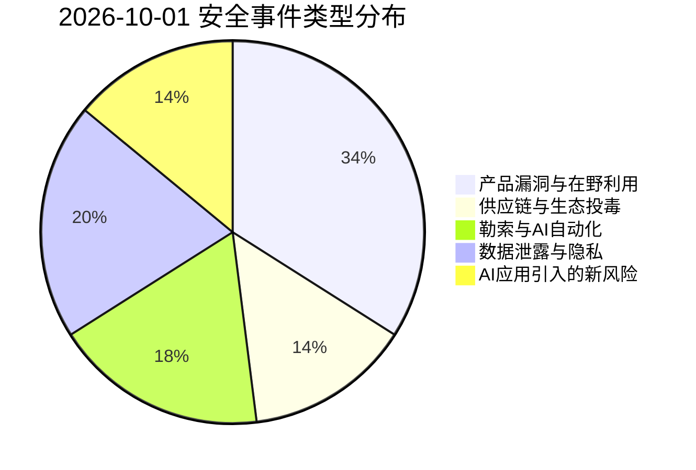
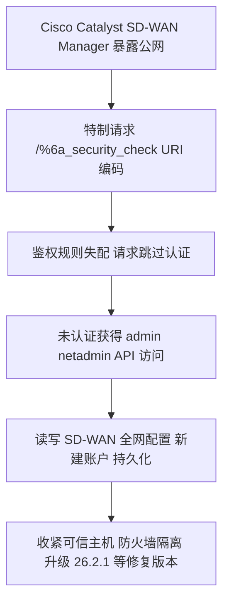
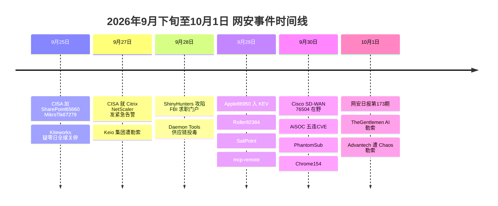

# 网安日报速递 · 2026年10月1日（第 173 期）

> **AI城 · 网络安全** ｜ 覆盖区间：2026-09-30 — 2026-10-01 ｜ 数据截止：2026-10-01 12:00 (GMT+8)
> 选题原则：只收有明确编号 / 官方通告 / 一手披露的事件；无 CVE 编号者会显式标注「无 CVE」。

---

## 一、今日头条

### Cisco Catalyst SD-WAN Manager CVE-2026-76504（CVSS 9.8）：一个编码字符绕过鉴权，未授权拿下管理员 API

| 项目 | 内容 |
| --- | --- |
| CVE | CVE-2026-76504 |
| CVSS v3.1 | **9.8**（AV:N/AC:L/PR:N/UI:N/S:U/C:H/I:H/A:H） |
| 缺陷类型 | CWE-288 认证绕过（利用替代路径/通道）／CWE-177 URI 编码处理不当 |
| 受影响产品 | Cisco Catalyst SD-WAN Manager（原 SD-WAN vManage） |
| 披露时间 | 2026-09-30（Cisco 安全公告） |
| 在野状态 | **已确认在野**，Cisco PSIRT 称 2026 年 9 月已观测到活跃利用 |
| CISA KEV | 2026-09-30 收录，联邦整改截止 **2026-10-03** |
| 缓解措施 | **无官方 workaround**，唯一修复路径为升级 |

**事件内容**

Cisco Catalyst SD-WAN Manager 的 API 会话认证管理对 HTTP 请求中的 URI 编码处理不当。攻击者只需在登录处理路径 `j_security_check` 中对**任意一个字符**做十六进制 URI 编码（Cisco 给出的示例是 `/%6a_security_check`，`%6a` 即字母 `j`），鉴权规则便因路径不匹配而失效，请求得以**无凭据直达受保护端点**，并获得 admin 身份（默认持有 `netadmin` 角色，可执行全部操作）的 API 访问。

**受影响版本与修复版本**

| 版本线 | 首个修复版本 |
| --- | --- |
| 早于 20.9 | 需迁移到受支持修复版本 |
| 20.9 | 20.9.10.1 |
| 20.12 | 20.12.8.2 |
| 20.15 | 20.15.6.1 |
| 20.18 | 20.18.4.1 |
| 26.1 | 26.1.2.1 |
| 26.2 | 26.2.1 |

Cisco SD-WAN Cloud（Cisco 托管）已在 20.15.605 修复，客户无需操作。

**排查线索（IoC）**

- `/var/log/nms/containers/service-proxy/serviceproxy-access.log`：来自未知/未授权 IP 的 `j_security_check` 请求，路径含编码字符，如 `POST /%6a_security_check`
- `/var/log/nms/vmanage-server.log`：来自未知 IP、且用户名以 `viptela-reserved-` 开头的相关请求
- 注意：Cisco 提示此类日志在正常运行中也可能出现，需结合网络基线判断，避免误报

**值得关注的原因**

1. 利用门槛极低（一个 URL 编码字符）而影响面极高（vManage 是整张 SD-WAN 的中枢，单实例常管辖数千台设备，部分部署可达 6000 台）——典型的「打一个点、瘫一张网」。
2. 这是 2026 年**第 5 个在野 SD-WAN 零日**；Cisco 今年累计已记录 **17 个零日**，而 2025 全年为 8 个、2024 年为 6 个。边缘网络设备已取代邮件网关成为最热突破口。
3. **没有 workaround**。未完成升级前，只能临时把控制组件收到防火墙后、仅允许已知可信主机访问管理面。

---

## 二、重点事件

### 2.1　AiSOC 五连 CVE：SOC 平台把 CrowdStrike RTR 变成打自己端点的枪（CVE-2026-103056 ×9.0）

2026-09-30，开源安全运营平台 AiSOC 一次性披露 5 个漏洞，全部修复于 **AiSOC 12.0.0**。

| CVE | CVSS | 类型 | 影响 |
| --- | --- | --- | --- |
| CVE-2026-103056 | **9.0** | CWE-78 OS 命令注入 | 经 CrowdStrike RTR 在受管端点以 SYSTEM/root 执行任意命令 |
| CVE-2026-103055 | 7.5 | CWE-321 硬编码 JWT 密钥 | 跨租户实时数据访问 |
| CVE-2026-103054 | 7.1 | CWE-639 授权绕过 | MSSP 用户可认领任意租户并读取其安全数据 |
| CVE-2026-103053 | — | CWE-306 缺失认证 | dev 模式开启且服务令牌为空时未认证派发响应动作 |
| CVE-2026-103057 | 4.3 | CWE-306 缺失认证 | 未认证向内部实时端点投递事件 |

**核心机制**：AiSOC 的 actions 服务在 `crowdstrike_rtr.py` / `endpoint.py` 中拼装 CrowdStrike Real Time Response 命令串时，直接插值未转义的用户参数。认证用户只要注入一个单引号即可逃逸引号边界，把「处置工具」反过来变成攻击自己终端基础设施的武器。

**值得关注**：这是「防御工具自身成为攻击面」的又一例。更糟的是 103053 在默认 Docker Compose 部署下即可利用（`AISOC_DEV_MODE` 默认启用、服务令牌从未生成）。修复动作：升级 12.0.0 → 设置 `AISOC_ACTIONS_SERVICE_TOKEN` 与 `AISOC_REALTIME_JWT_SECRET` → 关闭 dev 模式 → 审计 RTR 调用日志。

### 2.2　PhantomSub：101 个恶意 npm 包劫持 WhatsApp 会话，累计 49 万次下载

OX Security 披露代号 **PhantomSub** 的供应链投毒活动：**101 个**伪装成开源 WhatsApp Web API 库 **Baileys** 衍生版本的 npm 包，在开发者建立已认证会话后，用其账号**静默关注/加入攻击者控制的频道与群组**。

| 变体 | 包数量 | 频道 ID 获取方式 |
| --- | --- | --- |
| 变体 1 | 19 | 运行时从 GitHub 拉取（可随时换目标、无需发新版） |
| 变体 2 | 60 | 明文硬编码在源码中 |
| 变体 3 | 14 | 编码/混淆后内嵌 |

- 累计下载约 **490,000** 次，近 30 天 **116,000** 次；截至 9/28，npm 仅下架了 16 个包。
- 目标频道多为印尼小型「卖号 / 卖脚本 / 游戏资源 / 刷粉」社群，粉丝数即社会证明；多个包共享同一批频道 ID 与 GitHub 账号，指向同一受益人。
- 前情：2026 年 8 月 SafeDep 已报告过从事类似行为的 Baileys 恶意 fork，Xygeni 亦披露过 `@dappaoffc/baileys-mod`。

**值得关注**：这类攻击不偷密钥、不投勒索，只「偷流量」。它调用的是合法 API，行为与预期功能难以区分，因此静态扫描与依赖漏洞扫描几乎无感——传统工具链的盲区。防御要点：审查依赖树、检查 WhatsApp 会话是否被塞入陌生群组、避免使用需要接入个人会话的包。

### 2.3　Google Chrome 154.0.8037.57 修复 V8 类型混淆与 XML 实现缺陷（各 8.8）

2026-09-30 披露两枚高危漏洞，均需用户访问特制页面触发，可在浏览器沙箱内执行任意代码：

- **CVE-2026-95306**（CWE-843 类型混淆，CVSS 8.8）：V8 引擎中的类型混淆，恶意 HTML 页面即可触发沙箱内代码执行。
- **CVE-2026-95369**（CWE-841 实现不当，CVSS 8.8）：XML 处理组件实现不当，同样经恶意 HTML 页面触发。

两者均无凭据要求、无需用户交互以外的前置条件；Chromium 内部评级为 Medium，CVSS 按 `AV:N/AC:L/PR:N/UI:R/S:U/C:H/I:H/A:H` 计为 8.8。修复版本：**154.0.8037.57** 及以后。

**值得关注**：浏览器仍是「一次点击即 RCE」的主要入口，V8 类型混淆更是沙箱逃逸链的常见一环。企业应经 GPO/MDM 强制更新，并在 EDR 侧关注 Chrome 派生出的异常子进程。

### 2.4　TheGentlemen 用 AI 代理跑勒索：单次攻击成本低至 0.4–4 美元，一台服务器堆 3.1TB 赃物

Cybernews 发现一台属于 **TheGentlemen** 联盟成员的服务器：上面存有来自 **30 多家公司**的 **3.1 TB** 被盗数据、一个 **AI 代理**以及 **86 个 AI 生成脚本**。

该代理自主完成整条链条：搜索受害企业网络 → 提取敏感数据 → 为每套环境**定制脚本** → 起草勒索信。操作者基本只需要提供「一个目标和一组登录凭据」。按研究者估算，单家企业攻击的 **token 成本低至 0.40–4.00 美元**（不含基础设施成本）。

**团伙背景**：TheGentlemen 2025 年年中崛起，以「90% 分成」招募联盟成员，泄露站上已列 200+ 受害组织、覆盖 50+ 国家与 20+ 行业。Black Kite 9 月 17 日报告将其列为今年制造业第二大勒索团伙（1–7 月 142 家受害）；Halcyon Q2 报告称其 6 月已超越 Qilin。

**值得关注**：

- 攻击的边际成本被压到「几美元」，目标画像从大型企业下沉到年营收 1000 万至 1 亿美元的中型企业——这类公司停产即亏钱、且没有 7×24 监控。
- 修复窗口同步坍缩：Food and Ag-ISAC 9 月报告指出，过去需要数天才能写出的利用代码，现在几小时就能生成。
- 防御重心需从「防住」转向「假设会被打进来」，并把快速检测、自动遏制与可靠恢复作为核心能力。

### 2.5　Citrix NetScaler 双零日：Mandiant 证实被利用至少三周才被发现

Mandiant 的取证结论显示，攻击者从 **9 月 3 日**左右起就在利用 Citrix NetScaler 的关键零日，直到被检测出来，**未察觉窗口至少三周**。已确认数十家机构受害，涉及高级与疑似国家背景的行为体，行业横跨政府、金融服务、教育、电信、法律与专业服务，地域集中在北美与欧洲。

| CVE | 说明 |
| --- | --- |
| CVE-2026-88772 | 内存缓冲区操作限制不当，可导致 RCE 或 DoS（DTLS 默认在 VPN 虚拟服务器上启用） |
| CVE-2026-88771 | 输入校验不当，未认证远程攻击者可执行任意命令 |

两者 CVSS v4.0 均为 **9.5**，9/27 已列入 CISA KEV，**联邦整改截止日 9 月 30 日已过**。Mandiant 在入侵后阶段观测到包括隧道型恶意软件在内的新型工具，用于内网侦察、凭据窃取与数据外泄。

**值得关注**：边界设备长时间潜伏 + 国家背景行为体，意味着后续横向与数据窃取风险仍在。仍未完成补丁的机构应把 NetScaler 当作「已失陷」处理，排查 webshell 与隧道工具。

---

## 三、速览区

| # | 事件 | 要点 |
| --- | --- | --- |
| 6 | **Advantech 遭 Chaos 勒索** | 台湾工业物联网与嵌入式计算大厂 9/30 被列入 Chaos 泄露站。作为全球供应链关键厂商，若固件/源码/更新机制被触及，单点入侵可能放大为供应链攻击 |
| 7 | **FBI 招聘门户被 ShinyHunters 入侵** | FBI 9/30 公开回应，正追查 ShinyHunters；受影响数据库含求职、晋升申请及医疗/家庭数据。FBI 认为攻击者可能利用了第三方软件漏洞，具体影响人数尚未通知到个人 |
| 8 | **日本 9 月数据泄露潮（16 起）** | Gyazo 约 2362 万条用户记录 + 约 49 亿条图片元数据、村内.com 771 万条、Times Car 约 660 万账户（其中约 160 万含证件影像）、数字厅 GSS 约 24.6 万条。9 月日本几乎每天有通报 |
| 9 | **麦当劳印尼 4000 万记录暴露** | 客户数据平台暴露 4000 万条记录，含 2800 万条客户记录（姓名、邮箱、电话、设备 ID）与 7.1 万条广告投放记录；数据库已由发现方通报后关闭 |
| 10 | **Medela 42.4 万账户泄露** | 瑞士医疗设备厂商 Medela 遭 ShinyHunters「付钱或公开」勒索，9/30 被 Have I Been Pwned 确认为真实泄露，涉 423,947 个邮箱（多为医疗从业者） |
| 11 | **新加坡首例「AI 相关」数据泄露** | 美珍香（Bee Cheng Hiang）员工用 AI 工具生成群发邮件 Python 脚本，未要求隐藏收件人地址，导致 **95,364** 名客户邮箱互相可见。PDPC 9/30 定性为人为提示失误，而非 AI 工具故障 |

---

## 四、风险分析

### 4.1 漏洞严重性 × 利用状态象限

```mermaid
quadrantChart
    title 2026-10-01 漏洞严重性 × 利用状态
    x-axis "未利用" --> "在野/公开可用"
    y-axis "低危" --> "严重"
    quadrant-1 "紧急修复"
    quadrant-2 "密切关注"
    quadrant-3 "持续监控"
    quadrant-4 "常规更新"
    "Cisco76504×9.8 SD-WAN": [0.95, 1.00]
    "Citrix88771/88772×9.5": [0.90, 0.95]
    "AiSOC103056×9.0": [0.20, 0.90]
    "Chrome95306 V8×8.8": [0.20, 0.88]
    "Chrome95369 XML×8.8": [0.20, 0.88]
    "TheGentlemenAI勒索": [0.85, 0.85]
    "FBI ShinyHunters": [0.70, 0.82]
    "Advantech勒索": [0.75, 0.80]
    "PhantomSub101包": [0.60, 0.62]
    "麦当劳印尼4000万": [0.55, 0.75]
```

### 4.2 事件类型分布



### 4.3 Cisco CVE-2026-76504 利用链



### 4.4 事件时间线



---

## 五、出处

| 主题 | 来源 | 链接 |
| --- | --- | --- |
| CVE-2026-76504 官方公告 | Cisco Security Advisory (cisco-sa-sdwan-webauth-xr8beuuU) | https://sec.cloudapps.cisco.com/security/center/content/CiscoSecurityAdvisory/cisco-sa-sdwan-webauth-xr8beuuU |
| CVE-2026-76504 解读与影响面 | CIS / MS-ISAC Advisory 2026-105（2026-09-30） | https://www.cisecurity.org/advisory/a-vulnerability-in-cisco-catalyst-sd-wan-manager-could-allow-for-authentication-bypass_2026-105 |
| CVE-2026-76504 逆向、IoC 与修复版本 | Horizon3.ai Attack Research | https://horizon3.ai/attack-research/vulnerabilities/cve-2026-76504 |
| CVE-2026-76504 / Citrix 等在野清单 | CISA Known Exploited Vulnerabilities Catalog | https://www.cisa.gov/known-exploited-vulnerabilities-catalog |
| KEV 近 7 日新增与 EPSS | Senserva — CISA KEV additions | https://senserva.com/exploited-this-week.html |
| AiSOC 五连 CVE | ThreatAft — AiSOC Mass Disclosure | https://threataft.com/articles/aisoc-mass-disclosure-cve-2026-103056-103055-103054-103053-103057 |
| PhantomSub 101 个 npm 包 | Cybersecurity Beat（2026-09-30） | https://cybersecuritybeat.com/2026/09/30/a-hundred-npm-packages-quietly-conscript-whatsapp-bots-for-spam |
| PhantomSub 包清单与变体 | Ghost Protocol / World Cyber News | https://www.worldcybernews.com/articles/1347 |
| Chrome CVE-2026-95306 | CVE Brief 分析报告 | https://cvebrief.com/cve/cve-2026-95306 |
| Chrome CVE-2026-95369 | CVE Brief 分析报告 | https://cvebrief.com/cve/cve-2026-95369 |
| TheGentlemen AI 代理勒索 | Cybernews 调查（经 Koltiv 转引） | https://koltiv.com/blog/cheap-ransomware-long-recovery |
| TheGentlemen 团伙画像 | ITWeb — Hollard data hits dark web | https://www.itweb.co.za/article/hollard-data-hits-dark-web-after-mip-hack/wbrpOqg2J5oMDLZn |
| Citrix 三周未察觉 / PhantomSub | CyberRecaps（2026-09-30 每日综述） | https://cyberrecaps.com/news/cybersecurity-news-september-30-2026 |
| Citrix 双零日确认在野 | CIRT.GY（2026-09-30） | https://cirt.gy/article/al2026_30-citrix-confirms-two-critical-netscaler-rce-zero-days-exploited-in-attacks-september-30th-2026 |
| Advantech 遭 Chaos 勒索 | NetSecOps Cyber Intelligence | https://cyber.netsecops.io/articles/chaos-ransomware-targets-industrial-iot-firm-advantech |
| FBI 招聘门户泄露 | NPR（2026-09-30） | https://www.npr.org/2026/09/30/nx-s1-5985084/fbi-investigating-massive-data-breach-of-the-bureaus-job-portal |
| 日本 9 月泄露 16 起汇总 | ePrize（截至 2026-09-30） | https://eprize.jp/en/blog/japan-unauthorized-access-and-data-breach-incidents-september-2026-summary |
| 麦当劳印尼 4000 万记录 | OSINTSights / Security Magazine | https://osintsights.com/mcdonalds-customer-data-platform-breach-exposes-40m-records |
| Medela 42.4 万账户 | Recent Data Leaks / Have I Been Pwned | https://recentdataleaks.com/breach/medela-2026 |
| 新加坡首例 AI 相关泄露 | Channel News Asia（2026-09-30） | https://www.channelnewsasia.com/singapore/bee-cheng-hiang-data-breach-ai-pdpc-emails-6421711 |
| 周度威胁汇总（KEV / 在野） | F5 Labs — Weekly Threat Bulletin Sept 30 | https://www.f5.com/labs/articles/weekly-threat-bulletin-september-30th-2026 |
| 在野漏洞跟踪 | Tech Times CVE Tracker | https://www.techtimes.com/cve-tracker |

---

> **免责声明**：本报告基于公开信息整理，CVE 编号、CVSS 评分、受影响版本等以厂商公告与 NVD 等官方源为准。部分事件（勒索团伙泄露站条目、攻击者自述）属未独立验证的声称，阅读时请自行交叉核实。

**AI城 · 网安日报速递** ｜ 第 173 期 ｜ 2026年10月1日
