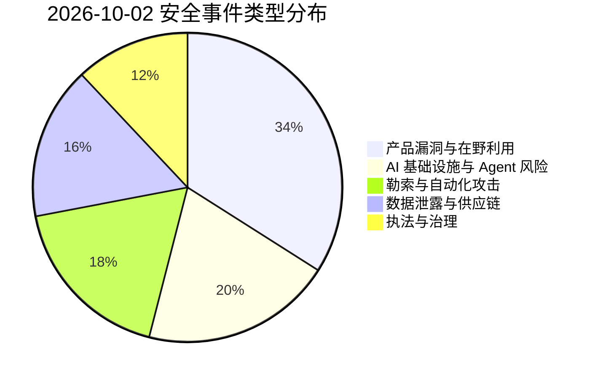
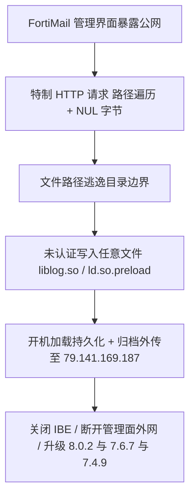
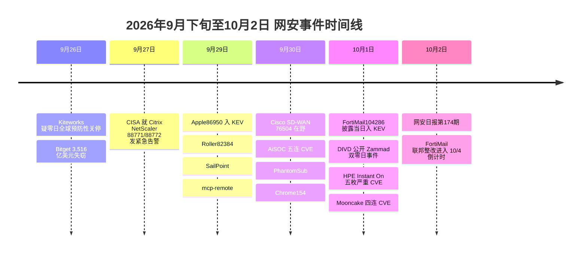

# 网安日报速递 · 2026年10月2日（第 174 期）

> 数据窗口：2026-10-01 ~ 2026-10-02 | 编辑：AI城 · 网安日报
> 说明：本期头条遵循「只看 #1 漏洞事件」原则，顶部仅呈现当日 TOP 事件的 CVE 信息与关键细节；#2 及以后条目仅在卡片区展开。

---

## 一、今日头条

### Fortinet FortiMail CVE-2026-104286（CVSS 9.8）：路径遍历 + NUL 字节绕过，未认证任意文件写入，披露即入 KEV

2026-10-01，Fortinet 发布安全公告 **FG-IR-26-175**，披露 FortiMail 邮件安全网关管理界面存在严重漏洞 **CVE-2026-104286**（**CVSS v3.1 9.8，Critical**）。该漏洞由 **CWE-22 路径遍历** 与 **CWE-158 NUL 字节处理不当** 组合而成：攻击者无需任何凭据，只需向暴露在公网的 FortiMail 管理界面发送特制 HTTP/HTTPS 请求，即可让文件路径逃逸目标目录并**在底层系统任意位置写入文件**。

| 项目 | 内容 |
|---|---|
| CVE | CVE-2026-104286 |
| CVSS | 9.8（Critical，CVSS v3.1） |
| CWE | CWE-22 路径遍历 · CWE-158 NUL 字节中和不当 |
| 认证要求 | 无（未认证远程） |
| 厂商公告 | Fortinet FG-IR-26-175（2026-10-01） |
| 在野状态 | 已确认在野利用；**披露当日（10-01）即入 CISA KEV / ENISA KEV / VulnCheck KEV** |
| 联邦整改期限 | 2026-10-04（依 BOD 26-04） |
| 虚拟补丁 | 无 |

**影响版本**：FortiMail 8.0.0–8.0.1、7.6.0–7.6.6、7.4.0–7.4.8、7.2.0–7.2.9。
**修复版本**：8.0.2、7.6.7、7.4.9 或更高；7.2 分支建议迁移至 7.4 或更新分支。

**缓解措施（官方 workaround）**：进入 CLI 关闭 IBE 功能——`config system encryption ibe` → `set status disable` → `end`；或将管理界面移出公网，仅允许可信私网访问。注意：关闭外网访问只能降低暴露面，**无法判断设备此前是否已被攻陷**。

**排查线索（IoC）**：
- 新增文件：`/data/lib/liblog.so`、`/data/bin/webconsole`、`/data/bin/mailservice`、`/data/etc/ld.so.preload`
- 被篡改文件：`/bin/smit`、`/data/etc/httpd.conf`、`/data/migadmin.tar.gz`
- 可疑 IP：`79.141.169.187`、`45.129.0.192`
- 可疑配置：归档账户 `archive234` 向 `79.141.169.187` 的 `/uploads` 发送归档
- 其它：root cron 引用 `/migadmin`、admin 登出记录出现空 interface 值、IBE 解密报 Base64 无效、内部用户登录失败

> 为何值得关注：这是「安全设备自己成为突破口」的又一记实锤——邮件安全网关通常握有全网邮件流与归档权限，一旦被写入任意文件，攻击者可植入 `ld.so.preload` 实现**开机即加载的持久化后门**，危害等级远高于一般的 Web 漏洞。披露当日即入 KEV，说明攻击者早于补丁掌握了利用方式。

---

## 二、重点条目

### 2. DIVD 遭「自主 AI 代理」借 Zammad 双零日攻破：秒级从工单账户爬到 root

2026-10-01，荷兰漏洞披露研究所（**DIVD**）公开其被入侵事件：**9 月 21 日**遭攻击，**9 月 22 日**发现，攻击者利用开源工单系统 **Zammad** 的两个零日漏洞串链，在**数秒内**完成从劫持会话到拿到主机 root 控制的完整链路。

| CVE | 类型 | CVSS 4.0 | 影响版本 | 修复状态 |
|---|---|---|---|---|
| CVE-2026-102489 | 会话劫持 + 未认证 RCE（执行身份为低权 zammad 用户） | 9.4 | 6.3.0–6.5.4 可利用；7.0.0–7.1.3 存在缺陷但环境条件不满足、不可利用 | 升级至 7.x |
| CVE-2026-102490 | 本地提权（zammad → root） | 9.4 | 1.5.0 起至 7.1.0 alpha **全版本存在** | **暂无修复** |

**关键细节**：
- 攻击呈现明显自动化特征——DIVD 形容其「喧闹且非常混乱」「做了一些相当蠢的事」（如自行发起密码喷洒、破坏了自己的中间人位置），并在攻击脚本中**内嵌了 AI 自我辩解式的注释**，为取证留下罕见的自述型痕迹。
- DIVD 将该 modus operandi 定性为 **agentic AI 驱动的攻击**，与 2026 年 7 月 Hugging Face 事件（自主代理一个周末记录 17,000+ 动作）形成呼应。
- 荷兰国家网络安全中心（NCSC-NL）9 月 30 日告警确认两漏洞均在野利用，且**提权漏洞尚未解决**，建议在升级前先保全应用与网络日志。
- DIVD 已发布 IoC 狩猎脚本，建议所有 Zammad 用户升级至 7 或直接下线；被窃数据包含志愿者研究员的邮箱与联系方式，社交工程风险上升。

> 为何值得关注：「专门找别人漏洞」的机构自己被 AI 代理攻破，且失守速度以「秒」计。它把两件事同时摆上台面——**机器速度的利用链**，以及**旧版本遗留缺陷长期无人修的提权面**。

### 3. HPE Networking Instant On 接入点五枚严重漏洞（最高 9.8）：邻接网络即可打穿

2026-10-01 披露，HPE 公布 **HPE Networking Instant On** 接入点的 5 个严重漏洞（公告 **HPESBNW05150**）。全部无需凭据，远程或邻接网络攻击者可执行任意代码/命令、造成拒绝服务或绕过认证控件。

| CVE | 类型 | CVSS | 触发条件 |
|---|---|---|---|
| CVE-2026-76721 | 缓冲区溢出 → 底层主机任意代码执行（特权用户） | 9.8 | 未认证远程 |
| CVE-2026-76722 | 非受控格式串 → 任意命令执行 / DoS | 9.8 | 未认证远程 |
| CVE-2026-76723 | 缓冲区溢出 → 操作系统命令执行 | 9.6 | 未认证邻接网络 |
| CVE-2026-76724 | CLI 命令注入 → 特权用户任意命令 | 9.6 | 未认证邻接网络 |
| CVE-2026-76725 | 认证控制绕过 → 权限提升，可能 RCE | 9.6 | 未认证邻接网络 |

> 为何值得关注：**「邻接网络」即触发**，意味着攻击者只需接入同一无线/局域网段（如开放的访客 Wi-Fi、被拿下的终端）就能横向打穿 AP。企业应核对受影响型号与修复固件版本，并在确认前限制管理界面暴露与邻接管理路径。

### 4. Mooncake 四连 CVE：分布式 LLM 推理的 KV Cache 传输引擎暴露「未认证任意内存读写」

2026-10-01 披露，**Mooncake**（月之暗面 Moonshot AI 开源的分布式 LLM 推理 KV Cache 传输引擎）一次性暴出 4 个漏洞，直指 AI 推理基础设施的数据通路。

| CVE | 类型 | CVSS | 详情 | 修复 |
|---|---|---|---|---|
| CVE-2026-103764 | 不可信指针解引用（`ServerSession::readHeader`） | 9.8 | 未认证攻击者经 TCP 传输数据端口读取/写入任意进程内存 | 0.3.13 已修 |
| CVE-2026-103765 | HTTP 元数据服务 `/metadata` 缺失认证 | 9.4 | 未认证读取、覆盖、删除传输引擎元数据键，可投毒元数据把 KV Cache 重定向至攻击者监听端 | 至 0.3.13.post1 仍受影响，无确认修复 |
| CVE-2026-103761 | 内存耗尽（`TransferMetadata::receivePeerNotify`） | 7.5 | 无界内存增长 | 同上 |
| CVE-2026-103760 | DoS（`SocketHandShakePlugin::writeFully`） | 5.9 | 阻断握手守护进程 | 同上 |

> 为何值得关注：KV Cache 承载着**提示词、模型状态乃至其间泄露的密钥**。这类 AI 推理中间件的通病是「内网信任假设」——传输端口默认不做认证。前四期已多次出现 LiteLLM / Kestra / RAGFlow 同类问题，AI 基础设施正在成为 **Tier-0 攻击面**。建议限制传输与握手端口的网络可达性，并监控异常内存活动。

### 5. Kiteworks CVE-2026-54154（CVSS 10.0）：EPG 代码注入链，未认证直达管理员接管

2026-10 月，Kiteworks 一次性修复 **126 个漏洞**，其中 **CVE-2026-54154**（**CVSS 10.0**）位于其 **Email Protection Gateway（EPG）**：由**路径遍历 + 代码注入 + 缺失认证**串成的利用链，允许未认证远程攻击者实现任意代码执行并提升至完整管理员控制。

- 影响产品：Kiteworks Email Protection Gateway < 9.4.1
- 暴露面：公网可及 Kiteworks 实例接近 **400** 个，潜在终端用户逾 **1 亿**
- 利用状态：**暂无公开利用**（发现自 bug bounty）
- 参考：GitHub Security Advisory `GHSA-5xhq-9wq3-rvj6`

> 为何值得关注：这是 9 月 26 日 Kiteworks 疑似零日全球预防性停机的后续落槌——厂商当时选择「先关停再排查」，如今给出了正式 CVE 与修复。对处理 M&A、法务、金融等高敏文件的平台而言，10.0 级未认证 RCE 意味着通信与文件传输链路存在被整体架空的可能。

---

## 三、速览区

| # | 事件 | 关键信息 |
|---|---|---|
| 6 | **Apache Tomcat** WebSocket 安全约束绕过 | CVSS 最高 9.8（AUSCERT ESB-2026.11795）；攻击者可绕过保护 WebSocket 端点的安全约束 |
| 7 | **Zimbra** 命令注入在野利用 | 利用 7 月已修的命令注入漏洞部署 Java WebShell，窃取用户凭据与历史邮件；微软已记录该活动，未归因具体组织 |
| 8 | 欧洲多国执法 dismantle **KillSec** 勒索团伙 | 跨国联合行动逮捕多名成员，勒索生态持续承压 |
| 9 | **Thales SConnect** CVE-2026-18397（CVSS 9.4） | 原生主机组件密码学缺陷 + 内存管理问题，经「网页 ↔ 原生主机」无限制消息接口绕过校验，未认证 RCE；已存在公开/AI PoC |
| 10 | **Omnigent** CVE-2026-62674（CVSS 9.0） | AI Agent 编排框架 `PUT /sessions/{session_id}/agent` 可替换共享/模板 Agent 并注入恶意 stdio MCP Server → 以 runner 权限执行任意命令，可外联反弹 shell；< 0.3.0，修复 0.3.0 |
| 11 | 勒索侧三则 | **FTAPI**（德国安全文件传输商）遭 The Gentlemen 勒索；**Qilin** 连续 17 个月居首（2,223 受害者、同比 +443%）；**Warlock** 借 SharePoint 入侵后经 SYSVOL 复制横向部署，约 2 小时内于 40 台主机执行 AV/EDR Killer |

---

## 四、风险分析

### 4.1 漏洞严重性 × 利用状态象限图

```mermaid
quadrantChart
    title 2026-10-02 漏洞严重性 x 利用状态
    x-axis "未利用" --> "在野/公开可用"
    y-axis "低危" --> "严重"
    quadrant-1 "紧急修复"
    quadrant-2 "密切关注"
    quadrant-3 "持续监控"
    quadrant-4 "常规更新"
    "FortiMail104286x9.8": [0.95, 0.99]
    "Zammad102489/102490x9.4": [0.90, 0.94]
    "Kiteworks54154x10.0": [0.25, 1.00]
    "HPE76721x9.8": [0.20, 0.96]
    "Mooncake103764x9.8": [0.15, 0.96]
    "Tomcat WebSocketx9.8": [0.15, 0.95]
    "SConnect18397x9.4": [0.55, 0.92]
    "Omnigent62674x9.0": [0.20, 0.88]
    "Zimbra在野": [0.85, 0.85]
    "Warlock SharePoint": [0.80, 0.88]
```

### 4.2 安全事件类型分布



### 4.3 FortiMail CVE-2026-104286 攻击链



### 4.4 本周时间线



---

## 五、出处链接

1. **World Cyber News** — Critical Zero-Day Vulnerability in FortiMail Allows Unauthenticated File Writes
   <https://www.worldcybernews.com/articles/1379>
2. **zeroday.news** — Fortinet FortiMail Path Traversal Flaw Exploited Same Day as Disclosure
   <https://www.zeroday.news/article/fortinet-fortimail-path-traversal-flaw-exploited>
3. **Cybernoz** — Critical Fortinet FortiMail 0-Day Vulnerability Actively Exploited in Attacks（含 IoC 与版本清单）
   <https://cybernoz.com/?p=15135>
4. **Security Resilience** — Security Leader Briefing, Week ending 01 October 2026（CISA KEV 近 7 日新增）
   <https://security-resilience.ai/security-leaders>
5. **CSA Labs Research Note** — Autonomous AI Agent Breaches DIVD via Chained Zammad Zero-Days
   <https://labs.cloudsecurityalliance.org/research/csa-research-note-zammad-ai-agent-breach-20261001-csa-styled>
6. **Cybersecurity Beat** — Two Zammad zero-days let an AI agent reach root in seconds
   <https://cybersecuritybeat.com/2026/10/01/two-zammad-zero-days-let-an-ai-agent-reach-root-in-seconds>
7. **iSec News** — Zammad flaws used in attack on Dutch vulnerability disclosure group
   <https://www.isec.news/2026/10/01/zammad-zero-days-divd-breach>
8. **NetSecOps** — Dutch Security Institute Hacked via AI-Powered Zammad Zero-Days
   <https://cyber.netsecops.io/articles/dutch-security-institute-divd-hacked-via-ai-powered-zammad-zero-days>
9. **Secure ISS** — HPE Networking Instant On Multiple Critical Vulnerabilities（HPESBNW05150）
   <https://www.secure-iss.com/newsroom/hpe-networking-instant-on-multiple-critical-vulnerabilities>
10. **ThreatAft** — Mooncake Mass Disclosure: 4 CVEs Expose KV Cache Transfer Engine
    <https://threataft.com/articles/mooncake-mass-disclosure-cve-2026-103764-103765-103761-103760>
11. **Aviatrix Threat Research** — Kiteworks Patches Max-Severity Code Injection Vulnerability CVE-2026-54154
    <https://aviatrix.ai/threat-research-center/kiteworks-patches-max-severity-code-injection-vulnerability-cve-2026-54154>
12. **AUSCERT** — Week in Review for 2nd October 2026（Tomcat / MikroTik / GitLab / Cisco）
    <https://auscert.org.au/week-in-review/auscert-week-in-review-for-2nd-october-2026>
13. **Risky Business** — Risk Bulletin: KillSec dismantled, Zimbra in the wild, Linux LPE CVE-2026-72018
    <https://news.risky.biz/risky-bulletin-authorities-dismantle-killsec-group-arrest-members-across-europe>
14. **神龙漏洞库** — CVE-2026-18397 Thales SConnect 原生主机未认证远程代码执行漏洞
    <https://cve.imfht.com/detail/CVE-2026-18397>
15. **BeyondMachines** — Omnigent Patches Critical RCE Flaw in AI Agent Framework (CVE-2026-62674)
    <https://beyondmachines.net/event_details/omnigent-patches-critical-rce-flaw-in-ai-agent-framework-o-o-w-m-z>
16. **ZeroFox** — Daily Intelligence Brief, October 1, 2026（FTAPI 勒索 / ClickFix Custom GPT / ATNS）
    <https://www.zerofox.com/advisories/42383>
17. **The Code W** — Daily News Coverage（Qilin 2223 受害者 / Dediserve N0n 勒索）
    <https://www.thecodew.com/2026/10/ftc-ai-probe-california-subpoena-openai.html>
18. **DEV Community (Anoymask)** — Warlock: Ransomware Deployment from SYSVOL After SharePoint Compromise
    <https://dev.to/anoymask/warlock-ransomware-deployment-from-sysvol-after-sharepoint-compromise-5813>

---

*本报告基于公开信息整理，CVE 编号、CVSS 评分以官方公告为准；涉及攻击链的部分描述为公开报道的复述，请以厂商原始公告为准。*
