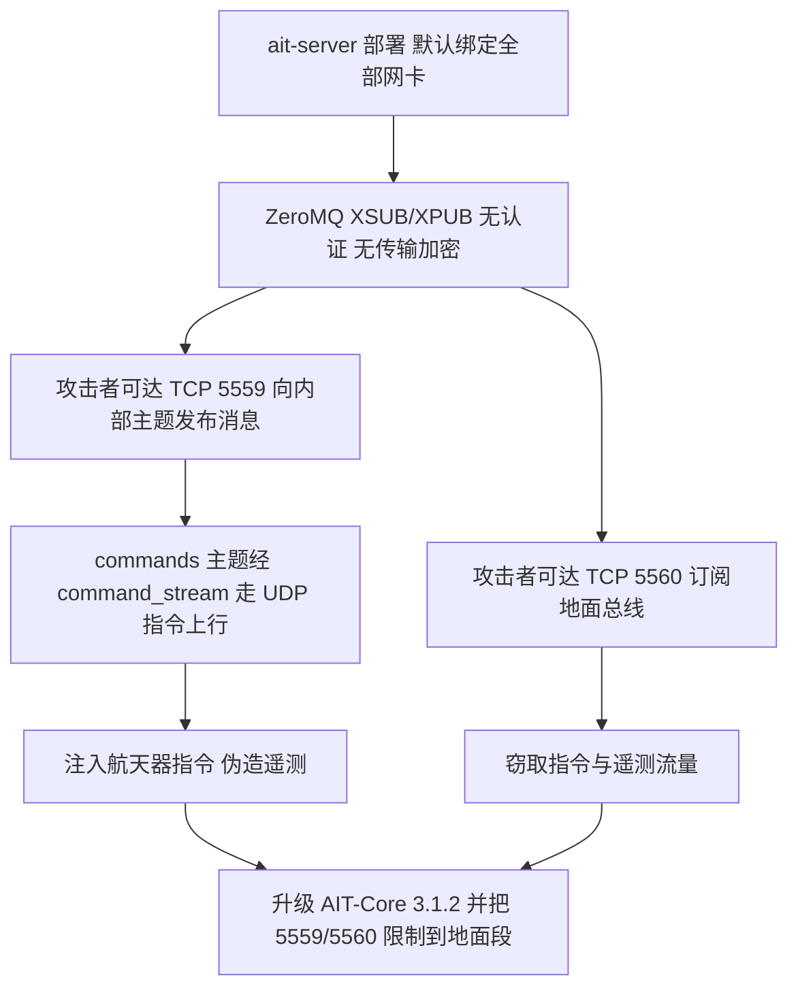
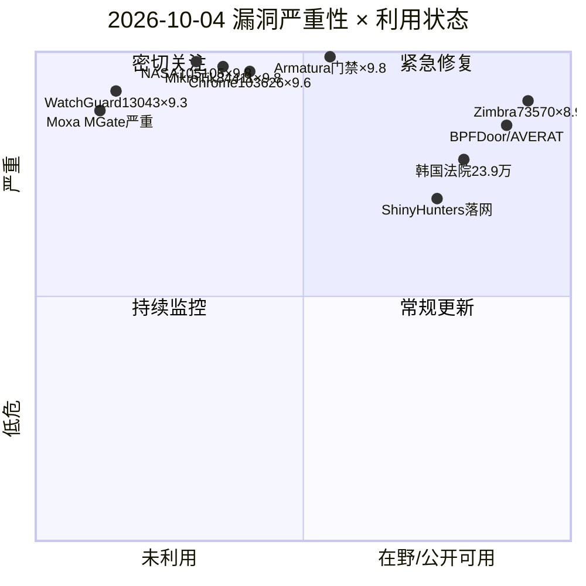
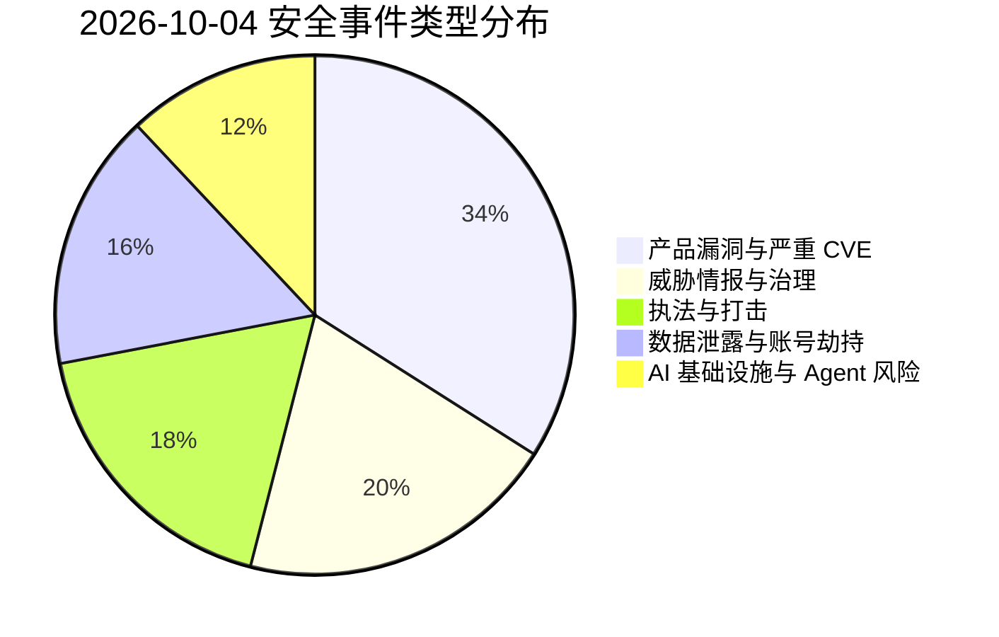
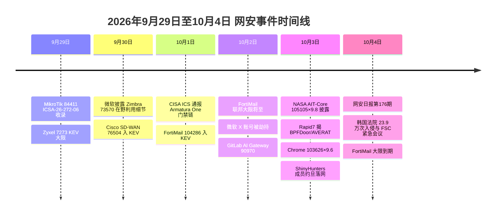

# 网安日报速递 - 2026年10月4日

> 星期日 · 第 176 期 | 总第 176 期
> 今日关键词：NASA105105×9.8星地指令 · CISA ICS 门禁 Armatura9.8 · BPFDoor 打韩台邮件设备 · 韩国法院 23.9 万入侵 · ShinyHunters 约旦落网 · Chrome9.6

---

## 头条：NASA 开源航天软件 AIT-Core 爆 CVE-2026-105105（×9.8）——未认证的星地指令总线

2026-10-03，NASA-AMMOS 开源项目 **AIT-Core** 修掉一个满分级别的缺失认证漏洞 **CVE-2026-105105**（**CVSS 3.1 = 9.8**，CWE-306）。出问题的是 `ait.core.server` 的遥测与指令代理 `ait-server`：它的 ZeroMQ 代理**默认把 XSUB 与 XPUB 套接字绑到所有网络接口**，既不做认证也不做传输加密。

后果很直接：能连到 **TCP 5559** 的攻击者可以向内部主题发布消息，其中包括 `commands` 指令主题——按出厂默认配置，这些消息会经 `command_stream` 从**指令上行 UDP 通道**发出去；能连到 **TCP 5560** 的攻击者则可以订阅地面总线上的指令与遥测流量。换言之，**注入航天器指令、窃取遥测、伪造遥测、打瘫整个指令遥测总线**，四件事都不需要任何凭据。

- **影响范围**：NASA-AMMOS AIT-Core ≤ 3.1.1（含 3.1.1）
- **修复版本**：AIT-Core **3.1.2**，该版本把 ZeroMQ 默认绑定地址改回 loopback
- **临时缓解**：把 TCP 5559、5560 限制在地面段或管理网，不要暴露到公网或不可信的任务合作方网络
- **披露状态**：无在野利用报告、无公开 PoC（截至 10/3）
- **公告**：GHSA-ccw5-g774-3683 / GHSA-3j6g-pxmx-58qg

**为何值得关注**：AIT-Core 是航天器**总装、集成与测试（AIT）**阶段的地面软件框架，属于"地面段"，通常不在安全团队的资产清单里。它开源、可被多方复用，而漏洞的形态又是最古典的那种——关键功能零认证。一条网络可达的路径，就能让攻击者在地面站说出"指令"。任何跑 AIT-Core 的实验室、院校与商业航天团队，都该先查两个端口是否可达，再升级到 3.1.2。

---

## 2. CISA 一周内连发 ICS 通报：门禁平台 Armatura One 满分链、Moxa 工业网关、Meari IoT 云

CISA 在 9 月底到 10 月初集中发布了多条工业控制系统（ICS）通报，**物理安全与工业网关同时在列**。

**Armatura One（ICSA-26-274-01，10/1，CVSS v3 9.8）** —— 这是一套**物理门禁控制平台**，全球部署，覆盖通信、关键制造、能源与交通四大关键基础设施部门。它一次暴露了 5 个问题：

- `CVE-2023-46604`（**CVSS 3.1 9.8 / 4.0 9.3**）：产品内置 **Apache ActiveMQ** 且**默认把 OpenWire 协议监听器暴露在网络上**。这是 ActiveMQ 反序列化漏洞，**已列入 CISA KEV（在野）**，未认证攻击者在认证检查之前就能触发任意对象图反序列化，进而在主机上以最高权限执行代码
- `CVE-2026-94591`（8.4）：数据库与消息代理凭据写进安装配置文件，用 AES-128-CBC 加密，但**密钥和 IV 是编译进软件的固定值**，每套安装都相同
- `CVE-2026-94592`（8.4）：硬编码凭据
- `CVE-2026-94593`（7.8）：日志文件写入敏感信息
- `CVE-2026-94594`（4.0）：消息代理正常运行时**明文记录客户端连接凭据与口令**

影响 < 4.7.2 与 USA 线 < 4.6.1，修复版本 4.7.2 / 4.6.1_USA。CISA 明确列出后果不只是数据丢失：**攻击者可以直接控制门禁系统本身**——开门、改授权记录。

**Moxa MGate MB3170 系列**协议网关同步通报两个漏洞：`CVE-2026-86325`（严重）与 `CVE-2026-86326`（高危）。

**Meari IoT Cloud Platform OpenAPI 服务（ICSA-26-274-06）**：`CVE-2026-96613`（6.5）与 `CVE-2026-101104`（7.7），属于缺失授权，攻击者可操纵设备配置、触发越权动作、读取敏感信息。

**为何值得关注**：这一批通报的共同点是"**默认配置即暴露**"——ActiveMQ 监听器默认开放、硬编码密钥全量相同、云 API 缺授权。门禁系统的漏洞不只是信息泄露，而是**把网络安全问题变成人身与场地安全问题**；而硬编码密钥一旦从安装包里提取出来，就能解密全世界任何一份拿得到配置文件的部署。

---

## 3. Rapid7 揭 BPFDoor / AVERAT 无文件植入物：冒充厂商软件潜伏韩台邮件安全设备

2026-10-03，Rapid7 Intelligence 公布一组 Linux 植入物的跟踪分析：一个**新的 BPFDoor 变种**、一个针对韩国目标的 **BPF Rekoobe 构建**、一个 dropper，以及**六个 AVERAT 构建**（打台湾设备）。它们共同的手法是**把自己伪装成目标设备上本来就该有的厂商软件**。

- **伪装定制化**：韩国系统上的 BPFDoor 样本**冒充韩国反垃圾邮件产品 SpamSniper 的 PID 文件**，并在十个普通 Linux 守护进程名之间轮换；AVERAT 则针对台湾国产邮件安全设备（ShareTech）
- **无文件驻留**：dropper 的加密密钥从字符串 **`ShareTech`** 派生，落点就在设备自带的 add-on 包目录。它把两个二进制复制进 `/sbin` 命名为 `ntpdate` 和 `udevds`，启动后**十秒删除文件**，进程继续运行；其中一个 payload 就是 dropper 自身，重新以常驻 watchdog 身份运行。防守方去 `/sbin` 找，**什么都哈希不到、隔离不了**
- **藏在邮件端口里**：AVERAT 从 **25 端口**外联，先发一个正常的 `EHLO`、请求 `STARTTLS`，然后才用自建 TLS 层开始自己的加密会话，约每十分钟回连一次；BPFDoor 变种是**被动 BPF socket，不开监听端口**，信标混在普通 DNS/TCP/SMTP 里
- **中转基础设施**：AVERAT 配置里的三个 IP 属于台湾中华电信 HiNet 网上被入侵的第三方设备——一家燃料零售商的 Synology NAS、一台过时的 NetKlass 小型设备、一台大华录像机；三者暴露**相同的 PPTP 横幅**，Rapid7 判断是运营者装的，每台都成了中继兼 VPN 落脚点
- **对抗进化**：早期 BPFDoor 用 TCP/UDP 头里的裸 magic bytes（如 `0x7255`）触发，厂商出了 Suricata/Snort 规则后，运营者把 magic 包**包进标准 HTTPS POST**，借电信环境常见的 SSL 卸载送达，绕开传统深度包检测
- **检测建议**：找 `/proc/<pid>/exe` 指向 `(deleted)` 的进程、找没有磁盘后备文件的可执行内存、告警 `/HDD/ms6x2xTo64/` 目录与以 `#!` 开头的 `.php` 文件

**归因**：Rapid7 明确表示**具体归因仍在评估中**，未与任何已命名网络挂钩；它指出这组设备的画像与 CISA/NCSC-UK 等机构在 AA26-113A 中描述的中国关联隐蔽中转网络（ORB）相符，但**没有发现重叠**。Dark Reading 的报道则提及 BPFDoor 的历史背景。

**为何值得关注**：邮件安全网关处在**网络边界却不是 EDR 覆盖区**——它们看得到全部进出的邮件、凭据与内部路由，却通常装不了端点代理。文件级检测在这条链上基本失效，必须转向行为与内存侧。

---

## 4. 韩国司法与金融双线告急：法院网络 8 个月遭 23.9 万次入侵，三大银行接连泄露

2026-10-04，韩国国会公开的数据显示，**法院网络在今年 1 至 8 月记录了 239,145 次入侵尝试**，是去年同期 101,205 次的 **2.4 倍**，而且**已经超过 2021 年以来任何一个完整年度的总量**（2021 年 142,514 次、2022 年 126,212 次、2023 年 114,070 次、2024 年 98,171 次），而今年还剩四个月。

- **月度高点**：3 月 48,263 次居首，5 月 39,915 次，6 月 34,083 次
- **数据来源**：国家法院行政处，由执政党议员金东河（Kim Dong-ha）于 10 月 4 日周日提交并公开

同期，韩国金融业也在连续失血。**韩亚银行（Hana）、KB 国民银行、新韩银行**近期接连发生客户数据泄露，其中韩亚银行确认**89 名客户的个人信息**被泄露，包含居民登记号、姓名、地址与电话。

**金融服务委员会（FSC）主席李亿远（Lee Eog-weon）于 10 月 4 日周日下午紧急召集受影响银行与金融公司 CEO 开会**，会议原定于周三，因损害继续扩散到更多机构而**提前三天**。FSC 同时要求所有金融公司全面复查计算机安全系统。

**为何值得关注**：法院与银行是一座社会**制度信任的两个支柱**，同时承压意味着攻击面与影响面都被拉满。更值得注意的是监管自身的节奏——把会议从周三提前到周日，说明**连监管机构都被升级速度打乱了**。这既是攻击量级的问题，也是响应机制量级的问题。

---

## 5. ShinyHunters 核心成员在约旦落网并与 FBI 合作：FBI 员工数据案出现转折

2026-10-03，路透社报道：疑似 **ShinyHunters** 成员 **Saif al-Din Khader**（黑客别名 **Rey**）本周二在**约旦**被当地执法部门扣押，三名知情人士称他**正在配合 FBI**，帮助锁定该组织的其他成员。两名消息源确认，他正在向调查人员展示自己的电子设备与数字通信记录。

- **前情**：另一名疑似成员 **Pepijn van der Stap** 此前已在**荷兰**被拘；FBI 局长 Kash Patel 公开表示"更多逮捕在路上"
- **数据性质**：路透社分析该组织分享的样本后发现，其中包含大量 FBI 员工的个人身份信息、敏感职位信息，以及**精神科与医疗信息**——外界将其与 2015 年美国人事管理局（OPM）事件相提并论
- **组织动向**：自本周二起，路透社无法再通过该组织先前与记者联络的账号取得联系；周三，其此前发布对 FBI 威胁的暗网站点消失。该组织在最近一封邮件中**一改此前强硬口吻**，称"我们不希望进一步升级"，并表示外界可以将其理解为"ShinyHunters 完全退让"

**为何值得关注**：这是执法层面的实质进展，一个人的配合往往比一次查扣更有价值。对防守方而言，它同时说明**勒索与数据盗窃生态并非铁板一块**——高压执法能改变整个组织的风险计算，这在制定"是否支付"与"是否公开"的策略时值得纳入考量。

---

## 速览区

**6. Google Chrome CVE-2026-103626（×9.6）：FileSystem 授权不当，可逃出沙箱执行代码**
Windows 版 Chrome 在 **154.0.8037.97 之前**存在 FileSystem 组件的授权不当问题。远程攻击者**结合社工**，可借特制 HTML 页面在**沙箱之外执行任意代码**（Chromium 官方定级 High，第三方评分 9.6）。应尽快升级到 154.0.8037.97 或更高版本。

**7. WatchGuard Endpoint Security PSKMAD 驱动 CVE-2026-13043（×9.3）：缺失认证即任意读写内核内存**
WatchGuard 端点安全产品所用的**内核内存访问驱动（PSKMAD）**存在缺失认证（CWE-306）与硬编码凭据（CWE-798）。**本地已认证的低权限攻击者**可绕过驱动的访问控制握手，向驱动下发任意特权命令，**导致内核与进程内存泄露**。修复版本 **8.00.26.0012**。这是典型的 BYOVD 类风险面——安全产品自身的驱动成了内核级入口。

**8. Zimbra CVE-2026-73570（×8.9）：补丁与公开披露之间，已有人动手**
微软威胁情报披露了该漏洞在野利用的完整链条：**SNMP 通知路径的 OS 命令注入**，一封特制邮件即可触发，前提是装了 `zimbra-snmp` 且开启 SNMP 通知。时间线才是不舒服的部分——Zimbra 于 **7/20** 发布修复（10.1.20），漏洞 **8/13** 才公开披露，而微软在 **7/28 至 8/7** 就观察到两套扫描工具在探测该注入路径，**都发生在公开披露之前**。后续 TTP 包括 JSP 网页木马、反向 shell、通过 `zmmailboxdmgr` 与 PAM 篡改拿到免密 root、用被窃的 `zimbraPreAuthKey` / `zimbraAuthTokenKey` 签名任意账号令牌。Shadowserver 已计数 **270 余台沦陷**，约 1.2 万台公网可达。建议把排查起点定在**修复发布日**，而不是披露日。

**9. Warlock 勒索（Longlegs / Storm-2603）借 SharePoint 链打关键基础设施**
Symantec 威胁狩猎团队观察到该**中国关联团伙**继续利用本地部署 SharePoint 漏洞入侵：受害者包括**水务公司、电信运营商、区域政府机构与高校**，横跨欧洲、非洲与拉美。在一次确认的入侵中，攻击者**在两小时内向至少 40 台主机推送工具关停安全软件**，随后通过**域内 SYSVOL 复制**向至少 33 台机器投递勒索载荷，并用一个有漏洞的**签名驱动在内核层关掉 EDR**。入口是 2025 年中的 ToolShell 链——一年多之后仍然有效，威胁不在于手法新颖，而在于**那些"被遗忘还在公网上"的服务器没打补丁**。

**10. Google 扩展 Android 17 Advanced Protection：新增入侵日志、USB 保护、无障碍保护**
Google 为 Android 17 的高级保护模式加入多项能力：**入侵日志（Intrusion Logging）**为可选项，把加密的安全与网络事件日志存放在云端，**滚动保留 12 个月**；**USB 保护**在设备锁定时把新连接默认设为**仅充电**；**无障碍保护**把 `AccessibilityService` 访问限制在经验证的无障碍工具范围；此外在 Chrome 中禁用 WebGPU，并在多次验证失败后锁定设备。对高价值目标用户而言，这些默认收紧比事后告警更有意义。

**11. MikroTik RouterOS CVE-2026-84411（×9.8）：预认证整数下溢直达 root**
CISA 以 ICSA-26-272-06（9/29）收录：RouterOS **web 管理服务**存在整数下溢（CWE-191），且**位置在登录检查之前**——**单条特制 HTTP 请求**即可造成以 root 权限执行任意代码，或导致拒绝服务。修复版本 **7.24.2 / 7.23.4**，同时关闭另一批自 9 月初起被 CERT Polska 确认在野的 MikroTrick 漏洞。CISA 表示暂无公开 PoC 与已知在野利用。ZoomEye 对 RouterOS 应用指纹的查询返回 **2,861,901** 个匹配实例（指指纹匹配资产，不等于确认存在脆弱版本）——管理面暴露面的量级由此可见。

---

## 风险分析

---

## 本期时间线

---

## 出处

| 来源 | 说明 | 链接 |
| --- | --- | --- |
| GitHub Advisory / NASA-AMMOS | AIT-Core CVE-2026-105105（GHSA-ccw5-g774-3683） | https://github.com/NASA-AMMOS/AIT-Core/security/advisories/GHSA-ccw5-g774-3683 |
| East Bay Cyber | CVE-2026-105105 修复与分析（CVSS 9.8） | https://eastbaycyber.com/content/cve-2026-105105 |
| Berigo | CVE-2026-105105 记录（CVSS 向量 / 影响范围） | https://berigo.no/en/vulnerabilities/CVE-2026-105105 |
| CISA | ICSA-26-274-01 Armatura One 漏洞通报 | https://www.cisa.gov/news-events/ics-advisories/icsa-26-274-01 |
| Provintell | Armatura One：ActiveMQ 在野链与硬编码密钥解析 | https://provintell.com/advisories/actively-exploited-activemq-flaw-and-hardcoded-keys-expose-armatura-one-access-control-systems |
| CyberWorldOps | Armatura One 五漏洞与修复版本对照 | https://cyberworldops.eu/en/armatura-one-security-failures-put-access-control-hosts-databases-and |
| CyberSecBrief | 每日简报 2026-10-03（Moxa MGate 86325/86326、ICS 通报、DIVD 等） | https://www.cybersecbrief.com/news/cybersec/cybersec-2026-10-03 |
| 神龙漏洞库 | ICSA-26-274-06 Meari IoT 云 OpenAPI 认证绕过 | https://cve.imfht.com/intel/824702 |
| Rapid7 | SMTP is the key: BPFDoor and AVERAT hitting the network edge | https://www.rapid7.com/blog/post/tr-smtp-is-the-key-bpfdoor-averat-hitting-the-network-edge/ |
| IntelFusions | 邮件网关间谍植入物与 SMTP 隐蔽通道 | https://www.intelfusions.com/news/bpfdoor-averat-mail-gateway-smtp-implants |
| Nation Press | 韩国法院网络 23.9 万次入侵与银行泄露（10/4） | https://www.nationpress.com/business/s-korea-court-hacking-attempts-up-24x-in-2026 |
| Reuters（AOL 转载） | ShinyHunters 成员在约旦被拘并与 FBI 合作 | https://www.aol.com/articles/exclusive-key-shinyhunters-hacker-detained-151707000.html |
| Vulnios | Chrome CVE-2026-103626（×9.6）记录 | https://vulnios.com/threats/cve-2026-103626-critical-vulnerability-cve-2026-103626-2026-10-03 |
| WatchGuard PSIRT | CVE-2026-13043 官方公告（CVSS 9.3） | https://psirt.watchguard.com/CVE-2026-13043 |
| Inception Security | Zimbra CVE-2026-73570 狩猎指南与时间线 | https://www.inceptionsecurity.com/post/zimbra-cve-2026-73570-snmp-command-injection-hunt |
| secnews.in | Zimbra 73570 在野利用与 TTP（微软威胁情报） | https://secnews.in/article/article-zimbra-cve-2026-73570-rce-active-exploitation |
| DataWater | Warlock 借 SharePoint 打关键基础设施 + 本周在野台账 | https://datawater.com/attackers-now-move-from-breach-to-data-theft-in-minutes-most-enterprise-defenses-are-still-measured-in-days |
| CyberRecaps | Warlock/Storm-2603 SharePoint 攻击与 FortiMail 现状 | https://cyberrecaps.com/news/cybersecurity-news-october-03-2026 |
| DEV Community | MikroTik RouterOS CVE-2026-84411 预认证整数下溢分析 | https://dev.to/onaeiuspkz/cve-2026-84411-in-mikrotik-routeros-why-a-pre-authentication-integer-underflow-reaches-root-38f5 |
| LayerLogix | CVE 修复指南汇总（CVE-2026-13043 等条目） | https://layerlogix.com/cve |
| CISA | ICSA-26-274-01 / ICSA-26-274-06 原始公告索引 | https://www.cisa.gov/news-events/ics-advisories |

---

*免责声明：本报告基于公开信息整理，CVE 编号、CVSS 评分等数据以官方源为准。建议读者查阅原始来源获取最新动态。*
