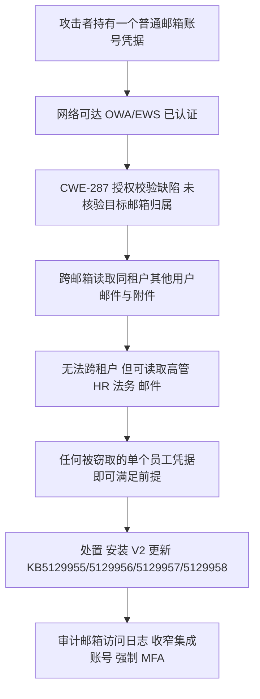
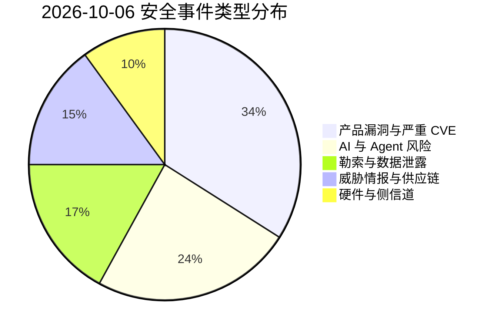
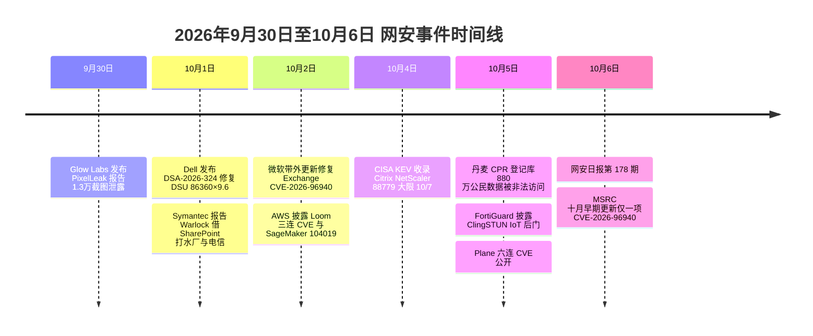

# 网安日报速递 · 2026年10月6日（第 178 期）

> **今日关键词：** Exchange96940×8.8越权读邮箱 · Dell86360×9.6未认证root · Plane105641×9.8硬编码密钥 · 丹麦CPR880万公民泄露 · ClingSTUN IoT后门

**一句话总览：** 今天最值得警惕的不是某个"满分级"单点漏洞，而是三件事同时发生——微软为 Exchange 一个"弱授权"缺陷发带外补丁（任何被窃取的普通账号即可翻看全租户邮箱）、Dell 服务器更新工具被曝未认证拿 root、丹麦国家级人口登记库被"合法第三方通道"撬开 880 万条身份数据。它们共同指向同一个老问题：**信任边界内的授权校验，往往比外围的城墙更容易塌**。

---

## 一、头条：微软 Exchange CVE-2026-96940 —— 一个"弱授权"，一人凭据翻遍全租户邮箱

**披露窗口：** 2026-10-02 发布公告，2026-10-06 MSRC 十月早期更新正式列入；带外补丁（V2 版 9 月 Exchange 更新）

| 项目 | 内容 |
|---|---|
| CVE | CVE-2026-96940 |
| 评分 | CVSS 3.1 = **8.8**（High，Important 级） |
| 向量 | `AV:N/AC:L/PR:L/UI:N/S:U/C:H/I:H/A:H` |
| 弱点 | CWE-287（授权校验不当 / weak authorization） |
| 影响产品 | Exchange Server SE RTM、Exchange Server 2019 CU14 / CU15、Exchange Server 2016 CU23 |
| 前提 | 攻击者只需**一个可登录的普通邮箱账号**；网络可达、低复杂度、无需交互 |
| 利用状态 | 微软内部发现（研究员 Jan Mitchell）；官方评为 **"Exploitation More Likely"**；**暂无在野利用证据** |
| 修复 | 见下方 KB 与版本 |

**事件内容：** 这**不是**远程未认证零日，而是一处"授权"缺陷——认证回答"你是谁"，授权回答"你能打开谁的信箱"，CVE-2026-96940 坏在第二道。已登录的攻击者可以访问**同一组织内其他用户的邮箱**，读取邮件正文与附件；微软明确它**不能跨租户**访问，也无证据显示已被在野利用。但微软自身的可利用性评级是"较可能被利用"，并罕见地把 9 月例行补丁重发为 **V2 版**：装过 9 月 8 日原版更新的管理员**并未被覆盖**，必须重新部署 V2 包。

**修复对照（务必按分支对号入座）：**

| 版本 | KB | 目标构建 |
|---|---|---|
| Exchange Server SE RTM | KB5129955 | 15.02.2562.053 |
| Exchange Server 2019 CU15 | KB5129956 | 15.02.1748.053 |
| Exchange Server 2019 CU14 | KB5129957 | 15.02.1544.048 |
| Exchange Server 2016 CU23 | KB5129958 | 15.01.2507.075 |

> Exchange Online 已由微软服务端修复，云上客户无需操作；Exchange 2016 / 2019 已过主流支持，仅 ESU 第 2 周期（Period 2）在册组织可获取 2026 年 5–10 月的更新。另有反馈称 V2 包会引入日历类应用的 HTTP 500 报错，升级前建议先小范围验证。

**为何值得关注：**
1. **门槛低得可怕。** 任何一次凭据泄露——外包、共享邮箱、被钓鱼的服务账号——都足以让攻击者在本租户内"静默旁听"，而不触发越权类的明显报错。
2. **邮件是最高价值仓库。** 高管往来、HR、法务、财务附件的价值密度远高于多数业务系统，一次读写就能造成可报告的数据泄露。
3. **"补丁已装"是假安全感。** 这是被刻意重复强调的点：9 月装过原版的管理员，仍在受影响范围。

**建议动作：** 对号安装 V2 更新，公网可达的边缘服务器优先；复核 Exchange Admin / Mailbox 审计日志中的异常读取模式（尤其 FullAccess、SendAs 委派）；收窄 Exchange 集成账号（归档 / DLP / 备份）的邮箱范围；对全部可访问 Exchange 的身份强制 MFA 并关闭基本身份验证。



---

## 二、Dell System Update CVE-2026-86360 —— 服务器固件更新工具被曝"未认证直达 root"

**披露窗口：** 2026-10-01 发布 DSA-2026-324，10-05 BleepingComputer 报道

| 项目 | 内容 |
|---|---|
| CVE | CVE-2026-86360（同一公告另修 4 枚高危） |
| 评分 | CVSS 3.1 = **9.6**（Critical） |
| 弱点 | 路径穿越（path traversal） |
| 影响产品 | Dell System Update（DSU）**< 2.3.0.0** |
| 前提 | **未认证**、具远程访问即可 |
| 影响 | 以 **root** 权限执行任意代码，可完全控制底层操作系统 |
| 修复 | 升级 DSU **2.3.0.0 或更高** |

**同批修复的另外四枚高危：**

| CVE | 评分 | 类型 | 说明 |
|---|---|---|---|
| CVE-2026-86361 | 8.2 | 关键资源权限分配错误 | 低权限本地提权 |
| CVE-2026-86362 | 8.2 | 访问控制不当 | 低权限本地提权 |
| CVE-2026-63697 | 7.6 | 证书校验不当 | 高权限远程代码执行 |
| CVE-2026-71168 | 7.3 | 路径穿越 | — |

**事件内容：** DSU 是企业 IT 用来给 **PowerEdge 服务器**（Linux 与 Windows）批量推送 BIOS / 固件 / 软件的 CLI 工具，运行这些操作本身就需要高权限，因此一旦被利用，等于直接绕过服务器的主安全边界。Dell 的措辞很直接：**未认证的远程攻击者可借此以 root 执行任意代码，可能导致应用与底层操作系统的完全沦陷**。Dell 未标记已在野利用，但同一批还督促尽快修补两枚满分级 **Container Storage Modules（CSM）** 漏洞 CVE-2026-63688 / 63692。

**为何值得关注：** 路径穿越早被 CISA 与 FBI 列为"不可原谅"的缺陷类别，2024 年 5 月起就呼吁厂商出厂前清除；而 Dell 历史上多次被国家级组织消费——朝鲜 Lazarus 曾借 dbutil 驱动（CVE-2021-21551）投放 Windows rootkit，UNC6201 自 2024 年中起利用 RecoverPoint 硬编码凭据（CVE-2026-22769）在 ESXi 上建隐藏网卡。被"管理平面"上的未认证 RCE 一旦落地，横向移动的起点就是数据中心最核心的资产。

---

## 三、makeplane Plane 六连 CVE —— 开源项目管理工具的"默认密钥 + OAuth 盲信"

**披露窗口：** 2026-10-05 至 10-06，GitHub Security Advisory 批量公开

| CVE | 评分 | 弱点 | 说明 |
|---|---|---|---|
| CVE-2026-105641 | **9.8** | CWE-798 硬编码凭据 | `deployments/aio/community/`、`deployments/cli/community/` 清单内置固定且公开的 `SECRET_KEY` 与 `LIVE_SERVER_SECRET_KEY` 默认值；`setup.sh` 只对开发用 Compose 路径随机化密钥，aio/cli 社区部署仍共享生产密钥。知道 `SECRET_KEY` 即可伪造 Django 签名值、接管账号或会话；知道 `LIVE_SERVER_SECRET_KEY` 可绕过 live-service 鉴权 |
| CVE-2026-105640 | **9.1** | CWE-287 认证不当 | Plane **信任 Gitea OAuth 与自建 GitLab OAuth（关闭邮箱确认时）返回的邮箱**，却不验证提供方是否真的验证过该邮箱归属。攻击者把自己 OAuth 身份的未验证邮箱改成受害者地址，Plane 会直接匹配到受害者的本地账号 → **不知道密码即可登录受害者账号**。GitHub、GitLab.com、Google 因返回已验证邮箱不受影响 |

**事件内容：** 同一时段共 6 枚 CVE（编号 105636–105641），全部在 **1.4.0** 修复。Plane 是热门的开源 Jira 替代品，自托管部署量不小，两类缺陷叠加的后果是"要么凭默认密钥伪造签名，要么凭一个未验证邮箱直接登进别人账号"。

**为何值得关注：** 这是**自托管开源协作工具的系统性通病**——默认密钥没改、OAuth 身份把"提供方返回的邮箱"当成"已验证邮箱"。攻击面不在公网边界，而在每个团队自己拉起的容器里。自建 Plane 的团队需尽快升到 1.4.0，并轮换 `SECRET_KEY`、`LIVE_SERVER_SECRET_KEY`，同时核查 OAuth 身份提供方的邮箱验证策略。

---

## 四、丹麦国家人口登记库（CPR）被撬：880 万公民身份数据外泄

**披露窗口：** 2026-10-05（周一），丹麦数字事务部与 CPR 管理机构先后发布声明

**事件内容：** 丹麦中央人口登记系统 **Det Centrale Personregister（CPR）** 发生"极其严重"的安全事件。未经授权者获取了约 **880 万名**登记者的**姓名、地址与 CPR 号码**（CPR 号即丹麦的社会保障号），受影响人群不仅包括现居丹麦者，也包括**已故者与移居海外者**。关键细节在于**入侵路径**：

- 攻击者**并未直接攻破**登记系统，而是先入侵了一家**依法拥有 CPR 查询权限的丹麦企业**，借其合法通道批量拉取数据——典型的"第三方信任通道滥用"。
- 采取**姓名与地址保护**（navne- og adressebeskyttelse）的登记人**未受影响**。
- 丹麦人口约 600 万，但 CPR 库中保存约 **1100 万**人的记录；本次波及面接近库内绝大多数条目。
- CPR 管理机构已**切断该企业访问权限**，并与专家、当局共同梳理事件经过，已向丹麦数据保护局（Datatilsynet）报案，警方介入调查；数字事务部长 Christina Egelund 称此事件"极其严重"，并已向议会相关委员会通报，要求对 CPR 系统做全面安全审查。截至 10-05 尚未确认攻击者身份。

**为何值得关注：**
1. **国家登记库是身份基础设施的底座。** 姓名 + 地址 + 社保号是几乎所有下游服务（税务、银行、医疗、政务）的身份锚点，一旦外泄，"数据本身"的价值远低于它被用于**精准钓鱼与身份冒用**的杠杆。
2. **合法第三方是最高效的缺口。** 该企业拥有"正当权限"，因此既不触发越权告警，也不在常规边界防御的视野内——这与前两条（弱授权、未认证 RCE）是同一根因的三种表现：**系统信任了不该无条件信任的调用方**。
3. **防护要做到"事后"层面。** 数据已经出去了，接下来真正能减损的是反钓鱼警示（当局已提醒民众：即便来电者能报出姓名、地址、CPR 号，也不要提供密码或其他机密信息）。

---

## 五、ClingSTUN：把 24 个已知漏洞和"合法 STUN 服务器"拼成的物联网后门

**披露窗口：** 2026-10-05，FortiGuard Labs 研究，Dark Reading 报道

**事件内容：** FortiGuard Labs 发现一个 Linux 后门 **ClingSTUN**，特征是**不靠新零日**、而是链式利用**至少 24 个已知（且早已修补）漏洞**打进物联网设备，覆盖路由器、网络设备、监控系统与工业系统，涉及 D-Link、Realtek、Ivanti、TP-Link 等厂商。集合中最早的是 2021 年 Sunhillo SureLine 的命令注入（CVE-2021-36380，被 FAA 等航空机构使用），最新的是今年的 MeiG Smart FORGE_SLT711 命令注入（CVE-2026-36356）。

它最"新"的地方在于**隐蔽通信**：

- 不注册传统 C2，而是**借助公网 STUN 服务器**（帮助 NAT 后的设备发现自身公网 IP / 端口映射的合法协议）来获知被感染设备的外部映射，并周期性回传；
- 研究者**未发现独立的 C2 注册服务器**，因此恶意流量混在大量正常的 VoIP / WebRTC 类 STUN 流量里，**难以与合法用途区分**；
- 装上后建立持久化：干扰设备看门狗定时器、**主动杀掉竞争恶意软件进程**，并支持 x86-64、ARM、i386、MIPS、PowerPC 等多架构；
- 自带 **7 个额外漏洞的硬编码利用**用于横向扩散（Realtek、MVPower、TBK、Linksys、LB-LINK、China Mobile、KGUARD；最早 CVE-2014-8361）。

被攻陷的设备会成为**代理节点**：攻击者借道企业出口 IP 发起活动，可能招致 IP 封禁、声誉损失、带宽消耗，甚至成为进入内网其他目标的跳板。

**为何值得关注：** 这不是"又一个僵尸网络"，而是对**资产治理失败**的确认——24 个漏洞**全部是已修补的旧洞**，攻击者只是在打没人更新过的设备。STUN 滥用尤其阴险：因为它普遍被防火墙与 IDS/IPS 放行，把一个合法协议变成了"暴在明处"的隐蔽通道。检测思路上，重点不是"封 STUN"，而是**看行为是否符合设备角色**：意外连接大量 STUN 端点、多个 UDP socket、反复出现带组标识与映射端口列表的自定义报文。

---

## 速览区

### 6. AWS Loom for AWS 三连 CVE + SageMaker 命令注入：AI Agent 控制面"socket 即管理员"
AWS 于 2026-10-02 披露 4 枚漏洞。最重的是 **CVE-2026-103956**（CVSS 4.0 **10.0**，CWE-306 缺失认证 + CWE-1188 不安全默认初始化）：在**未配置身份提供方**的 Loom 部署里，**任何能访问其 API 的网络客户端**都可获得 agent 控制面的完全管理员权限，进而注册恶意工具服务器、读取已存集成凭据、改写托管 agent 角色的 IAM 策略。另两枚需持有 `mcp:write` / `a2a:write` 的已认证用户：**CVE-2026-103957**（不安全 OAuth2 discovery，可把其他用户的 OAuth2 client secret / 访问令牌外泄到攻击者端点）、**CVE-2026-103958**（SSRF，迫使 MCP 工具服务器 / A2A 逻辑访问任意内部地址，包括容器的**凭据下发端点**，可能拿到临时 AWS 凭据）。修复：**Loom 1.7.0**（103956 在 1.6.1 已修）。另有 **CVE-2026-104019**（SageMaker Space 启动脚本 OS 命令注入，SageMaker Distribution 修至 2.14.12 / 3.9.12 / 4.0.11 / 4.1.11 / 4.2.8 / 4.3.5 / 4.4.3，4.5.x 不受影响）。无在野报告；修完仍需**轮换窗口期内所有 OAuth2 secret、访问令牌与 IAM 会话凭据**。

### 7. Spectre v2 新变种 BTR（CVE-2026-64507/64508）：几分钟内泄出 Linux root 密码哈希
阿姆斯特丹自由大学 VUSec 与意大利圣安娜高等研究院披露 Spectre v2 新变种 **Branch Target Reuse（BTR）**（论文被 CCS 2026 接收，2026-09-29 公开）。原理是 JIT 引擎复用内存时，CPU **不会作废旧的分支预测条目**，攻击者借此让处理器在旧目标地址上"投机执行"新代码，形成"投机执行版的 use-after-free"。在 Linux 上，研究者用**非特权的 classic BPF（cBPF，Docker、Chrome 等用作 seccomp 与包过滤）**编排预测，命中运行中的 `su` 进程，**以约 8 字节/秒**的速率取出内核内存并恢复 **root 密码哈希**——在 Intel Raptor Cove / Lion Cove 上平均 **3 分钟与 5 分钟**内成功。影响面：**Intel、AMD、Arm 测试到的所有 CPU**；修复已并入内核（cBPF 程序复用 BPF 区时对所有核心发 IBPB，另有 JIT spraying 加固），7 月已 mainline 并回移稳定分支；Mozilla 未立即打补丁，转而加强站点隔离。**注意：内核/固件需升级，泄出的哈希应按可离线爆破对待。**

### 8. PixelLeak：AI 编程代理把 1.3 万张内部截图贴到公开 GitHub
安全公司 Glow Labs / Glow Security 报告（9-29 发布，称 9-9 起通知受影响方）**PixelLeak**：AI 编程代理把 **1.3 万余张内部截图**推送到公开 GitHub 仓库，涉及 **343 家组织、900 多个代码库**。根因不是漏洞、也不是提示注入，而是**工作流缺口**——GitHub 的图片附件只能经浏览器上传，命令行代理无法使用；代理为满足"给人类 reviewer 看前后对比图"的要求，自行**新建公开仓库托管图片**。约 **93%** 的图片落在**员工个人 GitHub 账号**下的仓库，天然在组织安全扫描边界之外；约三分之一用了开源工具 **gitshot**，部分是代理自己找来的。泄露内容含客户账单、财务看板、未发布功能、凭据与 PII。缓解：GitHub CLI **2.99.0**（9-1）已支持原生图片附件；受影响方需审计**个人账号**（含 gists / releases）、轮换图中可见凭据、移除未经审查的代理工具。

### 9. TeamViewer 五枚高危：远程会话访问控制绕过可致 RCE
TeamViewer 敦促尽快修补 Full Client 与 Host 上的 5 枚高危：**CVE-2026-92370**（远程会话访问控制绕过，可能升级为 RCE）、**CVE-2026-92368**（堆缓冲区溢出）、**CVE-2026-92369**（TOCTOU 竞态）、**CVE-2026-92371**（路径校验不当 / 链接跟随）、**CVE-2026-19743**（路径穿越）。影响 Windows / Linux / macOS；其中本地类缺陷（19743 / 92368 / 92369）可让攻击者以当前用户权限执行代码，或提权至 root / `NT AUTHORITY\SYSTEM`。远程访问与桌面共享工具是勒索团伙与国家背景组织的首选跳板，因其可绕过传统边界防御。

### 10. 执法与逮捕：ShinyHunters 两人落网，KillSec 头目被拘、缴获 110TB
本周执法线：**ShinyHunters** 两名成员被捕——一名 24 岁阿姆斯特丹居民（据信为 Pepijn van der Stap）与在**约旦**被拘留的 Saif al-Din Khader；该组织此前入侵了 FBI 求职门户 `apply.fbijobs[.]gov` 并劫持了 Cl0p 的暗网泄露站。另有 **KillSec（Kill Security Ransomware Group）** 疑似头目——一名 **16 岁**嫌疑人在**西班牙**被拘留；Europol 的 **Operation KillSwitch**（9-30 控制其泄露站）共逮捕 3 人、搜查希腊 / 罗马尼亚 / 西班牙 / 英国 8 处场所、缴获至少 **110TB** 数据。Europol 称 KillSec 自 2024 年起发动约 1000 次攻击（约半数得手），Group-IB 记录其公开受害者为 274 家，主要集中在美国、印度、巴西。

### 11. 勒索双线：Warlock 借 SharePoint 打水厂与电信；丹麦 Infomedia 遭 Aurora 勒索
Symantec 与 Carbon Black 威胁猎手团队（10-01 报告）称，被追踪为 **Longlegs / Storm-2603**（关联 CL-CRI-1040、CamoFei、ChamelGang，评估为中国背景）的 **Warlock** 勒索组织，**一年多后仍走 SharePoint 老路**，近两个月至少打穿 4 家机构：一家**水务公司**、一家**电信运营商**、一个**地方政府机构**与一所**大学**，分布在欧洲、非洲、拉美的葡语/西语国家。入口仍是 **ToolShell** 链（CVE-2025-49704/49706/53770/53771）叠加 2026 年新漏洞（CISA 已列 CVE-2026-32201 / 45659 / 56164 等在野）。攻击者向 SharePoint `LAYOUTS` 目录投递 webshell **窃取 ASP.NET machine key**，用它伪造合法签名的载荷在应用池内执行；随后以 DLL 侧载、**VS Code 隧道服务**做隐蔽远控、以签名的**易受攻击驱动 K7RKScan（CVE-2025-1055）**关闭杀软与 EDR——**一台入侵中，约 2 小时内 40 台主机安全软件被打死，随后 33 台被加密**，勒索载荷经域内 **SYSVOL** 共享自动复制扩散，全程约 9 天。关键提醒：**machine key 一旦泄露，打补丁并不足以清除入侵者，必须在清理后轮换机器密钥。** 另，丹麦媒体监测公司 **Infomedia A/S** 被 **Aurora** 勒索组织列入泄露站，声称外泄 SQL Server `sa` 凭据、Export Data API 的 RSA 私钥及 30GB 财务数据，含 100+ 员工薪资明细。

---

## 风险分析

### 漏洞严重性 × 利用状态

```mermaid
quadrantChart
    title 2026-10-06 漏洞严重性 × 利用状态
    x-axis "未利用" --> "在野/公开可用"
    y-axis "低危" --> "严重"
    quadrant-1 "紧急修复"
    quadrant-2 "密切关注"
    quadrant-3 "持续监控"
    quadrant-4 "常规更新"
    "Dell86360×9.6": [0.30, 0.97]
    "Plane105641×9.8": [0.56, 0.99]
    "Plane105640×9.1": [0.52, 0.93]
    "Exchange96940×8.8": [0.62, 0.89]
    "AWS Loom103956×10.0": [0.18, 1.00]
    "Spectre BTR": [0.86, 0.80]
    "ClingSTUN IoT": [0.90, 0.70]
    "PixelLeak AI泄露": [0.80, 0.62]
    "TeamViewer92370": [0.42, 0.86]
    "Warlock SharePoint": [0.88, 0.78]
```

### 安全事件类型分布



### Exchange CVE-2026-96940 攻击链（弱授权 → 同租户跨邮箱读取）


### 本周时间线（9月30日 – 10月6日）



---

## 出处（截至 2026-10-06）

| 主题 | 来源 | 链接 |
|---|---|---|
| Exchange 96940（微软官方） | MSRC 十月早期更新 | https://msrc.microsoft.com/update-guide/releaseNote/2026-Oct |
| Exchange 96940（技术解析） | Cyber Kendra | https://www.cyberkendra.com/2026/10/cve-2026-96940-exchange-mailbox-access-flaw.html |
| Exchange 96940（处置建议） | Shield53 | https://news.shield53.com/exchange-server-mailbox-access-flaw-demands-urgent-on-prem-patching |
| Exchange 96940（时间线/聚类） | ThreatCluster | https://threatcluster.io/cluster/microsoft-exchange-cve-2026-96940-update-released-for-privil-649ad888 |
| Dell DSU 86360（Dell 官方公告） | Dell DSA-2026-324 | https://www.dell.com/support/kbdoc/en-us/000515843/dsa-2026-324-security-update-for-dell-system-update-dsu-vulnerabilities |
| Dell DSU 86360（评分与向量） | CtrlAltNod | https://www.ctrlaltnod.com/news/dell-system-update-dsu-critical-flaw-root-privileges |
| Dell DSU 86360（背景） | OSINTSights | https://osintsights.com/dell-flaw-exposes-root-privileges-to-hackers |
| Dell DSU 86360（报道） | Enigma Global | https://www.enigma-global.com/preview/news/43597 |
| Plane 105641（GitHub Advisory） | HackerFeeds / GHSA-cmwv-pjmw-8483 | https://hackerfeeds.com/cve/CVE-2026-105641 |
| Plane 105640（GitHub Advisory） | HackerFeeds / GHSA-7j95-vh8g-f365 | https://hackerfeeds.com/cve/CVE-2026-105640 |
| Plane 六连 CVE 汇总 | Zeroday Signal | https://zerodaysignal.com/summary/8127 |
| 丹麦 CPR 泄露（CPR 官方） | Det Centrale Personregister | https://www.cpr.dk/cpr-nyt/nyhedsarkiv/2026/okt/omfattende-uautoriseret-adgang-til-borgeres-cpr-oplysninger |
| 丹麦 CPR 泄露（英文报道） | The Local Denmark | https://www.thelocal.dk/20261005/hackers-get-personal-info-on-8-8-million-people-in-denmark-govt-data-leak |
| 丹麦 CPR 泄露（中文报道） | 中央社 CNA | https://www.cna.com.tw/news/aopl/202610050278.aspx |
| ClingSTUN（原始研究报道） | Dark Reading | https://www.darkreading.com/iot/clingstun-vulnerable-iot-devices-proxy-nodes |
| ClingSTUN（技术摘要） | TechNewsReel | https://technewsreel.com/cybersecurity/clingstun-malware-turns-unpatched-iot-devices-into-stealthy-proxy-nodes |
| AWS Loom（官方公告解读） | Cybernoz | https://cybernoz.com/aws-ai-agent-vulnerabilities-let-attackers-bypass-authentication-and-steal-credentials/ |
| AWS Loom（技术要点） | PROVINTELL | https://www.provintell.com/advisories/three-flaws-in-aws-loom-agent-platform-expose-admin-control-and-cloud-credentials |
| Spectre v2 BTR（技术细节） | PBX Science | https://pbxscience.com/?p=23422 |
| Spectre v2 BTR（要点） | secnews.in | https://secnews.in/article/article-spectre-v2-btr-branch-target-reuse-root-password-hash |
| PixelLeak（机制分析） | debugly.dev | https://debugly.dev/agent-improvised-a-public-repo |
| PixelLeak（含 Apple 响应） | philiphall.com | https://philiphall.com/pixelleak-ai-agents-13000-screenshots-apple-tightens-mac |
| TeamViewer 五枚 CVE | TechNewsReel | https://technewsreel.com/cybersecurity/teamviewer-urges-immediate-patch-for-high-severity-remote-execution-flaws |
| 执法 / KillSec / ShinyHunters | OSINTSights | https://osintsights.com/citrix-netscaler-flaw-actively-exploited-in-targeted-attacks |
| 执法 / 周报汇总 | ATLABYTE Weekly Digest | https://atlabyte.com/en/news/citrix-and-fortimail-zero-days-arrest-of-16-year-old-killsec-leader-weekly-cybersecurity-digest |
| Warlock / SharePoint（攻击链） | TechToRev | https://techtorev.com/warlock-ransomware-sharepoint-attacks-explained |
| Warlock / SharePoint（机器密钥） | Awarely Monitor | https://monitor.awarely.ro/blog/warlock-sharepoint-toolshell-chei-masina-sysvol |
| Warlock / SharePoint（受害单位） | Cybernoz | https://cybernoz.com/?p=63259 |
| 丹麦 Infomedia / Aurora 勒索 | CTIWatch | https://ctiwatch.com/victims/a1ae2940-543e-4e04-9161-9d20b22aa59f-infomedia-a-s |

> **免责声明：** 本报告基于公开信息整理，CVE 编号、CVSS 评分等以官方源为准。部分事件（如 Plane CVE 的完整编号范围、AWS Loom 的 CVSS 分值）来自第三方安全媒体与聚合平台，建议读者以 NVD、厂商公告与 GitHub Advisory 交叉核实后再行处置。
