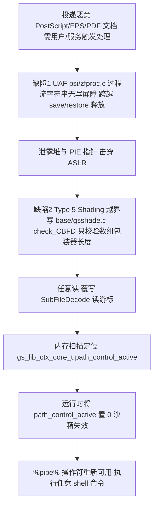
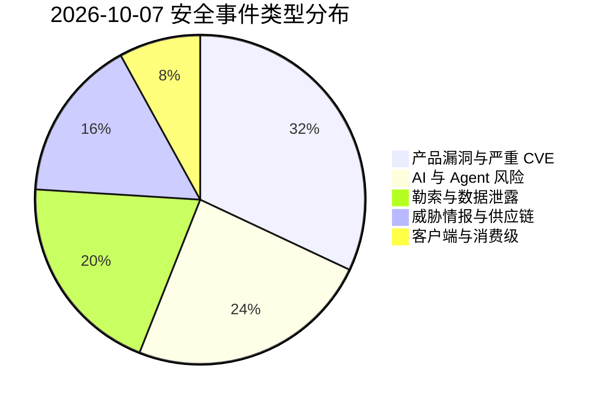
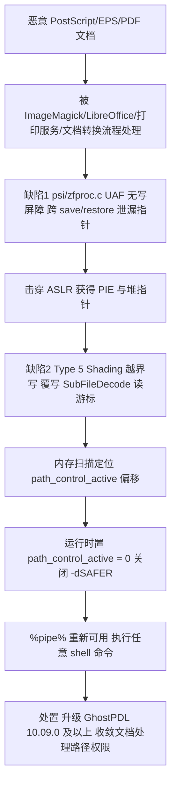
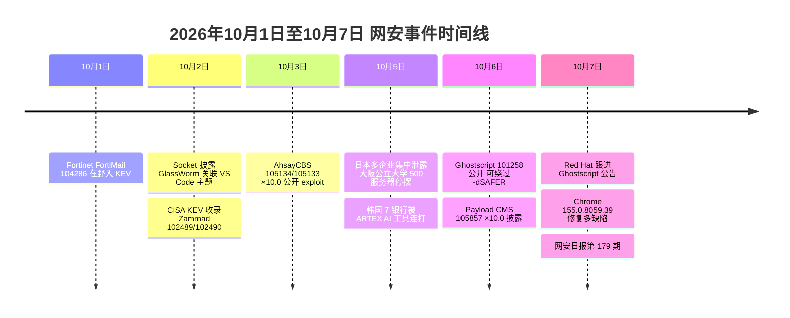

# 网安日报速递 · 2026年10月7日（第 179 期）

> 每日精选全球网络安全动态，覆盖 CVE 漏洞、安全事件、威胁情报与执法行动。本期主线：**"沙箱"与"信任"再次同时失效**——一个是用来隔离不可信文档的 Ghostscript `-dSAFER` 沙箱被五段链整体掀翻，一个是让 VS Code 主题"只该改颜色"却获得了执行代码的权限，还有一个是金融机构信任了本该被更强校验的合作伙伴入口。

---

## 一、今日重点（5 条）

### 1. Ghostscript CVE-2026-101258：五段链掀翻 `-dSAFER` 沙箱，公开 PoC 已就绪（头条）

**2026-10-06 公开、10-07 Red Hat 跟进出公告。** Ghostscript 的 `-dSAFER` 沙箱是它处理不可信 PostScript/EPS/PDF 时唯一的隔离手段，而 **CVE-2026-101258**（CVSS 3.1 = **7.8**，High）把它整个掀掉了。

| 项目 | 内容 |
| --- | --- |
| CVE | CVE-2026-101258 |
| CVSS 3.1 | **7.8**（High） |
| 缺陷类型 | CWE-416 释放后使用（UAF） + CWE-787 越界写（OOB Write） |
| 受影响组件 | `psi/zfproc.c`、`base/gsshade.c`、`base/gsfunc3.c`、`psi/zshade.c` |
| 受影响版本 | Ghostscript **10.00.0 – 10.07.1**（Alpine / Arch / Debian / Fedora / Ubuntu 均复现） |
| 修复 | GhostPDL **10.09.0** 源码已含修复（Red Hat RHSA-2026:76877 等跟进） |
| 利用状态 | **公开 PoC**（V12 Security 于 BSides Canberra 2026 发布），多发行版确认可用 |

**利用链（五段）：**



**为什么值得关注：** 这不是"崩溃级"的内存破坏，而是**主动关掉了沙箱的开关**——`-dSAFER` 存在的唯一目的就是禁止 `%pipe%` 之类危险操作。PoC 一公开，利用门槛立刻从"研究级"降到"脚本级"。更关键的是它的部署面：Ghostscript 是 **ImageMagick、LibreOffice、各类打印服务与文档转换微服务**的后端解析引擎，任何"把用户上传的文档喂给 Ghostscript"的流程都是候选目标——而这些流程常常藏在后台守护进程里，运维视角看不见。

---

### 2. Payload CMS CVE-2026-105857：表单提交即 RCE，满分 10.0 未认证远程代码执行

**2026-10-06/07 披露。** Payload 是流行的开源 headless CMS，`@payloadcms/plugin-form-builder` 是它的表单构建插件。**CVE-2026-105857**（CVSS 3.1 = **10.0**，Critical）允许攻击者构造一次表单提交，直接在服务器上执行代码。

| 项目 | 内容 |
| --- | --- |
| CVE | CVE-2026-105857 |
| CVSS 3.1 | **10.0**　`AV:N/AC:L/PR:N/UI:N/S:C/C:H/I:H/A:H` |
| 缺陷类型 | CWE-94 代码注入 + CWE-1321 原型污染 |
| 受影响版本 | `@payloadcms/plugin-form-builder` < **3.90.0**；canary < 4.0.0-canary.34 |
| 修复 | **3.90.0** / **4.0.0-canary.34**（GHSA-r488-j9vj-wx3q） |

**为什么值得关注：** 向量里 `PR:N / UI:N / S:C` 三项叠加意味着**无需认证、无需交互、且影响范围超出组件本身**——这正好是"互联网上任何脚本都能打"的画像。而表单是 CMS 面向公网的天然暴露点，谁会把联系表单藏在登录后面？修完还必须**重建并重新部署产物**（只改 `package.json` 而运行旧镜像等于没修），并轮换进程可触及的数据库、云与签名密钥。

---

### 3. 韩国 7 家金融机构被"AI 渗透工具"连打：约 6.8 万人资料外泄

**2026-10-05 起披露、10-07 持续发酵。** 韩国至少 7 家金融机构遭入侵，调查人员在攻击服务器中发现了中文串 **"ARTEX-自主渗透测试控制台"**。

| 机构 | 外泄规模 |
| --- | --- |
| Yegaram 储蓄银行 | 约 40,000 人 |
| Shinhan 银行 | 25,729 人 |
| Welcome 储蓄银行 | 2,200 条企业记录 |
| Hyundai Capital | 146 名贷款中介 |
| KB Kookmin 银行 | 119 条 |
| Hana 银行 | 89 条 |
| BNK 釜山银行 | 11 名合同工 |
| **合计** | **约 68,000 人 + 2,200 条企业记录** |

外泄数据含**姓名、联系方式、居民登录号、年收入与贷款额度**。攻击者**没有正面强攻核心银行系统**，而是反复试探**员工与合作伙伴门户**（贷款中介查询、员工销售支持台）这类控制更弱的入口，手法涉及**撞库 + 参数篡改**。韩国金融监督院已发现 **28–33 个攻击 IP**，分布在美、日、德、港、新等 10 余个国家/地区。

**ARTEX 是什么：** 它**不是大模型**，而是一款由中国网络安全工程师开发的开源**自主渗透测试控制台**，可调用 Claude Opus、GPT、DeepSeek 等模型来编排多个 AI Agent，自动侦察、找洞、规划攻击路径。韩国金融安全院（FSI）明确：**是人在操作工具，AI 并未自主行动**，且**无证据表明攻击者来自中国**。

**为什么值得关注：** 这是"AI Agent 加速攻击"在**金融行业**的一次落地——它把过去需要专家逐步手工完成的侦察与试探流程压缩成可自动编排的流水线，**显著降低了攻击门槛**。而暴露的"收入 + 贷款额度"组合，是精准钓鱼与语音诈骗的黄金素材：一个电话能同时报出姓名、住址与贷款额度的"客服"，说服力完全不同。韩国总统已下令"速度至上"，金融委员会紧急召集 CEO 开会。

---

### 4. 日本多起数据泄露与勒索集中爆发：公立大学 500 台服务器停摆，涉数百万用户

**2026-10-06 综合报道。** 日本多所学校与企业**在一周内**接连报告数据泄露或网络攻击，各起事件**相互独立**，却叠加成一次区域性冲击。

| 受害方 | 影响 |
| --- | --- |
| 大阪公立大学 | 约 **500 台服务器**停止运行（疑勒索），≥**13 万**师生姓名/地址/邮箱或外泄，讲座取消（原大阪府立大学 + 大阪市立大学 2022 年合并，遗留系统并存） |
| Mr. Max Holdings（折扣零售） | 最多 **170 万**客户个人数据 |
| GMO Research & AI | **948,500** 条会员记录；约 290 万日元积分被非法兑换成亚马逊礼品卡 |
| Monogatari（烤肉连锁 Yakiniku King） | **超 1,000 万**条客户信息（邮箱、电话），几乎覆盖全部注册用户 |
| Daiwa Securities（大和证券） | 约 **11 万**客户数据（经承包商服务器） |

**为什么值得关注：** 两点。其一，**500 台服务器同时倒下**说明这不是局部端点事件，而是核心机房级打击，且发生在"能容纳合并后两校遗留系统"的复杂拓扑上——**机构合并往往把两套安全基线拼在一起，形成横向移动的暗道**。其二，教育 + 零售 + 金融同时中招，说明攻击者并不挑行业，**挑的是"安全投入与数据价值不匹配"的目标**。

---

### 5. GlassWorm 借"配色主题"再下手：VS Code 主题内藏下载器与 Solana 隐蔽 C2

**2026-10-02 报告公开、10-06 持续报道。** Socket 研究报告《Pretty Themes, Hidden Loaders》揭露一个与 **GlassWorm** 高度关联的 VS Code 扩展簇：**Visual Studio Marketplace 4 个 + Open VSX 6 个**，其中 **2 个确认恶意**。

- **Aurora Nocturne Night Theme**（冒充 `microsoft` 发布者身份）：公开仓库看着正常，实际分发包是**约 59KB、单行混淆的 JavaScript**，用**零宽 Unicode 字符**隐藏载荷；解码后从 `fingercakes4sale[.]store` 下载内容，存为 `%TEMP%\temp_batch.cmd`，并用 **`cmd.exe` 隐藏窗口**执行。
- **Cosmic Nebula Themes**：用 **AES-256-CBC** 解密内嵌脚本后 `eval()`；**检测到俄语/俄罗斯时区即退出**，再通过**读取 Solana 交易备注**（dead drop）解析下一阶段下载地址——运营者可**不发新版本就轮换投递服务器**。其 Solana 地址、密钥与执行模式与既往 GlassWorm 活动一致。
- **高风险待观察**：Coca-Cola Christmas 与 Aurora Borealis Studio Theme（Marketplace 合计 **8,000+ 安装**，含可执行 JS 但未检出载荷）；Open VSX 上 Coca-Cola Christmas 约 **39,000** 下载、Charcoal Mint 约 **10,000**。微软已下架被举报扩展，但 **Cursor、Windsurf 等 VS Code 分支默认用 Open VSX**，只清 Marketplace 不够。

**为什么值得关注：** **一个配色主题只需要描述"编辑器长什么样"，VS Code 却允许主题携带 JavaScript，且没有细粒度权限控制**——这个架构缺口把"主题"变成了"加载器"。又一次证明了**"审仓库"不等于"审包"**：仓库可以干净，分发包却可能是另一副面孔（仓库即剧场）。而这些代码跑在**装着 SSH 密钥、Git/云凭据、CI/CD 密钥**的开发者机器上，以**用户自身权限**运行、**无逐条权限提示**——这是供应链最薄弱又最高价值的一环。

---

## 二、速览区（6 条）

1. **AhsayCBS CVE-2026-105134 / 105133（CVSS 10.0）**：AhsayCBS 备份管理平台存在未认证 OS 命令注入，影响 **10.3.0–10.3.2**，修复 **10.3.4**，两枚均已公开 exploit 代码。备份基础设施是"最后一道防线"，被拿下等于勒索方连你的底牌一起端走。

2. **OrdaSoft Joomla CCK CVE-2026-102427（CVSS 10.0）**：Joomla 的 OrdaSoft CCK 组件在 **< 8.3.16** 存在未认证 RCE，入口为 `site/uploader.php`，网络可达、利用简单，若挂在公网应优先于其它项修补。

3. **Progress DataDirect ARCGenAI CVE-2026-91140（CVSS 9.6）**：ARC AI Model Generator 的早期版本存在命令注入，**特制的 OpenAPI/Swagger 文档即可触发**——AI 时代的"文档即载荷"。修复方式很轻：**从仓库拉取最新的 agent 定义即可，无需安装或迁移**。

4. **Totolink A3002MU CVE-2026-105285（CVSS 10.0）**：`/boafrm/formIpQoS` 的 QoS 规则处理存在**栈溢出**，远程无需认证、无需交互，公开 PoC 已释出（`addQos / comment / entry_name` 参数）。家用/小型路由器广泛部署，属于"补丁未必有、但一定要收敛管理面"的一类。

5. **Google Chrome 155.0.8059.39**：2026-10-07 稳定版更新，修复多项缺陷，其中 **CVE-2026-106310**（FontAccess 组件释放后使用，可绕过 web 同源策略，需已攻陷渲染进程）与 **CVE-2026-102322** 等在列。Chrome 更新节奏快，但**渲染器沙箱逃逸类缺陷无论评分高低都应尽快跟进**。

6. **42 个恶意 RubyGems 包 + SubQuery npm 包被投毒**：一批针对**加密货币开发者**的恶意 RubyGems 包会**开反弹 shell 或下载二阶段载荷**；同时 SubQuery 生态一个正当 npm 包被植入恶意代码（v5.8.3），**在安装或被 import 时即触发**，窃取开发者机器与 CI（含 GitHub Actions）上的凭据与云密钥，并具备远程 shell 能力。用过相关依赖的团队须**轮换凭据**。

---

## 三、风险分析

### 3.1 漏洞严重性 × 利用状态象限

```mermaid
quadrantChart
    title 2026-10-07 漏洞严重性 × 利用状态
    x-axis "未利用" --> "在野/公开可用"
    y-axis "低危" --> "严重"
    quadrant-1 "紧急修复"
    quadrant-2 "密切关注"
    quadrant-3 "持续监控"
    quadrant-4 "常规更新"
    "Payload105857×10.0": [0.66, 1.00]
    "AhsayCBS105134×10.0": [0.74, 0.99]
    "Totolink105285×10.0": [0.72, 0.98]
    "Joomla102427×10.0": [0.55, 0.98]
    "ARCGenAI91140×9.6": [0.40, 0.93]
    "Ghostscript101258×7.8": [0.88, 0.74]
    "韩银行ARTEX AI": [0.92, 0.82]
    "GlassWorm主题": [0.86, 0.70]
    "Chrome106310": [0.22, 0.42]
    "RubyGems42包": [0.80, 0.66]
```

### 3.2 安全事件类型分布



### 3.3 Ghostscript CVE-2026-101258 攻击链（沙箱绕过 → 命令执行）



### 3.4 本周时间线（10 月 1 日至 10 月 7 日）



---

## 四、处置优先级建议

- **今天内**：Ghostscript（`10.09.0+`）、Payload CMS（`3.90.0+`）、AhsayCBS（`10.3.4`）、OrdaSoft Joomla CCK（`8.3.16+`）、Totolink 固件 / 管理面收敛——这些要么是满分、要么有公开 PoC。
- **本周内**：Progress DataDirect ARCGenAI（拉取最新 agent 定义）、Chrome（`155.0.8059.39+`）、RubyGems / SubQuery 相关依赖排查与凭据轮换。
- **持续性**：清点开发者机器上来自 **Marketplace 与 Open VSX 双源**的主题扩展（尤其 VS Code 分支 / Cursor / Windsurf）；对金融机构：复核员工与合作伙伴门户的鉴权强度与撞库防护；对疑似被 AI Agent 加速探测的系统，重点看**高频、多点、低强度**的试探日志。

---

## 五、出处（参考资料）

1. ThreatAft — Ghostscript CVE-2026-101258 分析（CVSS 7.8，-dSAFER 绕过/五段链）<https://threataft.com/articles/ghostscript-dsafer-bypass-cve-2026-101258>
2. ThreatCluster — Ghostscript CVE-2026-101258 命令执行聚类与时间线 <https://threatcluster.io/cluster/cve-2026-101258-ghostscript-vulnerability-allows-command-exe-6b6ecc74>
3. Undercode Testing — Ghostscript 五段沙箱逃逸技术拆解 <https://undercodetesting.com/unpacking-ghostscript-cve-2026-101258-advanced-five-stage-sandbox-escape-and-shell-execution-video>
4. TechGeeks — Red Hat RHSA-2026:76877（RHEL 8 Ghostscript） <https://www.techgeeks.org/security-notice-red-hat-ghostscript-rhel-8-rhsa-2026-76877>
5. Hacker Feeds — Payload CMS CVE-2026-105857（CVSS 10.0） <https://hackerfeeds.com/cve/CVE-2026-105857>
6. East Bay Cyber — Payload CMS CVE-2026-105857 处置与检测 <https://eastbaycyber.com/content/cve-2026-105857>
7. OffSeq Threat Radar — PayloadCMS CVE-2026-106100（同生态 IDOR 7.1） <https://radar.offseq.com/threat/cve-2026-106100-cwe-639-authorization-bypass-through-user-controlled-key-in-payloadcms-payload-d537d84e82e10254>
8. Korea Times — 韩国 AI 驱动银行攻击暴露金融防御短板 <https://www.koreatimes.co.kr/amp/business/banking-finance/20261005/ai-powered-attacks-on-banks-expose-technological-lag-in-koreas-financial-cyber-defenses>
9. UnboxFuture — 韩国银行事件归因 ARTEX 工具与明细清单 <https://www.unboxfuture.com/2026/10/south-korea-bank-breaches-traced-to.html>
10. 联合早报 — 韩金融机构遭黑客攻击 中国开发 AI 工具疑被用于入侵 <https://www.zaobao.com.sg/news/china/story20261007-9795996>
11. Financial News (fnnews) — WSJ：ARTEX AI 被用于攻击韩国银行 <https://en.fnnews.com/news/202610070549488919>
12. 新华网（英文）— 日本多起网络攻击与数据泄露波及数百万人 <https://english.news.cn/20261006/d8060b3f28ee41f8b60a53a2f3fe65bb/c.html>
13. Tetmo Cyber Security Brief — 大阪公立大学疑遭勒索 500 台服务器受影响 <https://tetmo.com/cyber-security-brief/osaka-metropolitan-university-reports-suspected-ransomware-attack-impacting-500-servers>
14. AL-ICE — GlassWorm 关联 VS Code 主题与 Open VSX 加载器（技术细节） <https://al-ice.ai/posts/2026/10/glassworm-vscode-color-themes-hidden-loaders-marketplace-open-vsx>
15. Xcitium Threat Labs — GlassWorm 关联 VS Code 主题隐藏恶意加载器 <https://threatlabsnews.xcitium.com/blog/glassworm-linked-vs-code-color-themes-hid-malware-loaders>
16. ThreatCluster — GlassWorm 活动聚类与 IoC <https://threatcluster.io/cluster/glassworm-campaign-targets-developers-with-malicious-vs-code-87ee0905>
17. CTIWatch — AhsayCBS CVE-2026-105134/105133（CVSS 10.0） <https://security-resilience.ai/vulnerabilities.html>
18. ThreatAft 周报（9/29–10/5）— AhsayCBS / YesWiki / OpenAM 批量披露 <https://threataft.com/articles/threataft-week-in-review-september-29-october-5-2026>
19. 神龙漏洞库 — Progress DataDirect ARCGenAI CVE-2026-91140（9.6） <https://cve.imfht.com/intel/831421>
20. CTIWatch — Totolink A3002MU CVE-2026-105285（CVSS 10.0） <https://ctiwatch.com/vulnerabilities/CVE-2026-105285>
21. OffSeq Threat Radar — Google Chrome CVE-2026-106310（FontAccess UAF） <https://radar.offseq.com/threat/cve-2026-106310-use-of-released-resource-in-google-chrome-5034107491f62749>
22. CyberSecBrief — 每日安全简报（10-06）：42 个恶意 RubyGems 包与 SubQuery npm <https://www.cybersecbrief.com/news/cybersec/cybersec-2026-10-06>
23. Pixelbird — SubQuery npm 包投毒（凭据与云风险） <https://www.pixelbird.com.au/trusted-npm-package-compromised-developer-cloud-credentials-at-risk>
24. Cyberbeat Blog — 2026 年 10 月补丁星期二早期更新（OrdaSoft Joomla CCK 102427） <https://cyberbeatblog.com/october-2026-patch-tuesday-early-updates-what-got-patched>
25. Diamatix ThreatScope 周报（9/30–10/6）— Zammad / FortiMail / Apple / Cisco 处置 <https://diamatix.com/threatscope-weekly-cyber-threat-report-september-30-october-6-2026>

---

*免责声明：本报告基于公开信息整理，CVE 编号、CVSS 评分与利用状态以官方来源为准；部分事件的完整性与归因仍在核实中，请查阅原始来源获取最新动态。*
