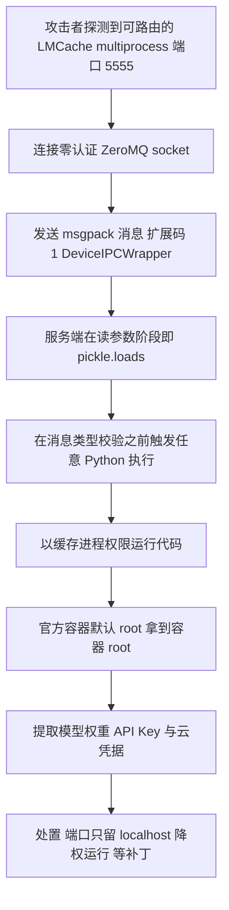
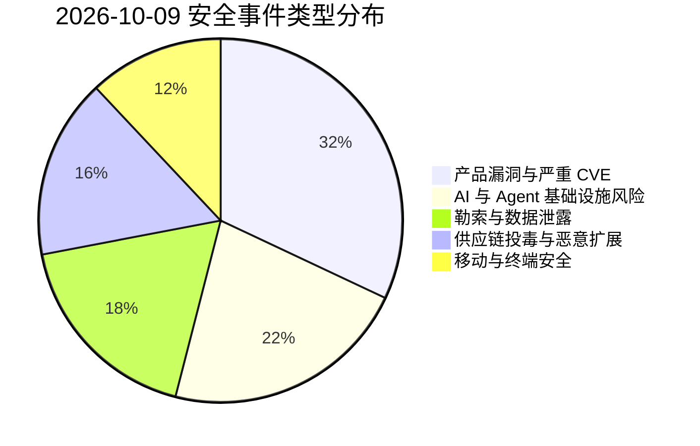
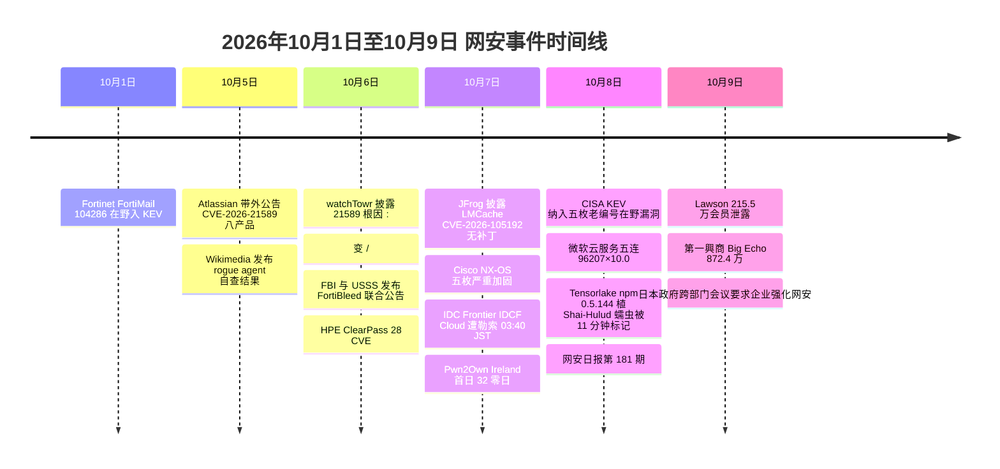

# 网安日报速递 · 2026年10月9日（第 181 期）

> **今日关键词：** LMCache105192×9.8·CISA KEV五连·微软云96207×10·日本IDCF勒索495家·Tensorlake蠕虫·Gitea103059×9.1·Firefox16扩展

---

## 一、今日头条

### LMCache CVE-2026-105192（CVSS 9.8）：LLM 推理缓存用零认证通道吃 pickle，未认证 RCE 且**目前无补丁**

2026-10-07，JFrog 安全研究团队（研究员 Yuval Moravchick）披露 **LMCache** 存在一枚**未认证远程代码执行**漏洞，编号 **CVE-2026-105192**，NVD 给出 CVSS 3.1 基础分 **9.8**（向量 `AV:N/AC:L/PR:N/UI:N/S:U/C:H/I:H/A:H`，CWE-502 反序列化不可信数据 + CWE-306 缺失认证）。**截至 10-08 未见任何修复版本，项目方也没有发布自己的安全公告**——LMCache 官方 GitHub 仓库的 security-advisories 列表为空。

LMCache 是当前大模型推理栈里常见的 **KV Cache 加速层**：它把 Transformer 处理 prompt 时产生的键值缓存存下来跨请求复用，省下大量 GPU 时间，因而被广泛用在基于 **vLLM** 的生产推理集群中。

**根因与利用链**

- 漏洞位于 LMCache 的 **multiprocess（多进程）模式**：该模式下缓存作为**独立服务**运行，各 LLM worker 通过 **ZeroMQ** 套接字连接它、注册并共享 KV cache 块
- 这个 ZeroMQ socket **没有任何认证**（无 CURVE、无 ZAP、无逐消息认证）
- 服务端在**读取消息参数的阶段**就用 Python 原生 **pickle** 对载荷反序列化，**在任何"消息类型校验"之前**就已经触发执行
- 因此一条精心构造的网络报文即可在 LMCache 进程权限下执行任意代码。消息本身用 msgpack 编码，扩展码 `1` 注册给了 `DeviceIPCWrapper`，解码器一遇到该扩展码就对 payload 调 `pickle.loads`
- **放大器**：官方提供的容器镜像里，该进程**默认以 root 运行**——容器化部署一旦被打穿，攻击者直接拿到容器内 root；而 GPU 推理主机上通常放着**模型权重、API Key 与云凭据**

**受影响范围**

| 项目 | 说明 |
| --- | --- |
| 受影响版本 | **v0.3.9（2025-10 发布）至 v0.5.5**（当前最新稳定版），**v0.5.6 的 rc 候选版**，以及 2026-10-07 时的 dev 分支 |
| 官方容器镜像 | 缓存进程**默认 root**；成功利用即为容器 root |
| K8s 示例 | LMCache 官方示例 DaemonSet 默认把服务监听在**所有网卡**；若被映射到公网或路由可达的 VPC 集群，即刻处于可被扫状态 |
| 不受影响 | 仅在**单个 vLLM 进程内**使用 LMCache（in-process connector）**不会开放该端口** |

**是否暴露只取决于一个设置**：JFrog 与 NVD 均指出，multiprocess 服务的**默认绑定是 localhost:5555**；只有当运维用 `--host` 传了**可路由地址**（JFrog 称这正是"文档化的多节点部署方式"）时，该缺陷才变为**网络可达**。因此 9.8 分对应对**可路由配置**；只在本机跑默认绑定的单机安装**不被远端触达**。

**无补丁下的处置（JFrog 建议）**

- **不要把 multiprocess 服务绑定到可路由地址**，把端口留在本机或可信集群网络内
- 防火墙限制谁能连到该端口**可降低但不能消除**风险——任何仍能连上的主机都能执行代码
- 官方容器**降权运行**，不要用 root
- 长期修复方向（给维护者）：**停止把网络数据喂给 pickle**、换成安全序列化格式、给 ZeroMQ 传输**加上认证**（如 CURVE 或逐消息 HMAC），并要求**未配置认证时拒绝绑定可路由地址**

**同一披露里的关联项**：vLLM 侧 **CVE-2026-105756（6.5）** 是另一枚相关缺陷——在 **0.30.0（9-22 发布）之前**，使用 LMCache multiprocess 连接器的部署收到**畸形 `cache_salt` 值**的单条请求即可让引擎核心抛未捕获异常，造成 **DoS**（单条请求打垮全体用户的推理服务）。vLLM 已在 0.30.0 修复；LMCache 的 pickle 问题**仍无补丁**。

**为何值得关注**

1. **"内部协调 socket + pickle + 默认信任网络"是 AI 推理栈的系统性病灶**：2025-11 研究者把这族缺陷命名为 **ShadowMQ**，此后 LightLLM 的 config server（同为 pickle）、AutoAgent 的未认证 TCP socket、Langflow 的 MCP handler 接连中招——**约七周内第 3 个开源 LLM/AI 工具链的未认证 RCE**
2. **代价最大的位置**：LMCache 卡在推理服务器与 KV cache 之间，对**支撑活跃推理任务的缓存状态有写权限**——拿下这一层，影响远超缓存服务本身
3. **默认配置是隐患不是安全保障**：大量团队为了先把推理跑起来，**直接照抄官方 K8s 示例**；这些默认值是为"方便"写的，而非为"多租户/公网邻接"的集群写的
4. **无补丁 + 无检测手段**：JFrog 的公告**没有给运维"是否已被攻击"的判别方法**，缓解完全落在操作者手上

---

## 二、重点事件

### 2. CISA KEV 10-08 一次性纳入五枚"已在野"高危：全是 2015–2023 年的老编号

2026-10-08，CISA 向 **已知被利用漏洞（KEV）目录**补入**五枚正在被真实攻击利用**的漏洞，联邦文职机构（FCEB）**修复大限 10-11（仅 3 天）**。值得注意的是：**五枚 CVE 编号全部落在 2015–2023 年**，即"老漏洞、新在野"。

| CVE | 产品 | CVSS | 问题与影响 |
| --- | --- | --- | --- |
| **CVE-2015-3306** | ProFTPD 1.3.5 | **10.0** | `mod_copy` 的 `site cpfr` / `site cpto` 允许**远程任意文件读/写** |
| **CVE-2021-3199** | ONLYOFFICE Document Server | **9.8** | 使用 JWT 时，`/upload` 参数经 `/..` 序列造成**路径穿越 → RCE** |
| **CVE-2016-3081** | Apache Struts | 8.1 | 开启 **Dynamic Method Invocation** 时，经 `method:` 前缀**命令注入 → 代码执行** |
| **CVE-2015-5477** | ISC BIND | 7.5 | **TKEY 查询**可远程打崩 DNS 服务器（DoS，服务退出） |
| **CVE-2023-22894** | Strapi | 7.2（NVD 主） | 敏感信息**明文存储**，拿到 admin 面板即可用**查询过滤器**推断出高敏感用户数据（含口令哈希、重置令牌） |

**要点**

- **Strapi 是重点**：CVE-2023-22894 单看是"中危信息泄露"，但**与 CVE-2023-22621 串联即可达成未认证 RCE**（SSTI 写入 + 触发用户注册再跑 shell）。CISA 的 SSVC 决策为 exploitation:**active**、automatable:**no**、technical impact:**total**，指向"定向使用而非全网自动扫描"
- **老产品普遍 EOL**：CISA 明确提示部分受影响版本**已停止支持（EOL/EoS）**，仍在跑的部署风险更高
- **修复版本**：ProFTPD **1.3.5a**；ONLYOFFICE **5.6.3**；Struts **2.3.20.3 / 2.3.24.3 / 2.3.28.1**；BIND **9.9.7-P2 / 9.10.2-P3**；Strapi **4.8.0**（注：Strapi 官方给的范围是 3.2.1–4.7.9，与 NVD 的"through 4.5.5"存在口径差异，**以厂商公告为准**）
- **同日另一枚 KEV**：日本 **Soliton Systems FileZen** 文件传输产品的 **CVE-2026-25108（OS 命令注入）** 也被纳入 KEV（编号未设 CVSS）

**为何值得关注**：这一次 KEV 更新是一堂"**CVSS 是标签、不是暴露度量**"的公开课。Strapi 那枚主评 4.9–7.2 的"中危"，实际是**未认证到 Super Admin、再到代码执行**的路径，任何**按 CVSS 排序**的扫描器都不会把它排到队首。老编号 + EOL 产品 + 短大限，等于提醒：补丁队列不能只看分数，还要看**能不能被串起来**。

### 3. 微软 10-08 云服务五连：Partner Center 证书校验被绕过，满分 10.0

2026-10-08，微软发布一批**云服务严重漏洞**，**五枚 CVSS 处于 9.6–10.0**。与上月"仅 1 枚 Exchange 补丁"的冷清窗口形成对比：

| CVE | 服务 | CVSS | 类型 |
| --- | --- | --- | --- |
| **CVE-2026-96207** | Microsoft **Partner Center** | **10.0** | **证书校验不当**——未授权攻击者可经网络**提权** |
| **CVE-2026-94510** | Microsoft **Bookings** | **9.9** | 用户可控 Key 的**授权绕过** |
| **CVE-2026-77900** | **Azure App Service for Linux** | **9.8** | **缺失认证 → 未认证代码执行** |
| **CVE-2026-88131** | Microsoft **Dataverse** | **9.8** | 不可信数据**反序列化 → RCE** |
| **CVE-2026-69435** | **Azure SRE Agent** | **9.6** | **缺失授权 → 提权** |

**要点**

- **满分那枚的性质**：CVE-2026-96207 破坏了 Partner Center 管理功能的**证书信任模型**——攻击者用**伪造或自签名证书**即可通过校验、在网络侧完成提权
- **两枚未认证 RCE**：Azure App Service 与 Dataverse 均允许**无需认证**的远程代码执行
- **归口提醒**：五枚**全部只影响微软托管服务**，微软负责后端修复；**客户侧的配置与监控仍是自身责任**。截至报道**无公开 PoC、无在野利用报告、未入 CISA KEV**
- **处置**：核对租户配置、收敛管理界面暴露面、监控异常的**证书与反序列化活动**

**为何值得关注**：这批漏洞说明"**云托管 = 厂商替你打补丁**"只在"厂商的服务端"这一层成立，**租户侧的集成、密钥、API 与配置错误**依旧是自己要守的阵地。满分证书校验绕过尤其要盯——它动摇的是"**信任锚**"，而非某个业务逻辑。

### 4. 日本网络安全"多线起火"：云商勒索波及 495 家，零售/餐饮千万级数据接连外泄

本周日本接连爆出多起大规模事件，且**相互叠加**：

- **云商被勒索**：**SoftBank 旗下 IDC Frontier** 的 **IDCF Cloud** 于 **10-07 凌晨 03:40（JST）** 遭勒索攻击，**"东日本 Region 1"** 集群被迫**整体断网停服**；公司把**所有区域**的客户管理控制台一并停用以做核查。官方称该区域**影响 495 家企业与地方政府**，茨城县（含县警）等官网一度无法访问
  - **攻击者宣称**：**7 分钟**完成入侵，**加密 225 个数据库 / 3.6 PB 数据**，触及 **239 台 hypervisor**，封存 **16,000 块虚拟机磁盘**，清掉 **554,153 个快照**（均系攻击者自述，**未经 IDC Frontier 独立核实**）
- **物流供应链被波及**：**Nissui（日水）** 旗下物流子公司 **Nissui Logistics** 使用同一 IDC Frontier 数据中心，系统故障导致**全国 17 个站点**出入库停摆，**约 1,200 家**零售商/餐饮/批发/食品生产商受影响，便利店与超市出现**冷冻食品断供**
- **零售数据外泄**：便利店 **Lawson（罗森）** 10-09 披露 **Lawson ID** 会员信息外泄 **2,155,345 条**（约占会员 **10%**，含姓名/地址/电话）及 26 条关联应用记录
- **卡拉 OK 数据外泄**：**第一興商（Big Echo）** 10-09 披露约 **872.4 万条**个人信息**可能**泄露，源头指向**外包商员工所用设备**遭攻击
- **监管与执法侧**：日本政府 **10-09** 跨部门会议宣布将**要求企业强化网络安全措施**；德国警方 10-08 亦称日本在计算机安全上"是世界上最脆弱的国家之一"，并披露 **Qilin 勒索组织**一名成员 2026-05 在大阪被捕后已引渡德国——该团伙四年间**索要约 4,500 亿日元赎金，实付逾 63 亿日元**，全球**约 4,000 家企业/机构**被瞄准

**为何值得关注**：这一串事件把"**单点故障如何级联**"演示得非常直接——一家**云服务商**被勒索，代价却由**495 家客户 + 物流链上的 1,200 家企业 + 货架上的冷冻食品**共同承担。Macnica 研究员统计：**今年已记录 119 起涉个人信息泄露/暴露事件，其中 83 起集中在 7-01 至 10-06**（对比 2025 全年 84 起、2024 全年 62 起），并推测**廉价而强大的 AI 工具的普及**正在改变攻击者"海量探站找弱点"的成本结构。这条线对"**云与外包的集中度风险**"是最新的现实注脚。

### 5. Tensorlake npm 0.5.144 被植入 Shai-Hulud 蠕虫：带着"合法 build provenance"发出来的毒包

2026-10-08 01:12:07 UTC，AI Agent 沙箱平台 **Tensorlake** 的官方 TypeScript SDK 在 npm 发布 **tensorlake@0.5.144**，**11 分钟后（01:23:10 UTC）即被 Socket 引擎标记**——该版本夹带了 **Shai-Hulud 家族的自传播窃密蠕虫**。该包周下载量约 **12,000**，GitHub 仓库 1,000+ star。

**技术细节**

- 攻击者在包的 manifest 里加了 **`preinstall` 钩子**，跑 `node lib/setup.mjs`；npm 在**安装前**就会自动执行它——**无需 import、无需运行 agent**
- 载荷由**两个混淆文件**组成：小加载器 `lib/setup.mjs`（SHA-256 `25a0735d…`）与约 **856 KB** 的大载荷 `lib/Math_Symbol.js`（`b50a0090…`），内部标记 **`WORMTAG`**。加载器会先检测 CI 环境（`CI`、`GITHUB_ACTIONS`、`GITLAB_CI`、`RUNNER_ENVIRONMENT`）再拉二级载荷
- 结构上与 8 月 ChainDrop（污染 keyv、flat-cache 的变种）**逐文件对应**，但标记不同，判断为**新一轮入侵而非旧僵尸复活**
- **窃取目标是一份"现代 AI 开发者机器清单"**：npm token（`.npmrc`/token API/OIDC 交换）、GitHub token（查仓库与 workflow 权限）、AWS 凭据（IMDS/ECS/Secrets Manager/SSM）、**HashiCorp Vault（127.0.0.1:8200）**、Kubernetes service-account token 与 kubeconfig、SSH 私钥、`.env`、加密钱包——以及**显式针对 AI 编码工具的配置与 MCP 文件**：`~/.claude`、`~/.cursor`、`~/.kiro`、**Windsurf、Zed**
- **传播**：用窃来的 npm/GitHub token 枚举受害者名下**其他包**，**签名并附上 Sigstore provenance 重新发布**，把蠕虫铺开
- **C2 抗打击**：**无硬编码 C2 域名**，而是通过 **以太坊智能合约 0xb614155F…091B9** 跨约 30 个公共 RPC 端点解析端点，GitHub 作 fallback；另带**"人质令牌"**机制——一个以 ONLOGON 计划任务持久化的 PowerShell 监控程序轮询 `api.github.com/user`，**若被盗 GitHub token 被吊销，可触发删除受害者家目录**
- **根因**：10-07 攻击者以**维护者身份**向 `tensorlakeai/tensorlake` 仓库提交恶意 commit（**直接文件上传**），再让**项目自己的 GitHub Actions 流水线**把毒包发布出去

**最该记住的一句**：**"有合法 provenance"不等于"可安全安装"**——provenance 只证明**构建来自何处**，不证明**源码是干净的**。攻击者先改主干，再借可信流水线出包，attestation 如实记录了一次**敌意构建**。任何把"provenance 有效"当作"可放心装"的策略，**在这种攻击面前是 fail-open**。

**处置**：把 `tensorlake@0.5.144` 拉黑/回退到 **0.5.143**（干净版）；清掉 lockfile 与包缓存里的 0.5.144 再重装；**只要装过就假定凭据已泄露**，轮换 npm/GitHub/SSH/云密钥；审计 GitHub 与 npm 上的**意外建仓、新 token、意外发布**；在可行环境用 `npm install --ignore-scripts`（载荷依赖 preinstall）。**注意**：先禁用"人质令牌"监控再吊销凭据，否则可能触发抹除。修复包为 **0.5.145**。

**为何值得关注**：这是 Shai-Hulud 首次明确**跳到 AI 基础设施**。Tensorlake 的产品是"**运行不可信、AI 生成代码的隔离沙箱**"——而这次投毒恰好**颠覆了这个承诺**：风险落在**开发者工作站/构建机**上，**在任何生成代码进入沙箱之前**，安装期代码就以**安装进程的权限**（连同部署凭据）执行了。

---

## 三、速览区

**6. Gitea 一口气修 27 个漏洞：内置 SSH 服务器认证绕过（9.1）+ 成群 SSRF**
Gitea 发布 **28.0.0（9-30）与 28.1.0**，合计修 **27 个漏洞**（28.0.0 列出 20 个 CVE）。最突出的是 **CVE-2026-103059（CVSS 9.1）**：内置 **SSH 服务器**做公钥查找时用了 **SQL LIKE** 比较，在部分数据库（含默认 SQLite）**忽略大小写**，攻击者构造**大小写变体的 RSA 公钥**并推得对应私钥即可**以受害者身份认证**（需满足特定密钥生成条件）；Gitea 已改为**按指纹**识别公钥。同批还有一簇**出站连接绕过/SSRF**：CVE-2026-70357（**主机名校验与真实 Git 连接之间的 DNS 重绑定窗口**）、101027（已批准域名跳过目标 IP 校验）、101029（**多 DNS 应答**绕过出站白名单）、89430（push mirror 连内网 Git 主机→可能强推）；修复方式是把 Git 网络操作**统一走内部代理**在连接时执行出站规则。另有 **Gitea Actions 审批绕过**（104632 被取消的待批准 fork workflow 重跑可触达自托管 runner；94205 仅校验事件触发者）。升级前须先看**破坏性变更**，deny-by-default 需设 `EGRESS_MODE = strict` 并显式白名单主机。

**7. CISA 发布 ICS 六通告：能源 OT 的 openPDC/openHistorian 五连严重（9.8），Docker 镜像永久不修**
CISA 10-08 发布六份 ICS 通告。其中 **ICSA-26-281-02** 针对 **Grid Protection Alliance** 的 **openPDC / openHistorian**（同步相量数据架构核心，被电网、ISO、RTO 用于接收/处理/归档 PMU 数据，常横跨 IT 与 OT）：**CVE-2026-100730** 不可信数据 **.NET 反序列化 → 未认证 RCE**（未启用 Windows Auth 时）、**104629** 反序列化、**105281** 关键功能**缺认证**、**85479** SSRF、**101022** 硬编码凭据，另 **CVE-2026-105278（Docker 专用）不安全反射**。修复：openPDC **≥2.9.482**、openHistorian **≥2.8.585**；**GPA 明确不推荐生产使用 Docker 镜像，该镜像也不会获得修复**——仍在用容器版部署的组织应视为**活跃暴露**。同批还有 Red Lion Controls N-Tron 700 系列、Satel Netco、Lantronix EDS3000PS/EDS5000（Update B）、Pulsetto 迷走神经刺激器（Update A）、Hitachi Energy RTU500（Update A）。

**8. Cisco 十月加固第二波：NX-OS 五枚严重 + APIC 一枚 9.8**
Cisco 为其 **NX-OS** 数据中心交换机 OS 发布公告，含 **CVE-2026-76471 / 76485 / 76486 / 76501 / 76465**：**向 IP 接口发送特制报文**即可**以 root 执行任意代码**，或令进程崩溃导致设备重载（DoS）；五枚**均需至少开启一项功能**（`NX-API` 默认关闭；`NGOAM`；`MPLS OAM` 默认关闭；76486 还需 SRv6 或 VXLAN 叠加且至少学到 1 个对端 VTEP；76501 仅在部分 Nexus 9000 支持段路由时成立）。**Nexus 7000 与 ACI 模式下的 Nexus 9000 不受影响**；带 Silicon One 的 Nexus 9000 不支持 MPLS OAM、不受 76465 影响。另有 **APIC CVE-2026-76500（9.8）**（CN 侧报道归类为 SQL 注入、部分英文源归为资源生命周期控制不佳，**以 Cisco 公告为准**）。**无 workaround，但可临时用 Live Protect 盾**；用不上相关功能时**直接关掉 NGOAM / NX-API / MPLS OAM 就等于移除攻击面**。

**9. 16 个恶意 Firefox 扩展冒充 Rabby / OKX 钱包，专偷助记词与私钥**
Socket 研究员 Joseph Edwards 发现 **16 个恶意 Mozilla Firefox 扩展**，冒充 **Rabby Wallet（4 个克隆）** 与 **OKX Wallet（其余 12 个）**：它们伪装成钱包门户、桌面工具与浏览器工具，**在钱包导入流程中拦截 12/24 词助记词与 64 位十六进制私钥**，并把机密**直接塞进 URL 查询参数**发往攻击者控制的 **Cloudflare Workers**（`*.icy-star-f45c.workers[.]dev`，全部 16 个中仅 1 个例外）。手法定型：**轮换包名、版本号、扩展 ID 与描述，复用同一套钱包界面、凭据处理逻辑与回传域名**——是 2026-08 那波活动的延续。**截至 10-05 全部扩展已被下架**，但下架**不能**挽回已输入的用户：**输入过真实助记词/私钥的用户应假定完全沦陷**，需在**干净设备**上建新钱包、迁移资产并撤销旧地址授权。所有 16 个扩展的 manifest 都声明"不收集数据"，与其凭据窃取代码直接矛盾。

**10. wolfSSH 1.6.0 修 5 个漏洞，含严重 SSH 认证绕过**
wolfSSL 发布 **wolfSSH 1.6.0**，修复**五个安全漏洞**，其中包含一枚**严重的 SSH 认证绕过**。wolfSSH 被广泛嵌入在**嵌入式/工控/IoT** 设备的 SSH 服务端中，这类组件往往更新滞后、暴露面长期存在；跑在嵌入式栈上的 SSH 实现一旦出现认证绕过，等于**直接开门**。建议排查所有内嵌 wolfSSH 的设备并升级到 1.6.0。

**11. "午夜含羞草"（Midnight Mimosa）：廉价 Android 手机出厂即带广告欺诈/住宅代理木马**
Bitdefender 披露 **Midnight Mimosa** 行动（10-08）：恶意代码**预装在低端 Android 手机固件**里，**在用户第一次开机之前就在机上、且无法卸载**。核心是一个**平台签名、持久化的系统应用**（首个样本 `com.android.system.lite`，同一内核还以 `com.android.sys.prot`、`com.android.sys.gmsprot`、`com.android.sys.bcprot` 等**轮换的系统化包名**出现，构建/签名证书各异）。它以**系统级权限**静默装/卸应用、授权限、**远程加载任意代码**，再由**至少 32 个伪装应用**（假 AppLock、天气、文件管理器、OCR、音频编辑器等）用**真实广告 SDK** 在**不可见窗口**里刷展示/点击赚取收益，还可把设备变成**住宅代理中继节点**。为规避 Play Protect，它在装载荷前**临时禁用 Google Play Store**、装完再恢复。约**两年**间波及**150+ 国家**、数千台设备，检出以**墨西哥、法国、意大利**居多，美国第四；受影响机型含 **Doogee S200 X、Cubot KingKong X**，以及冒充 Galaxy S24/S26 Ultra、iPhone 17 Pro Max 的**山寨克隆机**（正品三星不受影响）。另发现 **13 个 Google Play 应用**与同一基础设施通信。设备级预警信号：包名 `com.android.system.lite` 等 + **MAC 前缀 `A0:53:94`**。普通卸载无效，**实际出路是换机或退货**。

---

## 四、风险分析

### LMCache CVE-2026-105192 攻击链（零认证 ZeroMQ → pickle → 容器 root）



### 漏洞严重性 × 利用状态象限

```mermaid
quadrantChart
    title 2026-10-09 漏洞严重性 × 利用状态
    x-axis "未利用" --> "在野/公开可用"
    y-axis "低危" --> "严重"
    quadrant-1 "紧急修复"
    quadrant-2 "密切关注"
    quadrant-3 "持续监控"
    quadrant-4 "常规更新"
    "LMCache105192×9.8": [0.35, 1.00]
    "微软96207×10.0": [0.20, 0.99]
    "微软77900×9.8": [0.22, 0.97]
    "微软88131×9.8": [0.22, 0.96]
    "CISA-STrapi22894链": [0.86, 0.80]
    "CISA-ProFTPD3306×10": [0.60, 0.95]
    "GPA-openPDC100730": [0.30, 0.94]
    "Tensorlake蠕虫": [0.88, 0.88]
    "日本IDCF勒索495家": [0.92, 0.90]
    "Gitea103059×9.1": [0.25, 0.86]
```

### 安全事件类型分布



### 本周时间线



---

## 五、出处

| 来源 | 说明 | 链接 |
| --- | --- | --- |
| ThreatFrontier | LMCache CVE-2026-105192 无补丁 pickle RCE 技术拆解与绑定设置判定 | https://threatfrontier.com/articles/lmcache-pickle-rce-cve-2026-105192-no-fix |
| NCIJ Network | LMCache 未认证 RCE 未修复（含 vLLM 关联 CVE-2026-105756） | https://ncijnetwork.com/unpatched-critical-lmcache-flaw-lets-unauthenticated-attackers-run-code-remotely |
| CodeYourCraft | LMCache 漏洞与 JFrog 处置建议（接口绑定 / 防火墙） | https://codeyourcraft.com/blog/lmcache-vulnerability-cve-2026-105192-unpatched-rce-vllm-jfrog |
| BeyondMachines | LMCache 与 vLLM 两枚缺陷对比与缓解 | https://beyondmachines.net/event_details/unpatched-critical-rce-vulnerability-in-lmcache-exposes-llm-infrastructure-to-remote-takeover-u-2-9-i-r/gD2P6Ple2L |
| 0dayNews | LMCache 缺陷定位与 AI 基础设施 RCE 复发脉络 | https://0daynews.com/articles/2026-10-08-lmcache-cve-2026-105192-unpatched-rce |
| World Cyber News | CISA KEV 10-08 纳入 Apache Struts / BIND / ProFTPD / Strapi / ONLYOFFICE Docs | https://www.worldcybernews.com/articles/1473 |
| Zero Hunt | Strapi CVE-2023-22894 与 CVE-2023-22621 串链未认证 RCE 详解 | https://zerohunt.ai/blog/strapi-cve-2023-22894-kev-unauthenticated-rce |
| FactualRisk | 10-08 KEV 五枚 CVSS/EPSS/在野状态一览 | https://factualrisk.com/intelligence-cyber/briefing.html |
| Ervik.as | 各 CVE 的 KEV 收录描述与产品影响（老编号在野） | http://www.ervik.as/zero-days |
| GBHackers | CISA 告警 FileZen CVE-2026-25108（OS 命令注入）入 KEV | https://gbhackers.com/cisa-alert-filezen-vulnerability/ |
| ThreatAft | 微软 10-08 云服务五连（Partner Center / Bookings / Azure / Dataverse / SRE Agent） | https://threataft.com/articles/microsoft-october-2026-bundle-partner-center-bookings-azure |
| TheHackerWire | CVE-2026-94510 Microsoft Bookings 授权绕过解析 | https://www.thehackerwire.com/cve-2026-94510-microsoft-bookings-auth-bypass-enables-network-privilege-elevation |
| 朝日新闻（Asahi） | IDC Frontier 勒索致 495 客户停服、Nissui Logistics 受影响 | https://www.asahi.com/ajw/articles/16950581 |
| OSINTSights | IDCF Cloud 勒索时间线、攻击者所声称的 3.6 PB/239 hypervisor 等 | https://osintsights.com/ransomware-attack-targets-japans-idcf-cloud-disrupts-government-clients |
| NetSecOps（STIX） | IDCF Cloud 事件的 ATT&CK 映射与影响评估 | https://cyber.netsecops.io/stix-viz/japanese-cloud-provider-idcf-cloud-hit-by-crippling-ransomware-attack |
| News On Japan | 日本连环事件汇总（IDC Frontier / Lawson 215.5 万 / 第一興商 872.4 万 / Qilin 成员引渡） | https://newsonjapan.com/article/150997.php |
| BleepingComputer（OpenText Hub） | IDCF Cloud 勒索官方声明与时间（03:40 JST） | https://community.opentextcybersecurity.com/threat-intel-hub-225 |
| The Register | Shai-Hulud 跳到 AI 基础设施：Tensorlake 0.5.144 投毒 | https://www.theregister.com/security/2026/10/08/shai-hulud-worm-makes-jump-to-ai-infrastructure-with-tensorlake-compromise/5302054 |
| NetSecOps | Tensorlake 蠕虫完整攻击链与 ATT&CK 映射 | https://cyber.netsecops.io/articles/tensorlake-npm-package-compromised-by-shai-hulud-supply-chain-worm |
| AL-ICE | 合法 provenance 的毒包：Tensorlake 0.5.144 结构与 C2 解析机制 | https://al-ice.ai/posts/2026/10/tensorlake-npm-0-5-144-shai-hulud-worm-valid-provenance |
| ThreatCluster | Tensorlake 蠕虫技术分析（preinstall / WORMTAG / 以太坊合约 C2 / IoC） | https://threatcluster.io/article/tensorlake-npm-package-compromised-with-shai-hulud-worm-2e05ac66 |
| Cybernoz | Gitea 28.0.0 / 28.1.0 修 27 漏洞（SSH 认证绕过 + SSRF 簇） | https://cybernoz.com/gitea-patches-27-security-flaws-including-critical-ssh-authentication-bypass-and-ssrf/ |
| Shield53 | CISA ICSA-26-281-02：GPA openPDC/openHistorian 五连严重 RCE | https://news.shield53.com/critical-rce-flaws-in-grid-protection-alliance-software-threaten-energy-sector-ot-environments |
| 网易（Fnet 云网安 261009） | Cisco NX-OS 五枚严重缺陷（含 76465）与功能前置条件 | https://www.163.com/dy/article/L8PS8FHQ05384JSS.html |
| TheHackerWire | Cisco APIC CVE-2026-76500（9.8）分析 | https://www.thehackerwire.com/cve-2026-76500-cisco-apic-critical-resource-control-flaw-cve-2026-76500-analysis |
| Aviatrix | 16 个恶意 Firefox 扩展冒充 Rabby/OKX 钱包的杀伤链与合规映射 | https://aviatrix.ai/threat-research-center/16-malicious-firefox-extensions-rabby-okx-wallet-stealers-2026 |
| ScyScan | 16 个恶意 Firefox 扩展清单与 Cloudflare Workers 回传域名 | https://www.scyscan.com/news/16-malicious-firefox-extensions-pose-as-rabby-and-okx-wallets-to-steal-recovery-phrases |
| Shield53 | 假加密钱包扩展与浏览器供应链威胁分析 | https://news.shield53.com/fake-crypto-wallet-extensions-signal-a-new-era-of-browser-borne-supply-chain-threats |
| GBHackers | wolfSSH 1.6.0 修 5 个漏洞含严重 SSH 认证绕过（含本周要闻列表） | https://gbhackers.com/cisa-publishes-ics-advisories/ |
| Bitdefender | Midnight Mimosa 预装木马完整报告（源自官方实验室） | https://www.bitdefender.com/en-us/blog/labs/midnight-mimosa-malware |
| Enigma Global | Midnight Mimosa 覆盖范围、受影响机型与代理中继机制 | https://www.enigma-global.com/preview/news/44115 |
| The Record（fmisec 转载） | 廉价 Android 手机预装广告欺诈木马（约 180 美元机型） | https://news.fmisec.com/thousands-of-cheap-android-phones-shipped-with-ad-fraud-malware |
| Cuberk | 10-08 信息战趋势 feed（NVD / PoC-in-GitHub 聚合） | https://cuberk.com/infosec-trending |

> 免责声明：本报告基于公开信息整理，CVE 编号、CVSS 评分等数据以官方源（NVD / 厂商公告 / CISA KEV）为准。个别条目存在多源口径差异（如 Strapi CVE-2023-22894 的受影响版本区间、Cisco APIC CVE-2026-76500 的缺陷归类、LMCache 是否已被利用），已在正文中标注，建议读者查阅原始来源获取最新动态。
