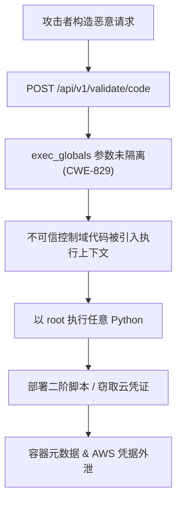
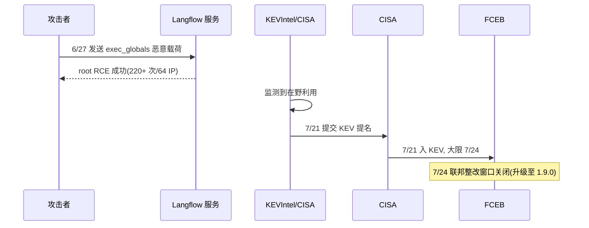
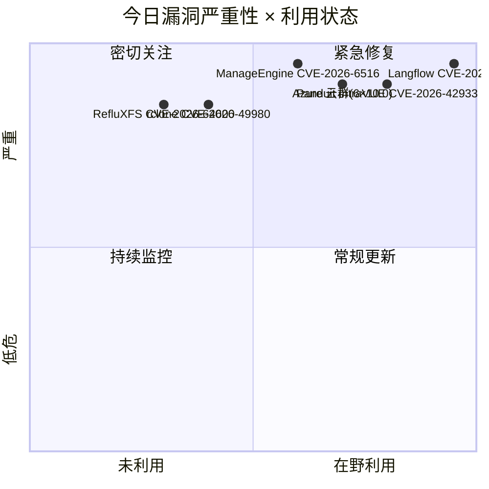
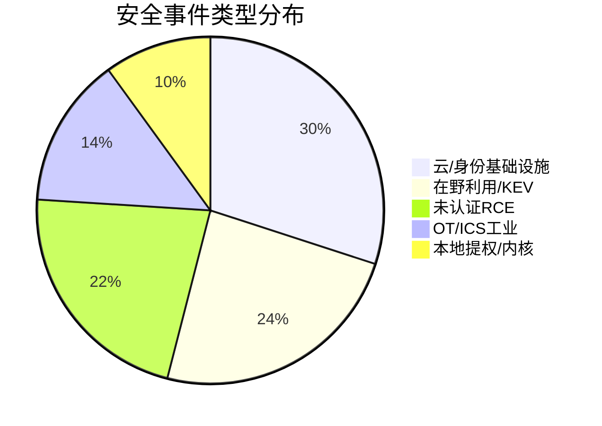
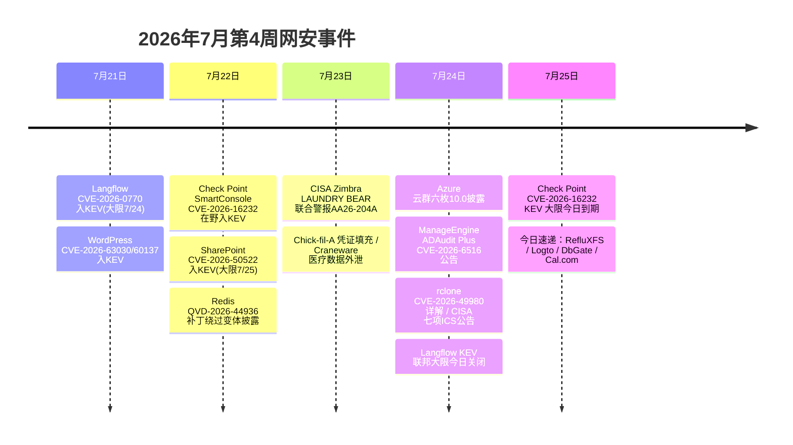

# 网安日报速递 — 2026年7月25日（星期六 · 第 112 期）

> 今日关键词：Langflow 10.0 RCE入KEV大限 · Azure云群7/24六枚10.0 · ManageEngine 10.0未认证RCE · rclone 9.8命令执行 · RefluXFS提权

---

## 今日头条

**Langflow 未认证 RCE 入 KEV 大限已至；Azure 同日爆发六枚云基础设施 10.0 漏洞；ManageEngine、rclone、Linux XFS 接连曝出高危利用面**

> 摘要：CVE-2026-0770 联邦整改窗口于 7/24 关闭，KEVIntel 已记录 220+ 次在野利用；微软云服务体系单日披露 App Service / AKS / Key Vault / DNS / Exchange Online 等 CVSS 10.0 权限提升；ManageEngine ADAudit Plus 与 rclone 暴露未认证代码执行路径；Qualys 披露潜伏 9 年的 Linux XFS 竞态提权 RefluXFS。

---

## 深度分析

### 1. Langflow CVE-2026-0770：AI 智能体框架未认证 RCE 入 KEV，联邦大限 7/24 关闭

- **事件内容**：CISA 于 7/21 将 Langflow（开源 AI 智能体可视化构建框架）的 **CVE-2026-0770**（CWE-829，不可信控制域功能引入）加入 KEV，要求 FCEB 机构在 **7/24（周五）** 前完成修复，修复版本 Langflow **1.9.0**。漏洞位于 `/api/v1/validate/code` 端点对 `exec_globals` 参数的处理，未认证攻击者可以低复杂度获取 **root** 远程代码执行。
- **值得关注的原因**：
  1. **在野利用已先行于 KEV**：KEVIntel 早在 **2026-06-27** 就观察到在野利用，KEV 收录前已记录 **220+ 次利用尝试、64 个独立源 IP**，载荷含下载二阶脚本、窃取 AWS 凭证/环境变量/容器元数据。
  2. **"打补丁≠止血"**：攻击已发生凭证窃取，仅升级无法撤销已被盗凭据，须排查历史请求、轮换暴露密钥。
  3. **Langflow 成 APT/勒索重复目标**：此为近年第四个被标记在野的 Langflow 漏洞（CVE-2025-3248 → JADEPUFFER 勒索、CVE-2026-33017、CVE-2026-55255 IDOR），AI 中间件已成 LLM/云凭证宝库。

### 2. Azure 云服务体系 7/24 单日爆发六枚 CVSS 10.0 漏洞

- **事件内容**：7/24 多家威胁情报源披露微软云服务体系一批 **CVSS 10.0** 漏洞，集中在权限提升/认证绕过类，未经认证即可越权：
  - **CVE-2026-58630** Azure App Service 访问控制不当（权限提升）
  - **CVE-2026-56163** Azure Kubernetes Service (AKS) 权限提升
  - **CVE-2026-62825** Azure Key Vault 认证绕过（权限提升）
  - **CVE-2026-58275** Azure DNS 授权缺失（权限提升）
  - **CVE-2026-57106** Microsoft Data Quality SSRF
  - **CVE-2026-56191** Microsoft Exchange Online 认证绕过/篡改
- **值得关注的原因**：
  1. **云控制面单日满分簇**：同一天多款核心 Azure 服务出现 10.0，攻击者可链式从 App Service 提权跳到 Key Vault/DNS，扩大云内横向。
  2. **SaaS 化降低了利用门槛**：多数无需认证、网络可达即可触发，与本月"披露即武器化"节奏叠加。
  3. **官方细节滞后**：部分 CVE 暂未给出精确组件与补丁，云客户须以租户审计日志+最小权限为先手缓解。

### 3. ManageEngine ADAudit Plus CVE-2026-6516（10.0）：未认证 RCE，域控审计服务器成跳板

- **事件内容**：Zoho ManageEngine **ADAudit Plus**（广泛部署的 AD 审计方案）Agent API 存在认证绕过 + 路径遍历组合漏洞 **CVE-2026-6516**（CVSS 10.0），未认证攻击者链式触发可达 **远程代码执行**。影响 **build 8606 之前**所有版本，修复版本 8606 已于 4/17 发布；西澳 SOC 于 **20260724001** 公告将其评为 Critical，提示域级访问风险。
- **值得关注的原因**：
  1. **身处 AD 核心**：ADAudit Plus 在域控/文件服务器/工作站驻有 agent，一旦 RCE 即贴近域控，等于拿到整域钥匙。
  2. **勒索/APT 高价值目标**：未认证 + RCE 的组合历史上披露后数日内即被武器化。
  3. **补丁早已就绪却仍暴露**：修复 4 月已出，仍有大量实例未升，凸显"补丁≠落地"的资产管理缺口。

### 4. rclone CVE-2026-49980（9.8）：rcd --rc-serve 未认证命令执行，绕过旧补丁

- **事件内容**：命令行云同步工具 **rclone** 在 **1.46.0–1.74.3** 版本中，`rclone rcd --rc-serve` 接受形如 `/[remote:path]/object` 的未认证 GET/HEAD 请求，URL 中的 remote 被解析为内联后端配置，可在初始化阶段执行本地命令——**单条未认证请求即以 rclone 进程用户执行命令**（CWE-306/CWE-78）。该漏洞实为对 CVE-2026-41179 修复的 **绕过**，已于 **1.74.3（2026-06-05）** 修复。攻击前置条件：rc 监听可达 + 未启用 `--rc-user/--rc-pass` 认证。
- **值得关注的原因**：
  1. **"补丁绕过"再次上演**：新 gadget 绕开既有修复，提醒防御方复核历史 CVE 的修复完整性。
  2. **CI/CD 与云同步链路的隐秘入口**：rclone 常跑在备份/同步/数据管道中，进程权限高，且浏览器 subresource 也能触发 localhost 监听。
  3. **缓解明确但部署松散**：启用 rc 认证或弃用 `--rc-serve` 即可挡，但默认无认证监听仍普遍。

### 5. RefluXFS CVE-2026-64600：潜伏 9 年的 Linux XFS 竞态本地提权；CISA 同日发布七项 ICS 公告

- **事件内容**：Qualys 披露 **RefluXFS（CVE-2026-64600）**——Linux 内核 XFS 文件系统一处 **2017 年起潜伏 9 年**的竞态条件，本地攻击者覆写受保护文件获取 **root**。同期 **CISA 于 7/24 发布七项 ICS 公告**（多项 OT 组件 CVSS 10.0），配合早前"PLC 在野利用"预警，构成近期最大单日 ICS 公告批次；另涉 **Panduit IntraVUE CVE-2026-42933（10.0）** OT 网段隔离绕过代理、**Logto 身份平台认证绕过（9.8）**。
- **值得关注的原因**：
  1. **长尾内核漏洞持续兑现**：XFS 在企 Linux 部署中无处不在，9 年未察觉凸显"老代码新发现"的审计价值。
  2. **OT 暴露面单日放大**：七项 ICS 10.0 + IntraVUE 代理绕过，将安全监控工具反转为 IT/OT 桥接攻击向量。
  3. **本地提权簇集中爆发**：叠加本月的 Bad Epoll（CVE-2026-46242，99% 成功率）、Copy Fail（CVE-2026-31431，已入 KEV），Linux 本地提权成 7 月高频主题。

---

## 速览区

6. **CISA 7/24 七项 ICS 公告**：多项 OT 组件 CVSS 10.0，配合 PLC 在野利用预警，为近期最大单日 ICS 公告批次，须复核 OT 网段隔离与远程访问 MFA。
7. **Panduit IntraVUE CVE-2026-42933（10.0）**：工业网络可视化软件变身活跃代理，完全绕过 OT 网段隔离，Exploit 已确认可用，工控环境需隔离或立即打补丁。
8. **Logto 身份平台认证/授权失败（9.8）**：核心认证协议处理多漏洞，可致完全认证绕过或权限提升，使用 Logto 做身份管理的系统面临整域失守风险。
9. **Linux 内核本地提权簇**：Bad Epoll（CVE-2026-46242，UAF，99% 成功率）+ Copy Fail（CVE-2026-31431，已入 KEV，AKS 非根 Pod 可提根）；容器逃逸与节点提权风险高。
10. **DbGate CVE-2026-47668（10.0）**：未认证攻击者通过向 `func` 注入恶意 JavaScript 在 DbGate 服务器实现 RCE，数据库网关成新突破点。
11. **Cal.com CVE-2025-71389（10.0）**：攻击者在 5.9.9 之前版本通过特制 React 组件未认证远程代码执行，SaaS 预约平台暴露面扩大。

---

## 风险分析

---

## 本周事件时间线

---

## 相关出处

1. CISA KEV — Langflow CVE-2026-0770：https://www.cisa.gov/known-exploited-vulnerabilities-catalog
2. ServnetUK / BleepingComputer — Langflow RCE CVE-2026-0770 利用与 KEV 解读：https://www.servnetuk.com/news/langflow-rce-cve-2026-0770-patch-2026
3. ManageEngine 官方 — CVE-2026-6516 修复说明（build 8606）：https://www.manageengine.com/in/products/active-directory-audit/cve-2026-6516.html
4. 西澳 SOC — 20260724001 ManageEngine ADAudit Plus RCE 公告：https://soc.cyber.wa.gov.au/advisories/20260724001-ManageEngine-ADAudit-RCE-Vulnerability
5. rclone 论坛 — Release 1.74.3（CVE-2026-49980 安全修复）：https://forum.rclone.org/t/rclone-release-1-74-3/53880
6. GitHub Advisory — GHSA-qw24-gh76-8rvv（rclone 未认证命令执行）：https://github.com/advisories/GHSA-QW24-GH76-8RVV
7. NVD — CVE-2026-49980 详情：https://nvd.nist.gov/vuln/detail/CVE-2026-49980
8. TheHackerWire — Azure App Service CVE-2026-58630 权限提升：https://www.thehackerwire.com/critical-azure-app-service-privilege-escalation
9. FixTheCVE — Trending CVEs（Azure 云群 / DbGate / Cal.com）：https://fixthecve.com/trending
10. DataSecurityWiki — Microsoft July 2026 Patch Tuesday 要点：https://datasecuritywiki.com/microsoft-patch-tuesday-for-july-2026-snort-rules-and-prominent-vulnerabilities
11. Enigma Global — 2026-07-24 每日威胁情报（ICS/IntraVUE/Logto/RefluXFS）：https://www.enigma-global.com/blog/daily-digest-2026-07-24
12. Qualys / NCSC-FI — RefluXFS CVE-2026-64600（XFS 竞态提权）：https://www.enigma-global.com/blog/daily-digest-2026-07-24
13. The Hacker News — Bad Epoll Linux 内核 UAF 提权：https://thehackernews.com/2026/07/new-bad-epoll-linux-kernel-flaw-lets.html
14. Microsoft Learn — AKS 安全公告（Copy Fail CVE-2026-31431）：https://learn.microsoft.com/azure/aks/security-bulletins/overview
15. CISA — ICS 公告总览（7/24 七项）：https://www.cisa.gov/news-events/cybersecurity-advisories
