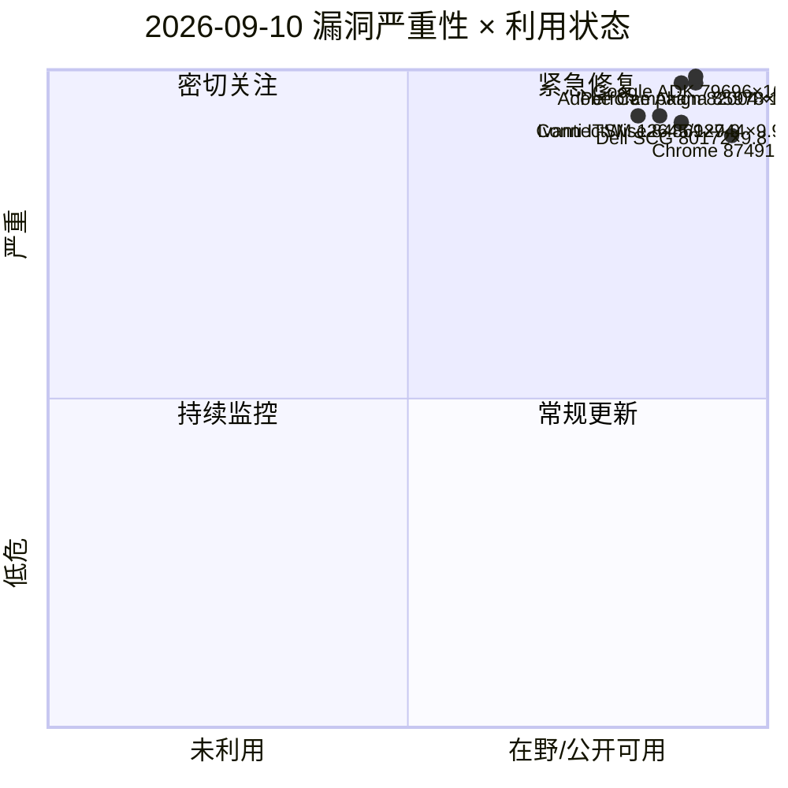
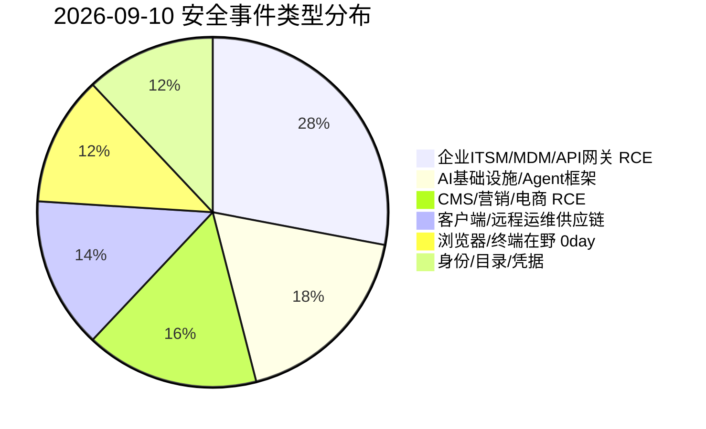
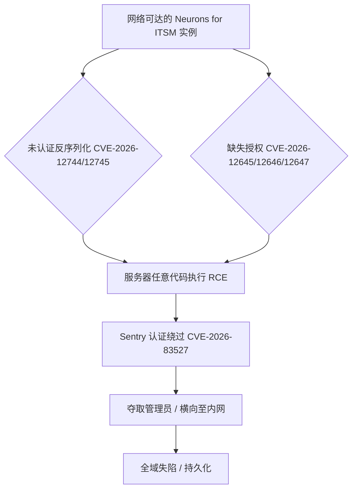
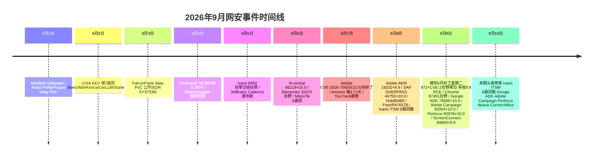

# 网安日报速递 - 2026年9月10日（第 156 期）

> 每日精选 · 值得关注 | 侧重新 CVE、公开 PoC、漏洞通报、安全事件

---

## 今日头条（仅 #1 漏洞事件）

### Ivanti Neurons for ITSM 九月补丁释出 8 漏洞簇：三枚 9.9 缺失授权 RCE + 两枚未认证 RCE + Sentry 8.1 认证绕过

Ivanti 于 9/8 发布 2026 年 9 月安全更新，覆盖 Neurons for ITSM、Sentry、EPMM 三款企业产品，合计披露 10 个 CVE。其中 Neurons for ITSM 一次性修复 8 个漏洞、6 个为可 RCE 的严重级：

- **三枚缺失授权（CWE-862）RCE：CVE-2026-12645 / 12646 / 12647，均 CVSS 9.9**（需已认证，但权限门槛极低）。
- **两枚未认证反序列化（CWE-502）RCE：CVE-2026-12744 / 12745，CVSS 9.8**——攻击者无需任何凭据即可在服务器执行任意代码。
- 另有反序列化 CVE-2026-12650（9.9）、CVE-2026-12651 / 12648（高危）等。
- **Sentry CVE-2026-83527（CVSS 8.1，CWE-288）认证绕过**：未认证远程攻击者可直接拿到管理员权限（修复于 R10.8.2 / R10.7.3 / R10.6.4）。
- EPMM CVE-2026-18851（8.8，需认证提权）。

值得注意：Ivanti 在公告中**首次明确提及这些 ITSM 漏洞由内部 LLM 辅助发现**——AI 辅助漏洞挖掘已从理论走进厂商正式披露流程。受影响范围为本地部署版 Neurons for ITSM 2025.2–2026.1（SaaS/云版已于 8/9 自动修复，2026.2 于 9/21 发布）；Enigma 等情报源将其中的缺失授权 RCE 标记为「exploit 公开可用」，而 Ivanti 官方称暂无在野利用证据。ITSM/MDM 是企业内网核心基础设施，本地暴露实例应立刻升级并排查异常管理会话。

---

## 重点关注（5 条）

### 1. Google Cloud ADK for Python CVE-2026-79696（CVSS 10.0）—— 不完整 denylist 致未认证 RCE（AI 基础设施）

Google Cloud Agent Development Kit（ADK）for Python 2.0.0–2.6.0 的 `adk web` 组件存在**代码注入（CWE-184 不完整禁用输入清单）**：其 agent 配置的代码引用解析器依赖一份手工维护的「危险标准库」黑名单（如拦了 `profile` 却漏了 `cProfile`），导致 `cProfile.run` / `timeit.timeit` / `trace.Trace` 等可被视为工具或回调，**在 pytest 安装的 OSS / Cloud Run / GKE 环境中，未认证攻击者通过构造的 test session replay 即可执行任意代码**（CVSS 4.0：AV:N/AC:L/AT:N/PR:N/UI:N/VC:H/VI:H/VA:H，满分 10.0）。修复于 **ADK 2.7.0**——改用完整标准库全拦截。

**值得关注的原因**：这是典型的「denylist vs allowlist」反模式在 AI Agent 框架上的真实翻车。AI 开发工具链（Agent SDK、MCP、tool-calling）正成为新攻击面，而 ADK 是云上 Agent 工作负载的主流底座；临时缓解：不把 `adk web` 暴露到不可信网络、生产环境去掉 pytest。

### 2. Adobe Campaign Classic CVE-2026-82004（CVSS 10.0）—— 未认证 OS 命令注入 RCE

Adobe 于 9/8 在 **APSB26-142** 修复 ACC 的 OS 命令注入（CWE-78），CVSS 3.1 **10.0**（AV:N/AC:L/PR:N/UI:N/S:C/C:H/I:H/A:H），影响 **ACC v7 ≤ 7.4.4 build 9401**，修复版本 **7.4.4 build 9402**（Adobe 标为 Priority 1，3 天内修复）。无需认证/无需用户交互，攻击者可借未净化的输入在服务器以当前用户身份执行任意系统命令。

**值得关注的原因**：Campaign Classic 是大量企业营销自动化底座、常驻敏感客户数据，完全本地部署实例若暴露公网即面临勒索/数据窃取/横向移动的直接风险；应即刻升级并收敛管理接口暴露面。

### 3. Perforce Akana API Platform CVE-2026-85978（CVSS 10.0）—— 路径归一化绕过认证 → 未认证 RCE

Akana API Platform 的 Policy Manager 控制台存在**认证过滤器与 servlet 分发器之间的路径归一化/等价性差异（CWE-41/CWE-863）**：攻击者发送经特殊构造、被两者以不同方式解释的路径，即可绕过认证，触达一个**无沙箱执行攻击者脚本代码**的端点（CWE-94 代码注入），达成未认证、无交互的 RCE。CVSS 4.0 **10.0**。受影响的默认配置包括除 2024.1.6 / 2025.1.2 / 2026.2 之外的所有版本。

**值得关注的原因**：API 网关/策略管理控制台是微服务架构的「中枢」，且常面向内网甚至公网管理面；路径归一化绕过是认证绕过的经典高危模式（类似旧年多个 API 管理平台 0day），临时缓解为限制控制台至可信内网。

### 4. ConnectWise ScreenConnect CVE-2026-84869（CVSS 9.9）—— 客户端未授权文件传输/执行（MSP 供应链风险）

ConnectWise 于 9/8 发布 **26.6.5** 安全补丁，修复 ScreenConnect 客户端的一个**缺失授权（CWE-862）/ 不当权限管理（CWE-269）**缺陷：在活跃远程会话中，文件可被**无需授权、无需 Host 确认**地传输并执行（CVSS 3.1 9.9，AV:N/AC:L/PR:L/UI:N/S:C）。**服务端不受影响**，仅客户端受影响。

**值得关注的原因**：ScreenConnect 是 MSP 管理数千终端的标配，单一被劫持的远程会话即可级联成供应链攻击；勒索团伙与初始访问经纪长期将其列为重点目标。临时缓解：在角色中取消 TransferFiles 权限、要求 Host 对所有文件传输/执行确认。云端已自动升级，本地需升 26.6.5 并重新部署客户端。

### 5. Dell Secure Connect Gateway CVE-2026-80172（CVSS 9.8）—— 令牌重放直取管理员（CWE-345）

Dell 在 **DSA-2026-382** 中披露 SCG 5.0 Appliance/Application 的**数据真实性验证不足（CWE-345）**：远程未认证攻击者在捕获到单条合法请求后，可反复重放以生成有效的 ADMIN 访问与刷新令牌，CVSS 3.1 **9.8**。影响 SCG 5.0 系列。

**值得关注的原因**：SCG 是戴尔设备管理与网关的统一入口，管理员令牌被重放等于「前门钥匙被复制」；应升级固件、启用请求一次性校验、并审计异常管理员登录。

---

## 速览区（6 条）

**6. Parse Server CVE-2026-87806（CVSS 9.1）9/9 披露**：LDAP 认证适配器缺陷，未认证攻击者只要知道一个有效用户名即可拿到认证会话令牌，造成账户接管（影响 < 8.6.88、9.0.x）。

**7. Google Chrome CVE-2026-87491（CVSS 8.8）在野利用**：V8 引擎越界写（OOB write），通过构造 HTML 页在沙箱内执行任意代码；Google 已于 Chrome 153.0.8010.36/.37 修复，并确认已有在野利用——这是 2026 年**第 7 个**被在野利用的 Chrome 零日。

**8. Microsoft Defender ShieldCrash 零日 PoC 公开**：研究员 Chaotic Eclipse 放出 CVE-2026-69414（ShieldBreak，CVSS 7.8）补丁绕过 PoC，名为 ShieldCrash，在特定条件下仍可触发原问题，实现**以 SYSTEM 身份任意文件读**；所有受支持 Windows 桌面版本均受影响。

**9. F5 BIG-IP APM webtop 无文件 rootkit**：it-learn.io 报道，攻击者将无文件 rootkit 隐藏于 BIG-IP APM webtop（webtop_popup_css.php3 等）内存中，规避磁盘检测，服务于持久化与凭据窃取。

**10. SiYuan Note CVE-2026-87807 + PasswordPusher CVE-2026-87816**：SiYuan Note < 3.8.2 全文检索 API 存在认证后 SQL 注入（可 UNION SELECT 读库）；PasswordPusher < 2.11.1 存在 TOCTOU 竞态（CVE-2026-87816，CVSS 8.7），并发请求可绕过「仅查看一次」限制多次窃取凭据。

**11. Adobe 9 月批量更新补充 + CISA KEV 9/9**：除 ACC 82004 外，Adobe 同期修 Acrobat Reader 多枚 UaF/Double Free（CVE-2026-81983/79907–79909/81973–81988）、ColdFusion eval 注入（CVE-2026-21269）；CISA 于 9/9 将 N-able N-central CVE-2026-86218 纳入 KEV，FCEB 机构修复截止 9/11。

---

## 风险可视化

### 漏洞严重性 × 利用状态象限

### 安全事件类型分布

### Ivanti Neurons for ITSM 攻击链（未认证 RCE → 管理员接管）

### 2026 年 9 月网安事件时间线

---

## 出处链接（便于查阅）

1. **SecurityWeek — Ivanti Patches Critical Flaws（Neurons/Sentry/EPMM，含 12645/12744/83527）**：https://www.securityweek.com/ivanti-patches-critical-flaws-across-enterprise-security-products/
2. **Ivanti 官方安全公告门户（含 2026 年 9 月 ITSM/Sentry/EPMM 公告）**：https://www.ivanti.com/security-advisories
3. **CVE 官方 — CVE-2026-79696（Google Cloud ADK）**：https://www.cve.org/CVERecord?id=CVE-2026-79696
4. **IONIX — CVE-2026-79696 威胁条目（含根因与缓解）**：https://www.ionix.io/threat-center/cve-2026-79696
5. **Google ADK for Python v2.7.0 发布（修复）**：https://github.com/google/adk-python/releases/tag/v2.7.0
6. **CVE 官方 — CVE-2026-82004（Adobe Campaign Classic）**：https://www.cve.org/CVERecord?id=CVE-2026-82004
7. **Adobe APSB26-142（Campaign Classic 修复公告）**：https://helpx.adobe.com/security/products/campaign/apsb26-142.html
8. **IONIX — CVE-2026-82004 威胁条目**：https://www.ionix.io/threat-center/cve-2026-82004
9. **IONIX — CVE-2026-85978（Perforce Akana）**：https://www.ionix.io/threat-center/cve-2026-85978
10. **Tenable — CVE-2026-85978**：https://www.tenable.com/cve/CVE-2026-85978
11. **Perforce 厂商公告（Akana Policy Manager 未认证 RCE）**：https://portal.perforce.com/s/cve/a91Qi000003CcxRIAS/unauthenticated-remote-code-execution-in-akana-policy-manager-console
12. **CVE 官方 — CVE-2026-84869（ConnectWise ScreenConnect）**：https://www.cve.org/CVERecord?id=CVE-2026-84869
13. **ConnectWise 安全公告 2026-09-08 ScreenConnect 26.6.5**：https://www.connectwise.com/company/trust/security-bulletins/2026-09-08-screenconnect-bulletin
14. **ConnectWise-Advisories GitHub（CVE-2026-84869）**：https://github.com/ConnectWise-Advisories/Disclosures/tree/main/CVE-2026-84869
15. **IONIX — CVE-2026-80172（Dell Secure Connect Gateway 令牌重放）**：https://www.ionix.io/threat-center/cve-2026-80172
16. **IONIX — CVE-2026-87806（Parse Server LDAP 认证绕过）**：https://www.ionix.io/threat-center/cve-2026-87806
17. **Help Net Security — Chrome CVE-2026-87491 在野零日**：https://www.helpnetsecurity.com/2026/09/09/google-chrome-cve-2026-87491-zero-day-flaw/
18. **Security Affairs — 2026 年第 7 个在野 Chrome 零日**：https://securityaffairs.com/198757/security/google-fixes-the-seventh-actively-exploited-chrome-zero-day-of-2026.html
19. **The Hacker News — Microsoft Defender ShieldCrash（CVE-2026-69414 补丁绕过）PoC**：https://thehackernews.com/
20. **it-learn.io — 2026-09-09 威胁综述（含 F5 BIG-IP APM rootkit / 微软 974 CVE）**：https://blog.it-learn.io/posts/2026-09-09-microsoft-974-cve-patch-tuesday-two-exploited-zero-days
21. **IONIX — CVE-2026-87807（SiYuan Note SQLi）/ CVE-2026-87816（PasswordPusher 竞态）**：https://www.ionix.io/threat-center/cve-2026-87807
22. **Enigma 每日威胁情报 9/9（Ivanti ITSM / Adobe Campaign / ScreenConnect / Chrome 汇总）**：https://www.enigma-global.com/blog/daily-digest-2026-09-09
23. **CISA KEV 总目录（含 9/9 新增 N-able 86218）**：https://www.cisa.gov/known-exploited-vulnerabilities-catalog

---

*免责声明：本报告基于公开信息整理，CVE 编号、CVSS、漏洞描述以官方源为准；建议读者查阅原始链接获取最新动态。*
