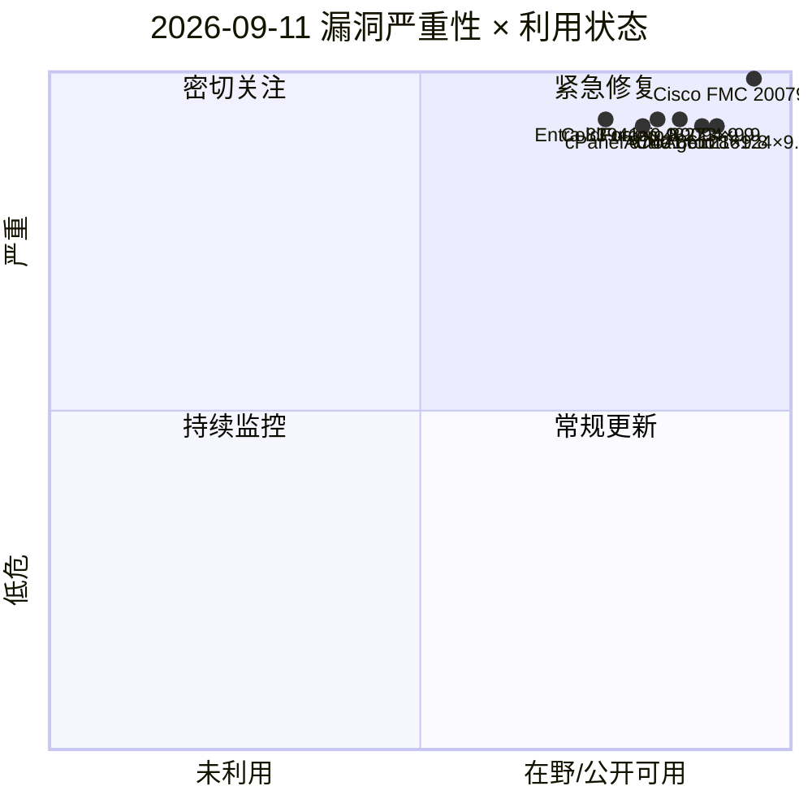
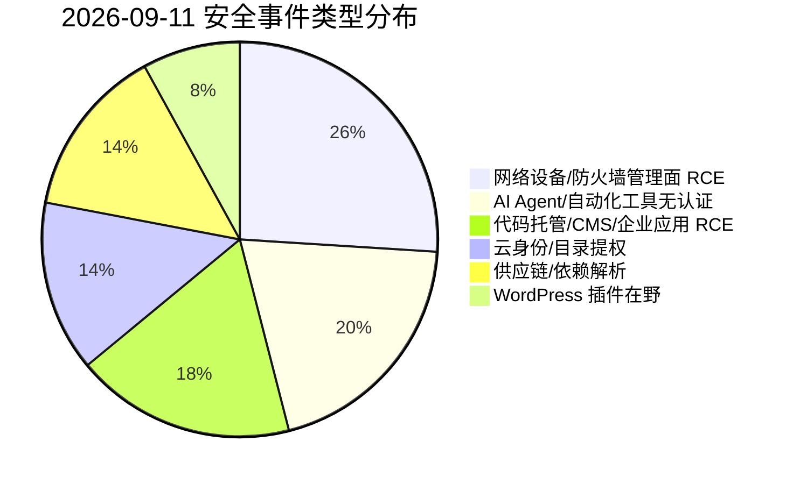
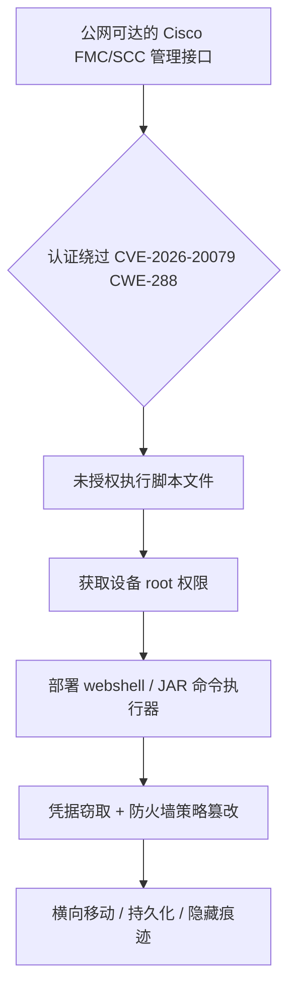
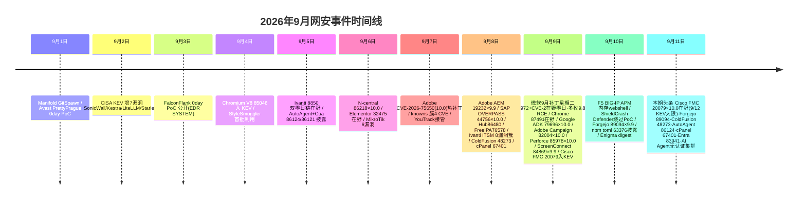

# 网安日报速递 - 2026年9月11日（第 157 期）

> 每日精选全球网络安全动态，覆盖 CVE 漏洞、公开 PoC、漏洞通报、安全事件及相关方向。

## 今日头条

### Cisco Secure FMC 认证绕过致未授权 root RCE（CVE-2026-20079，CVSS 10.0，已在野）

Cisco Secure Firewall Management Center（FMC）与 Security Cloud Control（SCC）防火墙管理组件存在认证绕过漏洞（CWE-288：Alternate Path/Channel 认证绕过），未认证远程攻击者可通过构造 HTTP 请求绕过认证并在受影响设备上执行脚本文件，获取底层操作系统 **root** 权限。CVSS 3.1 满分 **10.0**（AV:N/AC:L/PR:N/UI:N/S:C/C:H/I:H/A:H）。

该漏洞由 Cisco 于 2026 年 3 月披露，**9 月 9 日被 CISA 列入 KEV 目录，修复截止日为 9 月 12 日（明日）**。Cisco Talos 确认其已被实际利用：至少三个攻击集群（含勒索软件与疑似国家背景组织）借该漏洞部署 webshell、JAR 命令执行器与凭据窃取组件，部分集群将其与 CVE-2026-20316（静态凭据）组合部署反弹 shell 与 Cyclops Blink 变种。Cisco 明确：**本漏洞无 workaround，必须升级固件**。

**值得关注**：FMC 是防火墙管理中枢，一旦被 root 接管，攻击者可操控防火墙策略、清除痕迹并以此为跳板横向移动；其公开利用代码已出现（8 月即有两份独立 PoC），KEV 截止临近，公网暴露实例应立即升级。

---

## 重点漏洞与事件（精选 5 条）

### 1. Cisco Secure FMC 认证绕过未授权 root RCE — 见今日头条（CVE-2026-20079）

### 2. Forgejo 模板引擎注入 RCE（CVE-2026-89094，CVSS 9.9）
Forgejo（自托管代码托管平台，Codeberg 底层）在 **16.0.4 之前**版本中，对 `.forgejo/template` 目录下的模板文件扩展处理不当（**CWE-1336 模板引擎注入**）。攻击者可通过构造的模板仓库触发远程代码执行。影响 16.0.0–16.0.4 与 0–15.0.8，官方已发布 16.0.4 / 15.0.8 修复。
**值得关注**：Forgejo 是大量开源项目与企业的代码托管底座，模板仓库 RCE 可借 CI/构建流程实现供应链投毒；该 CVE 于 9/10 新披露，目前尚不在 KEV。

### 3. Adobe ColdFusion 动态代码 eval 注入 RCE（CVE-2026-48273，CVSS 9.9）
ColdFusion 存在 **eval 注入（CWE-95）**，低权限攻击者无需用户交互即可将指令注入动态求值代码，在 ColdFusion 服务账户上下文执行任意代码。影响 ColdFusion 2025 ≤ Update 12、2023 ≤ Update 23；修复于 2025 Update 13 / 2023 Update 24（**APSB26-119**，9/8 披露）。
**值得关注**：ColdFusion 常承载企业门户/API/认证服务，历史上漏洞从披露到武器化极快，应与 8 月同批 CVE-2026-48362（CVSS 10.0 未认证 OS 命令注入）一并纳入最高优先级。

### 4. AutoAgent 沙箱 TCP 服务未认证 root RCE（CVE-2026-86124，CVSS 9.8）
HKUDS 开源 AI Agent 框架 AutoAgent 的沙箱 TCP 命令服务（`tcp_server.py`）绑定 `0.0.0.0` 且完全不校验身份（**CWE-306 缺失认证**），任何能连上端口的客户端发送的命令都以 root 在容器内执行，并可借 bind-mount 的宿主机工作目录越出容器。CVSS 3.1 9.8 / 4.0 9.3，9 月 5 日由 VulnCheck 披露，**尚无官方修复版本**。
**值得关注**：这是 2026 年第四波「AI Agent 基础设施默认可达」事件，同批还有 Cua computer-server、excel-mcp-server、TEN Framework 出现同类「认证检查仅在环境变量被设置时才运行」缺陷。

### 5. cPanel EmailTrack SQL 注入致 root RCE（CVE-2026-67401）
cPanel/WHM 的 EmailTrack 功能存在 SQL 注入，拥有邮件权限的已认证 cPanel 账户可借此在服务器创建任意文件，进而以 root 身份执行代码、完全控制服务器。9 月 8 日披露，影响所有受支持版本，修复于 11.110.0.143 / 11.134.0.55 / 11.136.0.39 / 11.138.0.4（WP2 11.138.1.9）。
**值得关注**：cPanel 支撑全球数百万网站，单账户→root 的链式利用对虚拟主机服务商、多租户服务器与下发邮件权限的管理员风险极高；凭据泄露/钓鱼即触发。

---

## 速览区

- **npm `toml` 原型污染 + DoS（CVE-2026-63376 / CVE-2026-77465）**：`toml.parse()` 在 4.1.2 之前因路径去同步（逗号拼接跟踪路径 vs 点拼接遍历路径）将攻击者键写入 `Object.prototype`（CWE-1321，CVSS 8.2）；同包 CVE-2026-77465 为深层嵌套 payload 引发的不可捕获 RangeError（约 5–6KB 即可令 Worker 崩溃）。`toml` 在 npm 月下载约 **4700 万**，大量 Next.js 构建工具链与 Node 服务间接依赖——凡解析不可信 TOML 输入者需固定至 4.1.2 并加深度/大小护栏。
- **Microsoft Entra ID 缺失授权提权（CVE-2026-83941，CVSS 9.9）**：Entra ID（原 Azure AD）授权检查缺失（CWE-862），低权限已认证用户可跨租户范围提权，影响机密性/完整性。微软已于 9 月补丁中**服务端修复**，无需客户侧操作；应审计 Entra 审计日志与 PIM 告警排查异常角色分配。
- **Cua computer-server 未认证 RCE（CVE-2026-86121，CVSS 9.8）**：trycua/cua 的 computer-server 在 `CONTAINER_NAME` 环境变量未设置时静默跳过认证，且默认绑定 `0.0.0.0`（TCP/8000），未认证攻击者可直接 `run_command` / 读写任意文件 / 拿交互式 PTY。修复于 0.3.42（改默认绑定 127.0.0.1）。
- **AI Agent 无认证集群第二波（CVE-2026-85661 / CVE-2026-85688，均 9.8）**：excel-mcp-server 在 `EXCEL_FILES_PATH` 留空时可读写任意文件；TEN Framework 的 TMAN Designer API 直接接受未认证文件读写请求。与 AutoAgent、Cua 同属「认证检查非 fail-safe」模式。
- **WordPress 插件在野利用浪潮升级（Fruition 9/11）**：Wordfence 观测 Elementor Pro（~600 万安装）、All-in-One WP Migration（~500 万）持续在野；新增 Gravity Forms（~100 万）未认证文件上传/SQLi 向量导致 RCE。运行大规模 WordPress 者应本周内完成插件盘点与升级。
- **Drupal contrib 安全公告潮**：Drupal 一次性发布 16 项咨询，含 Jsonapi Role Access 与 OTP Verification 模块的严重越权访问绕过，使用相关 contrib 模块站点需核对并更新。

---

## 风险分析（Mermaid 图示）

### 漏洞严重性 × 利用状态（象限图）

### 安全事件类型分布（饼图）

### Cisco FMC 攻击链（流程图）

### 本周时间线（9/1–9/11）

---

## 出处与参考

1. CISA KEV — Cisco Secure Firewall Management Center Authentication Bypass（CVE-2026-20079）
   https://www.cisa.gov/kev
2. Cisco 官方安全公告 cisco-sa-onprem-fmc-authbypass-5JPp45V2（CVE-2026-20079）
   https://sec.cloudapps.cisco.com/security/center/content/CiscoSecurityAdvisory/cisco-sa-onprem-fmc-authbypass-5JPp45V2
3. CVE 官方 — CVE-2026-20079
   https://www.cve.org/CVERecord?id=CVE-2026-20079
4. BleepingComputer — Cisco FMC flaws exploited by ransomware gang, state-sponsored hackers（2026-09-10）
   https://www.bleepingcomputer.com/
5. CVE 官方 — CVE-2026-89094（Forgejo）
   https://www.cve.org/CVERecord?id=CVE-2026-89094
6. Tenable — CVE-2026-89094
   https://www.tenable.com/cve/CVE-2026-89094
7. Codeberg Forgejo milestone 139655（修复 16.0.4）
   https://codeberg.org/forgejo/forgejo/milestone/139655
8. CVE 官方 — CVE-2026-48273（Adobe ColdFusion）
   https://www.cve.org/CVERecord?id=CVE-2026-48273
9. Adobe APSB26-119（ColdFusion 修复公告）
   https://helpx.adobe.com/security/products/coldfusion/apsb26-119.html
10. CVE 官方 — CVE-2026-86124（AutoAgent）
    https://www.cve.org/CVERecord?id=CVE-2026-86124
11. VulnCheck — AutoAgent Unauthenticated RCE via Sandbox TCP Command Server
    https://www.vulncheck.com/advisories/autoagent-unauthenticated-remote-code-execution-via-the-sandbox-tcp-command-server
12. cPanel 官方安全公告 — CVE-2026-67401（EmailTrack SQL Injection）
    https://support.cpanel.net/hc/en-us/articles/43187903921559-Security-CVE-2026-67401-SQL-Injection-Vulnerability-in-cPanel-s-EmailTrack-Functionality-September-8-2026
13. The Hacker News — New cPanel Flaw Lets a Hosting Account With Mail Privileges Run Code as Root（2026-09-09）
    https://thehackernews.com/
14. CVE 官方 — CVE-2026-63376（npm toml 原型污染）
    https://www.cve.org/CVERecord?id=CVE-2026-63376
15. GitHub Advisory GHSA-v5mp-jgw5-2x6j（toml-node Prototype Pollution）
    https://github.com/BinaryMuse/toml-node/security/advisories/GHSA-v5mp-jgw5-2x6j
16. MSRC — CVE-2026-83941（Microsoft Entra ID Elevation of Privilege）
    https://msrc.microsoft.com/update-guide/vulnerability/CVE-2026-83941
17. CVE 官方 — CVE-2026-86121（Cua computer-server）
    https://www.cve.org/CVERecord?id=CVE-2026-86121
18. VulnCheck — Cua Computer-Server Unauthenticated RCE via Desktop Control
    https://www.vulncheck.com/advisories/cua-computer-server-before-0.3.42-unauthenticated-rce-via-desktop-control
19. NetFoundry Reachability Watch（2026-09-11，AI 工具无认证集群 + 906 新 CVE）
    https://netfoundry.io/ai/reachability-watch-cve-kev-tracker-2026-09-11
20. Fruition The Perimeter（2026-09-11，WordPress 插件在野 + npm toml + Drupal contrib）
    https://www.fruition.net/perimeter
21. Enigma Global Daily Threat Intelligence Digest（2026-09-10）
    https://www.enigma-global.com/blog/daily-digest-2026-09-10
