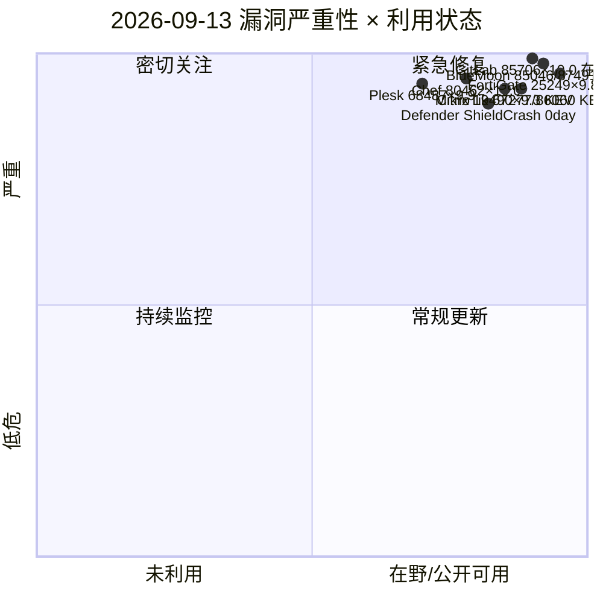
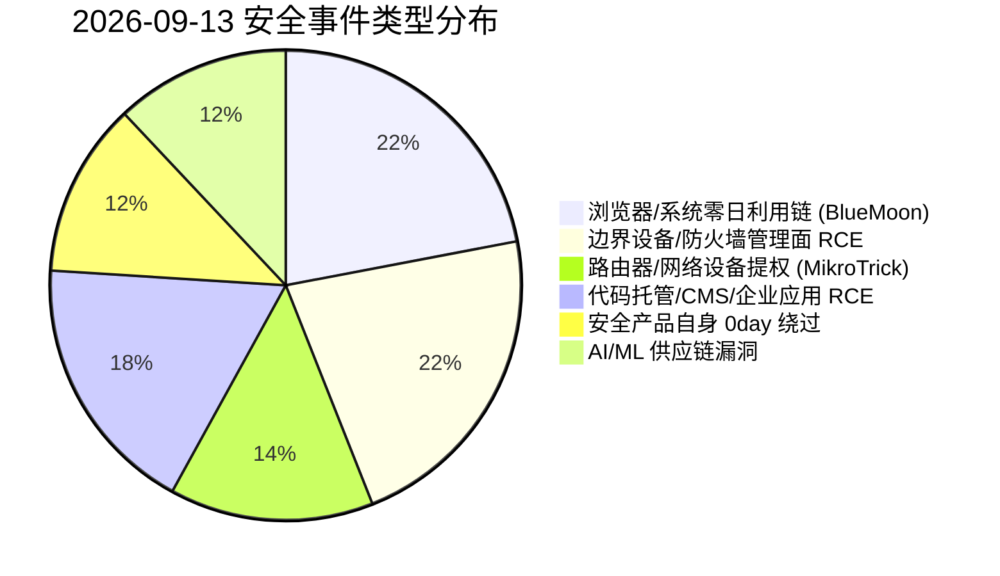
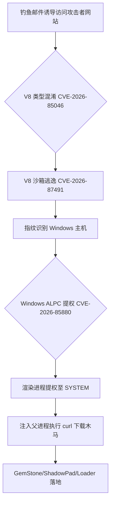
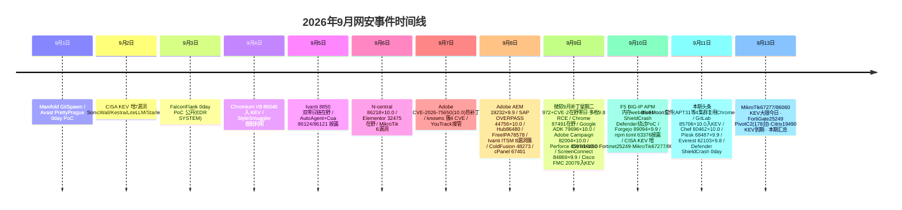

# 网安日报速递 - 2026年9月13日（第 158 期）

> 每日精选全球网络安全动态，覆盖 CVE 漏洞、公开 PoC、漏洞通报、安全事件及相关方向。本期聚焦 9/11–9/13 新披露/在野事件，未与 9/2–9/11 各期重复。

## 今日头条

### BlueMoon 利用套件：Chrome V8 + Windows ALPC 零日链被 4 个国家级 APT 在一周内同时采用（CVE-2026-85046 / CVE-2026-87491 / CVE-2026-85880）

Proofpoint 于 9/11 披露一个名为 **BlueMoon** 的浏览器+系统利用套件，它把三个漏洞串成完整利用链：**CVE-2026-85046**（Chromium V8 类型混淆，可越 V8 沙箱读写堆内存）、**CVE-2026-87491**（V8 沙箱逃逸，覆写 WebAssembly 元数据执行 shellcode）、**CVE-2026-85880**（Windows ALPC 堆溢出本地提权，用于逃逸渲染进程拿 SYSTEM）。前两个 V8 漏洞在被利用时是「补丁间隙（patch-gap）」零日——上游 Chromium 已公开修复，但稳定版 Chrome/Edge 尚未合入，攻击者直接逆向公开补丁造链。

首个使用者是 **中国背景 APT31 / TA412（JungleBamboo，紫光台风）**，8/28 起通过钓鱼邮件投递，目标含美国 NGO、矿业与大宗商品交易商；随后 12 天内 **UNK_LateNight（对美航空航天投 ShadowPad）、UNK_DoubleCheck（越南制造）、UNK_QuietRacket（印尼/新加坡政府金融）** 等至少 4 个集群几乎原样复用同一套代码。Proofpoint 在工具链里发现详尽的调试日志、markdown 交接文档与「请把完整 log 发回」等注释，高度疑似 **AI 辅助开发**。

**值得关注**：这是 2026 年首次出现「公开补丁→快速武器化→多国 APT 同日复用」的浏览器零日扩散模式，默认载荷只是 `curl` 下载并执行可执行文件（高检出信号），说明开发者优先抢在 9/3、9/8 Chrome 补丁前铺开。三个漏洞现均已修复并进入 CISA KEV，但已中招主机仍可能残留载荷与持久化。

---

## 重点漏洞与事件（精选 5 条）

### 1. BlueMoon 利用套件 — 见今日头条（CVE-2026-85046 / 87491 / 85880）

### 2. FortiGate CVE-2025-25249 在野：PivotC2 RAT 把边界防火墙变成内网支点（CVSS 9.8）
FortiOS / FortiSwitchManager `cw_acd` 守护进程存在堆溢出（CWE-122/787），攻击者可借发往 **UDP/5246 CAPWAP 控制端口** 的特制包实现未认证 RCE。该漏洞 2026 年 1 月已由 Fortinet 修复，但 SOCRadar 确认 **至少自 2026 年 7 月起在野利用**，通过 `fortirun.bin` + Bash/Python 自动化反复扫描，**目标超 3 万个 FortiGate IP，确认 178 台被植入 PivotC2**。PivotC2 是专为 FortiGate 后渗透定制的 Node.js RAT：外连 TLS C2、交互式 shell、SOCKS5/HTTP 代理隧道、CIDR 扫描，并能**解密设备配置与凭据**（SSL-VPN、LDAP、无线 PSK、IPsec）。其 `--auto` 模式可自动收割配置、解密凭据并横向扫描内网。归因指向俄语背景、逐利型团伙，已造成两起美国机构全网入侵与数据外泄。9/9 入 CISA KEV（截止 9/12）。
**值得关注**：边界设备被当作「内网跳板」而非单点失陷，凭据解密意味着补丁无法清除已建立的访问；修复至 FortiOS 7.6.4/7.4.9/7.2.12/7.0.18 及以上，并限制 CAPWAP 暴露、轮换所有相关凭据。

### 3. MikroTik RouterOS 双漏洞入 KEV（CVE-2026-67277 + CVE-2026-86060，截止日即今日 9/13）
CERT Polska 命名的 **MikroTrick** 链含三洞，其中两个于 9/10 入 KEV、修复截止日正是 **2026-09-13**：
- **CVE-2026-67277**（CWE-306 缺失认证，CVSS 8.8）：`btest` 带宽测试服务可被未授权连接拖入登录后状态，泄露内核内存或令路由重启（DoS）。
- **CVE-2026-86060**（CWE-88 参数注入，CVSS 9.2）：通过构造用户名篡改 RouterOS 受信任策略掩码，实现提权至管理员。
- **CVE-2026-67276**（CWE-347 签名校验缺陷，CVSS 9.2，未入 KEV）：仅匹配 RSA 模数即可伪造密钥登录，与 86060 组成「先进入、再提权」完整链（需 7.9+）。
受影响 6.x < 6.49.21、7.x < 7.23.4/7.24.2 及 7.25 beta3 之前。加拿大网络安全中心（AL26-020）9/10 警告 SSH 公网暴露设备风险最高。
**值得关注**：路由是内网「观察哨」，MikroTrick 已被用于针对 SSH 公网可达设备的真实入侵；6.x 仅 6.49.21 一个修复线，更老的 6.48 等已 EOL 无补丁，需升级或隔离。

### 4. 微软 Defender 第 11 个零日 ShieldCrash（Nightmare Eclipse，9/11 披露）
知名零日猎人 Nightmare Eclipse（又名 MSNightmare）9/11 再发 **ShieldCrash** 概念验证，据称可绕过 9 月刚修的 ShieldBreak（CVE-2026-69414）补丁，以 **SYSTEM 权限读取任意文件**（暂不支持任意写入或完整 SYSTEM shell），在已打 9 月补丁的 Windows 10/11/Server 上仍有效。它延续 RoguePlanet（CVE-2026-50656，7 月修）→ ShieldBreak → ShieldCrash 的「补丁绕过」链路，是该研究员第 **11 个**微软零日，目标已从 Defender/BitLocker 扩展到 CrowdStrike Falcon（FalconFlank）、Avast（PrettyPrague）、NVIDIA（GreenSection）、Kaspersky（HardBreacher）。微软尚未回应修复时间，漏洞无 CVE。
**值得关注**：安全产品自身成为提权/读取支点，且发布节奏紧跟补丁星期二、带有明显个人动机；企业应将「安全 agent 派生异常 SYSTEM 进程/文件读取」纳入检测。

### 5. GitLab 路径遍历未授权读文件 CVE-2026-85706（CVSS 10.0，已入 KEV 在野）
GitLab CE/EE 在 18.7 至 19.1.8/19.2.6/19.3.2 之前，因 commits API 的**路径限制缺失 + 认证强制缺失**，未认证用户可读服务器任意文件。CISA 已确认在野并列入 KEV，多国 CERT 发布紧急通告；同批 GitLab EE 还修了 Duo Chat 凭据泄露（CVE-2026-87719，CVSS 9.9）。
**值得关注**：GitLab 常承载源码与 CI 密钥，未授权文件读取可直接外泄 `config/secrets`、CI 变量与私钥；公网暴露实例应立即升级并排查异常文件读取日志。

---

## 速览区

- **Citrix NetScaler CVE-2026-19490（CVSS 9.3 v4，KEV，截止 9/12）**：Gateway/AAA vserver 认证绕过（CWE-288），无 workaround；Previdian 蜜罐自 9/3 起记录 56 次利用尝试、9/8 单日 36 次。升级至 14.1-73.32 / 13.1-63.21+。
- **Progress Chef Automate CVE-2026-80462（CVSS 10.0）**：API 网关/身份校验绕过致未认证提权，管理大规模基础设施的实例风险极高，已有可用利用。
- **Plesk Backup Manager CVE-2026-68487（CVSS 9.9）+ CVE-2026-68488（TOCTOU 提权）**：认证客户可借路径遍历以 root 写任意文件，共享主机环境下任意客户可升至 root。
- **WordPress Everest Forms CVE-2026-62103（CVSS 9.8）**：≤3.6.0 未认证 PHP 对象注入 → 任意代码执行，流行表单插件、利用门槛极低。
- **AI/ML 漏洞浪潮**：Apache OpenNLP CVE-2026-82617（CVSS 10.0）、Mistral AI Mistral Vibe CVE-2026-87988（CVSS 10.0）同日披露，Mistral Vibe 已有公开利用；AI 编码/推理链路成为新攻击面。
- **勒索态势（Ransomware.live 9/12）**：当日新增 24 名受害者，krybit（12）、medusalocker（4）领先；制造业/专业技术服务持续承压，边缘设备漏洞（Citrix/Fortinet/MikroTik）仍是主要入口。

---

## 风险分析（Mermaid 图示）

### 漏洞严重性 × 利用状态（象限图）

### 安全事件类型分布（饼图）

### BlueMoon 攻击链（流程图）

### 本周时间线（9/1–9/13）

---

## 出处与参考

1. Proofpoint — Once in a BlueMoon: Multiple State-Aligned Threat Actors Rapidly Adopt Novel Exploit Chain Using Chrome and Windows Zero-Days
   https://www.proofpoint.com/us/blog/threat-insight/once-bluemoon-multiple-state-aligned-threat-actors-rapidly-adopt-novel-exploit
2. The Hacker News / Security Affairs — Four Nation-State Actors Used the Same Chrome Zero-Day Exploit Kit Within 12 Days
   https://securityaffairs.com/198783/apt/four-nation-state-actors-used-the-same-chrome-zero-day-exploit-kit-within-12-days.html
3. CISA KEV — Chrome V8 / Windows ALPC / Citrix / Fortinet / MikroTik 条目
   https://www.cisa.gov/kev
4. CVE 官方 — CVE-2026-85046（Chrome V8 类型混淆）
   https://www.cve.org/CVERecord?id=CVE-2026-85046
5. CVE 官方 — CVE-2026-87491（Chrome V8 沙箱逃逸）
   https://www.cve.org/CVERecord?id=CVE-2026-87491
6. CVE 官方 — CVE-2026-85880（Windows ALPC 提权）
   https://www.cve.org/CVERecord?id=CVE-2026-85880
7. SOCRadar — CVE-2025-25249 Exploitation Delivers PivotC2, a FortiGate Post-Exploitation RAT
   https://socradar.io/blog/cve-2025-25249-pivotc2-fortigate-rat
8. Fortinet PSIRT — FG-IR-25-084（CVE-2025-25249）
   https://fortiguard.fortinet.com/psirt/FG-IR-25-084
9. 加拿大网络安全中心 — AL26-020 Vulnerabilities Impacting MikroTik RouterOS（CVE-2026-67276/67277/86060）
   https://cyber.gc.ca/en/alerts-advisories/al26-020-vulnerabilities-impacting-mikrotik-routeros-cve-2026-67276-cve-2026-67277-cve-2026-86060
10. CISA KEV — MikroTik RouterOS CVE-2026-67277 / CVE-2026-86060
    https://www.cisa.gov/kev
11. MikroTik 官方安全公告（September 2026 vulnerability）
    https://mikrotik.com/supportsec/september-2026-vulnerability/
12. 安恒威胁情报中心 — 微软零日漏洞猎手再发 Defender 新漏洞 ShieldCrash（2026-09-11）
    https://ti.dbappsecurity.com.cn/security-info/bulletin?id=16547
13. Cyderes Howler Cell — Nightmare-Eclipse Zero-Days（FalconFlank / GreenSection / PrettyPrague / HardBreacher）
    https://www.cyderes.com/howler-cell/nightmare-eclipse-zero-days-crowdstrike-nvidia-avast-kaspersky
14. CISA KEV / GitLab — CVE-2026-85706（GitLab 路径遍历，在野）
    https://about.gitlab.com/releases/2026/09/10/patch-release/
15. Enigma Global Daily Threat Intelligence Digest（2026-09-12，含 Chef 80462 / Plesk 68487 / Everest 62103 / OpenNLP 82617 / Mistral Vibe 87988）
    https://www.enigma-global.com/blog/daily-digest-2026-09-12
16. Citrix CTX696939 — CVE-2026-19490 NetScaler ADC/Gateway 认证绕过
    https://support.citrix.com/support-home/kbsearch/article?articleNumber=CTX696939
17. CVE Brief（2026-09-12，WordPress/OpenNLP/Mistral 批量严重披露）
    https://cvebrief.com/archive/2026/09/12
18. Ransomware.live — 2026-09-12 受害者态势（krybit / medusalocker 领先）
    https://ransomware.live/
