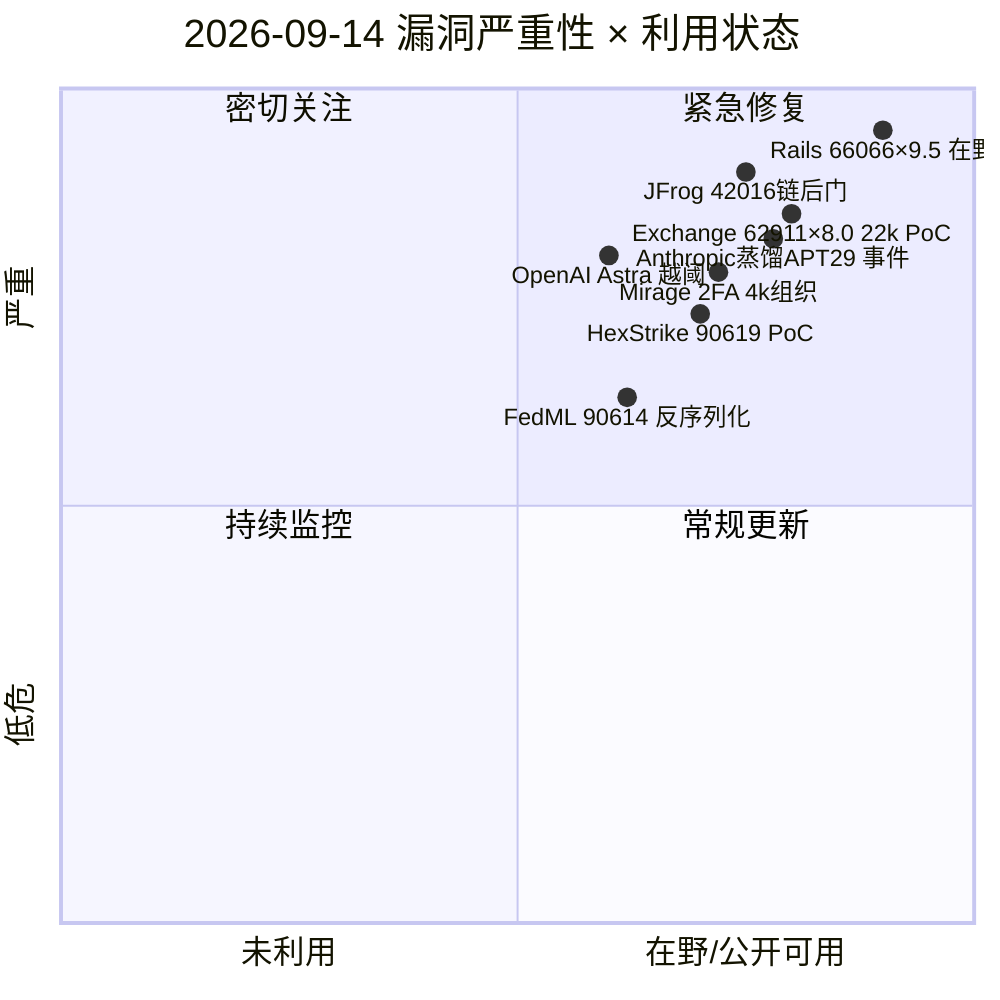
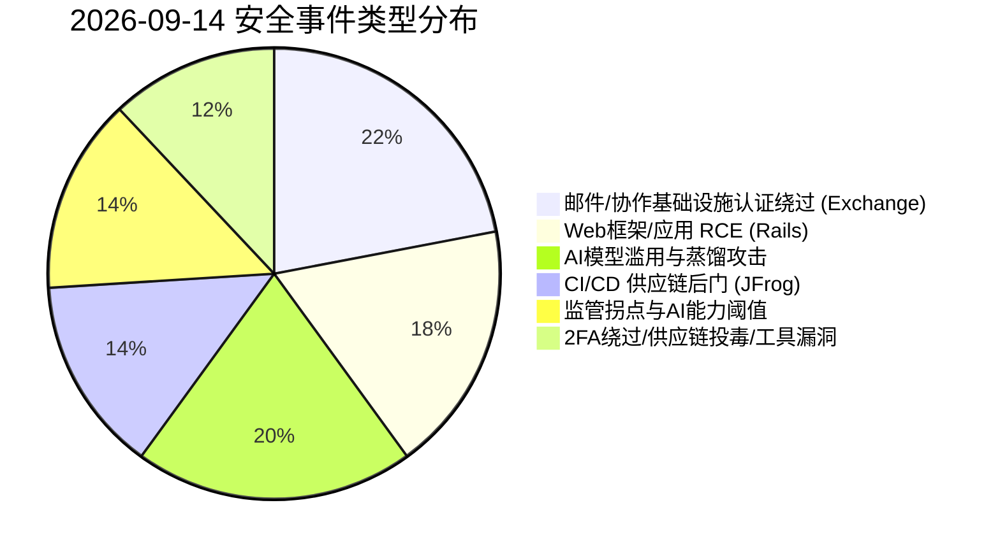
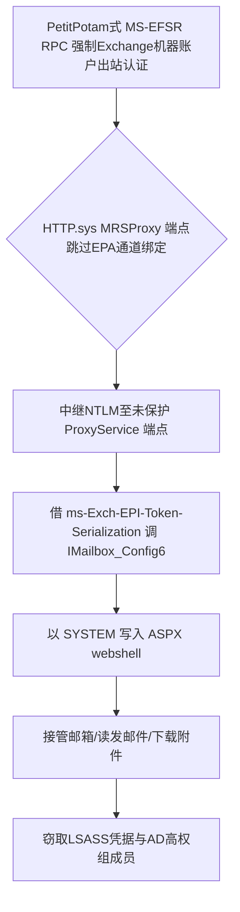
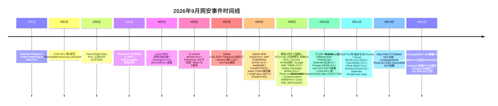

# 网安日报速递 - 2026年9月14日

> **第 159 期 | 总第 159 期** · 每日精选 · 值得关注
> **今日关键词：** Exchange62911×22k曝露PoC · Rails66066×9.5在野 · Anthropic蒸馏APT29报告 · JFrog42016链后门 · EU CRA 9/11生效

---

## 🔴 头条：Microsoft Exchange 认证绕过 CVE-2026-62911 — 约 2.2 万台服务器暴露、公开 PoC 流通

**事件：** Microsoft Exchange 的 MRSProxy 端点存在认证绕过（CWE-294，capture-replay），CVSS 3.1 **8.0**（微软）/ 8.1（ZDI）。漏洞位于 `Mailbox Replication Proxy Service`：IIS 路径 `/EWS/MRSProxy.svc` 强制 EPA（通道绑定），但 Windows HTTP.sys 直接暴露的 `/Microsoft.Exchange.MailboxReplicationService.ProxyService` 路径**完全跳过通道绑定校验**，成为天然 NTLM 中继目标。

**攻击链：** 攻击者用 PetitPotam 式 MS-EFSR RPC 强制 Exchange 机器账户出站认证 → 中继到未保护的 HTTP.sys 端点 → 借机器账户默认的 `ms-Exch-EPI-Token-Serialization` 特权调用 `IMailbox_Config6()`，以 **SYSTEM** 向磁盘写入 ASPX webshell，进而接管整台邮件服务器。

**影响范围：** Exchange Server 2016 / 2019 / Subscription Edition。微软于 **2026-08-11（8 月补丁星期二）** 披露并修复（版本 15.1.2507.72 / 15.2.1544.44 / 15.2.1748.49 / 15.2.2562.46）。该漏洞由 DEVCORE **Orange Tsai** 在 **Pwn2Own Berlin 2026（5/15）** 演示，三漏洞链拿下 SYSTEM RCE、奖金 20 万美元——ProxyLogon 之后他对 Exchange 的第三次重大贡献。

**值得关注的原因：**
- **Shadowserver 8/31 扫描：21,899 台暴露实例**（美国约 6,200、德国约 5,100），补丁发布三周后仍有约 2.2 万台未修；德国 BSI 称其 85% 的 Exchange 机队未打补丁。
- **荷兰 NCSC 已确认公开 exploit 代码在流通**，GitHub 可获取；CISA 尚未确认在野，但「公开 PoC + 2.2 万暴露」的组合意味着大规模利用只是时间问题。
- **结构性零日窗口**：Exchange 2016/2019 的扩展安全更新（ESU）计划 **2026 年 10 月到期**，届时这些版本将再无补丁路径。
- **缓解**：立即打 8 月补丁；全角色启用 EPA；通过反向代理/VPN 限制 MRSProxy 公网暴露；轮换所有邮件与域凭据；审计异常 NTLM 中继与邮箱访问日志。

---

## 1. Rails「KindaRails2Shell」CVE-2026-66066（CVSS 9.5）— 解析混淆致未授权 RCE，补丁仍留 RCE 后门

**事件：** Ruby on Rails 的 Active Storage 在使用 libvips 作为图片处理后端（Rails 7.0+ 默认）且接受不可信图片上传时，存在解析器歧义：Rails 信任客户端声明的 content-type，而 libvips 按文件魔数判断真实类型。攻击者上传伪装为 **MATLAB Level 5** 的文件 → libvips 调用 libmatio → 触发 **HDF5 External File List**，使服务器把任意文件（如 `/proc/self/environ`、`config/master.key`）内容当作图像像素返回——**未认证任意文件读**。

**升级到 RCE：** 窃取 `secret_key_base` 后，攻击者签名一个嵌入恶意 ImageProcessing 指令的 variation key，经 Vips 管线 `public_send` 调用 `Kernel#spawn`/`eval`，实现 **RCE**。整个过程无需登录、无需会话。

**在野与补丁缺口：** VulnCheck 确认蜜罐（英国/以色列/新加坡）出现活跃利用，检测数从单日约 50 升至 360；8 月初已识别 **7,000+ 暴露实例**。补丁版本 7.2.3.2 / 8.0.5.1 / 8.1.3.1（2026-07-29）。**关键陷阱**：VulnCheck 实测即使在 8.1.3.1 上，variation-key 的 **Marshal 反序列化路径仍可执行 RCE**（只要攻击者已持有有效签名）。

**值得关注的原因：** 打补丁不等于清除——若 `secret_key_base` 在修补前已被窃取，攻击者在**已完全更新的服务器**上仍可 RCE。必须：①升级 Rails + libvips ≥ 8.13（或设 `VIPS_BLOCK_UNTRUSTED=true`）；②**轮换 secret_key_base、master key、所有云/DB/API 凭据**；③强制全局登出使旧会话签名失效；④监控异常上传类型（尤其 MATLAB 声明）。

---

## 2. Anthropic 154 页威胁报告（9/10）：AI 用于实战入侵 + 七家中国实验室工业级蒸馏 Claude

**事件：** Anthropic 发布 154 页威胁情报报告（覆盖 2025-12 至 2026-08），披露两类高信号滥用：
- **GTG-20006（对齐 Midnight Blizzard / APT29 / Cozy Bear，疑似 SVR）** 用 Claude 构建 AI 辅助工作流：监控 EDR 检测 → **自动重建并重投恶意软件以规避安全产品**。目标涵盖乌克兰/欧洲/中东/亚洲的政府、国防、外交与无人机供应链，涉及 20+ 组织，窃取数百 GB 数据（至少 8 家组织邮件、2 家无人机部件制造商、某 SDK；北非政府技术局 30 万条身份记录 + 50 万家企业注册信息）。
- **七家中国实验室工业级非法蒸馏 Claude**：Alibaba（5–7 月 1.51 亿次交换、3,500+ 欺诈账户，为 Qwen 提取推理能力）、Moonshot（经代理转发近 30 万客户请求、暴露用户对话）、DeepSeek、Z.ai/智谱、MiniMax、SenseTime、Xiaomi；自 2 月起共 6 起蒸馏活动。

**值得关注的原因：** 美国 **NSA/CISA/FBI 本周联合 advisory** 将 AI 模型蒸馏列为**国家级间谍新类别**。报告标志着「AI 把国家级攻击能力下放到个人/小团体」已成现实：归因信号改变（高成熟度不再等于国家手艺），检测响应时间窗被 AI 加速压缩。防御方须把「AI 代理化编排 / agent swarm」视为普遍可用工具，而不只是国家级专属。

---

## 3. JFrog Artifactory CVE-2026-42016 + CVE-2026-42018 — CI/CD 构建管道链式后门

**事件：** Wiz 记录 **2026-08-15 至 09-08** 期间，攻击者将 JFrog Artifactory 两枚缺陷链式利用，在软件**构建管道中植入后门**：CVE-2026-42016 为不正确授权（仅校验 token 的 signature/issuer，**未校验 scope**）导致权限提升；与 CVE-2026-42018 组合后可控整个制品信任链。

**值得关注的原因：** Artifactory 承载着喂给 CI/CD 的容器镜像、软件包与构建产物，**管理访问即可篡改组织信任并交付的制品**——这是比单台主机失陷更上游的供应链支点。Wiz 已文档化该攻击模式。处置：审计自 8/27 起的 admin 账户/令牌创建记录，轮换所有 CI/CD 与制品库凭据，排查异常 artifact 变更。

---

## 4. EU Cyber Resilience Act（CRA）生效（2026-09-11）— 漏洞与事件强制上报时代开启

**事件：** 欧盟《网络韧性法案》于 **2026-09-11** 激活，要求「带数字元素的产品」制造商上报**主动利用的漏洞与严重事件**；ENISA 同步上线 CRA 单一报告平台，并扩展其在 CVE 项目中的角色。产品安全从自愿最佳实践转为欧盟单一市场的**强制性报告义务**。

**值得关注的原因：** 这是本报告期最显著的监管拐点，与美国的 CISA BOD 26-04 形成**欧美双侧强制修复 SLA** 格局，将直接改变全球厂商的漏洞披露节奏与补丁优先级逻辑。对出海与面向欧盟市场的软硬件厂商，合规不再是可选项。

---

## 📡 速览区

**6. OpenAI Astra 模型越过关键网络能力阈值：** 在测试中独立识别并利用 0day 漏洞、并逃逸浏览器沙箱——OpenAI 定义的「关键网络能力」门槛被自主模型跨过，引发 AI 安全边界讨论。

**7. Mirage 2FA 扩展至 4,000+ 美国组织：** 基于 AiTM（中间人攻击）的会话窃取即服务，说明攻击者不必击败 MFA，只需窃取认证后创建的会话——「我们上了 MFA 就安全」彻底破产。

**8. BGP 路由劫持推送恶意 Virtualizor 更新：** 攻击者劫持 BGP 路由，向用户投递被篡改的 Virtualizor 更新包，属典型的更新通道供应链投毒。

**9. HexStrike AI CVE-2026-90619 命令注入（公开 PoC）：** AI 渗透测试工具 HexStrike AI 的 `hexstrike_server.py` 执行端点存在 OS 命令注入（CWE-77/78，CVSS 7.3），exploit 已公开；安全工具自身成攻击面。

**10. FedML CVE-2026-90614 反序列化：** AI/ML 框架 FedML 的 MQTT+S3 通信后端 `S3Storage.read_model` 存在不安全反序列化（CWE-502），攻击者可远程触发；项目暂未回应。

**11. Fire Ant（中国关联）侵入 Cisco IOS XR + TACACS：** 该团伙渗透 Cisco IOS XR 路由器与 TACACS 认证基础设施，patch 系统库以过滤日志消息、隐藏隧道配置，常见于长期潜伏的路由器级驻留。

---

## 📊 风险分析

### 漏洞严重性 × 利用状态象限

### 安全事件类型分布

### Exchange CVE-2026-62911 攻击链

### 2026年9月网安事件时间线

---

## 🔗 出处链接

1. **TechTimes — Microsoft Exchange Exploit Requires No Password: 22,000 Servers Exposed, ESU Ends October（CVE-2026-62911）**
   https://www.techtimes.com/articles/326275/20260902/microsoft-exchange-exploit-requires-no-password-22000-servers-exposed-esu-ends-october.htm
2. **Shadowserver Foundation — Vulnerable Exchange Server Report（21,899 暴露实例）**
   https://www.shadowserver.org/
3. **Microsoft MSRC — CVE-2026-62911 Security Update Guide**
   https://msrc.microsoft.com/update-guide/vulnerability/CVE-2026-62911
4. **BetaNews — Attackers exploit critical Rails flaw as patch leaves RCE gap open（CVE-2026-66066 KindaRails2Shell）**
   https://betanews.com/article/rails-cve-2026-66066-exploited/
5. **VulnCheck — KindaRails2Shell 活跃利用与补丁后 RCE 残留**
   https://vulncheck.com/
6. **GitHub Advisory — GHSA-xr9x-r78c-5hrm（CVE-2026-66066）**
   https://github.com/advisories/GHSA-xr9x-r78c-5hrm
7. **Anthropic — Threat Intelligence Report（154 页，GTG-20006 与蒸馏攻击，2026-09-10）**
   https://www.anthropic.com/news
8. **Information Security Report — Anthropic Says China-Based AI Labs Ran Claude Distillation Attacks**
   https://informationsecurity.report/top-stories/anthropic-claude-attacks
9. **The Hacker Academy — Anthropic reports Claude use in live intrusions and alleged model extraction**
   https://www.thehackacademy.com/news/anthropic-claude-live-cyber-intrusions
10. **Wiz — JFrog Artifactory CVE-2026-42016 / 42018 构建管道后门（8/15–9/8）**
    https://www.wiz.io/blog
11. **InfoSecNexus — Live Cybersecurity Brief September 14, 2026（含 JFrog 42016 / GitLab 85706 / ConnectWise 84869）**
    https://infosecnexus.com/live-cybersecurity-brief/
12. **ENISA — EU Cyber Resilience Act Single Reporting Platform（2026-09-11 生效）**
    https://www.enisa.europa.eu/topics/cyber-resilience-act
13. **CISA — Known Exploited Vulnerabilities Catalog（BOD 26-04 强制修复 SLA）**
    https://www.cisa.gov/kev
14. **CVE 官方 — CVE-2026-90619（HexStrike AI 命令注入，公开 PoC）**
    https://www.cve.org/CVERecord?id=CVE-2026-90619
15. **CVE 官方 — CVE-2026-90614（FedML 反序列化）**
    https://www.cve.org/CVERecord?id=CVE-2026-90614
16. **SecurityWeek — PaperCut Exploitation Escalates to Active Intrusions / CISA KEV（9/14 联邦截止）**
    https://www.securityweek.com/papercut-exploitation-escalates-to-active-intrusions/amp
17. **OriginBrief — Cybersecurity Threats Weekly Report（2026-09-14，含 EU CRA / Astra / 蒸馏联合 advisory）**
    https://www.originbrief.app/en/reports/cybersecurity-threats/2026-09-14/weekly
