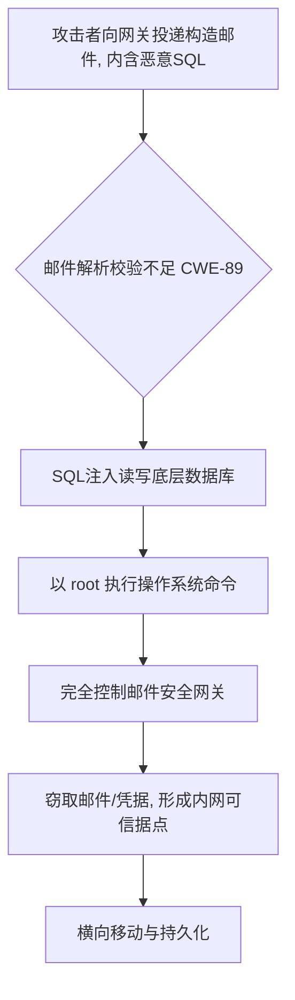
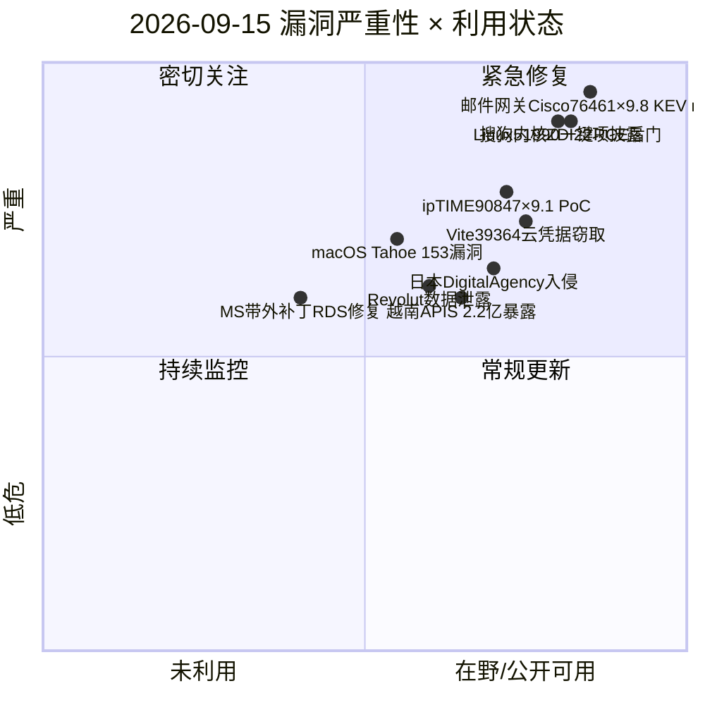
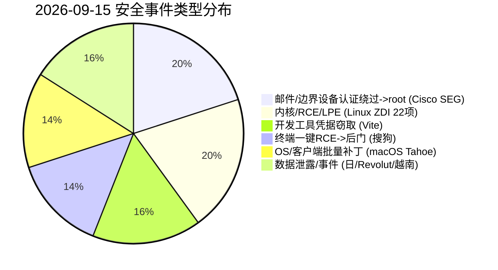
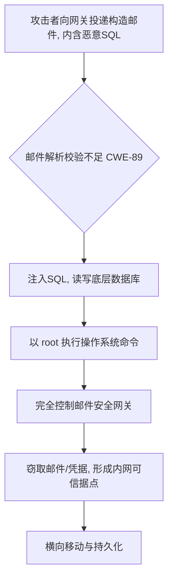
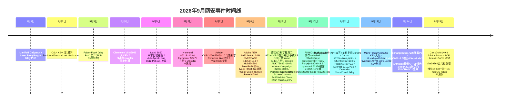

# 网安日报速递 — 2026年9月15日（第 160 期）

> 关注今日网络安全领域重要动态：新 CVE、公开 PoC、漏洞通报、在野利用与安全事件。
> 信息来源以官方公告 / CISA KEV / 厂商通告 / 一手报道为准；CVSS 与 CVE 编号均经交叉核验。

---

## 头条 · Cisco Secure Email Gateway 邮件解析 SQL 注入 CVE-2026-76461（CVSS 9.8，当日入 KEV）

Cisco 于 **2026-09-14** 披露 AsyncOS 邮件安全网关（Secure Email Gateway，物理与虚拟设备均受影响）邮件解析逻辑的 SQL 注入漏洞 **CVE-2026-76461**（CWE-89，CVSS 3.1 **9.8 CRITICAL**）。攻击入口就是一封构造好的邮件——无需认证、无需用户交互，只要邮件流经网关即可。攻击者投递含恶意 SQL 的邮件，利用解析校验不足，注入 SQL 并进一步以 **root** 权限在底层操作系统执行任意命令，从而完全控制邮件网关这一内网边界/可信据点。

**值得关注的原因：**
- **CISA 同日（9/14）将其纳入 KEV**，要求联邦机构在 **2026-09-17** 前完成处置；Cisco PSIRT 确认已发现活跃在野利用。
- **无临时缓解措施，只能升级**：修复版本为 15.5.5-014 / 16.0.4-302 / **16.5.0-780**（Cisco 明确建议直接迁移到 16.5.0-780）；Secure Email Cloud 已由 Cisco 后台升级。
- 影响面覆盖"互联网边界/管理边界"设备，失陷后可直接触达远程访问、流量审计、凭据与下游系统信任。
- 排查建议：核查 `mail_logs` 中 `COPY ... TO PROGRAM` 等可疑 SQL；结合设备外网/防火墙日志比对异常出站上传。

---

## 重点速览（5 条）

### 1. Cisco Secure Email Gateway CVE-2026-76461 — 未认证 root RCE（头条，见上）
- **CVE-2026-76461** · CWE-89 · CVSS **9.8** · KEV 9/14，截止 9/17 · 无 workaround
- 攻击链：构造邮件 → 邮件解析 SQL 注入 → root 命令执行 → 接管网关。

### 2. Linux 内核 ZDI 协调披露 22 项漏洞（ZDI-26-681 ~ ZDI-26-701）
- Zero Day Initiative 于 **2026-09-14** 一次性发布 **22** 份 Linux 内核协调披露通告，覆盖 NTFS3、KSMBD、NFSv4 server、OpenvSwitch、nftables、NFC NCI UART、FUSE、IPv6 组播路由、各网络调度器与驱动。
- 类型含本地提权（LPE）、远程代码执行（RCE）与信息泄露；技术根因涵盖竞态、UAF、越界读、未初始化内存。NTFS3 类堆溢出（如 **CVE-2026-72191 / CVE-2026-72192**，CVSS **9.8**）本地挂载恶意镜像即可触发内核内存破坏。
- **值得关注**：Linux 内核是绝大多数服务器/云/容器基础设施的底座，KSMBD、NFSv4、NTFS3 直接关联 RCE 风险；建议优先修补并禁用未使用的内核模块（如暂不需要 KSMBD/NTFS3）。

### 3. Vite 开发服务器大规模扫描窃取云凭据（CVE-2026-39364）
- Vite 开发服务器文件读取/访问绕过漏洞 **CVE-2026-39364**（CVSS **7.5**，CWE-200），影响 Vite 7.1.0–7.3.2 与 8.x（<8.0.5）；通过 `?raw`、`?import&raw`、`?import&url&inline` 等参数绕过 `server.fs.deny`，以 HTTP 200 明文返回本应受保护的文件。
- **值得关注**：F5 蜜罐在 8 月捕获 **807** 次攻击会话、约 **32,000** 条原始事件；攻击者系统化拖取 `.env`、AWS/Azure 凭据、Terraform state、`/proc/self/environ`、`/etc/passwd`，并复用 CVE-2025-31125（已在 KEV）等旧 Vite 绕过。修复：升级到 8.0.5 / 7.3.3，封锁 5173 端口与可疑 `/@fs/` 请求，轮换任何可能暴露的密钥。

### 4. 搜狗输入法 CVE-2026-51990 一键 RCE → GRAYRABBIT 后门（UNC3569）
- Tencent 搜狗输入法 Windows 版 **CVE-2026-51990**（一键 RCE，无官方 CVSS，按影响评为严重）：`sgbiz:` 自定义协议处理器参数校验缺失 → 加载攻击者控制的 CEF webview（基于 **Chromium 80**，无沙箱、关闭多项安全保护）→ 利用已知 V8 类型混淆（CVE-2021-38003）实现代码执行 → 投放 **GRAYRABBIT** 后门（反向 shell / 文件传输 / 内存加载插件）。
- **值得关注**：中国关联组织 **UNC3569** 已在真实入侵中利用；搜狗输入法装机量以亿计，单点一次点击即可系统级失陷。Tencent 已在 **16.3.0.3498** 修复协议滥用，但内嵌浏览器仍老旧且无沙箱，残余风险仍在。

### 5. Apple macOS Tahoe 安全公报 SB2026091501（153 项漏洞）
- Apple 于 **2026-09-15** 发布 macOS Tahoe 安全更新，一次性修复 **153** 项漏洞（High 5% / Medium 9% / Low 86%）。其中 APFS 越界写 **CVE-2026-84523**（CVSS 4.8，本地提权）、Accelerate Framework 越界写 **CVE-2026-86882** 等。
- **值得关注**：虽以中低危为主，但涉及 APFS/Framework 提权与信息泄露，对企业 macOS  fleet 的基线加固与统一补丁管理仍是刚需。

---

## 速览区（6 条）

- **6. Microsoft 9/14 带外紧急更新**：修复 9 月补丁引发的 Windows Server RDS 连接/登录失败（含 MMC、文件资源管理器异常），并修正 Hyper-V 共享文件夹与部分 USB 音频问题。注意——不要靠卸载 9 月安全更新来"修复"RDS，否则会丢掉本月 966 个漏洞修复（含两个在野 0day）。
- **7. 日本 Digital Agency 网络入侵**：VPN 入口被突破，约 **24.6 万**条人事数据可能外泄，已通报隐私监管机构。
- **8. Revolut 数据泄露**：攻击者冒充政府机构实施社工，导致身份文件与金融记录暴露。
- **9. Twitch JeetBot OAuth token 泄露**：恶意 Twitch 扩展（JeetBot）暴露近 **31,000** 名用户的 OAuth bearer token，存在账号接管风险，需吊销令牌并轮换凭据。
- **10. EFM ipTIME C200E CVE-2026-90847**（CVSS **9.1**）：系统设置 `iux_set.cgi` 操作系统命令注入，公开 PoC 已流通；远程可达。
- **11. 越南 APIS 2.2 亿旅客记录暴露**：Kinryū Labs 发现一个暴露的 Elasticsearch 集群，含 **2.2 亿+** 乘客与机组人员记录。

---

## 风险分析

### 漏洞严重性 × 利用状态象限

### 安全事件类型分布

### Cisco SEG CVE-2026-76461 攻击链（邮件 → root）

### 2026年9月网安事件时间线

---

## 出处与参考链接

1. **Cisco Security Advisory — CVE-2026-76461（Secure Email Gateway SQL Injection）**：https://sec.cloudapps.cisco.com/security/center/content/CiscoSecurityAdvisory/cisco-sa-esa-inj-2bLVGmhX
2. **CVE 官方 — CVE-2026-76461**：https://www.cve.org/CVERecord?id=CVE-2026-76461
3. **CISA KEV — CVE-2026-76461（截止 2026-09-17）**：https://www.cisa.gov/known-exploited-vulnerabilities-catalog
4. **Beazley Security Labs — Critical Vulnerability in Cisco SEG Under Active Exploitation**：https://labs.beazley.security/advisories/BSL-A1207
5. **Zero Day Initiative — Multiple Linux Kernel Advisories（ZDI-26-681 ~ ZDI-26-701）**：https://www.zerodayinitiative.com/
6. **CVE 官方 — CVE-2026-72191（Linux NTFS3 越界写）**：https://www.cve.org/CVERecord?id=CVE-2026-72191
7. **F5 Labs — Cloud Takeover: Mass Scanning for Exposed Vite Endpoints (CVE-2026-39364)**：https://www.f5.com/labs/articles/cloud-takeover-mass-scanning-for-exposed-vite-endpoints-cve-2026-39364
8. **BleepingComputer — Hackers target exposed Vite dev servers to steal AWS, Azure secrets**：https://www.bleepingcomputer.com/
9. **Gen Digital / Cybernoz — Sogou Input Method CVE-2026-51990 one-click RCE → GRAYRABBIT (UNC3569)**：https://cybernoz.com/?p=95205
10. **CVE 官方 — CVE-2026-51990**：https://www.cve.org/CVERecord?id=CVE-2026-51990
11. **Cybersecurity Help — SB2026091501 Multiple vulnerabilities in macOS Tahoe**：https://www.cybersecurity-help.cz/vdb/SB2026091501
12. **Microsoft — 2026-09 带外更新（修复 RDS 故障）**：https://support.microsoft.com/
13. **Carthage Electronics — September 14 2026 CVE Threat Brief (Cisco SEG KEV)**：https://carthageelectronics.com/september-14-2026-cve-threat-brief
14. **CyberHappenings — Sourced Cybersecurity Happenings (Japan Digital Agency / Revolut / Twitch JeetBot)**：http://www.cyberhappenings.com/
15. **CVE 官方 — CVE-2026-90847（EFM ipTIME C200E）**：https://www.cve.org/CVERecord?id=CVE-2026-90847

---
*免责声明：本报告基于公开信息整理，CVE 编号、漏洞描述等数据以官方源为准。建议读者查阅原始来源获取最新动态。*
