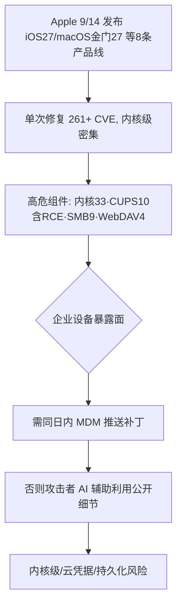
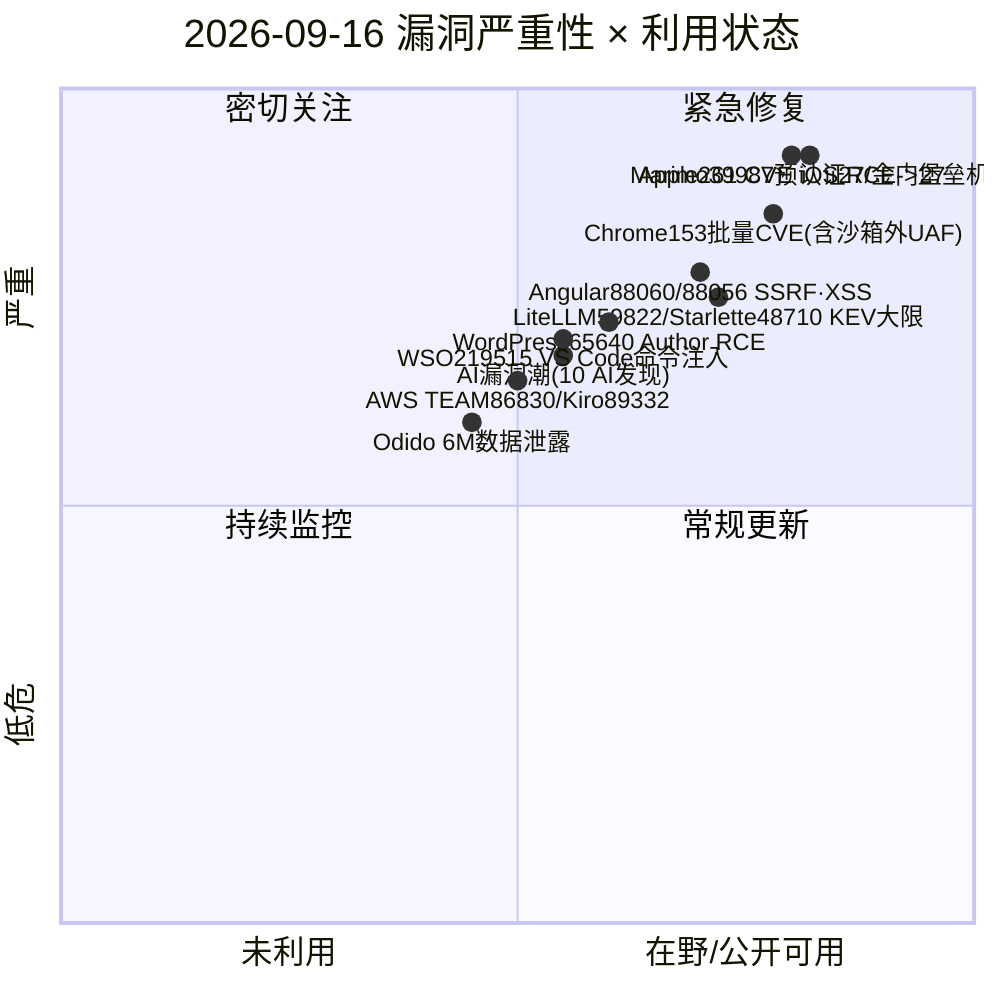
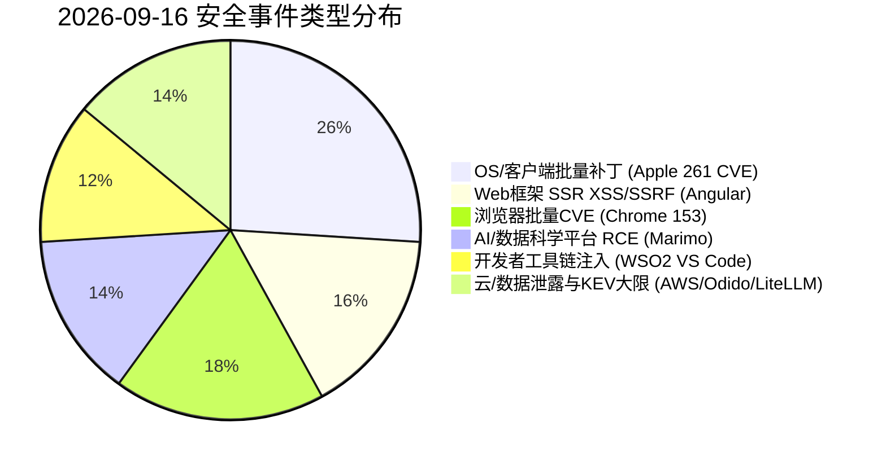
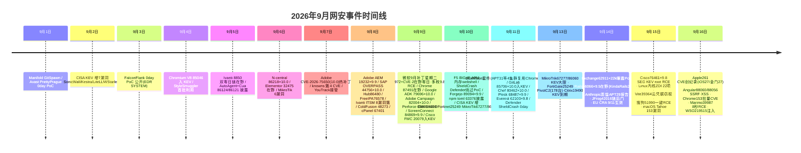

# 网安日报速递 — 2026年9月16日（第 161 期）

> 关注今日网络安全领域重要动态：新 CVE、公开 PoC、漏洞通报、在野利用与安全事件。
> 信息来源以官方公告 / CISA KEV / 厂商通告 / 一手报道为准；CVSS 与 CVE 编号均经交叉核验。

---

## 头条 · Apple iOS 27 / macOS Golden Gate 27 创纪录单次修复 261 个 CVE（9/14–9/15）

Apple 于 **2026-09-14** 一口气发布 iOS 27、iPadOS 27、macOS Golden Gate 27 及配套 5 个版本（macOS Tahoe 26.7、Sequoia 15.8、tvOS 27、watchOS 27、visionOS 27、Safari 27、Xcode 27），**一次性修复超过 261 个 CVE**，为苹果史上最大单次补丁周期。

**关键数据：**
- **iOS 27 / iPadOS 27**：约 **126** 个 CVE，其中 **20** 个位于内核（UAF、竞态、越界写）。
- **macOS Golden Gate 27**：**210** 个 CVE，内核 **33** 个、CUPS 打印栈 **10** 个、SMB **9** 个、WebDAV **4** 个。
- **macOS Tahoe 26.7**：**153** 个 CVE（26 个内核缺陷）。
- 值得注意：**CVE-2026-64752** CoreMedia 内存破坏——一张恶意图片即可攻陷 iPhone，Apple 直接删除了问题代码而非打补丁；CUPS 打印栈含远程 RCE **CVE-2026-43692** 与提权 **CVE-2026-64790**；SMB 含内核内存读 **CVE-2026-43690**。
- 已核实最高 CVSS 为 **7.5**（CVE-2026-28930 / CVE-2026-28969）；Apple 与 SANS ISC 均**未标记任何漏洞在野利用**。

**值得关注的原因：**
- 内核级修复密集，企业 fleet 需**同日内 MDM 推送**——Jamf 的 Boynton 直言"这是内核版本而非浏览器版本"，延迟修补是策略选择而非工具问题。
- **AI 辅助漏洞挖掘正式进入主流**：本次 **10** 个漏洞由 AI 直接发现（Calif 协同 Claude / Anthropic Research、Nvidia AI Red Team），如 CVE-2026-65410（AVE 编码器）、CVE-2026-65409（Foundation DoS）、CVE-2026-43692（CUPS RCE）。
- 虽无在野，细节公开瞬间攻击窗口即打开，攻击者同样在用 AI。

---

## 重点速览（5 条）

### 1. Apple iOS 27 / macOS Golden Gate 27 — 创纪录 261 CVE 批量修复（头条，见上）
- 9/14 发布，iOS 27（126 CVE/20 内核）、macOS 金门 27（210 CVE/33 内核）、Tahoe 26.7（153 CVE）
- 关键漏洞：CoreMedia CVE-2026-64752（恶意图片→iPhone）、CUPS CVE-2026-43692（远程 RCE）、SMB CVE-2026-43690（内核内存读）
- 10 个漏洞由 AI（Claude/Anthropic、Nvidia AI Red Team）直接发现；无在野标记

### 2. Angular SSR 双高危：CVE-2026-88060（XSS）+ CVE-2026-88056（SSRF/凭据泄露）
- `@angular/platform-server` 漏洞，CVSS 4.0 **8.6**，修复版本 **20.3.30 / 21.2.22 / 22.1.4**（9/10 披露）。
- **CVE-2026-88060**：SSR 序列化时 `noscript`/`iframe` 等 fallback raw-content 元素内未转义用户内容 → **XSS**；**CVE-2026-88056**：URL 解析对 Unicode 空白（U+00A0/U+FEFF）的 `trim()` 差异绕过同源校验 → **SSRF 并泄露 Authorization 等后端凭据**。
- **值得关注**：Angular SSR 广泛用于 AI/Web 应用，后端凭据泄露直接危及 API key/Bearer token；Renderer2 命令式 DOM 构造无条件受影响。

### 3. Google Chrome 153.0.8010.47 批量修复约 42 个 CVE
- 一批 CVE-2026-91708 ~ 91749。含 ServiceWorker 类型混淆 **CVE-2026-91715**（8.8）、V8 UAF **CVE-2026-91745**、PDF UAF **CVE-2026-91737**、DigitalCredentials UAF **CVE-2026-91729**（沙箱外代码执行）、Auth UAF **CVE-2026-91716**（沙箱外）。
- **值得关注**：多个 High 级"沙箱内 RCE"叠加两个**沙箱外** UAF（91729/91716），浏览器是首要客户端攻击面；Chrome / Edge / Opera 同步需升级。

### 4. Marimo CVE-2026-39987（CVSS 9.8）预认证 RCE → 8 秒拿下 SSH 堡垒机
- Marimo notebook 的终端 WebSocket 端点跳过鉴权（其他端点有），任意连接者获 Marimo 进程用户的交互式 shell。Sysdig 观测到**人类攻击者 8 秒**从 RCE 跳到 SSH 堡垒机，从进程环境/Redis 拖走云凭据，并用 AWS Secrets Manager 私钥认证；自 **2026-04** 起已在 **CISA KEV**。
- **值得关注**：Marimo 常跑在 ML 训练管线、持云凭据；单点未授权 shell 直接变云账号沦陷；升级 **0.23.0** 并对终端 WS 端点加鉴权/禁用。

### 5. WSO2 Integrator MI VS Code 扩展 CVE-2026-19515（OS 命令注入 7.0）
- 处理不可信 Micro Integrator 项目时，单元测试执行流注入任意 OS 命令（CWE-78）；需用户授予 workspace trust 后触发（CVSS 3.1 **7.0**）。
- **值得关注**：开发者工具链是供应链入口，CI/开发工作站凭据暴露风险；升级扩展并谨慎授予 workspace trust。

---

## 速览区（6 条）

- **6. AWS TEAM 样本方案 CVE-2026-86830（提权）+ Kiro IDE CVE-2026-89332（恶意仓库重定向 Kiro Powers registry 请求、窃取工作区数据）**：云身份与开发者工作站风险，升级 TEAM <1.5.1、Kiro IDE <0.8.135。
- **7. WordPress CVE-2026-65640** — Author+ 级 RCE，经 Imagick + Ghostscript 恶意文件上传触发（需作者权限 + 图像处理路径）。
- **8. ShinyHunters 攻破 Odido，暴露约 600 万客户数据**：典型大规模数据泄露事件，需关注凭据重置与钓鱼次生风险。
- **9. CISA KEV 9/16 截止双漏洞**：BerriAI LiteLLM **CVE-2026-59822**（8.8，MCP 认证绕过）与 Kludex Starlette **CVE-2026-48710**（HTTP 走私）今日处置大限。
- **10. "漏洞潮"(vulnpocalypse) 趋势确立**：Apple 本次 10 个漏洞由 AI（Claude/Anthropic 协同 Calif、Nvidia AI Red Team）直接发现，AI 辅助漏洞狩猎进入主流。
- **11. Chrome 153 Medium 批次**：同步修复 Compositing 整数溢出 CVE-2026-91746、WebAppInstalls 竞态 UI 欺骗 CVE-2026-91723、Skia 未初始化 CVE-2026-91740 等。

---

## 风险分析

### 漏洞严重性 × 利用状态象限

### 安全事件类型分布

### Apple 261 CVE 批量修复风险链（披露 → 暴露）

### 2026年9月网安事件时间线

---

## 出处与参考链接

1. **Yahoo Tech / SecurityWeek — Apple Patches Record 261 CVEs in iOS 27 and macOS Golden Gate 27**：https://tech.yahoo.com/cybersecurity/articles/apple-patches-record-261-cves-191702220.html
2. **Zero Day News — The vulnpocalypse rains iBugs down on Apple (record patches, AI-found bugs)**：https://www.zeroday.news/article/vulnpocalypse-rains-ibugs-down-apple-record-setting
3. **iThinkDifferent — iOS 27 and macOS Golden Gate 27 Patch 336 Security Vulnerabilities**：https://www.ithinkdiff.com/ios-27-and-macos-golden-gate-27-patch-336-security-vulnerabilities/
4. **CVE 官方 — CVE-2026-64752（CoreMedia）**：https://www.cve.org/CVERecord?id=CVE-2026-64752
5. **GitHub Advisory GHSA-v3p8-whq6-r5jg — Angular SSR XSS CVE-2026-88060**：https://github.com/advisories/GHSA-v3p8-whq6-r5jg
6. **GitHub Advisory GHSA-f6mr-pjwc-34m4 — Angular SSRF / credential leak CVE-2026-88056**：https://github.com/advisories/ghsa-f6mr-pjwc-34m4
7. **Google Chrome Releases — Stable Channel Update for Desktop (2026-09-15, 153.0.8010.47)**：https://chromereleases.googleblog.com/2026/09/stable-channel-update-for-desktop_0541751186.html
8. **CVE 官方 — CVE-2026-91715（Chrome ServiceWorker 类型混淆）**：https://www.cve.org/CVERecord?id=CVE-2026-91715
9. **CyberRecaps — Marimo CVE-2026-39987 pre-auth RCE, 8-second pivot to SSH bastion**：https://cyberrecaps.com/news/cybersecurity-news-september-15-2026
10. **CVE 官方 — CVE-2026-39987（Marimo）**：https://www.cve.org/CVERecord?id=CVE-2026-39987
11. **WSO2 Security Advisory WSO2-2026-5854 — CVE-2026-19515 (Integrator MI VS Code extension)**：https://security.docs.wso2.com/en/latest/security-announcements/security-advisories/2026/WSO2-2026-5854/
12. **Zinbiel's Tech Blog — Daily Security & Vulnerability Brief 2026-09-15 (AWS TEAM 86830 / Kiro 89332 / WordPress 65640)**：https://zinbiel.net/daily-security-vulnerability-brief-2026-09-15
13. **CISA KEV — Known Exploited Vulnerabilities Catalog（LiteLLM 59822 / Starlette 48710 截止 9/16）**：https://www.cisa.gov/known-exploited-vulnerabilities-catalog
14. **HKCERT — Google Chrome Multiple Vulnerabilities (CVE-2026-91708~91749)**：https://www.hkcert.org/security-bulletin/google-chrome-multiple-vulnerabilities_20260916

---

*免责声明：本报告基于公开信息整理，CVE 编号、漏洞描述等数据以官方源为准。建议读者查阅原始来源获取最新动态。*
