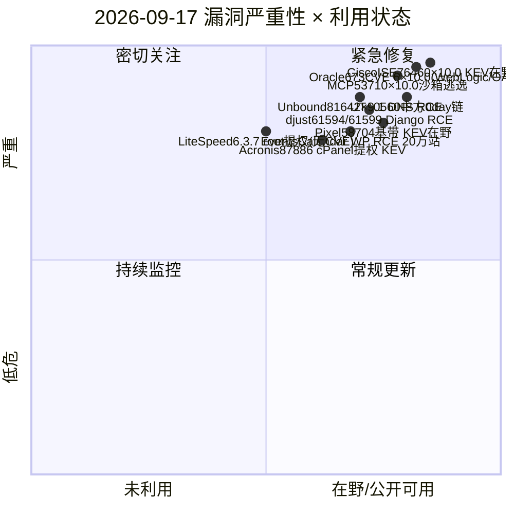
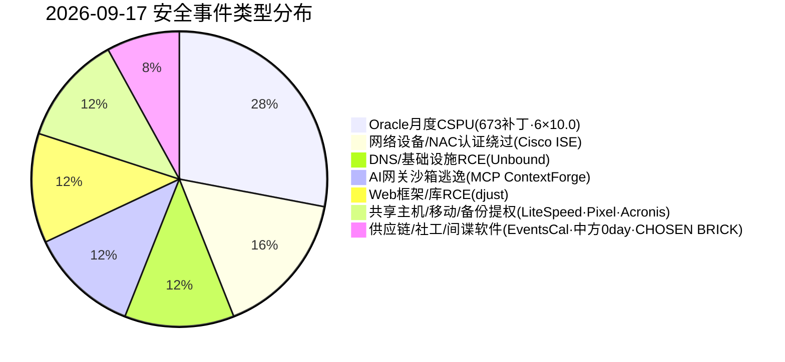
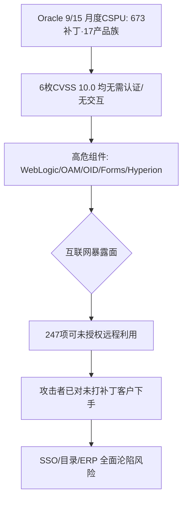
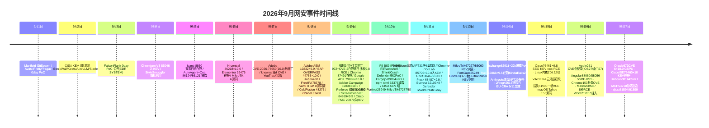

# 网安日报速递 - 2026年9月17日

> 第 162 期 | 2026年9月17日 星期四 | 每日精选 · 值得关注

## 今日头条

**Oracle 9 月关键补丁更新（CSPU）单次修复 673 漏洞：6 枚 CVSS 10.0 未授权 RCE/认证绕过横扫 Fusion Middleware**

Oracle 于 9/15 发布月度 CSPU（HKCERT 9/16 转发），247 项可未授权远程利用；WebLogic / OAM / OID / Forms / Hyperion 多枚满分且无需认证、无需交互，攻击者已在对未打补丁客户下手。

## 重点速递（5 条）

### 1. Oracle 9 月关键补丁更新（CSPU）— 单次 673 补丁，6 枚 CVSS 10.0 横扫 Fusion Middleware（头条）

- **时间**：Oracle 2026-09-15 发布月度关键安全补丁更新（CSPU），HKCERT 于 9/16 转发。
- **规模**：一次性修复 **673** 个安全补丁、覆盖 **17** 个产品族；**247** 项可被未授权远程利用（Fusion Middleware 153 项，其中 78 项无需认证）。
- **6 枚满分（CVSS 10.0）**，全部网络可达、无需认证/无交互：
  - WebLogic Web Container **CVE-2026-83021**
  - Oracle Access Manager 认证引擎 **CVE-2026-71133**
  - Oracle Forms **CVE-2026-83099**
  - Oracle Internet Directory LDAP 服务器 **CVE-2026-83059**
  - Platform Security for Java **CVE-2026-83020**
  - Hyperion Financial Management **CVE-2026-87230**
  - WebLogic 另含 3 枚 T3/IIOP 反序列化 9.8（CVE-2026-70756 / 70757 / 70748）。
- **值得关注**：Oracle 已将节奏从季度加速为月度 CSPU；多枚满分无需认证即「changed scope」可拿下整机。Oracle 警告其仍收到针对已打补丁漏洞的成功攻击报告。临时缓解可网络层阻断攻击所需协议，但非长久之计。另需注意 WebLogic 代理插件 **CVE-2026-21962** 已于 2026-08-24 入 CISA KEV（大规模利用），前端插件需独立核验。

### 2. Cisco ISE CVE-2026-76460（CVSS 10.0）认证绕过，披露当日入 CISA KEV 且确认在野

- **时间**：Cisco 2026-09-16 发布 ISE 2026 年 9 月安全强化更新，同步披露该漏洞。
- **描述**：ISE/ISE-PIC 某 REST API 端点认证控制不足（CWE-648），未授权远程攻击者可绕过 Web 管理接口认证；Cisco 确认已在野利用，成功利用后可获 **root 级命令执行**。
- **处置**：当日即入 CISA KEV，联邦大限 **2026-09-19**；无 workaround，仅 iACL 临时缓解。受影响 ISE 3.1–3.5 / ISE-PIC 3.4–3.5；修复 3.1 P12 / 3.2 P11 / 3.3 P12 / 3.4 P7 / 3.5 P4。
- **值得关注**：ISE 是企业零信任/NAC 架构核心，沦陷即暴露全网分段策略、设备态势与认证流；三天大限紧迫，且按 BOD 26-04 需先完成取证排查（攻击者可能已清除痕迹）。

### 3. NLnet Labs Unbound CVE-2026-81642（CVSS 9.1）DNSSEC 验证器堆溢出，可能 RCE

- **时间**：2026-09-16 披露。
- **描述**：DNSSEC 验证器存在堆缓冲区溢出（CWE-122）——DNSKEY 记录的 owner 含指向自身 RDATA 的压缩指针时，digest 缓冲区被溢出；攻击者控制恶意域并诱导查询即触发，数据由攻击者完全控制。
- **评分/影响**：CVSS 4.0 基分 **9.1**；攻击者可控数据可进入溢出路径，存在远程代码执行可能。影响 Unbound ≤ 1.26.0，修复 **1.26.1**。
- **值得关注**：递归 DNS 解析器是基础设施关键节点，一旦 RCE 可被用于投毒、劫持与内网跳板；运营商与企业递归解析器应优先升级。

### 4. MCP Context Forge CVE-2026-53710（CVSS 10.0）RestrictedPython 沙箱逃逸，AI 网关级 RCE

- **时间**：Enigma 9/16 威胁情报收录。
- **描述**：python_sandbox_server 在 safe_builtins 中暴露原始 `getattr` 且缺少 getattr 守卫，攻击者可完全逃逸 RestrictedPython 沙箱，在宿主机执行任意代码。
- **影响**：MCP Context Forge 是面向 MCP/A2A/REST/gRPC 的 AI 网关与代理，沙箱逃逸可级联至后端 AI 服务与系统；PoC 门槛低，修复版本 **1.0.2**。
- **值得关注**：AI 基础设施正成为新型攻击面；凡将 LLM/智能体沙箱暴露到网络的平台，都应把「沙箱逃逸」列为最高优先级，立即升级并审计调用面。

### 5. djust（Django LiveView 库）CVE-2026-61594（9.1 授权绕过）+ CVE-2026-61599（8.8 未授权 RCE）

- **时间**：IONIX 9/16 收录。
- **描述**：
  - **CVE-2026-61599**：挂载 LiveView 时在认证前即用 importlib 解析客户端提供的 dotted module path，触发任意 Python 模块 import-time 代码执行 → 未授权 RCE（CVSS 8.8）。
  - **CVE-2026-61594**：实时传输走独立 check_view_auth 路径，可绕过 LoginRequiredMixin 等保护 → 授权绕过（CVSS 9.1）。
- **影响/修复**：djust < 1.0.7，升级 **1.0.7**。
- **值得关注**：Django 生态 SSR 组件一旦暴露在公网，未授权即打穿；使用 djust 的站点应即刻升级并复核访问策略。

## 速览区（6 条）

- **6. LiteSpeed Enterprise 6.3.7 根提权（无 CVE）**：cPanel 于 9/14 公告，低权限共享主机租户可越 CageFS 隔离拿 root，影响 6.3.7 之前所有企业版；这是 5 月以来第 3 次同类根提权（前两次 CVE-2026-48172 / 54420 已入 KEV），需手动强制升级 6.3.7。
- **7. Google Pixel CVE-2026-58704（基带，KEV 在野）**：基带 improper authorization 逻辑缺陷可越权提权；CISA KEV 9/16 加入（截止 9/19），已确认在野，Google 已于 9/15 发布安全更新，MDM 应核验设备合规。
- **8. Acronis Backup CVE-2026-87886（cPanel/Plesk 提权，KEV）**：cPanel/WHM 插件与 Plesk 扩展默认权限不当本地提权；CISA KEV 9/16 加入（截止 9/19），升级 1.8.11(Plesk)/1.9.3 HF3(cPanel)。
- **9. The Events Calendar 插件未授权 RCE（20 万+ 站点）**：SecurityWeek 9/17 报道该 WordPress 插件存在未授权 RCE，影响 20 万+ 站点，CVE 编号厂商尚未完整披露，站点应关注并更新。
- **10. UTA0560 / JungleBamboo 中方 actors 串 Chrome+Win 零日**：Volexity 观测两团伙用 V8 类型混淆 + WASM 沙箱逃逸 + Windows 内核 LPE 链注入 Chrome 浏览器进程，投递 GRIMWEDGE JScript 后门与 LONGTALE 凭据窃取扩展（承接 9/13 BlueMoon 链）。
- **11. CHOSEN BRICK 伊朗间谍软件（Telegram C2）**：美/英/荷联合 advisory 披露，借假 MRI 扫描等社工投递，以每受害者独立 Telegram bot 作 C2，窃取联系人/消息/屏幕并激活麦克风、逃避 Defender，针对异见者与记者。

## 风险分析（Mermaid 图表）

### 漏洞严重性 × 利用状态象限

### 安全事件类型分布

### Oracle 9 月 CSPU 批量修复风险链（披露 → 暴露）

### 2026 年 9 月网安事件时间线

## 参考出处

1. Oracle — September 2026 Critical Security Patch Update Advisory: https://www.oracle.com/security-alerts/cspusep2026.html
2. Waratek — September CSPU Analysis (six max-severity flaws): https://waratek.com/news/september-2026-oracle-cspu-analysis
3. NVD — CVE-2026-83021（Oracle WebLogic）: https://nvd.nist.gov/vuln/detail/CVE-2026-83021
4. Cisco Security Advisory — CVE-2026-76460 ISE Auth Bypass: https://sec.cloudapps.cisco.com/security/center/content/CiscoSecurityAdvisory/cisco-sa-ISE-ABP-VNSW7Tn5
5. CISA KEV — CVE-2026-76460: https://www.cisa.gov/known-exploited-vulnerabilities-catalog?field_cve=CVE-2026-76460
6. NLnet Labs — CVE-2026-81642 Unbound advisory: https://www.nlnetlabs.nl/downloads/unbound/CVE-2026-81642.txt
7. CVE.org — CVE-2026-81642: https://www.cve.org/CVERecord?id=CVE-2026-81642
8. Enigma Global — Daily Digest 2026-09-16（MCP Context Forge）: https://www.enigma-global.com/blog/daily-digest-2026-09-16
9. CVE.org — CVE-2026-61594（djust auth bypass）: https://www.cve.org/CVERecord?id=CVE-2026-61594
10. CVE.org — CVE-2026-61599（djust unauth RCE）: https://www.cve.org/CVERecord?id=CVE-2026-61599
11. Shield53 — LiteSpeed Enterprise root escalation (3rd since May): https://news.shield53.com/litespeed-enterprise-root-escalation-third-time-since-may-for-cpanel-shared-hosting
12. CISA KEV — CVE-2026-58704（Pixel）: https://www.cisa.gov/known-exploited-vulnerabilities-catalog?field_cve=CVE-2026-58704
13. SecurityWeek — Acronis 87886 / The Events Calendar RCE: https://www.securityweek.com/
14. CyberSecBrief — UTA0560/JungleBamboo & CHOSEN BRICK: https://www.cybersecbrief.com/news/cybersec/cybersec-2026-09-16
