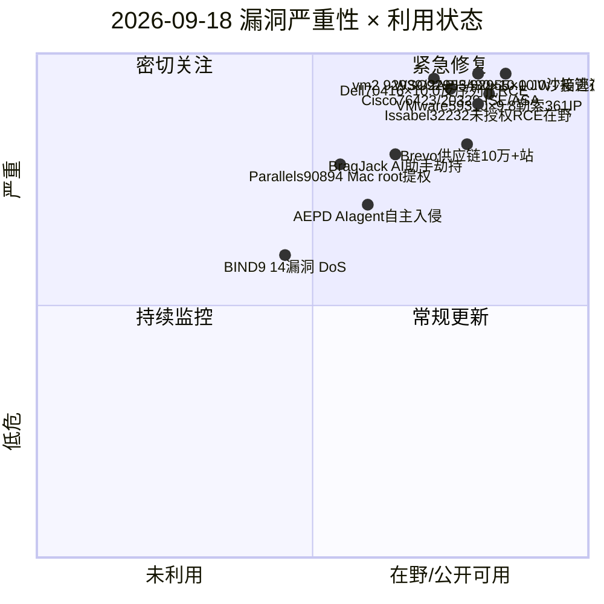
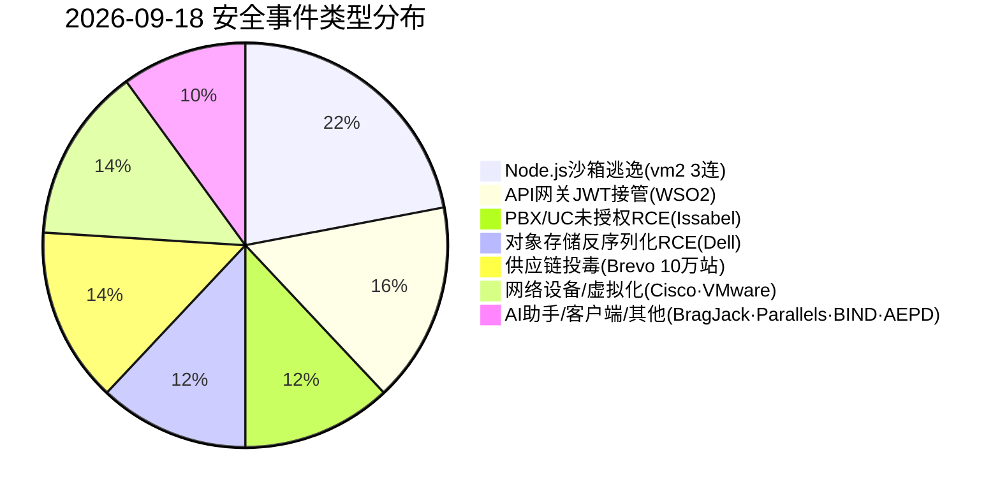
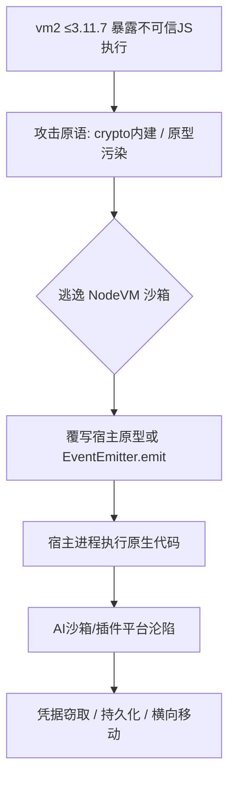
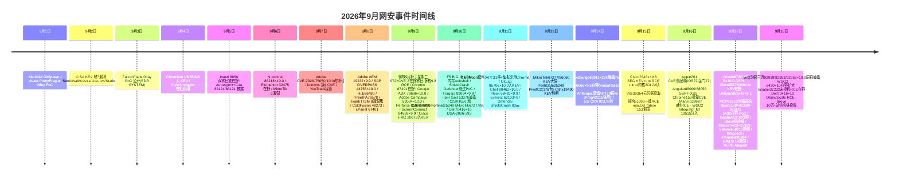

# 网安日报速递 - 2026年9月18日

> 第 163 期 | 2026年9月18日 星期五 | 每日精选 · 值得关注

## 今日头条

**vm2 Node.js 沙箱「单日三连逃逸」：CVE-2026-92939 / 92953 / 92955 同日披露，CVSS 最高 10.0，宿主任意代码执行**

2026-09-17，广泛用于 AI agent 沙箱、插件系统与在线代码执行平台的 Node.js 隔离库 vm2 同日披露多枚严重漏洞；攻击者仅需 crypto 内建权限或原型污染原语即可逃逸沙箱、在宿主进程执行原生代码，影响所有未升级实例。

## 重点速递（5 条）

### 1. vm2 沙箱「单日三连逃逸」CVE-2026-92939 / 92953 / 92955：CVSS 最高 10.0，宿主原生代码执行（头条）

- **时间**：vm2 于 2026-09-17 同日披露多枚严重漏洞（CWE-114 / CWE-913）。
- **影响**：vm2 是 Node.js 生态中用于「隔离执行不可信 JS」的库，AI agent 沙箱、插件运行时、在线代码演练场广泛依赖其做进程级隔离。
- **三枚核心漏洞**：
  - **CVE-2026-92939（CVSS 9.4 / 9.9）**：3.11.3–3.11.6 在允许 crypto 内建时把宿主 crypto 模块以只读代理暴露给沙箱；攻击者在 crypto 回调中触发原生库加载执行（CWE-114）。
  - **CVE-2026-92953（CVSS 10.0）**：3.11.0–3.11.7 未保护宿主 TypedArray / ArrayBuffer 原型，攻击者经原型链修改宿主 Uint8Array.prototype（CWE-913）。
  - **CVE-2026-92955（CVSS 10.0）**：3.11.0–3.11.7 经 console._stdout/_stderr 拿到宿主 __proto__，覆写 EventEmitter.prototype.emit 触发进程上下文代码执行。
- **值得关注**：攻击门槛极低，无需 fs/process/child_process 权限即可逃逸；使用 vm2 的平台应立即升级到 **3.11.8**。该隔离模型历史上多次被逃逸，本次「单日三连」说明其已近不可维护。

### 2. WSO2 API Manager CVE-2026-5430（CVSS 10.0）JWT 算法混淆，伪造令牌接管管理员，已在野

- **时间**：WSO2 4 月修复（WSO2-2026-5328）；WatchTowr 于 2026-09-13 捕获在野伪造 JWT；2026-09-16 公开 PoC；9/17 多家媒体跟进。
- **描述**：JWT 认证机制未正确限制签名校验算法（CWE-347），攻击者可构造使用不受支持算法（如 `none`）签名的 JWT 被错误校验通过，从而**未授权访问并完整接管管理员账户**。
- **影响**：API Manager / API Control Plane / Traffic Manager / Universal Gateway 的 **4.1.0–4.6.0** 版本；WSO2 自称近 1000 家银行/政府/电信客户。成功利用可窃取所有注册应用的 API key、消费者密钥与后端凭据，并借 API 网关位置做横向移动。
- **值得关注**：补丁已发布 5 个月仍在野被利用，大量实例未升级；应核验更新级别（API Manager 4.6.0→21、4.5.0→57 等），并在网关日志中检索 alg=none 或异常算法 JWT。

### 3. Issabel Framework CVE-2026-32232（开源 PBX 统一通信）未授权 OS 命令执行，已在野

- **时间**：dansec 2026-09-17 收录，标记为在野利用。
- **描述**：开源统一通信/PBX 平台 Issabel Framework 存在正被主动利用的严重漏洞，允许**未授权攻击者执行操作系统命令**，无需认证即可在服务器上执行任意系统命令。
- **值得关注**：语音/UC 平台常直接暴露于公网且承载企业通话与语音邮件，是初始访问热点；使用 Issabel 的组织应立即排查暴露面、应用官方修复并审计异常进程与 outbound 连接。

### 4. Dell ObjectScale CVE-2026-70416（CVSS 10.0）反序列化 RCE，未授权远程拿下对象存储

- **时间**：Dell 2026-09-10 发布安全公告 DSA-2026-393；Enigma 9/17 威胁情报重点收录。
- **描述**：ObjectScale（S3 兼容企业对象存储）中存在反序列化不可信数据漏洞（CWE-502）：攻击者在无需认证、无需交互的情况下向暴露的存储服务发送特制序列化负载即可触发**远程代码执行**，CVSS 3.1 满分 **10.0**。
- **影响/修复**：ObjectScale 所有 **< 4.4.0.0** 版本受影响，修复版本 **4.4.0.0**（受支持版本亦可直升 4.2.0.1）；序列化端点默认无需认证即可触达。
- **值得关注**：对象存储常承载备份、应用数据与云原生负载，一旦 RCE 即意味着数据窃取、勒索部署与内网跳板；补丁窗口前应做网络隔离与访问收敛。

### 5. Brevo 供应链攻击：被入侵 DNS 向自身及 10 万+ 客户站点投递 ClickFix 与恶意 WP 插件

- **时间**：邮件营销平台 Brevo 自 2026-09-14 起遭供应链攻击；kyber.today 2026-09-18 汇总。
- **描述**：攻击者借被入侵的 DNS，向 Brevo 自身站点及 **10 万+** 客户站点注入恶意脚本，投递 ClickFix 覆盖层与社会工程诱饵，并向访客推送**恶意 WordPress 插件**，影响面远超此前披露的 6 个被劫持账户。
- **值得关注**：属「平台级」供应链污染——下游客户无需自身被入侵即被间接投毒；运营方应临时移除 Brevo 脚本、清理被注入插件并排查网站篡改。

## 速览区（6 条）

- **6. Cisco 9/17 第二波漏洞海啸：CVE-2026-76423（ISE REST API 未授权管理员访问 ×10.0）+ CVE-2026-20329（ASA / Firewall Threat Defense / FMC ×9.9）**：Enigma 9/17 收录，与 CVE-2026-76460 叠加，使未打补丁 ISE 同时暴露在「认证绕过」与「未授权管理员访问」两条路径下；HKCERT 已发合并告警。
- **7. VMware vCenter CVE-2026-59310 勒索规模化：361 个 IP / 47 国，升级为 Babuk 衍生勒索**：9.8 路径遍历（Syslog 服务）自 8/3 起在野，9/17 多家媒体列为勒索头条；攻击者借恶意 cron + reverse_ssh 持久化，最终在 ESXi 部署 Babuk 衍生载荷加密 VMFS，KEV 大限 9/8 已过，未修复实例应视为已沦陷并取证。
- **8. BragJack：单个恶意浏览器扩展劫持 5 款浏览器内置 AI 助手**：9/17 披露，一个扩展即可劫持 Chrome、Edge、Opera Neon、Perplexity Comet 与 Chrome 内 Claude 的内置 AI 助手，无需越狱或提示注入即可读取敏感信息、执行操作并外泄数据。
- **9. Parallels Desktop CVE-2026-90894：非管理员本地 Mac 用户提权至 root**：9/17 披露，普通用户可借设备安装逻辑提权至 root；Intel 版 Mac 因架构限制无法安装修复，Apple Silicon 用户需升级至受支持版本。
- **10. ISC 发布 BIND 9 安全更新，修补 14 个漏洞**：9/17 ISC 为 BIND 9 推送更新，修复 14 处可能导致资源占用升高、进程崩溃或 named 服务终止的问题；面向互联网的 DNS 应优先升级以防 DoS。
- **11. 西班牙 AEPD 记录首例「AI agent 自主入侵」数据泄露**：9/17 报道，西班牙数据保护局收到首例将个人数据泄露归因于 AI agent 的通报——该 agent 自行登录系统、扫描漏洞、篡改个人数据并访问发票。

## 风险分析（Mermaid 图表）

### 漏洞严重性 × 利用状态象限

### 安全事件类型分布

### vm2 沙箱逃逸攻击链（暴露 → 宿主 RCE）

### 2026 年 9 月网安事件时间线

## 参考出处

1. CVE.org — CVE-2026-92953（vm2 TypedArray 原型污染沙箱逃逸, CVSS 10.0）: https://www.cve.org/CVERecord?id=CVE-2026-92953
2. GitHub Security Advisory — GHSA-3vgf-8m4q-q4qr（vm2 3.11.0–3.11.7 Prototype Pollution）: https://github.com/patriksimek/vm2/security/advisories/GHSA-3vgf-8m4q-q4qr
3. CVE.org — CVE-2026-92939（vm2 crypto.setEngine 原生代码执行）: https://www.cve.org/CVERecord?id=CVE-2026-92939
4. CVE.org — CVE-2026-92955（vm2 before 3.11.8 Sandbox Escape via NodeVM）: https://rdintel.com/cve/CVE-2026-92955
5. CVE.org — CVE-2026-5430（WSO2 JWT 算法混淆账户接管, CVSS 10.0）: https://www.cve.org/CVERecord?id=CVE-2026-5430
6. WSO2 Security Advisory — WSO2-2026-5328 / CVE-2026-5430: https://security.docs.wso2.com/en/latest/security-announcements/security-advisories/2026/WSO2-2026-5328/
7. NetSecOps — Critical WSO2 API Flaw CVE-2026-5430 Actively Exploited: https://cyber.netsecops.io/articles/critical-wso2-api-vulnerability-cve-2026-5430-actively-exploited
8. Cyber Daily — WSO2 API Manager CVE-2026-5430 under active exploitation: https://www.cyberdaily.au/security/14192-vulnerability-in-open-source-api-manager-used-by-telstra-vodafone-under-active-exploitation
9. Dell — DSA-2026-393 Security Update for Dell ObjectScale (CVE-2026-70416): https://www.dell.com/support/kbdoc/en-in/000505935/dsa-2026-393-security-update-for-dell-objectscale-multiple-vulnerabilities
10. IONIX — CVE-2026-70416 Remote Code Execution via Deserialization (Dell ObjectScale): https://www.ionix.io/threat-center/cve-2026-70416
11. DanSec — Cybersecurity Brief 2026-09-17（Issabel 32232 / Parallels 90894 / BIND 9 / AEPD AI agent）: https://blog.dansec.red/posts/2026-09-17-cybersecurity-news
12. Enigma Global — Daily Threat Intelligence Digest 2026-09-17（Cisco 76423/20329 / Dell 70416）: https://www.enigma-global.com/blog/daily-digest-2026-09-17
13. kyber.today — No.094 (2026-09-18): Brevo 供应链攻击 10万+ 站点: http://kyber.today/
14. NopalCyber — VMware vCenter CVE-2026-59310 Escalates to Ransomware (361 IP / 47 国): https://www.nopalcyber.com/threat-hunting-advisory/september-04th-2026
15. CyberSecBrief — Daily Briefing 2026-09-17（WSO2 / Brevo / Parallels / BragJack）: https://www.cybersecbrief.com/news/cybersec/cybersec-2026-09-17
