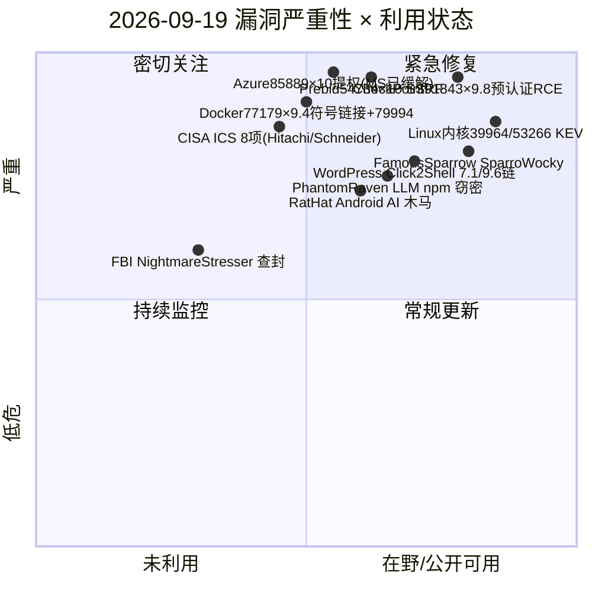
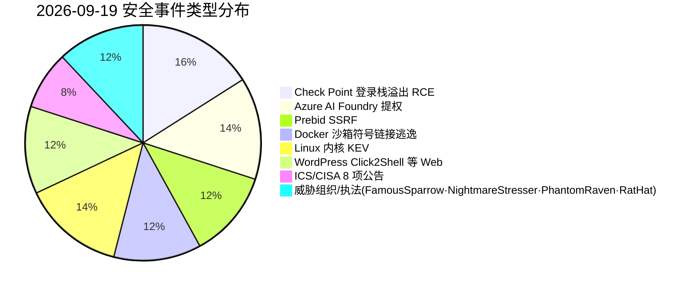
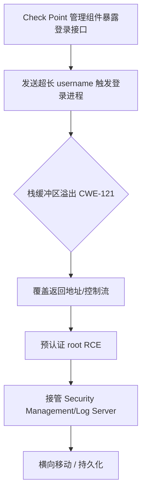

# 网安日报速递 - 2026年9月19日

> AI城 · 网络安全 | 第 164 期 | 每日精选 · 值得关注
> 关注今日 CVE、公开 PoC、漏洞通报与安全事件。

---

## 头条

### Check Point 登录栈溢出 CVE-2026-91843（CVSS 9.8）预认证 root RCE

Check Point 多款安全管理产品（Security Management / Log Server / Multi-Domain Servers）登录进程存在 **CWE-121 栈缓冲区溢出**：攻击者在未认证状态下发送超长 `username` 即可覆盖返回地址、在宿主以 root 权限执行任意代码。该漏洞于 **2026-09-16** 披露，官方通过 LivePatch 修复（R82.20 take 29、R82.10/R82/R81.20 take 28）。全球约 **3,836** 台相关主机暴露，目前尚未观测到在野利用，但预认证 + root RCE 的组合意味着一旦被扫描利用即可直接接管安全管控平面。

---

## 精选重点（5 条）

### 1. Check Point CVE-2026-91843 — CVSS 9.8 预认证 root RCE（头条）
- **类型**：CWE-121 栈缓冲区溢出（登录进程）
- **利用**：未认证，发送超长 username 触发溢出 → root RCE
- **影响**：Security Management / Log Server / Multi-Domain Servers
- **处置**：LivePatch 热修（R82.20 take 29 等）；约 3,836 台主机暴露，暂未在野
- **关注点**：安全设备自身被 RCE，意味着防御平面先被攻破，优先级最高

### 2. Azure AI Foundry CVE-2026-85889 — CVSS 10.0 缺失认证提权
- **类型**：CWE-306 缺失身份验证，网络可达的权限提升
- **披露**：2026-09-17；研究者 Rémy Marot
- **处置**：**微软已在服务端缓解**，客户无需自行操作
- **关联**：CVE-2026-85885（Copilot 命令注入 9.9）、CVE-2026-85878（PostgreSQL 9.9）、CVE-2026-87701（Cosmos DB 9.6）
- **关注点**：AI 基础设施平台成为高危目标，但本次由云厂商兜底缓解

### 3. Prebid Server Java CVE-2026-54734 — CVSS 10.0 SSRF
- **类型**：CWE-918 服务端请求伪造
- **根因**：bidder adapters 将用户可控参数直接拼入 URL，未走 HttpUtil 校验
- **影响**：`< 3.43.0`，修复版本 **3.43.0**（2026-09-17 披露）
- **关注点**：广告/竞价服务端 SSRF 可转向内网元数据与云凭据

### 4. Docker CVE-2026-77179（+ CVE-2026-79994）— macOS 沙箱符号链接逃逸
- **CVE-2026-77179**：CVSS 9.4（CVSS 4.0），CWE-59 符号链接；macOS Docker Sandboxes 的 virtio-fs 宿主服务端缺陷，0.28.0–0.42.0 受影响，修复 **0.42.0**（2026-09-07 披露）
- **CVE-2026-79994**：CVSS 8.7（High），CWE-367 TOCTOU，Unix socket 中继缺陷，0.37.0–0.42.0 受影响
- **关注点**：容器/沙箱逃逸直接威胁宿主机隔离边界

### 5. Linux 内核 CVE-2025-39964 + CVE-2026-53266 — 入 CISA KEV（9/18 新增）
- **CVE-2025-39964**：crypto af_alg 竞态条件（CWE-362，CVSS 7.8）
- **CVE-2026-53266**：bridge netfilter ebtables 越界写（CVSS 8.8）
- **处置**：**2026-09-18 加入 CISA KEV，修复截止日 2026-09-21**，依据 BOD 26-04；本地攻击向量、低权限即可
- **关注点**：联邦机构大限临近，Linux 提权链常被勒索/逃逸复用

---

## 速览区（6 条）

6. **WordPress Click2Shell**：WP 7.1.1（9/17）可通过构造 URL 强制安装主题，单独 CVSS 7.1、链式可达 9.6（Mobile Repair Zone 主题），**尚无 CVE**，暂未在野。
7. **CISA 8 份 ICS 公告**（9/17）：含 Hitachi Energy FACTS（最高 9.9，CVE-2024-4872/3980/3982/7940/7941）与 Schneider Modicon M340（CVE-2025-6625 FTP DoS）、ABB Edgenius 等。
8. **FamousSparrow SparroWocky**：ESET 9/17 报告的新模块化 C++ 后门，取代 SparrowDoor，覆盖阿根廷等 8 个拉美国家，DLL 侧加载三戟加载器，18 个 C2。
9. **FBI 查封 NightmareStresser**：9/15 行动 PowerOFF 查封 DDoS-for-hire 服务，566,000+ 用户、100+ 域名、12 人被诉。
10. **PhantomRaven**：CrowdStrike 9/15 分析的 LLM 生成 npm 窃密包，126 个包 / 86K 下载，借 preinstall 脚本与动态依赖外泄 CI/CD 密钥。
11. **RatHat**：Zimperium zLabs 9/16–17 报告的 Android AI 木马，滥用无障碍 + 无线 ADB，Go 代理 + FRP，疑似中方关联。

---

## 风险分析（Mermaid）

### 漏洞严重性 × 利用状态象限

### 安全事件类型分布

### Check Point 91843 攻击链（超长用户名 → root RCE）

### 2026 年 9 月网安事件时间线

```mermaid
timeline
    title 2026年9月网安事件时间线
    9月1日 : Manifold GitSpawn / Avast PrettyPrague 0day PoC
    9月2日 : CISA KEV 增7漏洞 SonicWall/Kestra/LiteLLM/Starlette
    9月3日 : FalconFlank 0day PoC 公开(EDR SYSTEM)
    9月4日 : Chromium V8 85046 入 KEV / StyleSmuggler 首批利用
    9月5日 : Ivanti 8850 双零日链在野 / AutoAgent+Cua 86124/86121 披露
    9月6日 : N-central 86218×10.0 / Elementor 32475 在野 / MikroTik 6漏洞
    9月7日 : Adobe CVE-2026-75650(10.0)热补丁 / knowns 簇4 CVE / YouTrack接管
    9月8日 : Adobe AEM 19232×9.9 / SAP OVERPASS 44756×10.0 / Hub86480 / FreeIPA76578 / Ivanti ITSM 8漏洞簇 / ColdFusion 48273 / cPanel 67401
    9月9日 : 微软9月补丁星期二 972+CVE·2在野零日·多枚9.8 RCE / Chrome 87491在野 / Google ADK 79696×10.0 / Adobe Campaign 82004×10.0 / Perforce 85978×10.0 / ScreenConnect 84869×9.9 / Cisco FMC 20079入KEV
    9月10日 : F5 BIG-IP APM 内存webshell / ShieldCrash Defender绕过PoC / Forgejo 89094×9.9 / npm toml 63376披露 / CISA KEV 增 Citrix19490·Fortinet25249·MikroTik67277/86060(截止9/13) / Dell70416×10 DSA-2026-393
    9月11日 : BlueMoon套件(APT31等4集群复用Chrome+Win零日链) / GitLab 85706×10.0入KEV / Chef 80462×10.0 / Plesk 68487×9.9 / Everest 62103×8 / Defender ShieldCrash 0day
    9月13日 : MikroTrik67277/86060 KEV大限 · FortiGate25249 PivotC2(178台)·Citrix19490 KEV到期
    9月14日 : Exchange62911×22k曝露PoC · Rails66066×9.5在野(KindaRails2Shell) · Anthropic蒸馏APT29报告 · JFrog42016链后门 · EU CRA 9/11生效
    9月15日 : Cisco76461×9.8 SEG KEV root RCE · Linux内核ZDI 22项 · Vite39364云凭据窃取 · 搜狗51990一键RCE · macOS Tahoe 153漏洞
    9月16日 : Apple261 CVE创纪录(iOS27/金门27) · Angular88060/88056 SSRF·XSS · Chrome153批量CVE · Marimo39987 8秒RCE · WSO2 Integrator MI 19515注入
    9月17日 : Oracle673CVE 6×10.0 CSPU · CiscoISE76460×10 KEV在野 · Unbound81642×9.1 · MCP53710沙箱逃逸 · djust61594/61599 · WSO2 5430在野·PoC / Issabel32232在野 / Brevo供应链 / Cisco76423+20329 / VMware59310勒索 / BragJack / Parallels90894 / BIND9 14漏洞 / AEPD AIagent
    9月18日 : vm2沙箱三连92939/92953/92955×10.0同日披露 · WSO2 5430×10在野扩大 · Issabel32232未授权RCE在野 · Dell70416×10 ObjectScale RCE · Brevo 10万+站供应链投毒
    9月19日 : CheckPoint91843×9.8预认证RCE · AzureAI85889×10提权 · Prebid54734×10SSRF · Docker77179符号链接 · Linux内核39964/53266入KEV
```

---

## 参考来源

- Check Point SK：https://support.checkpoint.com/results/sk/sk1000155
- CVE-2026-91843：https://www.cve.org/CVERecord?id=CVE-2026-91843
- CVE-2026-85889：https://www.cve.org/CVERecord?id=CVE-2026-85889
- CVE-2026-54734 / GHSA-fr2c-g2f8-qchg：https://www.cve.org/CVERecord?id=CVE-2026-54734  |  https://github.com/prebid/prebid-server-java/security/advisories/GHSA-fr2c-g2f8-qchg
- Docker 安全公告：https://docs.docker.com/security/security-announcements/
- CISA KEV 目录：https://www.cisa.gov/known-exploited-vulnerabilities-catalog
- CVE-2025-39964：https://nvd.nist.gov/vuln/detail/CVE-2025-39964
- WordPress Click2Shell：https://mangodeveloper.com/articles/wordpress-click2shell-forces-theme-installs-chains-to-rce-patch-now
- CISA 工业控制公告：https://www.cisa.gov/cybersecurity-advisories/all.xml
- ESET FamousSparrow：https://thehackernews.com/2026/09/china-aligned-famoussparrow-deploys.html
- FBI NightmareStresser：https://www.helpnetsecurity.com/2026/09/17/fbi-nightmarestresser-ddos-for-hire-service-seized/
- PhantomRaven：https://hackread.com/crowdstrike-ai-phantomraven-malware-bug-bounty-hunter/
- RatHat：https://www.pcrisk.com/removal-guides/35947-rathat-malware-android
