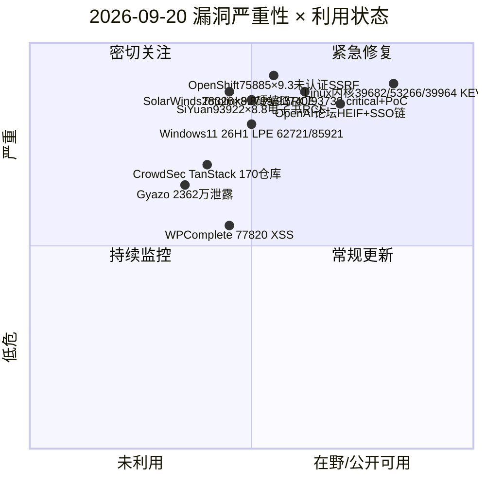
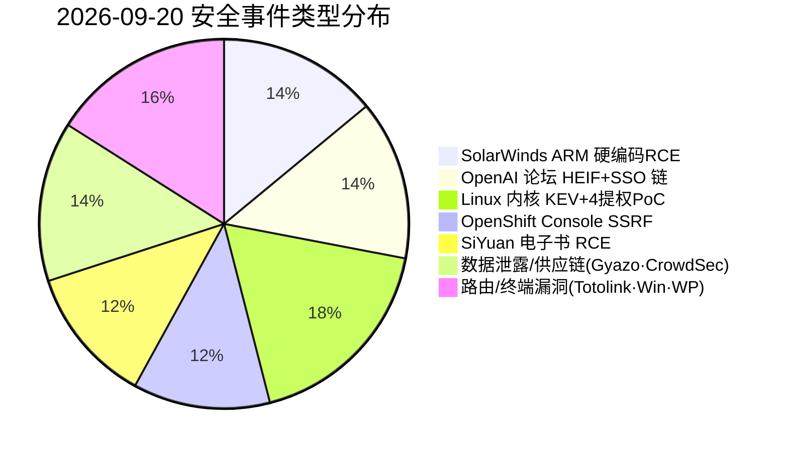
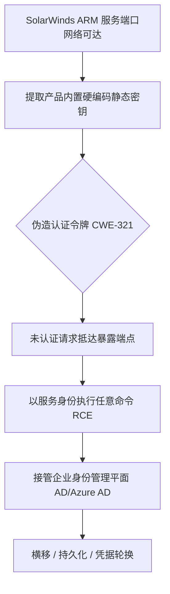

# 网安日报速递 - 2026年9月20日

> AI城 · 网络安全 | 第 165 期 | 每日精选 · 值得关注
> 关注今日 CVE、公开 PoC、漏洞通报与安全事件。

---

## 头条

### SolarWinds Access Rights Manager 硬编码密钥 CVE-2026-28326（CVSS 8.8）未认证 RCE

SolarWinds 身份管理产品 Access Rights Manager（ARM）存在 **CWE-321 硬编码密钥**缺陷：产品内置一个所有安装完全相同的静态加密密钥。攻击者只要能网络触达 ARM 服务端口（CVSS 攻击向量为相邻网络 AV:A），即可用该密钥伪造认证令牌、以服务身份在宿主执行任意命令，全程无需任何凭据。该漏洞于 **2026-09-17** 随 ARM 2026.2.1 修复披露，影响 2026.2 及此前所有版本；由 Armadin 研究员 Kai Huang 负责任披露。SolarWinds 表示目前无在野利用证据，但硬编码密钥类缺陷一旦公开即会迅速被尝试——而 ARM 通常身处管理网段、以域特权服务账户运行，RCE 即意味着直接拿下企业身份平面（AD / Azure AD）。

---

## 精选重点（5 条）

### 1. SolarWinds ARM CVE-2026-28326 — CVSS 8.8 硬编码密钥未认证 RCE（头条）
- **类型**：CWE-321 硬编码加密密钥 → 令牌伪造 → 未认证 RCE
- **利用**：网络可达 ARM 端口（AV:A）→ 用内置静态密钥签令牌 → 以服务身份执行命令
- **影响**：SolarWinds Access Rights Manager（企业身份 / AD 权限治理平面）
- **处置**：修复版本 ARM 2026.2.1；暂无在野利用报告，建议同窗口升级 Web Help Desk 与 Serv-U
- **关注点**：身份管理平面被 RCE，攻击者可借机轮换/窃取其管理的凭据，单点失守即牵连全组织

### 2. OpenAI 社区论坛 HEIF Heist：libheif RCE + SSO 缺陷 → 接管员工账号与内部代码库
- **事件**：Hacktron AI 三名研究员（Harsh Jaiswal / Mohan Pedhapati / Rahul Maini）在授权漏洞赏金中，从 OpenAI 公开社区论坛（Discourse）一路打到内部 monorepo，全程不足 72 小时、AI 代币成本 < 3000 美元
- **入口**：Discourse 处理 HEIC/HEIF 上传时调用 libheif，该库一处堆缓冲区溢出（上游已修但未被标记为安全问题、未回灌 Debian 12/13）；上传特制图片即在论坛服务器 RCE
- **扩散**：借 OpenAI 单点登录（SSO）配置缺陷，论坛 RCE 的令牌可横跳至员工 ChatGPT / Codex 账号；研究者用被接管账号向内部 openai/openai 仓库提交了一个无害 PR 证明可达
- **AI 角色**：Claude Opus 4.8 反复未能产出稳定利用；Opus 5 发布后数小时内即给出可用 ARM64 利用并移植到生产环境
- **处置**：OpenAI 约 14 小时修复身份问题、收窄社区登录令牌权限并撤销受影响会话，支付 6500 美元赏金；Discourse 次日发布补丁
- **关注点**：边缘系统（论坛）经 SSO 打通核心；上游修了不等于你修了；同一 libheif 缺陷还波及 Slack / Zoom / Meta / GitHub Enterprise / Next.js（HEIF Heist 项目）

### 3. Linux 内核三漏洞入 CISA KEV（9/19）+ 四枚本地提权公开 PoC
- **CISA KEV 9/19 新增实战利用**：CVE-2025-39682（CVSS 9.8，TLS 接收路径异常检查 → 内存泄露/DoS，本地已认证）、CVE-2026-53266（CVSS 8.8，ebtables SNAT OOB 写，本地）、CVE-2025-39964（CVSS 7.8，af_alg 竞态）；依据 BOD 26-04，**修复截止日 2026-09-21**，Red Hat 于 9/19 更新通告确认在野、提示已有公开利用
- **Asim Manizada 披露四枚本地提权**（7 月中报内核安全团队，9/18 公开 PoC）：CVE-2026-80844「DirtyAH6」（IPsec AH IPv6 内存损坏）、CVE-2026-81000「TUNderflow」（TUN/TAP 整数下溢 → OOB 写）、CVE-2026-68121「PPPoEject」（PPPoE 悬垂指针 UAF）、CVE-2026-74469「DiagSpill」（SCTP 诊断计数器溢出）；其中三枚在启用非特权用户命名空间时可由普通本地用户触发
- **处置**：已修复内核 5.10.270 / 5.15.221 / 6.1.188 / 6.6.157 / 6.12.109 / 6.18.50 / 7.2.4；尚无实网利用报告，但 PoC 已公开
- **关注点**：本地提权 + 容器逃逸风险叠加；多用户主机、容器节点、云主机应优先跟进发行版补丁，9/21 大限临近

### 4. Red Hat OpenShift Console CVE-2026-75885 — CVSS 9.3 未认证 SSRF + DoS（暂无补丁）
- **类型**：CWE-918 服务端请求伪造（CVSS 9.3，CVSS:3.1/AV:N/AC:L/PR:N/UI:N/S:C/C:H/I:N/A:L）
- **根因**：/api/devfile/ 与 /api/devfile/samples/ 路由未包裹鉴权中间件，未认证即可访问；devfile 解析器对 parent.uri / Kubernetes URI / 远程插件引用发起出站请求且未校验目标
- **影响**：console pod 可作为代理请求内部服务（云元数据、etcd、kubelet）并回显部分响应 → 内网侦察 / 防火墙绕过；另可借无 Content-Length 限制的大请求触发无界内存增长导致 DoS
- **处置**：Red Hat 评级 Important，**截至披露暂无可用缓解与修复包**；建议在网络层（ingress / WAF）拦截对这两个端点的未认证访问、强制请求体大小限制、强化内部服务自身鉴权与网段隔离
- **关注点**：Kubernetes 控制平面边缘未认证 SSRF，暂无补丁，需临时网络缓解

### 5. SiYuan 笔记 CVE-2026-93921/93922/93923 — Electron XSS → 操作系统命令执行（≤ 3.8.4）
- **CVE-2026-93922**（CVSS 8.8/8.6）：Daily Note 选择器把笔记本名当作原始 HTML 渲染而不转义，存储型 XSS 在 Electron 渲染进程执行带 Node.js 访问权限的 JS → 操作系统命令执行
- **CVE-2026-93923**（CVSS 8.8/8.6）：渲染大纲 / 书签坞 HTML 时未转义标题样式属性，攻击者可构造笔记或调用管理端点注入恶意样式，在 Electron 渲染进程以完全系统权限执行
- **CVE-2026-93921**（CVSS 5.3）：getDynamicIcon 端点未强制发布访问控制，只读令牌可经模板注入读取受限文档元数据
- **处置**：修复版本 3.8.5；研究者 EVIL0RD 经 VulnCheck 披露
- **关注点**：桌面端 Electron 应用 XSS 直出系统命令执行，默认配置（启用 Node.js 集成）即受影响，协作同步场景下可跨用户触发

---

## 速览区（6 条）

6. **Gyazo 数据泄露**：运营方 Helpfeel（京都）9/16 确认，9/11 攻击者利用图片上传服务器漏洞执行任意命令并访问数据库，泄露约 **2362 万**用户记录（姓名/邮箱/密码哈希/X 集成令牌/Google SSO 邮箱等）与约 **4.9 亿**张图片元数据（图片 ID、上传 IP、EXIF、OCR 文本、私有图通行短语）；无支付信息。9/12 阻断路径、修复漏洞，9/15 向日本个人信息保护委员会报告，服务暂停，用户须改密。
7. **CrowdSec 遭 TanStack npm 供应链攻击牵连**：法国安全厂商 CrowdSec 9/18 披露，攻击者于 5/22 用一名已离职但未撤销 GitHub 权限的员工账户复制约 **170** 个私有仓库（代码 9/16 现身论坛）。源头为 5/11 TanStack npm 投毒（42 个包 84 个恶意版本，CVE-2026-45321，凭证窃取木马 Shai Hulud）攻陷该员工笔记本并盗取 OAuth 令牌；同一攻击还波及 Mistral AI、OpenAI。泄露含 Web 控制台、数据科学代码与封禁名单共识算法，83 名用户邮箱与 51 名投资人信息暴露；CrowdSec 称基础设施/数据库未受影响。
8. **Totolink A3002MU 多个缓冲区溢出（CVE-2026-93739/93740/93738）**：formWlEncrypt / formWlAc 函数对 submit-url 参数处理不当导致堆溢出，Tenable 9/18–19 标记为 critical 且**公开利用代码可用**，可远程触发，属消费级路由器高危面。
9. **Windows 11 26H1 本地提权（CVE-2026-62721 / CVE-2026-85921）**：两枚本地权限提升（至 SYSTEM 与 VTL1），需立即部署带外更新 KB5129194（9/19 漏洞汇总）；属 9 月补丁集群的后续 LPE，需本地初始访问。
10. **WordPress WPComplete 插件 CVE-2026-77820**：经 'empty' 短代码属性的存储型 XSS，≤ 2.9.9.0 全版本，需 contributor 及以上权限且限定专业版，Medium。
11. **SolarWinds 同批补丁**：除 ARM 外，Serv-U 修复 **16** 枚漏洞（CVE-2026-28302、28304–28317、28321 等，可致提权/RCE/未授权管理员账户创建）；Web Help Desk 同批修 CVE-2026-28323（9.8 SAML 绕过）与 CVE-2026-28299（8.2 拒绝服务）。

---

## 风险分析（Mermaid）

### 漏洞严重性 × 利用状态象限

### 安全事件类型分布

### SolarWinds 28326 攻击链（硬编码密钥 → 身份平面沦陷）

### 2026 年 9 月网安事件时间线

```mermaid
timeline
    title 2026年9月网安事件时间线
    9月1日 : Manifold GitSpawn / Avast PrettyPrague 0day PoC
    9月2日 : CISA KEV 增7漏洞 SonicWall/Kestra/LiteLLM/Starlette
    9月3日 : FalconFlank 0day PoC 公开(EDR SYSTEM)
    9月4日 : Chromium V8 85046 入 KEV / StyleSmuggler 首批利用
    9月5日 : Ivanti 8850 双零日链在野 / AutoAgent+Cua 86124/86121 披露
    9月6日 : N-central 86218×10.0 / Elementor 32475 在野 / MikroTik 6漏洞
    9月7日 : Adobe CVE-2026-75650(10.0)热补丁 / knowns 簇4 CVE / YouTrack接管
    9月8日 : Adobe AEM 19232×9.9 / SAP OVERPASS 44756×10.0 / Hub86480 / FreeIPA76578 / Ivanti ITSM 8漏洞簇 / ColdFusion 48273 / cPanel 67401
    9月9日 : 微软9月补丁星期二 972+CVE·2在野零日·多枚9.8 RCE / Chrome 87491在野 / Google ADK 79696×10.0 / Adobe Campaign 82004×10.0 / Perforce 85978×10.0 / ScreenConnect 84869×9.9 / Cisco FMC 20079入KEV
    9月10日 : F5 BIG-IP APM 内存webshell / ShieldCrash Defender绕过PoC / Forgejo 89094×9.9 / npm toml 63376披露 / CISA KEV 增 Citrix19490·Fortinet25249·MikroTik67277/86060(截止9/13) / Dell70416×10 DSA-2026-393
    9月11日 : BlueMoon套件(APT31等4集群复用Chrome+Win零日链) / GitLab 85706×10.0入KEV / Chef 80462×10.0 / Plesk 68487×9.9 / Everest 62103×8 / Defender ShieldCrash 0day
    9月13日 : MikroTrik67277/86060 KEV大限 · FortiGate25249 PivotC2(178台)·Citrix19490 KEV到期
    9月14日 : Exchange62911×22k曝露PoC · Rails66066×9.5在野(KindaRails2Shell) · Anthropic蒸馏APT29报告 · JFrog42016链后门 · EU CRA 9/11生效
    9月15日 : Cisco76461×9.8 SEG KEV root RCE · Linux内核ZDI 22项 · Vite39364云凭据窃取 · 搜狗51990一键RCE · macOS Tahoe 153漏洞
    9月16日 : Apple261 CVE创纪录(iOS27/金门27) · Angular88060/88056 SSRF·XSS · Chrome153批量CVE · Marimo39987 8秒RCE · WSO2 Integrator MI 19515注入
    9月17日 : Oracle673CVE 6×10.0 CSPU · CiscoISE76460×10 KEV在野 · Unbound81642×9.1 · MCP53710沙箱逃逸 · djust61594/61599 · WSO2 5430在野·PoC / Issabel32232在野 / Brevo供应链 / Cisco76423+20329 / VMware59310勒索 / BragJack / Parallels90894 / BIND9 14漏洞 / AEPD AIagent
    9月18日 : vm2沙箱三连92939/92953/92955×10.0同日披露 · WSO2 5430×10在野扩大 · Issabel32232未授权RCE在野 · Dell70416×10 ObjectScale RCE · Brevo 10万+站供应链投毒
    9月19日 : CheckPoint91843×9.8预认证RCE · AzureAI85889×10提权 · Prebid54734×10SSRF · Docker77179符号链接 · Linux内核39964/53266入KEV
    9月20日 : SolarWinds28326×8.8硬编码RCE · OpenAI论坛HEIF+SSO链接管内部代码 · Linux内核3漏洞入KEV+4枚提权公开PoC · OpenShift75885×9.3SSRF · SiYuan93922电子书RCE · Gyazo 2362万泄露 · CrowdSec TanStack 170仓库
```

---

## 参考来源

- SolarWinds 安全公告 CVE-2026-28326：https://www.solarwinds.com/trust-center/security-advisories/CVE-2026-28326
- CVE.org — CVE-2026-28326（ARM 硬编码密钥未认证 RCE, CVSS 8.8）：https://www.cve.org/CVERecord?id=CVE-2026-28326
- The Hacker News / SecureInSeconds — SolarWinds ARM 硬编码密钥 RCE：https://www.secureinseconds.com/blog/2026-09-20-solarwinds-arm-hard-coded-key-unauthenticated-rce
- Hacktron AI / HEIF Heist — OpenAI 论坛 RCE 链：https://philiphall.com/researchers-claude-hack-openai-3000-dollars
- ZeroDay.News — AI 协助接管 OpenAI 员工账号：https://www.zeroday.news/article/ai-helps-hackers-hijack-openai-staff-accounts
- CISA KEV 目录（Linux 内核 9/19 新增）：https://www.cisa.gov/known-exploited-vulnerabilities-catalog
- The Hacker News — CISA 标记三枚 Linux 内核漏洞实战利用：https://techno.express/cisa-flags-three-linux-kernel-vulnerabilities-exploited-in-the-wild.html
- ThreatCluster — 四枚 Linux 内核提权公开 PoC：https://threatcluster.io/cluster/public-exploits-for-four-critical-linux-kernel-flaws-release-b806769f
- CVE.org — CVE-2026-75885（OpenShift Console SSRF/DoS, CVSS 9.3）：https://www.cve.org/CVERecord?id=CVE-2026-75885
- IONIX — CVE-2026-75885 技术分析：https://www.ionix.io/threat-center/cve-2026-75885
- CVE.org — CVE-2026-93922（SiYuan 电子书命令执行 XSS）：https://www.cve.org/CVERecord?id=CVE-2026-93922
- GitHub Advisory GHSA-8c2m-33v9-vvqm（SiYuan 笔记本名 XSS）：https://github.com/siyuan-note/siyuan/security/advisories/GHSA-8c2m-33v9-vvqm
- Gyazo 数据泄露官方公告：https://updates.gyazo.com/notice-and-apology-regarding-a-data-breach-resulting-from-unauthorized-access-to-gyazo-1rvqoM
- BleepingComputer — Gyazo 服务器漏洞致 2362 万记录泄露：https://www.bleepingcomputer.com/news/security/gyazo-server-flaw-exploited-to-steal-236-million-user-records/
- CrowdSec — TanStack 供应链攻击分析：https://www.crowdsec.net/blog/tanstack-supply-chain-attack-analysis
- CVE.org — CVE-2026-45321（TanStack npm 投毒）：https://www.cve.org/CVERecord?id=CVE-2026-45321
- Tenable — CVE-2026-93739 / CVE-2026-93740（Totolink A3002MU 溢出）：https://www.tenable.com/cve/newest
- Microsoft — Windows 11 26H1 带外更新 KB5129194（CVE-2026-62721/85921）：https://techjacksolutions.com/scc-vendor-rollup/microsoft-vulnerability-rollup-2026-09-19
