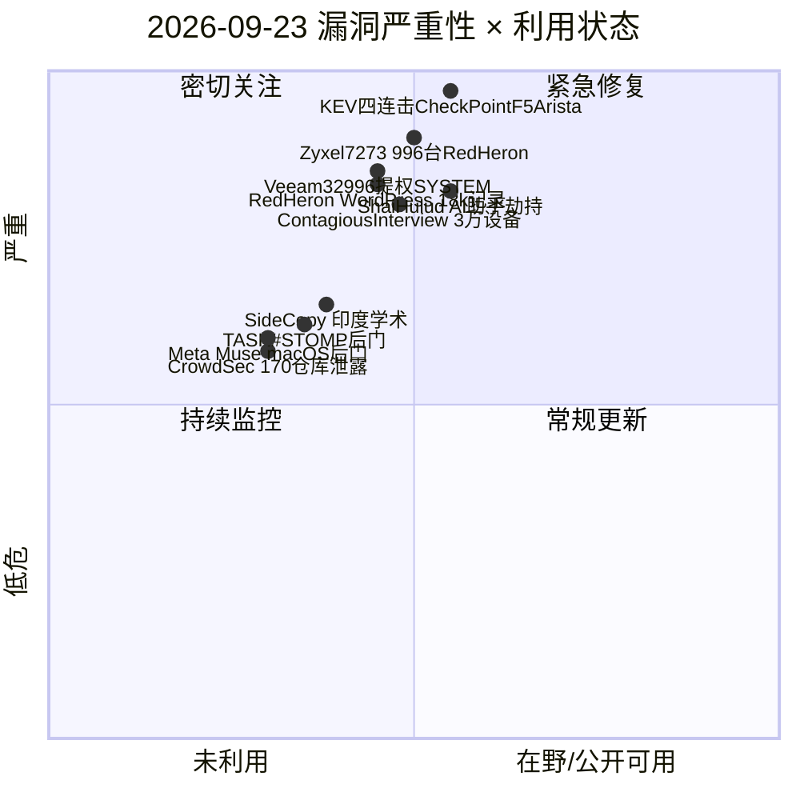
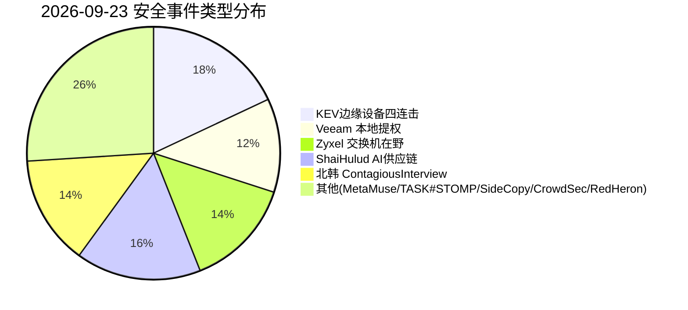
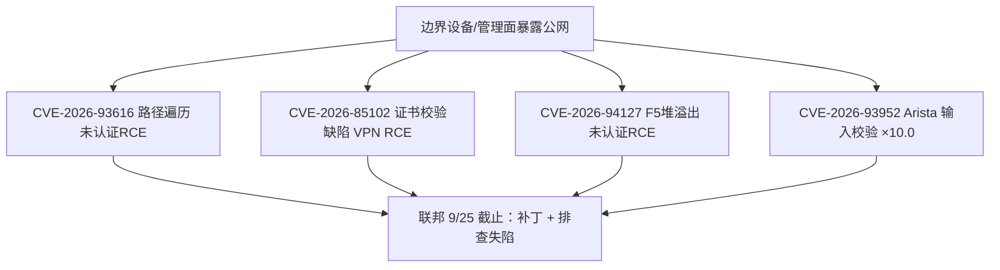

# 网安日报速递 · 2026年9月23日（第 167 期）

> 今日关键词：KEV四连击CheckPoint+F5+Arista·Veeam32996 PoC提权SYSTEM·Zyxel 7273 996台·ShaiHulud助手劫持·Contagious3万设备

## 头条
### CISA KEV 四连击（9/22）：Check Point ×2 + F5 BIG-IP APM + Arista VeloCloud，边界设备与管理面在野（CVSS 9.8×3 / 10.0×1）

2026-09-22 CISA 一次将 4 枚已确认在野的漏洞加入 KEV（目录升至 1,721），且全部落在网络边界 / 管理平面：Check Point 两枚（证书校验缺陷 VPN RCE 与安全管理路径遍历零日）、F5 BIG-IP APM 堆溢出未认证 RCE、Arista VeloCloud Orchestrator 输入校验 ×10.0。联邦修复截止 9/25，运行上述产品的组织需立即升级并先做失陷排查。

## 重点动态（5 条）

### 1. CISA KEV 四连击（9/22）：Check Point ×2 + F5 BIG-IP APM + Arista VeloCloud，边缘设备与管理面在野（头条）

* CISA KEV 2026-09-22 新增 4 项 · 联邦 9/25 截止 | CVSS 9.8×3 / 10.0×1 · 在野 · 边界/管理面

CISA 于 **2026-09-22** 一次性将 **4 枚**已确认在野的漏洞加入 KEV 目录（catalog 升至 1,721 条），且全部落在网络边界设备与管理平面：Check Point 两枚 `CVE-2026-85102`（证书校验缺陷，VPN 网关未认证 RCE，CVSS 9.8）与 `CVE-2026-93616`（安全管理服务器路径遍历，未认证上传并执行脚本，CVSS 9.8，被厂商确认为零日在野）、F5 BIG-IP APM `CVE-2026-94127`（堆溢出，未认证 RCE，CVSS 9.8）、Arista VeloCloud Orchestrator `CVE-2026-93952`（输入校验缺陷，CVSS 10.0）。

四者均影响暴露面极广的网关、VPN、负载均衡与 SD-WAN 集中管理平台，攻击者无需认证即可拿到设备 / 域的控制权。Check Point Research 同日发布紧急通告，确认网关 VPN 证书处理与安全管理预认证路径遍历均已被实际利用；联邦机构修复截止日为 **9/25**。

**值得关注：**这是继 9 月 Cisco ISE（CVE-2026-76460×10.0）、Cisco SEG（CVE-2026-76461×9.8）之后，边界 / 管理面设备又一次集中“在野”浪潮；运行上述产品的组织应立即升级并排查是否已被入侵（BOD 26-04 要求先做取证 triage 再补丁）。

### 2. Veeam Agent for Windows CVE-2026-32996：本地提权至 SYSTEM，公开 PoC 拉高在野风险

* Arctic Wolf / SecurityAffairs 2026-09-14 PoC · 影响 v13.0.1.2067 及更早 | 本地提权 · 低权用户 → NT AUTHORITY\SYSTEM

Veeam Agent for Microsoft Windows 存在本地提权漏洞 `CVE-2026-32996`（CVSS 7.3）：其 Endpoint Backup 服务通过本地 gRPC 命名管道 `\.\pipe\Veeam\VAW\ServiceConnectionPipe` 处理高权限会话时，把管理员身份缓存到一个**客户端可控、却未与用户身份绑定的 session UID** 上。

更糟的是，这些高权限 session UID 被写入 `C:\ProgramData\Veeam\Endpoint\Svc.VeeamEndpointBackup.log`，而该日志任意标准用户可读。攻击者在多用户主机上只需读取日志、复用有效 UID，即可冒充管理员以 **SYSTEM** 执行命令。研究者 suce0155 已于 9/14 在 GitHub 公开 PoC（whoami 落地为证）。

**值得关注：**备份代理常装在生产机、RDS/Citrix 多会话主机与管理员工作站上，低权用户一键提权 SYSTEM 意味着可直接篡改备份配置、删除还原点，为勒索铺路；修复见 Veeam B&R 13.0.2.29（Agent 13.0.3.1220）。

### 3. Zyxel GS1900 CVE-2026-7273：LAN 未授权 OS 命令执行，Red Heron 已拿下 996 台交换机

* CISA KEV 2026-09-21 · GreyNoise · CVSS 8.8 | 栈溢出 · LAN 未认证 · OS 命令执行

Zyxel GS1900 系列交换机固件的 CGI 程序存在栈溢出 `CVE-2026-7273`（CVSS 8.8）：局域网内**未认证**攻击者构造恶意 HTTP 请求即可执行操作系统命令；Zyxel 已于 6 月发布修复固件（十个型号）。

GreyNoise 披露，一名疑似中文背景的攻击者（Acronis 命名为 **Red Heron**）自 8/17 起利用该漏洞，用 PyArmor 混淆的 Python 脚本攻陷 **996 台**分布于 48 国的 GS1900，通过 TFTP 拉取自定义采集脚本，窃取设备配置与哈希后的 root 凭据；其中 564 台仍使用出厂默认口令。CISA 9/21 将其加入 KEV，联邦 9/24 截止。

**值得关注：**交换机是内网“咽喉”，一旦被拿下即可成为横向移动与流量嗅探支点；已部署设备应立即升级固件并强制改密，排查 8 月中旬以来的异常 TFTP 外联。

### 4. Shai-Hulud 蠕虫：劫持 AI 编程助手活动会话，污染 PyPI 扩散至约 100 个内部代码库

* Mandiant AI Risk & Resilience Report 2026（9/16 发布 · 9/23 报道） | AI 供应链 · 会话劫持 + 命名空间投毒

Mandiant 披露一例事件响应案例：攻击者攻陷某 SaaS 供应商开发者工作站上的**活跃 AI 编程助手会话**，迫使助手推荐一个已被投毒的外部包；开发者接受建议后，攻击者借该活动会话通过**投毒 PyPI 包**植入信息窃密器，盗取 GitHub OAuth 令牌与代码仓库密钥、专有源码。

随后攻击者部署可自传播的 **Shai-Hulud 蠕虫**扩散至约 100 个内部代码库，并进一步**投毒该组织官方命名空间下的包**，导致另一名员工拉取被污染版本触发二次感染——AI 助手从“可信顾问”变成了特洛伊木马。

**值得关注：**传统供应链防御假设危险来自外部包，此例危险来自“推荐层”本身；Mandiant 建议对 AI 推荐依赖做校验和 / 白名单核验、把 OAuth 令牌与扩展隔离、依赖流量走内部仓库。

### 5. 北韩 Contagious Interview 供应链：30,000+ 设备、7,000+ 加密钱包，剑指 Rust 贡献者

* CyberSecBrief / DanSec 2026-09-22 · 与朝鲜 IT 劳工行动同源 | 供应链 · 假招聘面试 + 恶意命令

**Contagious Interview** 行动（与朝鲜 IT 劳工行动共享基础设施）规模持续扩大：自 2025 年 12 月以来已感染 **30,000+ 台**设备、波及 100+ 国家，窃走 7,000+ 加密货币钱包凭据、获利超 1,071 万美元。

最新动向是其开始**定向 Rust Project 贡献者与 crates.io 维护者**——以假招聘面试诱骗目标安装恶意软件或运行恶意命令，为软件供应链投下新隐患。

**值得关注：**开源生态维护者与开发者已成高风险目标；组织接入远程开发者或参与开源时应默认其携带供应链风险，对依赖、构建与发布链路收紧信任边界。

## 速览区

### 6. Meta Muse macOS 后门（Patrick Wardle，9/21）

本地恶意软件经一个隐藏设置把 Meta 的 Muse AI 助手变成后门：攻击者在用户本机已能运行代码的前提下，篡改该设置，使麦克风听写内容被导向攻击者而非 Meta；Wardle 还演示攻击者可通过 ClickFix 诱骗远程劫持 Muse 并窃取其令牌。仅本地方可触发，但降低了“进入 Mac”的门槛。

### 7. TASK#STOMP PowerShell 后门（Securonix，9/22）

VBScript 落地后创建 4 个计划任务与启动文件夹加载器做持久化，隐藏的 PowerShell 模块编译 C# 以绕过 TLS 证书校验，与两个故障转移 C2 通信，实现自动化文档窃取、实时文件监控、Wi-Fi 密码与剪贴板窃取及任意远程命令执行。

### 8. SideCopy 扩大印度学术机构定向（Trellix，9/22）

威胁组织 SideCopy 借 mshta.exe 投递 ReverseRAT 的 spear-phishing 战术，将目标从政府实体扩展到高校等学术机构；研究员提醒该组织的投递机制惯于绕过常规安全协议，需重点监控 mshta 异常调用。

### 9. CrowdSec 170 私有仓库数据泄露（9/22）

攻击者利用从离职员工窃得的 OAuth 令牌（供应链）入侵 CrowdSec，涉及 170 个私有仓库；事件再次凸显长期 OAuth 令牌的收敛、最小权限与定期轮换的必要性。

### 10. Red Heron 链 WordPress CVE-2026-63030 + ZyXEL 0day（CyberSecBrief，9/22）

同一中文攻击者（Red Heron）串联 WordPress 漏洞与 ZyXEL 预认证 RCE，从 49 家组织窃走 18,000+ 政府记录（含明文口令与执法 PII），显示其能在互联网暴露软件与网络设备之间灵活切换。

### 11. ShinyHunters 夺取 Cl0p 暗网泄露站 + 八位数勒索（The Record，9/22）

犯罪团伙互噬：ShinyHunters 接管 Cl0p 勒索组织的暗网泄露站，开出八位数赎金，威胁曝光 Cl0p 受害者的付款记录与数据；反映勒索生态内部的权力重组。

## 风险分析

### 漏洞严重性 × 利用状态象限

### 安全事件类型分布

### CISA KEV 四连击（边界设备 / 管理面）

### 9 月网安事件时间线

```mermaid
timeline
    title 2026年9月网安事件时间线
    9月1日 : Manifold GitSpawn / Avast PrettyPrague 0day PoC
    9月2日 : CISA KEV 增7漏洞 SonicWall/Kestra/LiteLLM/Starlette
    9月3日 : FalconFlank 0day PoC 公开(EDR SYSTEM)
    9月4日 : Chromium V8 85046 入 KEV / StyleSmuggler 首批利用
    9月5日 : Ivanti 8850 双零日链在野 / AutoAgent+Cua 86124/86121 披露
    9月6日 : N-central 86218×10.0 / Elementor 32475 在野 / MikroTik 6漏洞
    9月7日 : Adobe CVE-2026-75650(10.0)热补丁 / knowns 簇4 CVE / YouTrack接管
    9月8日 : Adobe AEM 19232×9.9 / SAP OVERPASS 44756×10.0 / Hub86480 / FreeIPA76578 / Ivanti ITSM 8漏洞簇 / ColdFusion 48273 / cPanel 67401
    9月9日 : 微软9月补丁星期二 972+CVE·2在野零日·多枚9.8 RCE / Chrome 87491在野 / Google ADK 79696×10.0 / Adobe Campaign 82004×10.0 / Perforce 85978×10.0 / ScreenConnect 84869×9.9 / Cisco FMC 20079入KEV
    9月10日 : F5 BIG-IP APM 内存webshell / ShieldCrash Defender绕过PoC / Forgejo 89094×9.9 / npm toml 63376披露 / CISA KEV 增 Citrix19490·Fortinet25249·MikroTik67277/86060(截止9/13) / Dell70416×10 DSA-2026-393
    9月11日 : BlueMoon套件(APT31等4集群复用Chrome+Win零日链) / GitLab 85706×10.0入KEV / Chef 80462×10.0 / Plesk 68487×9.9 / Everest 62103×8 / Defender ShieldCrash 0day
    9月13日 : MikroTrik67277/86060 KEV大限 · FortiGate25249 PivotC2(178台)·Citrix19490 KEV到期
    9月14日 : Exchange62911×22k曝露PoC · Rails66066×9.5在野(KindaRails2Shell) · Anthropic蒸馏APT29报告 · JFrog42016链后门 · EU CRA 9/11生效
    9月15日 : Cisco76461×9.8 SEG KEV root RCE · Linux内核ZDI 22项 · Vite39364云凭据窃取 · 搜狗51990一键RCE · macOS Tahoe 153漏洞
    9月16日 : Apple261 CVE创纪录(iOS27/金门27) · Angular88060/88056 SSRF·XSS · Chrome153批量CVE · Marimo39987 8秒RCE · WSO2 Integrator MI 19515注入
    9月17日 : Oracle673CVE 6×10.0 CSPU · CiscoISE76460×10 KEV在野 · Unbound81642×9.1 · MCP53710沙箱逃逸 · djust61594/61599 · WSO2 5430在野·PoC / Issabel32232在野 / Brevo供应链 / Cisco76423+20329 / VMware59310勒索 / BragJack / Parallels90894 / BIND9 14漏洞 / AEPD AIagent
    9月18日 : vm2沙箱三连92939/92953/92955×10.0同日披露 · WSO2 5430×10在野扩大 · Issabel32232未授权RCE在野 · Dell70416×10 ObjectScale RCE · Brevo 10万+站供应链投毒 · Click2Shell WP核心RCE披露 · FeralWolf勒索·SETTRA绕过RMM · Steam BrokenPipe PoC
    9月19日 : CheckPoint91843×9.8预认证RCE · AzureAI85889×10提权 · Prebid54734×10SSRF · Docker77179符号链接 · Linux内核39964/53266入KEV · Gemini误触3公司受保护系统
    9月20日 : SolarWinds28326×8.8硬编码RCE · OpenAI论坛HEIF+SSO链接管内部代码 · Linux内核3漏洞入KEV+4枚提权公开PoC · OpenShift75885×9.3SSRF · SiYuan93922电子书RCE · Gyazo 2362万泄露 · CrowdSec TanStack 170仓库
    9月21日 : D-Link94089×10路由栈溢出0day公开exploit · Steam BrokenPipe静默提权SYSTEM · Gemini误触3公司受保护系统 · FeralWolf Confluence+1C勒索 · SETTRA绕过RMM+AI勒索 · Click2Shell WP RCE
    9月22日 : CISA KEV四连击 CheckPoint85102/93616+F5 94127+Arista93952(9/25截止) · Veeam32996公开PoC在野风险 · Zyxel7273 KEV(RedHeron 996台) · ShinyHunters夺Cl0p泄露站 · ContagiousInterview 3万设备
    9月23日 : WordPress Comment2Shell 93485 · Meta Muse macOS后门 · ShaiHulud AI助手会话劫持100代码库 · TASK#STOMP后门 · SideCopy印度学术 · CrowdSec 170仓库泄露
```

## 出处

- [CISA — Adds Four Known Exploited Vulnerabilities to Catalog (2026-09-22)](https://www.cisa.gov/news-events/alerts/2026/09/22/cisa-adds-four-known-exploited-vulnerabilities-catalog)

- [CSIRTS — CISA Adds Four Known Exploited Vulnerabilities (CVE-2026-85102/93616/93952/94127)](https://www.csirts.com/advisory/cisa-adds-four-known-exploited-2922905)

- [Carthage Electronics — September 22 2026 CVE Threat Brief (Check Point/F5/Arista KEV)](https://carthageelectronics.com/september-22-2026-cve-threat-brief)

- [InfoSecNexus — Live Cybersecurity Brief for September 23, 2026](https://infosecnexus.com/live-cybersecurity-brief/)

- [Arctic Wolf — UPDATE: Active Exploitation CVE-2026-32996 of Veeam Agent](https://arcticwolf.com/resources/blog-uk/update-active-exploitation-cve-2026-32996-veeam-agent/)

- [The Hacker News — Zyxel and Veeam Flaws Under Active Exploitation](https://thehackernews.com/2026/09/zyxel-and-veeam-flaws-under-active.html)

- [Cybersecurity Beat — Zyxel switches fall to an obfuscated exploit as CISA sets a deadline](https://cybersecuritybeat.com/2026/09/22/zyxel-switches-fall-to-an-obfuscated-exploit-as-cisa-sets-a-deadline)

- [CyberTech Edition — Mandiant: An AI Coding Assistant Became a Trojan Horse (Shai-Hulud)](https://cybertechedition.com/news/mandiant-ai-coding-assistant-shai-hulud-worm-100-repos/)

- [Threat Wiki — Mandiant IR: AI coding-assistant session hijack → Shai-Hulud (SaaS, Sep 2026)](https://threat.wiki/ops/mandiant-ai-coding-assistant-session-hijack-shai-hulud-saas-september-2026)

- [CyberSecBrief — Daily Cybersecurity Briefing (22 September 2026)](https://www.cybersecbrief.com/news/cybersec/cybersec-2026-09-22)

- [DanSec — Cybersecurity Brief 2026-09-22 (Contagious Interview / TASK#STOMP / SideCopy)](https://blog.dansec.red/posts/2026-09-22-cybersecurity-news)

- [iThome — 2026-09-23 资安新闻（Meta Muse / Shai-Hulud / SolarWinds / PQC）](https://www.ithome.com.tw/news/133294)

- [HKCERT — Security Bulletin (23 Sep 2026: F5 BIG-IP RCE / Chrome / WordPress)](https://www.hkcert.org/security-bulletin)
