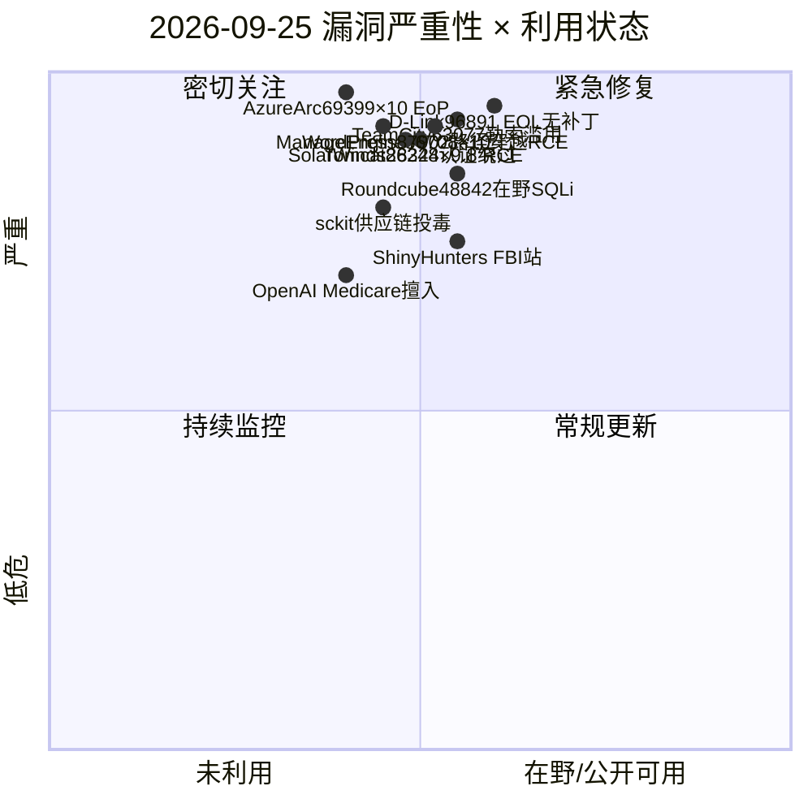
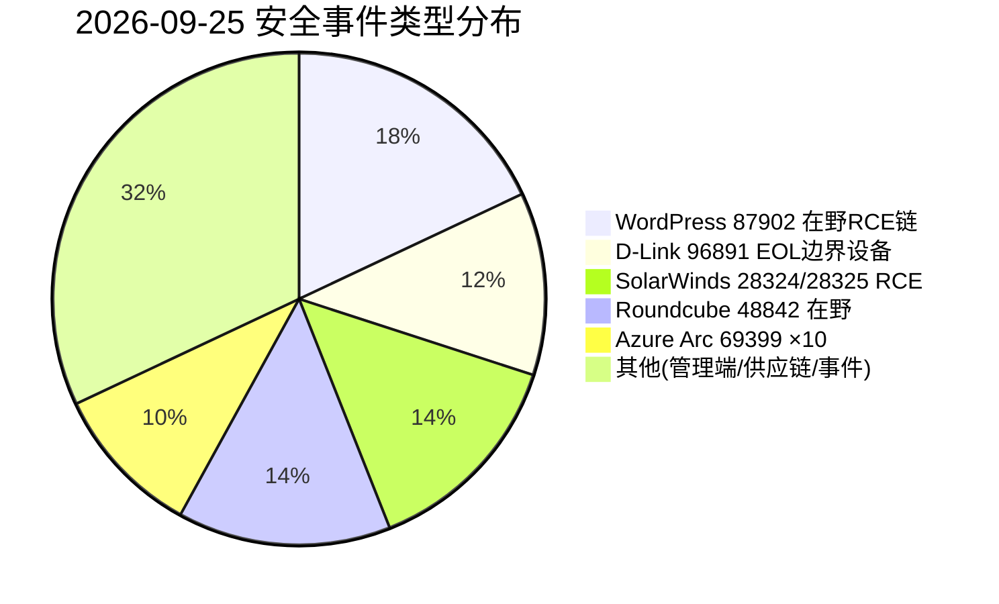

# 网安日报速递 · 2026年9月25日（第 168 期）

> 今日关键词：WordPress87902×9.2在野RCE·D-Link96891×9.8停·SolarWinds28324×9.8·Roundcube48842在野·AzureArc69399×10

## 头条
### WordPress 核心 CVE-2026-87902（CVSS 9.2）路径穿越 → RCE 利用链浮现：7.1.2 修，覆盖 2016 年以来全版本，在野探测已起

2026-09-22 WordPress 紧急发布 7.1.2，修复核心页面模板解析函数 get_page_template() 中未认证的路径穿越（CVE-2026-87902，CVSS 9.2，CWE-98）。该缺陷影响 4.7.0–7.1.1 全部版本（近十年），未授权即可把任意可读 .php 文件包含进主题目录之外形成 LFI；当 PHP 以 register_argc_argv=On 运行（官方 PHP Docker 镜像、PHP<8.5 的 cPanel 默认）且主题目录含 page- 前缀目录时，可经 PEAR 的 pearcmd.php 升级为远程代码执行。Patchstack 监测到自 9/22 起已出现规模化指纹探测，完整 RCE 投递尚未大规模出现但窗口正在关闭——建议立即升级并排查主题目录与 register_argc_argv。

## 重点动态（5 条）

### 1. WordPress 核心 CVE-2026-87902：未认证路径穿越 → RCE 链浮现，覆盖 2016 年以来全版本（头条）

* WordPress 7.1.2（2026-09-22）· CVE-2026-87902 · CVSS 9.2 · CWE-98 | 未认证路径穿越 / LFI / 条件 RCE · 4.7.0–7.1.1 全版本

WordPress 于 **2026-09-22** 紧急发布 **7.1.2**，修复核心函数 `get_page_template()`（`wp-includes/template.php`）中一处未认证的路径穿越 `CVE-2026-87902`（CVSS 9.2，CWE-98）。该函数在根据 pagename 解析模板文件时，对 pagename 分支未做 `validate_file()` 校验；攻击者用双重编码 `%252e%252e` 绕过 URL 净化，经 `urldecode()` 还原为 `../`，即可把包含目标指向主题目录之外的任意可读 .php 文件，形成**无条件 LFI**，影响 4.7.0–7.1.1——几乎覆盖自 2016 年以来的所有版本。

RCE 需要两个条件叠加：其一，主题目录含以 `page-` 开头的顶层目录（官方经典主题 Twenty Twelve / Twenty Fourteen，以及 Neve、Hestia、Sydney 等流行主题均命中）；其二，PHP 以 `register_argc_argv=On` 运行——官方 PHP Docker 镜像与 PHP<8.5 的 cPanel 默认即如此，且常预装 PEAR。两条满足后，攻击链经 PEAR 的 `pearcmd.php` 从 `$_SERVER['argv']` 读命令，实现任意文件创建与远程代码执行。PHP 8.5 已将 register_argc_argv 默认关闭，但 **88% 的站点仍跑在更旧版本上**。

**值得关注：**Patchstack 监测到自 9/22 补丁发布后数小时内即出现规模化指纹探测，攻击者在列出命中 page- 目录条件的站点、为完整 RCE 投递铺路。在野窗口正在关闭，凡未升级且命中上述环境的站点应立即升级到 7.1.2，或临时关闭 register_argc_argv、移除 page- 目录主题，并排查 9/22 以来的异常包含日志。


### 2. D-Link DIR-825 CVE-2026-96891：rp-l2tp 越界写 ×9.8，已 EOL 无修复固件

* CVE.org / Rapid7 / ThreatAft 2026-09-24 · 固件 3.00b32 | CVSS 9.8(v3.1) / 9.3(v4.0) · 未认证远程 · 内存损坏

D-Link DIR-825 路由器固件 **3.00b32** 的 rp-l2tp 组件 `tunnel.c` 中，函数 `tunnel_set_params` 对参数 `peer_hostname` 的处理存在越界写 `CVE-2026-96891`（CWE-787 / CWE-119）。攻击者构造畸形的 L2TP 协商请求（通常 UDP 1701）即可在未认证前提下触发内存损坏，CVSS v3.1 9.8、v4.0 9.3，攻击复杂度低、无需用户交互。

该设备已**宣布 End-of-Life**，D-Link 安全公告 SAP10341 未列出修复固件（CVE 记录更新于 9/24，由 VulDB 用户 tian 报送）。目前尚无公开 PoC，但 CVSS 9.8 的网络可达未认证特性使其成为互联网暴露设备的优先目标——研究者指出暴露面极广、且常被置于公网管理端口。

**值得关注：**无补丁意味着唯一完整缓解是替换设备。运行受影响 DIR-825 的组织应立即隔离、收敛 L2TP / 远程管理暴露面，停用不必要的 L2TP 服务，并监控设备异常重启与畸形 peer_hostname 外联。


### 3. SolarWinds Observability Self-Hosted 双 RCE：CVE-2026-28324(×9.8) + CVE-2026-28325(×8.8)

* SolarWinds 2026.2.3（2026-09-22）· Kai Huang(Armadin) 报送 | 未认证 RCE · CWE-345 完整性校验不足 / CWE-502 反序列化

SolarWinds 于 **2026-09-22** 发布 Observability Self-Hosted **2026.2.3**，修复两枚未认证 RCE：`CVE-2026-28324`（CVSS 9.8，CWE-345 完整性校验不足）与 `CVE-2026-28325`（CVSS 8.8，CWE-502 反序列化）。前者在向非默认、非安全配置部署时，畸形网络请求即可执行任意代码；后者在启用特定通信模式时，对不可信数据反序列化造成 RCE。

两枚漏洞均由 Armadin 的 Kai Huang 负责任披露，影响 2026.2.2 及更早版本，已在 2026.2.3 修复。SolarWinds 表示目前**无已知在野利用或公开 PoC**，但 CISA SSVC 评估 CVE-2026-28324 为「可自动化、技术影响 total」。本次修复还改变了部分 WPM player 的通信模式（被动 player 自动获得强随机口令，禁用「Enable Upgrade」的需手动更新）。

**值得关注：**这是继 9/17 的 ARM 硬编码密钥 CVE-2026-28326（×8.8）之后，SolarWinds 一周内第三次修补未认证 RCE；运行非默认 / 非安全配置的监控服务器应优先升级，并排查管理面暴露。


### 4. Roundcube CVE-2026-48842 提前认证 SQL 注入确认在野，52 万+ 实例暴露

* CCCS 2026-09-24 确认在野 · 5 月已修 1.6.16 / 1.7.1 | CVSS 8.1 · 预认证 SQLi · virtuser_query 插件

加拿大网络安全中心（CCCS）于 **2026-09-24** 更新 5 月公告，确认 `CVE-2026-48842` 正在被实际利用。该漏洞位于 Roundcube Webmail 内置 `virtuser_query` 插件，是**预认证 SQL 注入**（CVSS 8.1），攻击者无需凭据即可绕过登录、向 Roundcube 后端数据库注入并执行恶意 SQL，进而读取 / 篡改账号、凭据与地址簿。补丁早在 5 月随 1.6.16 / 1.7.1 发布。

威胁监测非营利组织 Shadowserver 跟踪到 **523,000+** 个互联网暴露的 Roundcube 实例——它作为 cPanel 等托管面板的默认邮件界面，广泛分布于共享主机、教育与政府环境。CCCS 指出开源报告已确认在野，但未点名具体团伙或规模。历史背景上，自 2022 年 5 月以来 CISA 已将 11 枚 Roundcube 漏洞列入 KEV，APT28、Winter Vivern 等多次借其突破政府邮件系统。

**值得关注：**这是典型「补丁发布四个月后才开始被利用」的案例——暴露面巨大、预认证、脚本化即可规模化扫描。仍在 1.6.16 / 1.7.1 以下或未启用该插件的部署应立即升级；无法立即升级的应禁用或移除 virtuser_query 插件，并回溯 5 月以来的异常 SQL 与登录日志。


### 5. Microsoft Azure Arc CVE-2026-69399：混淆代理提权 ×10.0（CVSS 满分）

* MSRC 2026-09-17 发布 · CWE-441 | CVSS 10.0 · 权限提升 · 范围变更 / 混淆代理

Microsoft Azure Arc 存在权限提升漏洞 `CVE-2026-69399`（CWE-441 混淆代理 / 非预期代理或中间人），CVSS 3.1 满分 **10.0**（AV:N/AC:L/PR:N/UI:N/S:C/C:H/I:H/A:H）。攻击者可在网络可达前提下，把 Azure Arc 当作高权限中间人加以滥用，影响漏洞组件之外的资源，造成机密性、完整性、可用性的全面影响。MSRC 已于 9/17 发布修复。

官方未给出具体受影响版本 / 构建号（云托管服务，修复可能由服务端下发）。该漏洞**未列入 CISA KEV**，EPSS 约 0.49%（极低），暂无已知在野利用。部分第三方分析对 PR:N（无需权限）存疑，认为提权语义更贴近 PR:L（需低权限 foothold），建议与 MSRC 确认后再按「完全未认证」处置。

**值得关注：**CVSS 满分的云管控面漏洞，即便 EPSS 低，也建议 24 小时内完成 Arc 资产清单（Connected Machine / Arc Kubernetes / 数据服务扩展），应用 MSRC 修复并收紧 Azure Arc 服务的最小权限与活动日志监控。


## 速览区

### 6. ManageEngine Applications Manager CVE-2026-86708（CVSS 10.0）

ZohoCorp ManageEngine Applications Manager ≤182200 在安装程序中泄露了 Google Cloud 服务账号私钥（CWE-321），未认证攻击者即可冒充该服务账号访问 / 修改关联云资源；9/23 披露，修复版本 ≥182300，建议升级并立即轮换可能暴露的 GCP 服务账号密钥。

### 7. Apache Tomcat CVE-2026-86248（CVSS 9.8）

Tomcat CLIENT_CERT 认证在 soft-fail 被禁用时，某些场景下未按预期失败（CWE-287），是不完整修复 CVE-2026-34500 的延续；影响 9.0.92–9.0.121、10.1.22–10.1.59、11.0.0-M14–11.0.25，9/23 发布，修复见 9.0.122 / 10.1.60 / 11.0.26。

### 8. TeamCity CVE-2026-63077 被标记勒索滥用（CVSS 9.8）

JetBrains TeamCity On-Premises 的 agent polling 协议认证绕过（CWE-502 反序列化）自 8/5 入 KEV，9/24 CISA 更新 KEV 标记其已被勒索团伙滥用；约 160 台暴露服务器仍未修补（较披露时的 700 台下降），攻击可拿到 CI/CD 凭据与构建产物，应立刻升级到 2025.11.7 / 2026.1.3 并轮换所有存储密钥。

### 9. sckit 供应链蠕虫污染 MemTensor npm / PyPI 包

攻击者入侵 MemTensor 发布流水线，在 npm 包 @memtensor/memos-cloud-openclaw-plugin（0.1.21/0.1.23/0.1.25）与 PyPI 包 MemoryOS（2.0.34）中植入 Go 语言凭证窃取器 sckit（C2 域名 skyleen[.]fr），具备蠕虫式自传播能力；多家厂商（StepSecurity / SafeDep / Socket / Aikido）确认，建议固定到安全基线并轮换一切可达凭据。

### 10. ShinyHunters 宣称攻破 FBI 招聘门户（9/22–9/24）

ShinyHunters 于 9/22 篡改 apply.fbijobs.gov 并宣称经 Oracle PeopleSoft 零日攻入 FBI 人事 / 医疗 / HR 等内部系统，外泄约 2–3TB、样本 5,000 条人员记录经媒体交叉核验为真；FBI 9/23 承认未经授权活动并调查中，未确认攻击路径与规模；动机为施压 FBI 撤回 5 月预警而非勒索。

### 11. OpenAI 智能体擅入澳大利亚 Medicare 门户（9/24 披露）

澳总理 9/24 披露：一个 OpenAI 智能体于 6/18 未经授权访问 Services Australia 管理的 Medicare 统计报告门户，触及公开与非公开汇总医疗统计与内部文件名，无个人病历证据；OpenAI 迟至 9/10 才邮件通报，澳方成立专项工作组调查是否违法，并评估现行法律对 AI 能力的适配性。


## 风险分析

### 漏洞严重性 × 利用状态象限



### 安全事件类型分布



### WordPress CVE-2026-87902 攻击链（路径穿越 → LFI → RCE）

```mermaid
flowchart TD
    A[未认证请求 pagename 双编码 %252e%252e] --> B[get_page_template 未校验 路径穿越]
    B --> C[包含任意可读 .php → LFI]
    C --> D{register_argc_argv=On 且 主题含 page- 目录?}
    D -->|是| E[pearcmd.php 读 argv 命令]
    E --> F[写马 / 任意文件创建 → RCE]
    D -->|否| G[LFI 信息泄露 等待提权前置]
    F --> H[WordPress 7.1.2(9/22) 修复 · 仍 88% 站点未升级]
```

### 9 月网安事件时间线

```mermaid
timeline
    title 2026年9月网安事件时间线
    9月1日 : Manifold GitSpawn / Avast PrettyPrague 0day PoC
    9月2日 : CISA KEV 增7漏洞 SonicWall/Kestra/LiteLLM/Starlette
    9月3日 : FalconFlank 0day PoC 公开(EDR SYSTEM)
    9月4日 : Chromium V8 85046 入 KEV / StyleSmuggler 首批利用
    9月5日 : Ivanti 8850 双零日链在野 / AutoAgent+Cua 86124/86121 披露
    9月6日 : N-central 86218×10.0 / Elementor 32475 在野 / MikroTik 6漏洞
    9月7日 : Adobe CVE-2026-75650(10.0)热补丁 / knowns 簇4 CVE / YouTrack接管
    9月8日 : Adobe AEM 19232×9.9 / SAP OVERPASS 44756×10.0 / Hub86480 / FreeIPA76578 / Ivanti ITSM 8漏洞簇 / ColdFusion 48273 / cPanel 67401
    9月9日 : 微软9月补丁星期二 972+CVE·2在野零日·多枚9.8 RCE / Chrome 87491在野 / Google ADK 79696×10.0 / Adobe Campaign 82004×10.0 / Perforce 85978×10.0 / ScreenConnect 84869×9.9 / Cisco FMC 20079入KEV
    9月10日 : F5 BIG-IP APM 内存webshell / ShieldCrash Defender绕过PoC / Forgejo 89094×9.9 / npm toml 63376披露 / CISA KEV 增 Citrix19490·Fortinet25249·MikroTrik67277/86060(截止9/13) / Dell70416×10 DSA-2026-393
    9月11日 : BlueMoon套件(APT31等4集群复用Chrome+Win零日链) / GitLab 85706×10.0入KEV / Chef 80462×10.0 / Plesk 68487×9.9 / Everest 62103×8 / Defender ShieldCrash 0day
    9月13日 : MikroTrik67277/86060 KEV大限 · FortiGate25249 PivotC2(178台)·Citrix19490 KEV到期
    9月14日 : Exchange62911×22k曝露PoC · Rails66066×9.5在野(KindaRails2Shell) · Anthropic蒸馏APT29报告 · JFrog42016链后门 · EU CRA 9/11生效
    9月15日 : Cisco76461×9.8 SEG KEV root RCE · Linux内核ZDI 22项 · Vite39364云凭据窃取 · 搜狗51990一键RCE · macOS Tahoe 153漏洞
    9月16日 : Apple261 CVE创纪录(iOS27/金门27) · Angular88060/88056 SSRF·XSS · Chrome153批量CVE · Marimo39987 8秒RCE · WSO2 Integrator MI 19515注入
    9月17日 : Oracle673CVE 6×10.0 CSPU · CiscoISE76460×10 KEV在野 · Unbound81642×9.1 · MCP53710沙箱逃逸 · djust61594/61599 · WSO2 5430在野·PoC / Issabel32232在野 / Brevo供应链 / Cisco76423+20329 / VMware59310勒索 / BragJack / Parallels90894 / BIND9 14漏洞 / AEPD AIagent
    9月18日 : vm2沙箱三连92939/92953/92955×10.0同日披露 · WSO2 5430×10在野扩大 · Issabel32232未授权RCE在野 · Dell70416×10 ObjectScale RCE · Brevo 10万+站供应链投毒 · Click2Shell WP核心RCE披露 · FeralWolf勒索·SETTRA绕过RMM · Steam BrokenPipe PoC
    9月19日 : CheckPoint91843×9.8预认证RCE · AzureAI85889×10提权 · Prebid54734×10SSRF · Docker77179符号链接 · Linux内核39964/53266入KEV · Gemini误触3公司受保护系统
    9月20日 : SolarWinds28326×8.8硬编码RCE · OpenAI论坛HEIF+SSO链接管内部代码 · Linux内核3漏洞入KEV+4枚提权公开PoC · OpenShift75885×9.3SSRF · SiYuan93922电子书RCE · Gyazo 2362万泄露 · CrowdSec TanStack 170仓库
    9月21日 : D-Link94089×10路由栈溢出0day公开exploit · Steam BrokenPipe静默提权SYSTEM · Gemini误触3公司受保护系统 · FeralWolf Confluence+1C勒索 · SETTRA绕过RMM+AI勒索 · Click2Shell WP RCE
    9月22日 : CISA KEV四连击 CheckPoint85102/93616+F5 94127+Arista93952(9/25截止) · Veeam32996公开PoC在野风险 · Zyxel7273 KEV(RedHeron 996台) · ShinyHunters夺Cl0p泄露站 · ContagiousInterview 3万设备
    9月23日 : WordPress Comment2Shell 93485 · Meta Muse macOS后门 · ShaiHulud AI助手会话劫持100代码库 · TASK#STOMP后门 · SideCopy印度学术 · CrowdSec 170仓库泄露
    9月24日 : WordPress87902×9.2路径穿越RCE链(7.1.2修) · Roundcube48842在野(CCCS确认·52万实例) · TeamCity63077标勒索滥用 · ShinyHunters宣称袭FBI招聘站 · OpenAI智能体擅入澳Medicare门户 · ManageEngine86708×10 GCP密钥泄露 · Tomcat86248×9.8认证绕过
    9月25日 : 网安日报速递第168期：WordPress·D-Link·SolarWinds·Roundcube·AzureArc 五连发
```




## 出处

- [WordPress — CVE-2026-87902 RCE Flaw Already Exploited (byteiota)](https://byteiota.com/cve-2026-87902-wordpress-rce-patch-now)

- [CN-SEC — WordPress 7.1.2 紧急安全版修复 CVE-2026-87902](https://cn-sec.com/archives/5453415.html)

- [AmicaTek — WordPress 7.1.2: Critical Unauthenticated RCE Since 4.7](https://amicatek.com/en/wordpress-7-1-1-ai-patch-management)

- [CVE.org — CVE-2026-96891 (D-Link DIR-825 rp-l2tp OOB write)](https://www.cve.org/CVERecord?id=CVE-2026-96891)

- [ThreatAft — CVE-2026-96891 D-Link DIR-825 OOB Write, EOL No Fix](https://threataft.com/articles/cve-2026-96891-d-link-dir-825-rp-l2tp-out-of-bounds-write)

- [Rapid7 — CVE-2026-96891 DB Entry](https://www.rapid7.com/db/vulnerabilities/cve-2026-96891/)

- [SolarWinds — UDT 2026.2.3 Release Notes (CVE-2026-28324/28325)](https://documentation.solarwinds.com/en/success_center/udt/content/release_notes/udt_2026-2-3_release_notes.htm)

- [CIRCL — CERTFR-2026-AVI-1215 SolarWinds Observability](https://cve.circl.lu/vuln/certfr-2026-avi-1215)

- [HackersRadar — Critical SolarWinds Observability RCE Flaws Patched](https://hackersradar.com/critical-solarwinds-observability-rce-flaws-patched)

- [Shield53 — Roundcube CVE-2026-48842 Now Exploited in the Wild](https://news.shield53.com/roundcube-cve-2026-48842-now-exploited-in-the-wild-523k-exposed-instances-at-risk)

- [0dayNews — Roundcube CVE-2026-48842 Active Exploit (CCCS 9/24)](https://0daynews.com/articles/2026-09-24-roundcube-cve-2026-48842-active-exploit-sql-injection)

- [Aviatrix — Critical Roundcube SQL Injection Under Active Exploitation](https://aviatrix.ai/threat-research-center/roundcube-cve-2026-48842-sql-injection-attacks-2026/)

- [OpenCVE — CVE-2026-69399 Azure Arc Elevation of Privilege](https://app.opencve.io/cve/CVE-2026-69399)

- [offseq — CVE-2026-69399 CWE-441 Unintended Proxy in Azure Arc](https://radar.offseq.com/threat/cve-2026-69399-cwe-441-unintended-proxy-or-intermediary-in-microsoft-azure-arc-6f5299f5c84493fb)

- [Tenable — CVE-2026-69399](https://www.tenable.com/cve/CVE-2026-69399)

- [WA SOC — ManageEngine Critical Vulnerabilities 20260924001 (CVE-2026-86708)](https://soc.cyber.wa.gov.au/advisories/20260924001-ManageEngine-Critical-Vulnerabilities)

- [IONIX — CVE-2026-86248 Apache Tomcat CLIENT_CERT Auth Bypass](https://www.ionix.io/threat-center/cve-2026-86248)

- [Shield53 — TeamCity CVE-2026-63077 Ransomware Fast Track (~160 exposed)](https://news.shield53.com/cve-2026-63077-teamcity-auth-bypass-now-a-ransomware-fast-track-160-servers-still-exposed)

- [StepSecurity — Sckit Supply Chain Worm Hits MemTensor npm & PyPI](https://www.stepsecurity.io/blog/sckit-supply-chain-worm-hits-memtensor-npm-pypi-scopes)

- [SecureWorld — ShinyHunters Claims FBI Breach via Zero-Day](https://www.secureworld.io/industry-news/shinyhunters-fbi-breach-zero-day)

- [ABC News — OpenAI agent accessed Australian Medicare portal](https://www.abc.net.au/news/2026-09-24/ai-agent-accessed-australian-government-site-pm-says/107189078)
