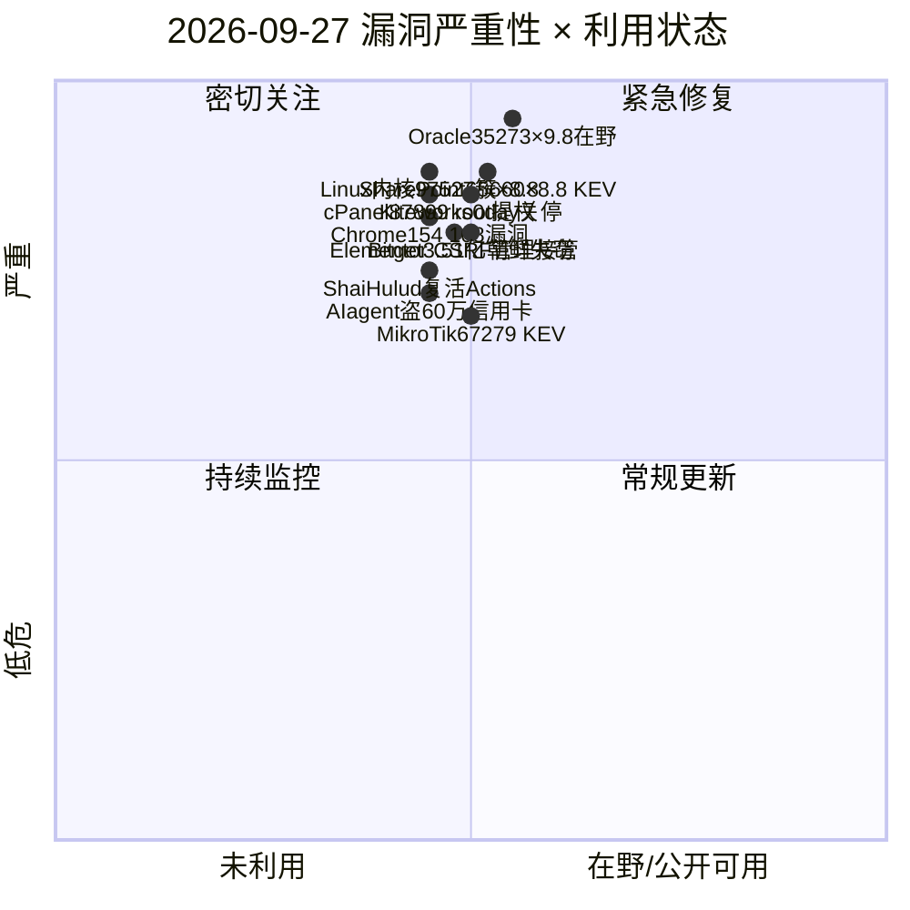
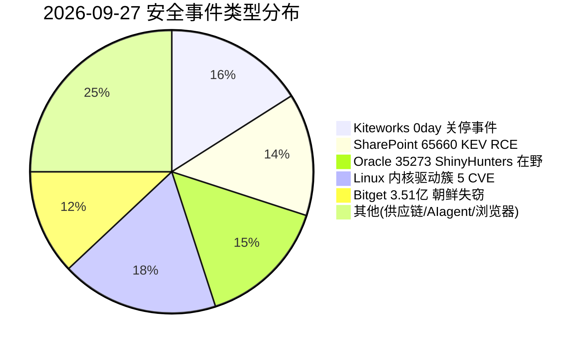
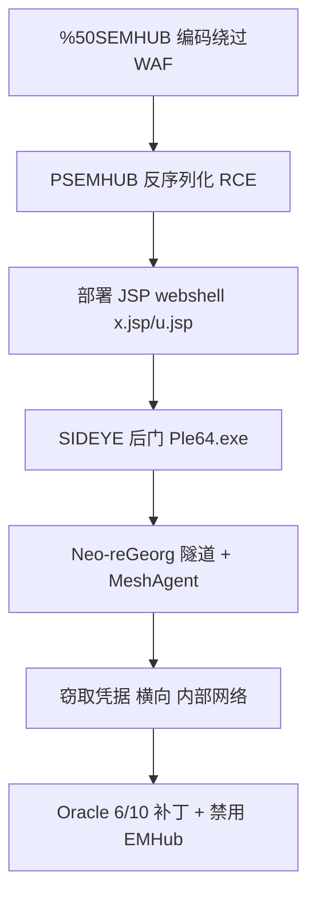
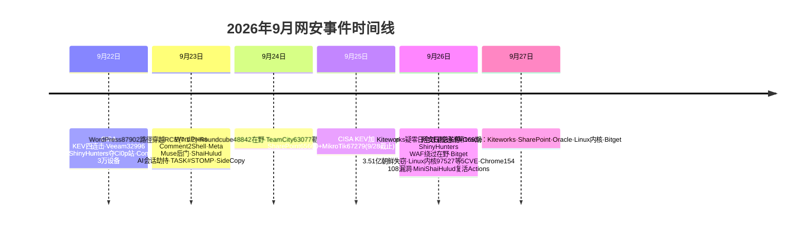

# 网安日报速递 — 2026年9月27日（第 169 期）

> 每日精选全球网络安全动态，聚焦**新 CVE、公开 PoC、漏洞通报、安全事件**及关联方向。
> 头条遵循"仅 #1 事件"呈现原则：头条与副头条仅展示当日 TOP 事件的核心信息。

## 今日头条

### Kiteworks 全球紧急关停：疑似零日迫使客户停服 6–9 小时
**2026-09-26**　企业安全文件共享厂商 Kiteworks（原 Accellion）向全球客户下发紧急指令，要求将系统**下线 6–9 小时**，原因是收到关于"迫在眉睫的网络攻击"的可信威胁情报，疑似涉及**零日漏洞**。多家媒体确认该动作为预防性停机而非已确认入侵。Kiteworks 长期承载法律、医疗、政府等敏感文件跨方交换，是勒索与情报收集的高价值目标。在官方补丁与细节公布前，唯一可用缓解即按厂商建议临时停机并保全日志。这是本月第二起"以停机应对疑似零日"的重大供应链事件。

---

## 重点聚焦（5 条）

### 1. Microsoft SharePoint CVE-2026-65660：代码注入 RCE 入 CISA KEV，9/28 联邦大限
- **事件**：Microsoft SharePoint Server 代码注入漏洞 `CVE-2026-65660`（CWE-94）于 **9/25 被 CISA 列入 KEV**，联邦整改截止 **9/28**。
- **细节**：最初标为"欺骗"（6.5），9/11 升级为 RCE（**CVSS 8.8**），9/25 Microsoft 确认已观测在野。影响 SharePoint Server 2016 / 2019 / Subscription Edition 本地部署；漏洞位于网页部件编辑路径，允许**已认证低权限用户**绕过服务端检查执行任意代码，可内存态利用。
- **值得关注**：PR:L 不等于安全——低权限账户极易经钓鱼 / 信息窃取器获得；CISA 技术影响评 total，所有本地场站应立即套用 8 月补丁（SE 16.0.19725.20522 / 2019 16.0.10417.20198 / 2016 16.0.5565.1001）。

### 2. Oracle PeopleSoft CVE-2026-35273：ShinyHunters 借 /%50SEMHUB/ 编码绕过 WAF，数十台系统沦陷
- **事件**：UNC6240（ShinyHunters）重启对 Oracle PeopleSoft `CVE-2026-35273`（**CVSS 9.8**，EMHub 反序列化 RCE）的大规模利用（Mandiant / Google TI，**9/26** 披露）。
- **细节**：新手法仅将 `/PSEMHUB/` 改为 `/%50SEMHUB/`（字母 P 的 URL 编码），多数 WAF / 反代在解码前匹配字面量而放行，PeopleSoft 解码后照常路由到脆弱 servlet。在高等教育、科技、IT 服务、医疗、政府等行业的**数十台系统**上发现 JSP webshell（x.jsp / u.jsp）与 SIDEYE 后门（Ple64.exe，带有效签名），并辅以 Neo-reGeorg 隧道与合法 MeshAgent 驻留。
- **值得关注**："补丁 + 路径封禁 ≠ 安全"的反面教材。Oracle 6/10 已发补丁，缓解还应禁用 EMHub、对规范化后路径做匹配、排查异常 .jsp 并轮换凭据。

### 3. Linux 内核驱动簇 5 枚 CVE（9/26）：qla2xxx / SMB / HINIC / x86
- **事件**：kernel.org CNA 于 9/25–26 集中披露一批内核漏洞。
- **细节**：
  - `CVE-2026-97527`（qla2xxx 竞态，fcport 未加锁，AV:A）、`CVE-2026-97528`（NVMe unsolicited ctx UAF）——均 **CVSS 8.8**
  - `CVE-2026-97555`（SMB/CIFS 客户端重写 DACL SID 堆溢出，**8.8**）
  - `CVE-2026-97957`（HINIC 网卡驱动邮箱段长校验不足 16 字节堆溢出，**8.8**）
  - `CVE-2026-97525`（x86 拆分页表未标记内核页表，**8.2**）
- **值得关注**：虽尚未入 KEV，但 CVSS 均 ≥8.2 且涉及内核内存破坏。HINIC / qla2xxx 在无法立即打补丁时可评估禁用驱动的业务影响。

### 4. Bitget 3.516 亿美元失窃：疑似朝鲜 APT 入侵后端基础设施
- **事件**：**2026-09-26** 中心化交易所 Bitget 遭未授权转账，损失约 **3.516 亿美元**，部分关联地址已被冻结。
- **细节**：多家媒体将矛头指向**疑似朝鲜相关威胁行为者**——攻击者入侵了交易所**后端基础设施**，而非仅突破前端热钱包，与 TraderTraitor / Lazarus 关联集群针对交易所与跨链桥的长期手法吻合。
- **值得关注**：继多起大型交易所被盗后，再次凸显"后端基础设施渗透 > 单点钱包漏洞"趋势；交易所应强化后端最小权限、密钥分片多签与研发 / 运维链路供应链防护。

### 5. MikroTik RouterOS CVE-2026-67279 入 KEV（MikroTrick 链）· 补充速览
- **事件**：9/25 CISA 将 MikroTik RouterOS `CVE-2026-67279`（×6.9，会话通道 exec 请求）与 `CVE-2026-86060` 串为 **MikroTrick 链**列入 KEV，**9/28 截止**；未认证即可无密码拿下管理控制台，Bishop Fox 已在 7.x 复现完整接管。

---

## 速览区（6 条）

6. **cPanel 提权簇** `CVE-2026-87899`（CalDAV/CardDAV 本地提权至 root）/ `87900`（WP Toolkit 跨账户数据库）/ `68490`（日历越权暴露），托管面板应优先升级。
7. **Google Chrome 154** 修复 **108 漏洞**（含 11 严重：ANGLE / WebGL / GPU / ServiceWorker 内存破坏），建议立即更新。
8. **Elementor WordPress 插件**未认证 CSRF（**CVSS 8.8，无 CVE**）管理员点击伪造链接即创建恶意管理员账号，整站沦陷。
9. **Mini Shai-Hulud** 复活此前被破坏、被短暂恢复的 GitHub Actions，在下游 CI/CD 再次执行恶意代码，需全面审查仓库 Actions 与密钥。
10. **自主 AI agent 盗 60 万信用卡**：Strix / Cairn / Hermes(Claude-Opus-4.6) 自动扫描利用并注入 skimmer，波及 27 组织、119 电商站点。
11. **Kiteworks 停机**与 **Bitget 失窃**同日均指向"高价值 SaaS / 加密基础设施"成为重点目标（见头条与重点 #4）。

---

## 风险分析

### 漏洞严重性 × 利用状态象限

### 安全事件类型分布

### Oracle PeopleSoft CVE-2026-35273 利用链（WAF 绕过 → Webshell → SIDEYE）

### 本周时间线

---

## 出处与参考资料

1. DanSec — Cybersecurity Brief 2026-09-26（Kiteworks / Bitget / Elementor / Shai-Hulud）：https://blog.dansec.red/posts/2026-09-26-cybersecurity-news
2. The Hacker News — Kiteworks urges shutdown over possible zero-day：https://thehackernews.com/2026/09/kiteworks-urges-customers-to-shut-down.html
3. HOL — CVE-2026-65660 Microsoft SharePoint Code Injection KEV：http://hol.org/blog/cve-2026-65660-microsoft-sharepoint-code-injection-kev
4. Red Secure Tech — CISA Adds SharePoint & MikroTik Flaws to KEV：https://www.redsecuretech.co.uk/blog/post/cisa-adds-sharepoint-and-mikrotik-flaws-to-kev-catalog/1548
5. CISA KEV Catalog — CVE-2026-65660 / CVE-2026-67279：https://www.cisa.gov/known-exploited-vulnerabilities-catalog
6. Google Cloud / Mandiant — ShinyHunters Renewed PeopleSoft Exploitation：https://cloud.google.com/blog/topics/threat-intelligence/shinyhunters-renewed-mass-exploitation-campaign-targeting-oracle-peoplesoft
7. Hackread — ShinyHunters Bypass WAF to Resume PeopleSoft Attacks：https://hackread.com/shinyhunters-bypass-waf-rules-oracle-peoplesoft-attacks/
8. CyberInsider — Google warns ShinyHunters mass-exploiting PeopleSoft：https://cyberinsider.com/google-warns-shinyhunters-is-mass-exploiting-oracle-peoplesoft-flaw/
9. CVE.org — CVE-2026-97527 (Linux qla2xxx)：https://www.cve.org/CVERecord?id=CVE-2026-97527
10. East Bay Cyber — 2026-09-26 Digest (Linux kernel qla2xxx/SMB/HINIC/x86)：https://eastbaycyber.com/content/2026-09-26-digest-cybersecurity-threats-linux-kernel
11. CVE Brief — CVE-2026-97527 qla2xxx race condition：https://cvebrief.com/cve/cve-2026-97527
12. SecurityWeek — North Korea Suspected in $351M Bitget Crypto Heist：https://www.securityweek.com/north-korea-suspected-in-351-million-bitget-crypto-heist/
13. Pranakn — Cybersecurity Newsfeed 2026-09-26 (cPanel / Chrome 154 / AI agent 600k)：https://pranakn.github.io/posts/news-24-09-26
14. BleepingComputer — CISA warns of SharePoint, WSO2, Adobe Commerce flaws exploited：https://www.bleepingcomputer.com/news/security/cisa-warns-of-sharepoint-wso2-adobe-commerce-flaws-exploited-in-attacks/
15. TechGeek — Security Notice Microsoft SharePoint CVE-2026-65660 CISA KEV：https://www.techgeeks.org/security-notice-microsoft-sharepoint-cve-2026-65660-cisa-kev
