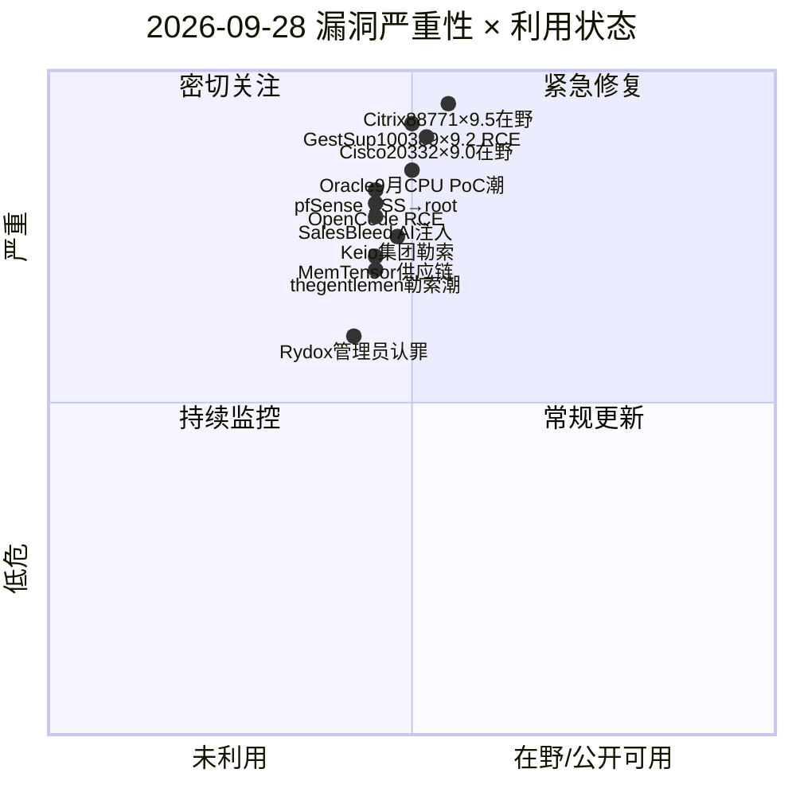
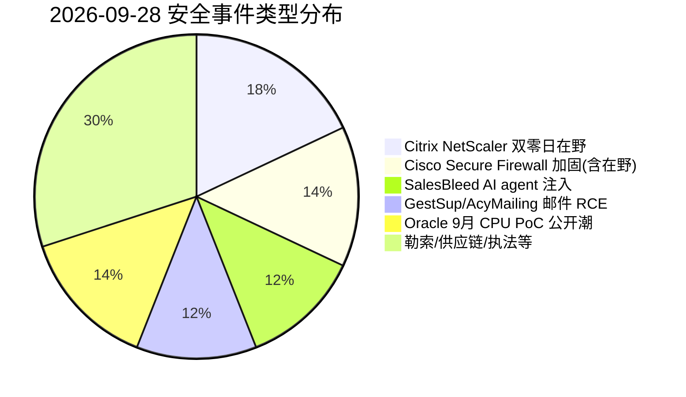
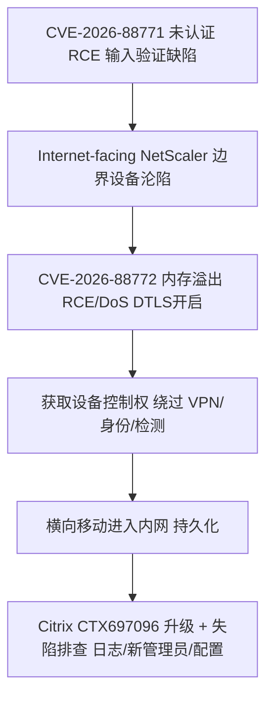
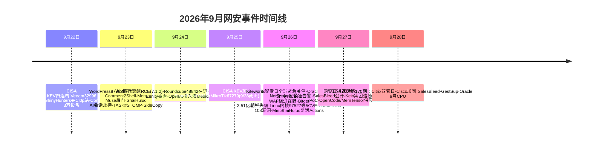

# 网安日报速递 — 2026年9月28日（第 170 期）

> 每日精选全球网络安全动态，聚焦**新 CVE、公开 PoC、漏洞通报、安全事件**及关联方向。
> 头条遵循"仅 #1 事件"呈现原则：头条与副头条仅展示当日 TOP 事件的核心信息。

## 今日头条

### Citrix NetScaler 双零日遭在野利用：CISA 紧急告警，网络边界设备再成重保靶心
**2026-09-27**　CISA 发布紧急告警，确认 Citrix NetScaler ADC 与 Gateway 两枚严重未认证 RCE 零日（`CVE-2026-88771`、`CVE-2026-88772`，CVSS 均 **9.5**）已在野被利用，Citrix 同日发布 CTX697096 修复 8 枚漏洞。事件脉络为 NCSC-NL 预先通知 → watchTowr 9/26 公开预警 → Citrix / CISA 9/27 确认出补丁。NetScaler 位于网络边界、承载 VPN / 负载均衡 / 认证，攻陷即可绕过端点与身份层直接获得内网立足点，类比 2023 年 CVE-2023-3519 / CVE-2023-4966，要求运维在数小时内完成修补与失陷排查。

---

## 重点聚焦（5 条）

### 1. Citrix NetScaler ADC/Gateway 双零日 RCE 在野（头条）
- **事件**：CISA 2026-09-27 紧急告警确认 `CVE-2026-88771`、`CVE-2026-88772`（均 **CVSS 9.5**，未认证 RCE）正在被在野利用；Citrix CTX697096 同日修复 8 枚漏洞。
- **细节**：88771 为输入验证缺陷导致的未认证 RCE，**无前置条件、默认配置即暴露**；88772 为内存溢出，开启 DTLS 时（VPN vServer 默认开启）可 RCE 或服务拒绝。另有 88773（9.3 HTTP 走私）、88774（7.0）、88775–88778（各 8.8）。影响 ADC 14.1<73.37 / 13.1<64.23 及 Gateway。
- **值得关注**：边界设备"先补丁、后失陷"的反复失守场景；应在 2 小时内清点并打补丁，24 小时内排查自 9/20 以来的异常命令执行、新建管理员与配置变更，轮换凭据。

### 2. Cisco Secure Firewall 9 月加固发布：CVE-2026-20332（×9.0 认证绕过类）被标注在野
- **事件**：Cisco Secure Firewall ASA / FTD / FMC 9 月安全加固发布（Greenbone 称共 29 个 CVE ID），修复 18+ 枚严重 / 高危漏洞。
- **细节**：`CVE-2026-20332`（CVSS **9.0**，CWE-284 访问控制 / 认证绕过类）被多家来源标注为**已在野**；另有 `CVE-2026-20329`（9.9 异常处理）、`20330`（9.9）、`20324`（9.9 sftunnel 任意文件写 root）、`20242`（9.8 FMC 反序列化未认证 root）等。**无可用 workaround**，须升级固定版本（ASA 9.24.1.155+ 等）。
- **值得关注**：继 FMC `CVE-2026-20079`（9/11 入 KEV）之后，Cisco 边界 / 管理设备持续成在野目标；应优先升级并收敛管理接口至内网。

### 3. Salesforce Agentforce「SalesBleed」：公共表单注入 → AI agent 0-click 外泄 CRM 数据
- **事件**：Zenity Labs **2026-09-24** 披露 Agentforce 三枚缺陷（统称 SalesBleed），影响 Salesforce Agentforce（托管 SaaS，**无 CVE 编号**）。
- **细节**：经公开 Web-to-Lead 表单提交"中毒线索"潜伏；员工让 agent 处理该线索时，agent 借自身权限跨记录读取 Account 等敏感数据，编码进攻击者子域名借 HTML `` 标签触发 DNS 外带，**全程 0-click**；第三枚缺陷在 Agentforce–Slack 集成可冒用 agent 身份内推钓鱼。根因是 Trusted URLs 红控被绕过。Salesforce 称 8/19 已修复，无客户被利用证据。
- **值得关注**：与 2025 年 ForcedLeak（CVSS 9.4）同源入口一年后再次被绕过，揭示"攻击者可控内容 + 敏感数据访问 + 外发通道"三要素叠加的 AI agent 风险范式；企业应将外部提交字段视为不可信指令。

### 4. GestSup CVE-2026-100389（×9.2）+ AcyMailing CVE-2026-94132：邮件附件未认证 RCE，PoC 9/27 公开
- **事件**：ThreatCluster **2026-09-27** 汇总两枚"附件即代码"类未认证 RCE。
- **细节**：GestSup < 3.2.61 因附件处理不当，向受监控邮箱发送 PHP 附件即可服务器端执行代码（`CVE-2026-100389`，CVSS **9.2**，9/25 披露）；AcyMailing Enterprise < 11.1.0 因未验证 MIME 附件被写入 web 可访问目录 RCE（`CVE-2026-94132`），首个公开 PoC 于 9/27 发布。
- **值得关注**：邮件网关 / 工单类应用常驻公网且自动处理附件，是"反序列化 / 文件写 + 可解析目录"组合的高危温床；应优先升级并隔离邮件处理账户权限与可写目录。

### 5. Oracle 9 月 CPU 落地：GovCERT.HK 高威胁警报提示在野 + 多枚 PoC 公开
- **事件**：GovCERT.HK **2026-09-27** 发布高威胁警报 A26-09-27，提示 Oracle 2026 年 9 月重要修补程式更新（cspusep2026）修复大批漏洞。
- **细节**：官方警报指出该批漏洞中**一枚 RCE 已在野被利用**，`CVE-2026-2332`/`7598`/`9563`/`57220`/`59943`/`63308`/`75838` 等多枚漏洞 **PoC 已公开**；影响 Java SE / Database / Fusion Middleware / Oracle Linux 等，Oracle 已发布补丁（Java 8u503 / 11.0.32.1 / 17.0.20.1 / 21.0.12.1 / 25.0.4.1 / 27）。
- **值得关注**：PoC 公开 + 在野利用叠加是规模化利用前奏；因该批 CVE 跨多产品，建议以 NVD 与 Oracle 官方交叉核实具体 CVE 的产品归属与 CVSS。

---

## 速览区（6 条）

6. **Keio 集团（东京铁路 / 酒店 / 百货）9/26 遭勒索攻击**：酒店预订与部分零售刷卡支付瘫痪，火车因独立网络照常；日本上半年勒索案 123 起创新高。
7. **MemTensor 供应链投毒**：恶意 npm / PyPI 发布在开发者环境窃取密钥、token 与云凭据。
8. **OpenCode RCE**：content-type 混淆缺陷经恶意 npm tarball 触发远程代码执行。
9. **pfSense 存储 XSS → root RCE / MagicINFO 利用后部署 SilentXMRMiner** 门罗币挖矿。
10. **thegentlemen 勒索大规模行动**：StMicroelectronics 等 20+ 企业被列（Ransomware.live 9/26）。
11. **Rydox 暗网市场管理员 Ardit Kutleshi 认罪**：7,600+ 笔被盗 PII / 信用卡交易，国际执法查封基础设施。

---

## 风险分析

### 漏洞严重性 × 利用状态象限

### 安全事件类型分布

### Citrix NetScaler CVE-2026-88771/88772 利用链（边界沦陷 → 内网横移）

### 本周时间线

---

## 出处与参考资料

1. CISA — Critical Zero-Day Vulnerabilities Exploited in Citrix NetScaler ADC/Gateway（告警 2026-09-27）：https://www.cisa.gov/news-events/alerts/2026/09/27/critical-zero-day-vulnerabilities-exploited-citrix-netscaler-adc-gateway
2. Citrix — CTX697096 NetScaler ADC/Gateway 安全公告：https://support.citrix.com/support-home/kbsearch/article?articleNumber=CTX697096
3. CSA Singapore — AL-2026-129 Active Exploitation of Citrix NetScaler：https://www.csa.gov.sg/alerts-and-advisories/alerts/al-2026-129
4. CERT-EU — 2026-014 Critical Vulnerabilities in Citrix NetScaler ADC and Gateway：https://cert.europa.eu/publications/security-advisories/2026-014
5. CVE.org — CVE-2026-88771 / CVE-2026-88772：https://www.cve.org/CVERecord?id=CVE-2026-88771
6. BeyondMachines — Cisco Patches 18 Critical/High Firewall Vulns, One Actively Exploited：https://beyondmachines.net/event_details/cisco-patches-18-critical-and-high-severity-firewall-vulnerabilities-one-actively-exploited-3-v-t-c-t
7. Greenbone — Critical-Severity CVE Clusters Across Cisco Secure Firewall（Sept 2026）：https://www.greenbone.net/en/blog/category/blog/
8. Cisco — Secure Firewall ASA/FTD/FMC Software Hardening Release September 2026：https://sec.cloudapps.cisco.com/security/center/publicationListing.x
9. Cybersecurity News — Salesforce SalesBleed Indirect Prompt Injection 0-click Exfiltration：https://cybersecuritynews.com/salesforce-salesbleed-vulnerability/
10. Cybersecurity Beat — Poisoned leads turned Salesforce's AI agent into a data thief：https://cybersecuritybeat.com/2026/09/26/poisoned-leads-turned-salesforces-ai-agent-into-a-data-thief
11. GovCERT.HK — A26-09-27 Multiple Vulnerabilities in Oracle Products：https://www.govcert.gov.hk/sc/alerts_detail.php?id=2069
12. Oracle — Critical Security Patch Update Advisory September 2026（cspusep2026）：https://www.oracle.com/security-alerts/cspusep2026.html
13. ThreatCluster — Critical RCE in GestSup and AcyMailing（CVE-2026-100389 / CVE-2026-94132）：https://threatcluster.io/cluster/critical-remote-code-execution-vulnerabilities-in-gestsup-an-028d82ba
14. NVD — CVE-2026-100389（GestSup）/ CVE-2026-94132（AcyMailing）：https://nvd.nist.gov/vuln/detail/CVE-2026-100389
15. TechQuire — Keio confirms ransomware attack on group server：https://tech-quire.com/articles/keio-confirms-ransomware-attack-group-server
16. HendryAdrian — Threat Research Weekly Recap [27 Sep 2026]（MemTensor / OpenCode / pfSense / MagicINFO）：https://www.hendryadrian.com/threat-research-weekly-recap-27-sep-2026
17. DEV / NetSecOps — Daily Cybersecurity Intelligence September 27, 2026（Rydox 认罪等）：https://dev.to/netsecops_io/daily-cybersecurity-intelligence-september-27-2026-247
