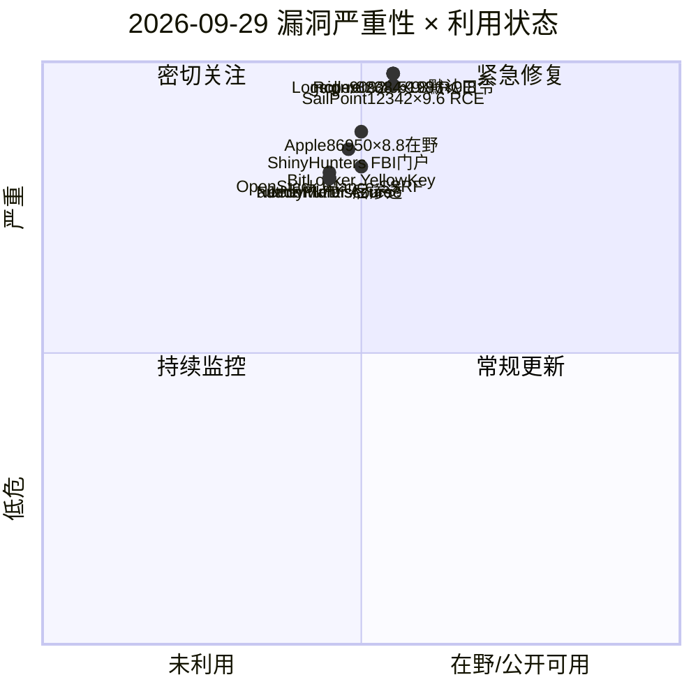
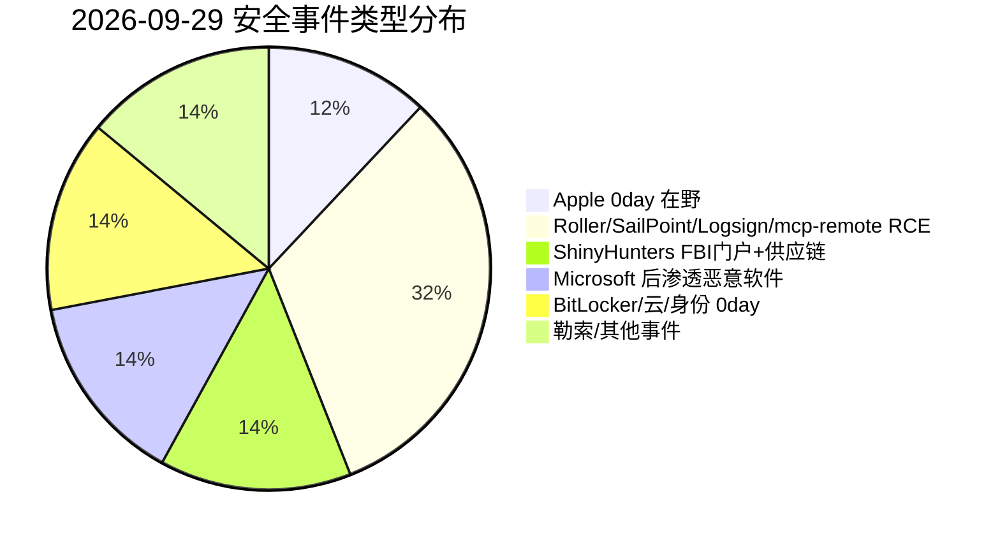
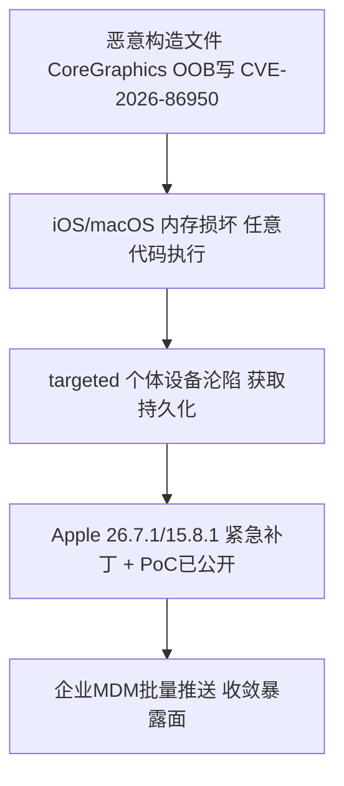
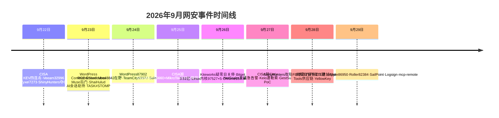

# 网安日报速递 — 2026年9月29日（第 171 期）

> 每日精选全球网络安全动态，聚焦**新 CVE、公开 PoC、漏洞通报、安全事件**及关联方向。
> 头条遵循"仅 #1 事件"呈现原则：头条与副头条仅展示当日 TOP 事件的核心信息。

## 今日头条

### Apple iOS/macOS 核心图形零日 CVE-2026-86950 确认在野，紧急推送修复补丁
**2026-09-28/29**　Apple 发布 iOS 26.7.1 / iPadOS 26.7.1、macOS Sequoia 15.8.1、macOS Tahoe 26.7.1 紧急安全更新，修复 CoreGraphics 组件一处越界写入漏洞（`CVE-2026-86950`，CVSS 8.8，CWE-787）。Apple 明确"已知该问题可能已在针对特定个人的极复杂攻击中被利用"，HKCERT 评为高风险，GitHub 已出现公开 PoC。消费级设备零日由此进入"在野 + 公开 PoC"阶段。

---

## 重点聚焦（5 条）

### 1. Apple CoreGraphics 零日 CVE-2026-86950：处理恶意文件即 RCE，已确认在野（头条）
- **事件**：Apple 2026-09-28/29 紧急发布 iOS 26.7.1 / iPadOS 26.7.1、macOS Sequoia 15.8.1、Tahoe 26.7.1，修复 CoreGraphics 越界写入（`CVE-2026-86950`，CVSS 8.8）。
- **细节**：CWE-787 内存破坏，处理特制恶意文件（图片等）触发越界写导致任意代码执行；无需认证，仅需用户打开文件（UI:R）。影响 iOS<26.7.1、iPadOS<26.7.1、macOS Sequoia<15.8.1、Tahoe<26.7.1。Apple 称该漏洞"可能已在针对特定个人的极复杂攻击中被利用"，HKCERT 高风险，GitHub 已有公开 PoC。
- **值得关注**：消费级零日进入在野 + 公开 PoC 阶段，攻击门槛快速下降；企业应经 MDM 批量推送 26.7.1 / 15.8.1 并核查异常进程。

### 2. Apache Roller CVE-2026-82384（×9.8）XML-RPC 未认证反序列化 RCE，PoC 已公开
- **事件**：2026-09-28 披露的 Apache Roller 6.1.5 反序列化漏洞（CWE-502），XML-RPC 端点在认证前解析 vendor extension 类型，攻击者发送特制序列化字节即未认证 RCE。
- **细节**：关键陷阱——该端点即使管理员禁用 XML-RPC 仍可被触达（`enabledForExtensions` 默认 true、禁用开关仅在 handler 内生效），改配置不足以缓解，必须升级 6.1.6；已有 3 个公开 PoC 仓库。
- **值得关注**：开源 Java 博客平台常暴露公网；无法立即升级时需在网络层封禁 `/roller-services/xmlrpc` 并部署 WAF 拦截可疑序列化对象。

### 3. SailPoint IdentityIQ CVE-2026-12342（×9.6）未认证 RCE，影响所有版本
- **事件**：身份治理平台 SailPoint IdentityIQ **所有版本**存在因 Web 服务 API 内容输入校验不当导致的未认证 RCE。
- **细节**：IdentityIQ 掌管企业用户供给与访问权限，失陷即可操纵特权访问；暂无公开 PoC，但"未经认证 + 9.6 高危 + 高价值目标"使其成优先尝试对象。
- **值得关注**：身份平台是"拿下即控全局"战略高点，失陷即横向移动 / 提权跳板，补丁紧迫。

### 4. Logsign SIEM CVE-2026-90924（×9.8）默认口令 → SIEM 全盘沦陷
- **事件**：土耳其 TR-CERT（USOM TR-26-1202）披露 Logsign SIEM 默认凭据漏洞（CWE-1392），产品出厂带常见 / 默认管理员账号且部署不强制修改。
- **细节**：远程未认证攻击者可直登；攻陷 SIEM 即获得对全环境日志、告警的可见与篡改能力，可压制自身攻击痕迹。影响 6.4.101–6.4.116，修复 6.4.117；利用极简（尝试默认口令即可）。
- **值得关注**：安全设备自身成突破口；临时缓解须改全部默认口令并收敛管理接口至内网、启用 MFA。

### 5. mcp-remote CVE-2026-51996（×9.8）MCP 远程传输任意代码执行
- **事件**：广用 MCP 远程传输库 `mcp-remote`（0.1.16–0.1.38）因 `getServerUrlHash` 函数缺陷允许远程攻击者执行任意代码（CVSS 9.8）。
- **细节**：MCP 是 AI agent 连接外部工具核心协议，传输层 RCE 意味着"调用任意 MCP 服务即可能中招"；GitHub 公告 GHSA-mvq8-g2rm-4rhm 已收录。
- **值得关注**：AI agent 供应链攻击面扩大，传输层为高危入口；集成 MCP 服务端须锁定版本并审查传输层实现。

---

## 速览区（6 条）

6. **ShinyHunters 攻陷 FBI 求职门户，荷兰逮捕嫌疑人**：借 Oracle PeopleSoft `CVE-2026-35273` 单字符替换绕过防火墙规则（非 Oracle 6 月补丁），据称取得 2–3TB 数据、暴露 5000+ 官员 SSN；荷兰 9/28 逮捕 Pepijn van der Stap，剩余成员随即升级活动。
7. **Microsoft 披露 NeedyMantis 后渗透恶意软件（Storm-3069）**：关联 Daemon Tools 供应链投毒，经 Poedit / TightVNC 目录 DLL 劫持，加密 WebSocket 通信，针对电信 / 高校 / 政府承包商长期驻留。
8. **JadePuffer 行动（Storm-3168）滥用 Azure 服务主体**：被盗 service principal 在约 18 小时内于租户内收集凭据并销毁资源，展示云身份凭据滥用破坏力。
9. **Windows BitLocker 零日 "YellowKey" CVE-2026-45585**：研究员公开 PoC，借特制 FsTx 文件 + WinRE 中按 Ctrl 触发全权限 Shell 绕过加密；微软发布缓解（移除 BootExecute 中 autofstx.exe、改 TPM+PIN）。
10. **OpenStack Glance CVE-2026-51772（×8.1）SSRF**：`show_multiple_locations` 开启时，认证用户经 crafted HTTP PATCH 操纵镜像 locations 触发服务端请求伪造，影响云基础设施。
11. **authentik `CVE-2026-94613` / Discourse `CVE-2026-91134`、`91132` 等 9/29 曝未认证缺陷**：身份与论坛类组件持续成高危入口。

---

## 风险分析

### 漏洞严重性 × 利用状态象限

### 安全事件类型分布

### Apple CVE-2026-86950 利用链（文件触发 → 设备沦陷）

### 本周时间线

---

## 出处与参考资料

1. Apple — iOS 26.7.1 / iPadOS 26.7.1 / macOS Sequoia 15.8.1 / Tahoe 26.7.1 安全内容（CVE-2026-86950）：https://support.apple.com/en-us/149226
2. HKCERT — Apple Products Remote Code Execution Vulnerability（CVE-2026-86950）：https://www.hkcert.org/security-bulletin/apple-products-remote-code-execution-vulnerability_20260929
3. CVE.org — CVE-2026-86950：https://www.cve.org/CVERecord?id=CVE-2026-86950
4. IONIX — CVE-2026-82384 Apache Roller unauthenticated RCE via XML-RPC deserialization：https://www.ionix.io/threat-center/cve-2026-82384
5. NVD — CVE-2026-82384（Apache Roller 6.1.5）：https://nvd.nist.gov/vuln/detail/CVE-2026-82384
6. ZeroDay Signal — SailPoint IdentityIQ Improper Form Validation RCE（CVE-2026-12342）：https://zerodaysignal.com/vulnerability/CVE-2026-93868
7. CVE.org — CVE-2026-12342（SailPoint IdentityIQ）：https://www.cve.org/CVERecord?id=CVE-2026-12342
8. IONIX — CVE-2026-90924 Logsign SIEM default credentials full compromise：https://www.ionix.io/threat-center/cve-2026-90924
9. TR-CERT / USOM — TR-26-1202（CVE-2026-90924 Logsign SIEM）：https://siberguvenlik.gov.tr/guvenlik-bildirimleri/detay/tr-26-1202
10. GitHub Advisory — GHSA-mvq8-g2rm-4rhm（mcp-remote CVE-2026-51996）：https://github.com/advisories/GHSA-mvq8-g2rm-4rhm
11. cve.report — CVE-2026-51996（geelen mcp-remote 9.8）：https://cve.report/CVE-2026-51996
12. CyberSecBrief — Daily Cybersecurity Briefing (29 September 2026)：https://www.cybersecbrief.com/news/cybersec/cybersec-2026-09-29
13. 安全资讯 — Windows BitLocker 零日 "YellowKey" CVE-2026-45585 缓解：https://ti.dbappsecurity.com.cn/info/15130
14. OpenCVE — CVE-2026-51772（OpenStack Glance SSRF）/ CVE-2026-94613（authentik）/ CVE-2026-91134（Discourse）：https://app.opencve.io/cve/CVE-2026-51772
15. Enigma Global — Daily Threat Intelligence Digest (2026-09-29)：https://www.enigma-global.com/blog/daily-digest-2026-09-29
