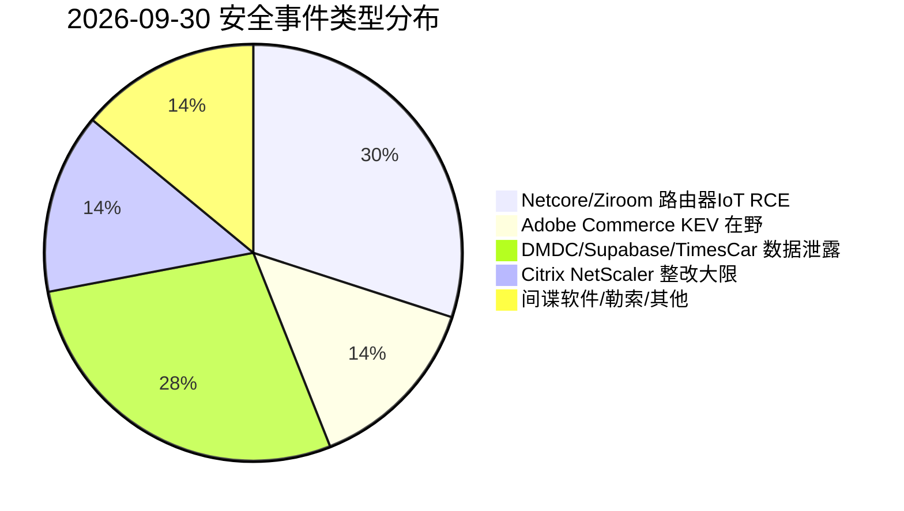
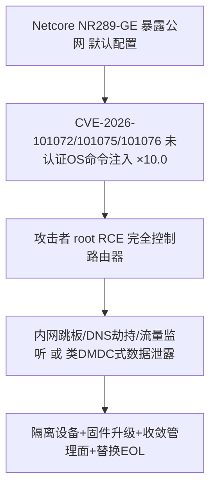
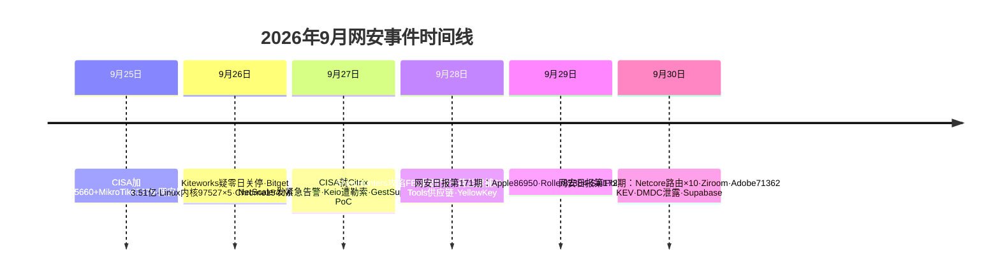

# 网安日报速递 — 2026年9月30日（第 172 期）

> 每日精选全球网络安全动态，聚焦**新 CVE、公开 PoC、漏洞通报、安全事件**及关联方向。
> 头条遵循"仅 #1 事件"呈现原则：头条与副头条仅展示当日 TOP 事件的核心信息。

## 今日头条

### Netcore NR289-GE 路由器曝 4 漏洞簇：3 枚 CVSS 10.0 未认证 RCE，暴露公网即沦陷
**2026-09-29**　Netcore NR289-GE 入门级路由器固件 1.4.5102 曝出 4 个漏洞，其中 `CVE-2026-101072` / `101075` / `101076` 均为 CVSS 10.0 的未认证 OS 命令注入（分别经 `ip` / `mac` / `ntp_ip` 参数），`CVE-2026-101077` 为未认证文件写入。攻击者无需凭据即可在设备上以 root 执行任意命令，是典型的"暴露即沦陷"边缘设备高危场景。

---

## 重点聚焦（5 条）

### 1. Netcore NR289-GE 路由器 4 漏洞簇：3×CVSS 10.0 未认证 RCE，暴露公网即 root（头条）
- **事件**：2026-09-29 披露的 Netcore NR289-GE 路由器（固件 1.4.5102）存在 4 个漏洞，其中 3 枚为 CVSS 10.0 未认证 OS 命令注入：`CVE-2026-101072`（`/ap_ip.cgi` 的 `ip` 参数）、`CVE-2026-101075`（`/location_time.cgi` 的 `mac` 参数）、`CVE-2026-101076`（`/set_ntp_server_ip.cgi` 的 `ntp_ip` 参数）；第 4 枚 `CVE-2026-101077` 为 `boa_temp` 处理器的未认证文件写入。
- **细节**：CWE-78 命令注入 / 文件写入类；向暴露的管理 CGI 接口发送特制参数即可注入系统命令，无需登录；设备以 root 运行，攻击者直接取得完全控制权。影响 SOHO / 入门级网关，常直接暴露公网且长期不更新。
- **值得关注**："暴露即 root"的边缘设备漏洞，自动化蠕虫式扫描利用风险极高（参考近年 MikroTik / D-Link 在野链）；SOHO / 分支网关是勒索与 APT 进入企业内网的经典入口，应第一时间下线公网管理面、升级固件并替换无法修复的 EOL 设备。

### 2. Ziroom ZHOME A0101 智能家居 CVE-2026-102793 / 102794（×9.1）命令注入，PoC 已公开
- **事件**：NIST NVD 于 2026-09-30 收录自如（Ziroom）智能家居网关 `ZHOME A0101 1.0.1.0` 的两枚高危命令注入漏洞：`CVE-2026-102793`（位于 `/api/ZRFirmware/set_time_zone` 的 `hostname` / `zonename` 参数）、`CVE-2026-102794`（位于 `/api/ZRnetwork/ping` 的 `url` 参数）。
- **细节**：两枚均可被远程触发命令注入，且利用代码已公开；厂商在产品披露后未作出回应。
- **值得关注**：IoT / 智能家居网关常处于家庭或企业内网入口，一旦被攻陷即成为内网跳板；PoC 公开意味着大规模自动化利用随时到来，无法升级的设备应做网络隔离并关闭不必要的公网 API。

### 3. Adobe Commerce / Magento CVE-2026-71362（×9.1）入 CISA KEV：不正确的授权 → 会话劫持
- **事件**：CISA 在最新周报中将 `CVE-2026-71362`（CVSS 9.1，CWE-863 不正确的授权）与 WSO2 `CVE-2026-5430` 一并加入 KEV 目录，确认在野利用。
- **细节**：该漏洞影响 Adobe Commerce 与 Magento，攻击者可在无需用户交互的情况下劫持客户会话、访问私有客户数据；利用尝试曾在 2026-08 被拦截，并于 9/10 在蜜罐中检测到来自澳大利亚 IP 的活动；联邦整改截止日为 9/27。
- **值得关注**：电商会话劫持直接影响交易与隐私，且"无需交互"降低了利用门槛；同时印证 Adobe Commerce 仍是攻击者持续压注的高价值目标（此前 StyleSmuggler 0day 已多次在野）。

### 4. 美国国防部人力数据中心（DMDC）确认长期入侵，约 300 万人 PII 暴露 9 个月
- **事件**：据 Cybersecurity Beat（2026-09-30）报道，美国国防部人力数据中心（DMDC，掌管现役 / 退役军人、文职、合同工及家属等人事记录，FY2024 存量超 6000 万条）开始通知约 300 万人其个人信息已在一次入侵中暴露。
- **细节**：通知信显示系统漏洞于 2026-07-16 被发现并当日修复，但分析确认在 2025-10 至发现日之间，少量未授权用户访问了一台存放未加密 PII 的文件共享服务器，入侵持续约 9 个月；受影响产品与漏洞细节未披露，尚无已知犯罪组织认领。
- **值得关注**：长期、未加密、大规模人事数据暴露，且发现滞后近一年；再次凸显"加密 + 最小暴露 + 持续检测"对高价值政府数据的基础性意义。

### 5. 超 16,000 个 Supabase 实例误配置，可读表暴露密码与令牌
- **事件**：研究人员报告超过 16,000 个 Supabase 数据库因误配置而暴露可读表，内容包括个人身份信息、明文密码或身份认证令牌（BleepingComputer 转引，2026-09-29）。
- **细节**：本质是一桩云配置与密钥管理事故，而非 Supabase 本身的产品漏洞——错误的行级安全（RLS）策略、公开的 anon key 权限过宽等都会导致此类暴露。
- **值得关注**：云原生默认安全 posture 缺失会直接把数据库变成公开资产；开发团队应在 CI 中强制检查 RLS 策略、密钥最小权限与公网可达性，并将密钥泄露纳入事件响应范围。

---

## 速览区（6 条）

6. **Times Car 确认数据泄露，约 660 万用户账户受影响**：日本租车服务商 Times Car 于 2026-09-29 确认一起影响约 660 万用户账户的数据泄露事件；处理客户身份的企业应复核认证遥测、密码复用风险与告知义务。
7. **前美军士兵 kiberphant0m 因电信黑客案被判 70 个月**：Cameron Wagenius（化名 `kiberphant0m`）因 2023-04 至 2024-12 期间黑客入侵并勒索电信公司、窃取通话 / 短信记录（关联 2024 Snowflake 数据失窃中的 AT&T 记录），被判处 70 个月监禁并赔偿近 29.5 万美元。
8. **CISA 今日（9/30）Citrix NetScaler 双零日联邦整改大限**：`CVE-2026-88771` / `88772`（详见 9/28 期）的 FCEB 整改截止日即为今日；Palo Alto Unit 42 称全球超 5 万暴露实例，watchTowr 指出 9/24 已观察到针对 NetScaler Gateway 的利用尝试——仍未打补丁的机构应立即隔离并排查 webshell。
9. **FSB 称高级俄官员手机发现复杂外国间谍软件**：俄罗斯联邦安全局（FSB）2026-09-30 通报，在多名高级官员手机上发现"复杂外国间谍软件"，引发对外交 / 军政通信被监听的担忧；具体载荷与归属未公开。
10. **微软将 Daemon Tools 供应链投毒与 NeedyMantis（Storm-3069）关联**：微软披露的后渗透恶意软件 NeedyMantis 通过 Poedit / TightVNC 等合法软件目录进行 DLL 劫持；该供应链投毒手法与 Storm-3069 的长期驻留活动直接关联。
11. **Keio 铁路集团勒索事件持续，销售系统受影响**：Keio 集团自 2026-09-26 确认勒索软件攻击扰乱集团系统、部分子公司销售系统受影响，已断网处置并向警方报案；列车运营未受影响，目前尚无确认数据外泄。

---

## 风险分析

### 漏洞严重性 × 利用状态象限
```mermaid
quadrantChart
    title 2026-09-30 漏洞严重性 × 利用状态
    x-axis "未利用" --> "在野/公开可用"
    y-axis "低危" --> "严重"
    quadrant-1 "紧急修复"
    quadrant-2 "密切关注"
    quadrant-3 "持续监控"
    quadrant-4 "常规更新"
    "Netcore101072×10路由RCE": [0.55, 1.00]
    "Ziroom102793×9.1 IoT": [0.55, 0.91]
    "Adobe71362×9.1 KEV": [0.50, 0.91]
    "DMDC300万泄露": [0.45, 0.80]
    "Supabase1.6万暴露": [0.45, 0.82]
    "TimesCar6.6M泄露": [0.45, 0.80]
    "kiberphant0m判刑": [0.45, 0.78]
    "Citrix88771/88772大限": [0.50, 0.95]
    "FSB官员间谍软件": [0.45, 0.78]
    "Keio铁路勒索": [0.45, 0.80]
```

### 安全事件类型分布


### Netcore CVE-2026-101072 利用链（暴露 → 沦陷）


### 本周时间线


---

## 出处与参考资料

1. East Bay Cyber — Threat Digest: Apple Zero-Day & Cloud Attacks (2026-09-29)：Netcore NR289-GE CVE-2026-101072/101075/101076/101077：https://eastbaycyber.com/content/2026-09-29-digest-apple-zero-day-cloud-attacks
2. InfoSecNexus — Live Cybersecurity Brief for September 30, 2026：Ziroom ZHOME CVE-2026-102793 / 102794：https://infosecnexus.com/?p=1169
3. NVD — CVE-2026-102793（Ziroom ZHOME A0101 command injection）：https://nvd.nist.gov/vuln/detail/CVE-2026-102793
4. F5 Labs — Weekly Threat Bulletin – September 30th, 2026：CISA KEV 加 CVE-2026-71362 (Adobe Commerce) / CVE-2026-5430 (WSO2)：https://www.f5.com/labs/articles/weekly-threat-bulletin-september-30th-2026
5. CISA — Known Exploited Vulnerabilities Catalog（CVE-2026-71362 / CVE-2026-5430）：https://www.cisa.gov/known-exploited-vulnerabilities-catalog
6. Cybersecurity Beat — Pentagon records office admits a nine-month intruder access (DMDC, 2026-09-30)：https://cybersecuritybeat.com/2026/09/30/pentagon-records-office-admits-a-nine-month-intruder-access
7. BleepingComputer（经 East Bay Cyber 转引）— 16,000+ misconfigured Supabase databases exposed：https://eastbaycyber.com/content/2026-09-29-digest-apple-zero-day-cloud-attacks
8. CyberSecBrief — Daily Cybersecurity Briefing (29 September 2026)：Times Car 6.6M / kiberphant0m 70 个月 / Keio 勒索：https://www.cybersecbrief.com/news/cybersec/cybersec-2026-09-29
9. Ankura CTIX FLASH Update – September 29, 2026：Citrix NetScaler CVE-2026-88771 / 88772 在野与缓解：https://ankura.com/insights/ankura-ctix-flash-update-september-29-2026
10. Palo Alto Unit 42 — Threat Brief: NetScaler Zero Days CVE-2026-88771 / 88772（50,000+ 暴露实例）：https://unit42.paloaltonetworks.com/
