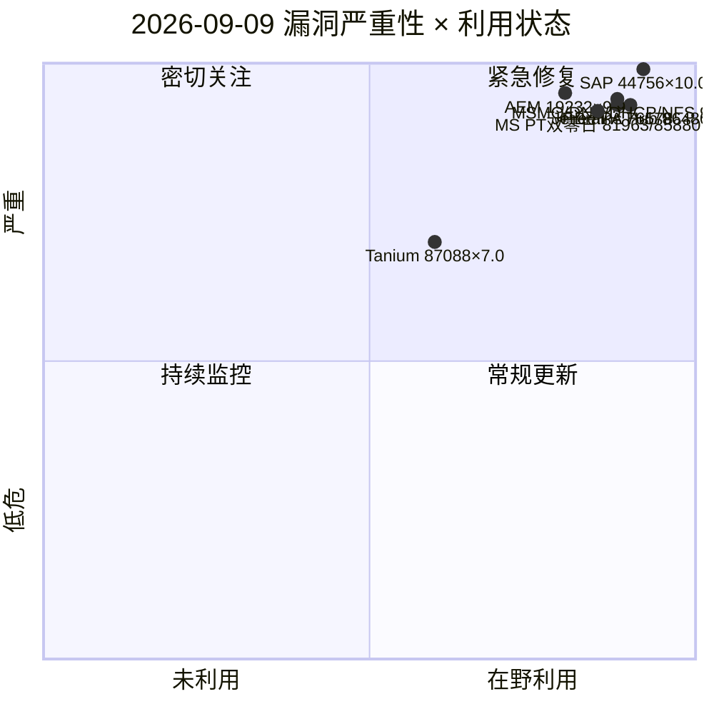
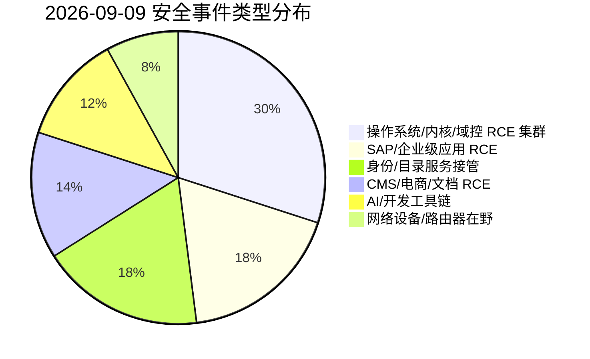
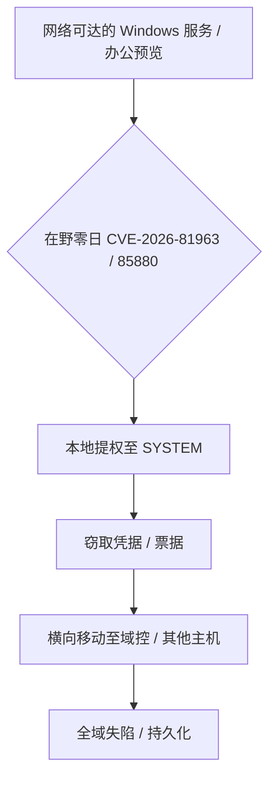
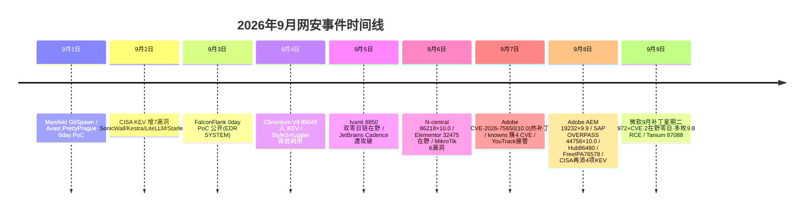

# 网安日报速递 - 2026年9月9日（第 155 期）

> 每日精选 · 值得关注 | 侧重新 CVE、公开 PoC、漏洞通报、安全事件

---

## 今日头条（仅 #1 漏洞事件）

### 微软 2026 年 9 月补丁星期二：972/973 个 CVE、113 个严重、2 个在野零日

微软于 9/8 发布 9 月安全更新，共修复 **972/973 个漏洞**（数据来源 Talos / CrowdStrike 口径略有差异），其中 **113 个标为「严重」、82 个为 RCE**。本月有 **2 个漏洞已被在野利用**：

- **CVE-2026-81963**（CVSS 7.8，Windows Update Stack「Link Following / 访问控制不当」提权）—— 在野。
- **CVE-2026-85880**（CVSS 7.8，Windows ALPC「堆缓冲区溢出 / 使用未初始化资源」提权）—— 在野。

**值得关注的原因**：单月漏洞量逼近千级，且提权零日均已被实战利用；一旦落地的提权链配合任意网络可达 RCE，即可完成「初始访问 → SYSTEM → 域横向」。本月还涌现一批 **9.8 分、无需认证即可远程触发** 的高危 RCE，需优先处置。

---

## 重点关注（5 条）

### 1. 微软 9 月补丁星期二的高危 RCE 集群（非头条详述）

除两个在野零日外，本月多枚 **9.8 分网络可达 RCE** 尤其危险：

| CVE | 组件 | 类型 | CVSS |
|---|---|---|---|
| CVE-2026-69579 | Windows Message Queuing (MSMQ) | Use-After-Free → RCE（蠕虫化风险） | 9.8 |
| CVE-2026-69730 | Windows DNS Server | Use-After-Free → RCE | 9.8 |
| CVE-2026-69845 / 72979 | Windows DHCP Server | 堆溢出 / UaF → RCE | 9.8 |
| CVE-2026-69595 / 78445 | Windows Services for NFS ONCRPC XDR | 堆溢出 → RCE | 9.8 |
| CVE-2026-77493 / 78510 / 78509 | Windows Graphics / Word / Outlook（预览窗格/阅读窗格） | 文档预览即 RCE，无需点击 | 9.8 |

**值得关注的原因**：MSMQ、DHCP、NFS、DNS 均为企业内网默认或常见开启的服务，监听高特权端口（1801 / 53 / 67-68 / 2049），未认证即可触发，历史上正是横向移动与蠕虫化利用的首选；Office 预览窗格类无需用户交互即执行，是钓鱼与初始访问经纪人的高价值目标。

### 2. Adobe Experience Manager CVE-2026-19232（CVSS 9.9）—— 低权账户远程代码执行

Adobe 于 9/8 在 **APSB26-98** 中修复 AEM 的 **不当授权（CWE-863）** 漏洞，CVSS 3.1 **9.9**（AV:N/AC:L/PR:L/UI:N/S:C），影响 AEM as a Cloud Service 至 2026.7.0、6.5 LTS 至 SP2、6.5 至 6.5.24；修复版本为 2026.8.0 / 6.5 LTS SP3 / 6.5.25。

**值得关注的原因**：攻击门槛极低——仅需一个低权限账户即可在网络侧触发，并在当前用户上下文执行任意代码、越权接管他人账户/会话（Scope 变更）。AEM 是大量企业门户与政务/金融站点的底层，应优先升级并审计可疑权限提升。

### 3. SAP「OVERPASS」CVE-2026-44756（CVSS 10.0）—— SAP 内核未授权 RCE

SAP 在 9 月安全补丁日发布 **CVE-2026-44756（Onapsis 命名 OVERPASS）**，位于 **SAP 内核 Extended Passport (EPP) 处理库**（CWE-120 缓冲复制未校验长度）。未认证攻击者发送畸形 EPP 头即可触发内存损坏并**以 SAP 系统权限执行任意 OS 命令**。影响 S/4HANA、ECC、NetWeaver、Web Dispatcher、BW/4HANA 等；修复见 **SAP Note 3747649**（9/8 发布）。同批另含 S4GET（CVE-2026-58240，NetWeaver 缺认证）、CVE-2026-76969（凭据泄露）、CVE-2026-66768（越权）。

**值得关注的原因**：漏洞位于**内核共享代码**，且会话建立阶段即被触发，绕过了用户锁、角色、授权对象等全部企业级鉴权；通过 ICM (HTTP/HTTPS/SMTP)、SAP GUI、RFC 多向量可达，约 1 万+ 互联网暴露 SAP 系统可能触达该组件。CVSS 10.0 + 补丁一出即进入「补丁比对」武器化窗口，需立即打内核补丁（临时收敛 ICM/GUI/RFC 暴露面无法替代补丁）。

### 4. JetBrains Hub CVE-2026-86480（CVSS 9.8）—— 未授权注册可信服务夺取超级管理员

JetBrains Hub **2026.2.52442 之前**版本存在 **CWE-306 缺失认证**，未授权攻击者可在 Hub 注册一个「可信服务」并直接获得 **superuser 全权**（CVSS 9.8，AV:N/AC:L/PR:N/UI:N）。公开 PoC 已出现（enigma 等将其列为「 imminent exploitable」）。

**值得关注的原因**：Hub 是 YouTrack、TeamCity 等 JetBrains 全家桶的统一身份/授权枢纽。拿下 Hub 即等于接管所有依赖它的 JetBrains 服务与用户账号；结合此前 JetBrains Cadence 遭 TeamCity 攻破 AWS 凭据的真实案例，公网暴露的 Hub 应立即升级并排查异常「可信服务」与新建超级用户。

### 5. FreeIPA CVE-2026-76578（CVSS 9.8）—— 匿名 LDAP 直取管理员凭据

FreeIPA 的 **self-managed OTP token ACI 不要求认证、且不限制可附加属性**，匿名 LDAP 客户端（匿名绑定或 SASL ANONYMOUS）可借此 + 底层 389 Directory Server 的 SELFDN ACI 缺陷（另报 CVE-2026-76560，7.5），创建一个攻击者控制的 Kerberos 主体并将其加入 **administrators 组**，实现**远程未授权获取真实管理员组成员身份**。修复于 **FreeIPA 4.13.4**。同批还修 CVE-2026-79678（8.1，idp-add 在鉴权前 eval() 可泄露环境变量）。

**值得关注的原因**：FreeIPA / Red Hat IdM 管理整个 Linux 域的身份与访问，拿下管理员等于「整域前门失守」；默认安装即受影响，且 SID 启用部署还可进一步获取带授权数据的 Kerberos 票据、签发证书。临时缓解：限制 LDAP 389/636 至可信主机、关闭匿名绑定；但仅打目录服务器补丁不足以清除已植入身份，需审计管理员组。

---

## 速览区（6 条）

**6. CISA KEV 9/8 再添 4 项在野漏洞**：CVE-2026-75650（Adobe Commerce/Magento，承接 9/7 头条）、CVE-2026-81963 与 CVE-2026-85880（微软双零日，本日头条）、CVE-2026-86218（N-able N-central，9/4 已报）。BOD 26-04 下 FCEB 机构须加速修复。

**7. Tanium Enforce CVE-2026-87088（CVSS 7.0）9/9 披露**：OS 命令注入（CWE-78），影响 Enforce 2.9/2.10/3.0 多版本，Tanium 以 TAN-2026-022 修复。本地攻击向量，需物理/低权限前置。

**8. Adobe 9 月安全更新批量发布**：除 AEM CVE-2026-19232 外，APSB26-98 等还修 ColdFusion eval 注入（CVE-2026-48273/76190）、Acrobat Reader 多枚 UaF/越界写、Commerce 一批 XSS 与越权，整体体量庞大。

**9. SAP 同批另 3 个严重漏洞**：S4GET（CVE-2026-58240，NetWeaver 缺认证，未授权注册组件）、CVE-2026-76969（多租户 CAP 凭据泄露）、CVE-2026-66768（NetWeaver 越权）。均无在野证据但 CVSS 高。

**10. MikroTik MikroTrick 链在野（SK-CERT 警告）**：攻击者链化 CVE-2026-67276 与 CVE-2026-86060，在开启特定服务时无需认证即可完全控制 RouterOS 设备；ISP/中小企业广部署，需升级固件、收敛管理面、审计异常账号。

**11. FreeIPA 链底层与伴随缺陷**：CVE-2026-76560（389-ds SELFDN ACI，7.5）是 76578 的目录服务端根因；CVE-2026-79678（8.1）idp-add eval 虽无代码执行但可逐条读环境变量、耗尽内存，容器镜像需核查首启口令是否残留于进程环境。

---

## 风险可视化

### 漏洞严重性 × 利用状态象限

### 安全事件类型分布

### 微软 9 月补丁星期二：在野零日 → 提权 → 域横向（攻击链）

### 2026 年 9 月网安事件时间线

---

## 出处链接（便于查阅）

1. **Microsoft Sept 2026 Patch Tuesday — Talos**：https://blog.talosintelligence.com/microsoft-patch-tuesday-for-september-2026/
2. **September 2026 Patch Tuesday — CrowdStrike**：https://www.crowdstrike.com/en-us/blog/patch-tuesday-analysis-september-2026/
3. **CISA KEV 9/8 新增 4 项在野漏洞**：https://www.cisa.gov/news-events/alerts/2026/09/08/cisa-adds-four-known-exploited-vulnerabilities-catalog
4. **CISA KEV 总目录**：https://www.cisa.gov/known-exploited-vulnerabilities-catalog
5. **Adobe APSB26-98（CVE-2026-19232）**：https://helpx.adobe.com/security/products/experience-manager/apsb26-98.html
6. **NVD — CVE-2026-19232（Adobe AEM）**：https://nvd.nist.gov/vuln/detail/CVE-2026-19232
7. **SAP Note 3747649（OVERPASS CVE-2026-44756）**：https://me.sap.com/notes/3747649
8. **Cybersecurity Help — SB2026090832（CVE-2026-44756）**：https://www.cybersecurity-help.cz/vdb/SB2026090832
9. **GajShield — CVE-2026-44756 OVERPASS 分析**：https://kb.gajshield.com/a/1383/cve-2026-44756-overpass-maximum-severity-sap-kernel-flaw-enables-remote-administrative-code-execution
10. **CVE 官方 — CVE-2026-86480（JetBrains Hub）**：https://www.cve.org/CVERecord?id=CVE-2026-86480
11. **IONIX — CVE-2026-86480 威胁条目**：https://www.ionix.io/threat-center/cve-2026-86480
12. **JetBrains 已修复安全问题页**：https://www.jetbrains.com/privacy-security/issues-fixed/
13. **CVE 官方 — CVE-2026-76578（FreeIPA）**：https://www.cve.org/CVERecord?id=CVE-2026-76578
14. **FreeIPA 4.13.4 发布说明（含 76578/79678）**：https://www.freeipa.org/release-notes/4-13-4.html
15. **Red Hat — CVE-2026-76578**：https://access.redhat.com/security/cve/CVE-2026-76578
16. **CVE 官方 — CVE-2026-87088（Tanium Enforce）**：https://www.cve.org/CVERecord?id=CVE-2026-87088
17. **Tanium 安全公告 TAN-2026-022**：https://security.tanium.com
18. **Enigma 每日威胁情报 9/8（MikroTrick 等）**：https://www.enigma-global.com/blog/daily-digest-2026-09-08

---

*免责声明：本报告基于公开信息整理，CVE 编号、CVSS、漏洞描述以官方源为准；建议读者查阅原始链接获取最新动态。*
